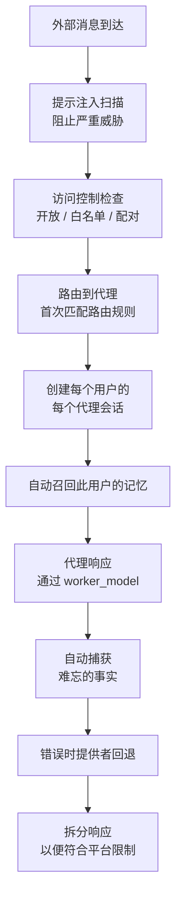

# 频道

将您的代理连接到消息平台。这些平台上的用户可以直接与您的代理聊天——一个应用程序，同时运行所有功能。

<Note>
所有传入消息都会扫描 **提示注入** ——具有严重级别的消息会自动被阻止。
</Note>

---

## 支持的频道

<Columns cols={3}>
  <Card title="Telegram" href="/channels/telegram" icon="paper-plane">
    Bot API — 公共机器人，群组聊天
  </Card>
  <Card title="Discord" href="/channels/discord" icon="discord">
    Gateway WebSocket — 社区服务器
  </Card>
  <Card title="Slack" href="/channels/slack" icon="slack">
    Bot API — 工作场所团队
  </Card>
  <Card title="Matrix" href="/channels/matrix" icon="hashtag">
    Client-Server API — 去中心化聊天
  </Card>
  <Card title="IRC" href="/channels/irc" icon="terminal">
    IRC 协议 — 经典聊天室
  </Card>
  <Card title="Mattermost" href="/channels/mattermost" icon="comments">
    WebSocket API — 自托管团队
  </Card>
  <Card title="Nextcloud" href="/channels/nextcloud" icon="cloud">
    Talk API — Nextcloud 用户
  </Card>
  <Card title="Nostr" href="/channels/nostr" icon="bolt">
    NIP 中继协议 — 去中心化社交
  </Card>
  <Card title="Twitch" href="/channels/twitch" icon="twitch">
    IRC + API — 直播聊天
  </Card>
  <Card title="Webchat" href="/channels/webchat" icon="globe">
    HTTP/WebSocket — 您自己的网站
  </Card>
  <Card title="WhatsApp" href="/channels/whatsapp" icon="whatsapp">
    Evolution API — 个人和群组消息
  </Card>
  <Card title="Discourse" href="/channels/discourse" icon="discourse">
    REST API — 社区论坛支持
  </Card>
</Columns>

---

## 频道工作原理

## 直接消息策略

控制谁可以向您的代理发送消息：

| 策略 | 行为 |
|--------|----------|
| **开放** | 任何人都可以聊天 |
| **白名单** | 仅限已批准的用户 |
| **配对** | 用户必须用代码配对 |

## 频道路由

基于规则将消息路由到特定代理：

1. 转到 **设置 → 频道**
2. 添加带过滤器的路由规则：
   - **频道** — 哪个平台
   - **用户筛选器** — 特定用户
   - **频道 ID 筛选器** — 特定频道/群组
   - **代理** — 哪个代理处理它

规则按 **首次匹配获胜** 评估 — 第一个匹配的规则确定代理。

## 安全

- 所有传入消息都经过提示注入扫描
- 具有 `严重` 级别的消息会自动被阻止
- 每个用户获得隔离的会话（无跨用户污染）
- 访问控制是逐频道和逐用户的
- 频道代理默认使用 `worker_model`（更便宜，更快）

## 精简频道上下文

频道桥接使用针对速度和低令牌成本优化的 **最小化上下文策略**：

- **仅核心身份** — 代理加载其身份、灵魂和用户文件，但跳过完整的代理上下文（其他代理、所有工具、自定义文件）
- **无记忆召回开销** — 为了避免延迟，频道消息跳过了内存搜索（BM25 + 向量）。如果代理需要，仍可通过 `memory_search` 工具按需获取记忆。
- **最小工具集** — 频道代理只获得与该桥接相关 (~4 个工具) 的工具，而不是全部 25,000+ 个集成
- **工作者模型** — 频道默认使用 `worker_model`（更便宜/更快），而非老板模型

这意味着频道消息的花费只是完整对话回合的一小部分。一个在 Discord 或 Telegram 上响应的代理使用约 2K–4K 个标记的上下文，而桌面完整聊天则需要 ~10K–30K。在数千条频道消息中，这样可以在令牌成本上显着节省。

:::tip
如果你需要频道代理具有完整功能（记忆召回、所有工具），请在 **设置 → 代理** 中将其配置为专用代理，具有更大的上下文窗口和完整的工具访问权限。
:::

## 提供者回退

如果主提供商失败（计费、认证或速率限制错误），Pawz 会在失败前自动尝试其他已配置的提供商。
