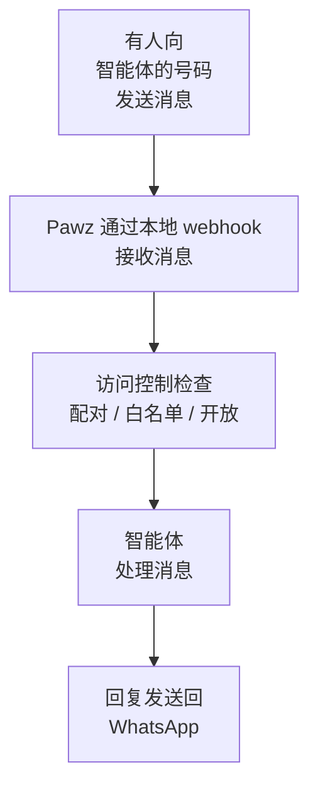

# WhatsApp

给您的智能体一个 WhatsApp 号码。人们向该号码发送消息，您的智能体回复 — 全部都在您的机器上完成。

:::warning 重要 — 请先阅读
当您扫描二维码时，**该电话号码将成为您的智能体**。任何向该号码发送消息的人都将与您的 AI 对话 — 而不是与您对话。

**不要使用您的个人号码**，除非您确实希望您的智能体处理所有 WhatsApp 对话。
:::

## 您需要一个单独的电话号码

Pawz 与 WhatsApp 的连接方式与 WhatsApp Web 相同 — 通过链接到现有账户。它无法创建新的电话号码。您扫描的号码就是人们用来与您的智能体对话的号码。

### 推荐：购买廉价预付费 SIM 卡

1. 购买一张预付费 SIM 卡（约 5 美元，任何商店或网上都可购买）
2. 在其上注册 WhatsApp（使用旧手机，或暂时更换 SIM 卡）
3. 您只需让 SIM 卡保持活跃状态足够长的时间以接收验证短信
4. 链接完成后，即使 SIM 卡过期，WhatsApp 也会保持连接

其他选项：
- **eSIM**（Airalo 等）— 约 5 美元，在您的手机上激活
- **Google Voice** — 免费但 WhatsApp 经常拒绝 VoIP 号码
- **第二台手机**，配有其自己的号码

## 设置

1. 在 Pawz 中，前往 **设置 → 频道**
2. 选择 **WhatsApp**
3. 选择谁可以给您的智能体发消息（默认设置即可开始使用）
4. 点击 **保存并连接**
5. 将出现二维码 — **从智能体的手机**（带单独号码的那台）**扫描它**
   - WhatsApp → 设置 → 已连接的设备 → 连接设备
6. 完成！人们现在可以向该号码发送消息来与您的智能体对话

## 有人发送消息时发生的事情

所有流量都留在您的机器上。没有东西暴露给互联网。

## 访问控制

| 模式 | 行为 |
|------|----------|
| **配对**（默认） | 新联系人收到"等待批准" — 您在 Pawz 中批准/拒绝 |
| **开放** | 任何人都可以立即向智能体发送消息 |
| **白名单** | 只有预先批准的电话号码可以发送消息 |

使用 **配对** 模式时，待处理请求会出现在 Pawz 中的 WhatsApp 频道卡片上，并带有批准/拒绝按钮。

## 配置

| 设置 | 说明 |
|---------|-------------|
| 谁可以给您的智能体发消息？ | 配对 / 开放 / 白名单 |
| 在群聊中也回复 | 智能体是否在群组中响应（默认：关闭） |
| 允许的电话号码 | 仅在白名单模式下需要 — 包括国家代码 |
| 智能体 | 留空使用默认值，或选择特定智能体 |

## 功能

- 二维码认证（扫描以链接）
- 支持私信和群聊
- 每用户的对话会话与记忆
- 对所有传入消息进行提示注入扫描
- 通过频道路由规则的智能体路由
- 工具调用的自动批准（频道消息无需人工参与）
- 所有内容在本地运行 — 没有任何东西暴露给互联网

## 提示

- 二维码几分钟后过期 — 请及时扫描
- 如果失去连接，请点击停止后启动以获取新的二维码
- 白名单中的电话号码应包括国家代码（例如，`15551234567`）
- 智能体使用 WhatsApp 格式：*粗体*，_斜体_，~删除线~，\`\`\`代码\`\`\`
- 长回复会自动拆分成多条消息
