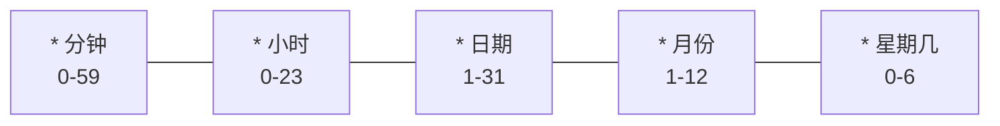

# 自动化任务

自动化任务是使用 cron 表达式按计划运行的重复任务。

## 工作原理

1. 在**任务**视图中创建任务
2. 设置 cron 计划
3. 启用 cron 切换
4. 引擎每**60秒**检查一次到期的任务

## 创建自动化任务

1. 转到侧边栏中的**自动化**（或**任务 → 新建任务**）
2. 设置任务标题和描述
3. 分配一个智能体
4. 输入**cron 计划**
5. 启用 cron

## Cron 语法

标准5字段 cron 表达式：

### 常用计划

| 计划 | Cron | 描述 |
|----------|------|-------------|
| 每天早上 | `0 9 * * *` | 每天上午9点 |
| 每天两次 | `0 9,17 * * *` | 上午9点和下午5点 |
| 仅工作日 | `0 9 * * 1-5` | 上午9点，周一至周五 |
| 每小时 | `0 * * * *` | 整点执行 |
| 每30分钟 | `*/30 * * * *` | 半小时一次 |
| 每周 | `0 9 * * 1` | 周一上午9点 |
| 每月 | `0 9 1 * *` | 每月1号上午9点 |

## 自动化视图

自动化页面显示三列：

| 列 | 描述 |
|--------|-------------|
| **活动** | 当前启用的自动化任务 |
| **暂停** | 已禁用的自动化任务 |
| **运行历史** | 过去的执行结果 |

## 动作

| 动作 | 描述 |
|--------|-------------|
| **立即运行** | 立即执行，无需等待计划 |
| **编辑** | 修改任务、计划或智能体 |
| **暂停** | 禁用而不删除 |
| **启用** | 重新激活已暂停的自动化任务 |
| **删除** | 永久移除 |

## 服务状态

顶部的绿色心跳指示器确认了自动化引擎处于活动状态并正在检查到期的任务。

## 使用场景

- **晨间简报** — 每天上午9点汇总您的日历和电子邮件
- **新闻摘要** — 每个晚上研究热门话题
- **健康检查** — 每日运行安全审计
- **博客监控** — 检查关注的博客上的新文章
- **指标报告** — 每周提取并汇总分析数据
