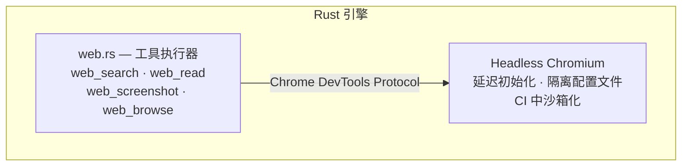

# 浏览器沙箱

浏览器沙箱让智能体在一个受控、可审计的环境中浏览网络。

## 配置

转到**设置 → 高级**进行配置：

| 设置 | 默认值 | 描述 |
|---------|---------|-------------|
| **无头模式** | 开启 | 在不可见窗口下运行浏览器 |
| **自动关闭标签页** | 开启 | 智能体完成后关闭标签页 |
| **空闲超时** | 300秒 | 空闲后终止浏览器 |

## 配置文件

为不同用途创建隔离的浏览器配置文件：

- 每个配置文件都有自己的cookies、存储和历史记录
- 智能体可以在配置文件之间切换
- 防止任务之间的交叉污染

## 网络策略

控制智能体可以访问的域名：

### 默认允许的域名

| 域名 | 用途 |
|--------|---------|
| `api.openai.com` | AI提供商 |
| `api.anthropic.com` | AI提供商 |
| `generativelanguage.googleapis.com` | AI提供商 |
| `openrouter.ai` | AI提供商 |
| `api.elevenlabs.io` | 文字转语音提供商 |
| `duckduckgo.com` | 网络搜索 |
| `html.duckduckgo.com` | 网络搜索 |
| `api.coinbase.com` | 交易 |
| `localhost` | 本地服务 |

### 默认阻止的域名

| 域名 | 原因 |
|--------|--------|
| `pastebin.com` | 数据渗透风险 |
| `transfer.sh` | 文件共享风险 |
| `file.io` | 文件共享风险 |
| `0x0.st` | 匿名上传风险 |

### 自定义规则

在浏览器设置中添加您自己的允许或阻止的域名。被阻止的域名优先于允许的域名。

### 请求日志

启用**请求日志**以查看浏览器发出的所有网络请求。最近的请求显示在设置面板中供审计。

## 智能体工具

| 工具 | 描述 |
|------|-------------|
| `web_browse` | 导航到URL并与页面交互 |
| `web_screenshot` | 截取当前页面的屏幕截图 |
| `web_read` | 从页面中提取文本内容 |

## 浏览器沙箱架构

浏览器沙箱使用 Rust crate `headless_chrome` 的**无头 Chromium**（通过Chrome DevTools协议）：



- **延迟初始化** — 只有当智能体首次调用 `web_screenshot` 或 `web_browse` 时才启动Chrome
- **单例实例** — 使用具有健康检查的一个共享浏览器进程；如果Chrome死机，则自动重启
- **会话连续性** — `web_browse` 在会话内重复使用第一个标签页进行多步交互
- **空闲超时** — 可配置（默认300秒），在空闲后终止Chrome

## 屏幕截图捕获与视觉分析

`web_screenshot` 工具捕获全页截图并提取可见文本：

| 参数 | 默认值 | 描述 |
|-----------|---------|-------------|
| `url` | （必需） | 要捕获的页面 |
| `full_page` | `false` | 捕获整个可滚动页面 |
| `width` | 1280 | 视口宽度（以像素为单位） |
| `height` | 800 | 视口高度（以像素为单位） |

截图：
1. 保存为PNG至 `$TMPDIR/paw-screenshots/screenshot-YYYYMMDD-HHMMSS.png`
2. 伴随提取的可见文本（最多5000个字符），因此智能体可以“阅读”页面
3. 可在**设置 → 高级**截图库中查看

:::tip
当 `web_read` 返回空文本时（JavaScript渲染的页面），请使用 `web_screenshot` — 它会等待动态内容加载并在渲染后的DOM中提取可见文本。
:::

## 表单填写和交互

`web_browse` 工具支持完整的页面交互：

| 动作 | 参数 | 描述 |
|--------|-----------|-------------|
| `navigate` / `goto` | `url` | 导航到URL并等待加载 |
| `click` | `selector` | 使用CSS选择器点击元素 |
| `type` / `fill` | `selector`, `text` | 点击输入框并在其中键入文本 |
| `press` | `text`（按键名称） | 按键盘（Enter、Tab等） |
| `extract` / `read` | `selector`（可选） | 从元素中提取文本内容 |
| `javascript` / `eval` / `js` | `javascript` | 执行任意 JavaScript 代码 |
| `scroll` | `text`（up/down/top/bottom） | 滚动页面 |
| `links` | — | 列出页面上所有链接（最多50个） |
| `info` | — | 获取当前页面标题和URL |

### 示例：填充登录表单

智能体可以通过链式调用多次 `web_browse`：

```
1. web_browse(action: "navigate", url: "https://example.com/login")
2. web_browse(action: "type", selector: "#email", text: "user@example.com")
3. web_browse(action: "type", selector: "#password", text: "...")
4. web_browse(action: "click", selector: "button[type=submit]")
```

## Cookie和会话管理

浏览器配置文件提供隔离的Cookie和会话存储：

| 特性 | 描述 |
|---------|-------------|
| **配置文件目录** | 每个配置文件将Cookie、localStorage和缓存存储在 `~/.paw/browser-profiles/<profile-id>/` |
| **会话持久性** | 在相同配置文件内的智能体工具调用间Cookie和登录状态保持 |
| **配置文件隔离** | 不同配置文件拥有完全独立的存储—没有交叉污染 |
| **配置文件切换** | 在**设置 → 高级**中设置默认配置文件 |

### 管理配置文件

- **创建** — 前往 设置 → 高级 → 浏览器 → "新建配置文件"
- **删除** — 移除配置文件目录及所有关联数据
- **设为默认** — 选择新的浏览器会话使用的配置文件

## 代理支持

通过Chrome启动参数应用代理配置。在启动Pawz之前设置 `HTTP_PROXY` 或 `HTTPS_PROXY` 环境变量，无头Chrome实例将会服从它们。

## 安全性

- 网络策略在浏览器级别强制执行——智能体无法绕过它
- 所有浏览器活动都包含在配置文件内
- 无头模式防止智能体显示任意内容
- 空闲超时防止失控的浏览器会话
