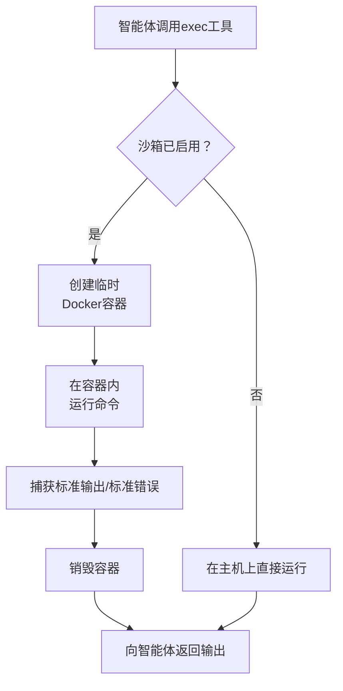

# 容器沙箱

容器沙箱在临时的Docker容器内运行智能体的 `exec` 命令，而不是直接在主机上运行。这提供了强隔离—每个命令都在具有丢弃功能、资源约束和可选网络限制的新鲜容器中运行。

## 工作原理



沙箱使用 [bollard](https://crates.io/crates/bollard) Rust crate 与Docker守护程序通信。

## 启用沙箱

1. 在系统上**安装Docker**（Docker Desktop或Docker Engine）
2. 前往**设置 → 高级**
3. 切换**容器沙箱**以启用
4. 可选地选择预设或手动配置

:::warning
Docker必须已安装并运行才能使沙箱工作。如果Docker不可用，启用沙箱时`exec`命令将失败。
:::

## 配置

| 设置 | 默认值 | 描述 |
|---------|---------|-------------|
| `enabled` | `false` | 是否激活沙箱 |
| `image` | `alpine:latest` | 用于容器的Docker镜像 |
| `timeout` | `30s` | 每个命令的最大执行时间 |
| `memory` | `256 MB` | 容器的内存限制 |
| `cpu_shares` | `512` | 相对CPU权重（Docker默认为1024） |
| `network` | 已禁用 | 容器是否具有网络访问权限 |
| `workdir` | `/workspace` | 容器内的工作目录 |
| `bind_mounts` | `[]` | 主机到容器的目录挂载（`host:container:mode`） |

## 安全强化

每个沙箱化的容器都使用严格的默认安全设置运行：

- **`CAP_DROP ALL`**: 丢弃所有Linux功能——可能的权限提升无法实现
- **无特权模式**: 容器无法访问主机设备或内核功能
- **输出截断**: 命令输出在**50,000字符**处截断以防止内存耗尽
- **临时性**: 每个命令后销毁容器——执行之间没有持久状态

## 预设

Pawz包含4个为常见用例预构建的沙箱配置文件。选择预设定即可立即配置所有设置。

### 最小化

最严格限制的配置。适用于希望获得最大隔离性的简单shell命令。

| 设置 | 值 |
|---------|-------|
| 镜像 | `alpine:latest` |
| 内存 | 128 MB |
| 超时 | 15s |
| CPU共享 | 512 |
| 网络 | 已禁用 |
| 工作目录 | `/workspace` |

**最适合**: 快速文件操作，文本处理，基本shell实用程序。

### 开发

平衡的配置文件，可获得Node.js并启用了网络访问。适合运行构建脚本、linting和测试套件。

| 设置 | 值 |
|---------|-------|
| 镜像 | `node:20-alpine` |
| 内存 | 512 MB |
| 超时 | 60s |
| CPU共享 | 512 |
| 网络 | **已启用** |
| 工作目录 | `/workspace` |

**最适合**: JavaScript/TypeScript开发, 包安装, 运行测试, 构建过程。

### Python

与开发类似，但预装了Python 3.12。适用于数据分析、脚本和机器学习任务。

| 设置 | 值 |
|---------|-------|
| 镜像 | `python:3.12-alpine` |
| 内存 | 512 MB |
| 超时 | 60s |
| CPU共享 | 512 |
| 网络 | **已启用** |
| 工作目录 | `/workspace` |

**最适合**: Python脚本, pip包安装, 数据处理, Jupyter类任务。

### 受限

锁定程度最高的配置。最小资源，没有网络，很短的超时时间。运行不受信任的或潜在危险命令时使用此选项。

| 设置 | 值 |
|---------|-------|
| 镜像 | `alpine:latest` |
| 内存 | 64 MB |
| 超时 | 10s |
| CPU共享 | 256 |
| 网络 | 已禁用 |
| 工作目录 | `/workspace` |

**最适合**: 评估不受信任的代码, 隔离危险命令, 最大隔离场景。

## 命令风险评估

沙箱包括内置的命令风险评分系统，将命令分为四个等级：

| 风险等级 | 示例 | 描述 |
|------------|----------|-------------|
| **严重** | `rm -rf /`, `mkfs`, `dd of=/dev/...`, fork炸弹 | 破坏系统的命令 |
| **高** | `sudo`, `su`, `chmod 777`, `curl | sh`, `eval` | 权限提升, 管道执行 |
| **中等** | `curl`, `wget`, `rm`, `pip install`, `npm install`, `apt` | 网络访问, 文件修改, 包安装 |
| **低** | `ls`, `cat`, `echo`, `grep` | 只读, 安全操作 |

:::info
风险评估仅供参考——帮助您了解智能体正在做什么。无论风险级别如何，沙箱都会强制实施隔离。所有功能都被删除且容器是临时的。
:::

## 绑定挂载

您可以将主机目录挂载到容器中，以便智能体访问特定文件：

```
/home/user/project:/workspace:ro
```

格式: `host_path:container_path:mode`

| 模式 | 描述 |
|------|-------------|
| `ro` | 只读访问 |
| `rw` | 读写访问 |

:::warning
对 `rw` 挂载要小心——智能体可以通过容器修改主机文件系统上的文件。仅当智能体只需要读取文件时使用 `ro`。
:::

## 使用场景

### 安全代码执行

让智能体在沙箱环境中运行代码，使得错误不会损坏您的系统：

```
你：编写并运行一个计算1000以内质数的Python脚本

智能体：[使用exec工具 → 在Python沙箱容器中运行]
```

### 不可信命令评估

当您不确定智能体建议的shell命令时，沙箱提供了一道安全网：

- 如果命令是破坏性的，那么只影响临时容器
- 所有Linux能力已被移除，防止权限提升
- 可以禁用网络，以防止数据渗漏

### 构建和测试隔离

运行项目构建和测试套件而不会污染您的主环境：

- 容器中安装的依赖关系不会影响您的系统
- 失败的构建不会留下坏的状态
- 每次运行都从干净镜像开始

:::tip
对于开发工作流程，请使用**开发**或**Python**预设和指向您的项目目录的绑定挂载。这样可以让智能体访问您的代码的同时确保执行是沙箱化的。
:::
