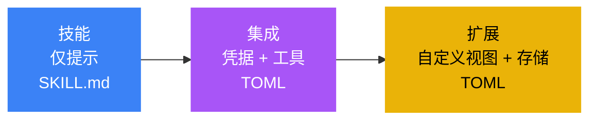
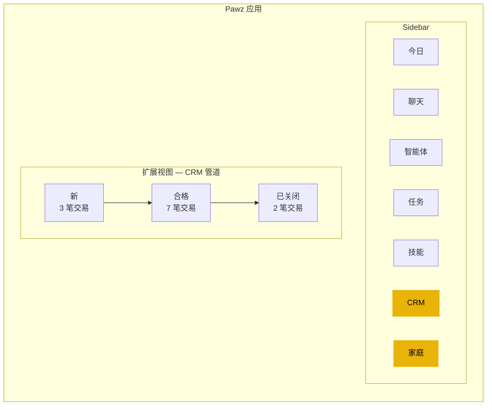
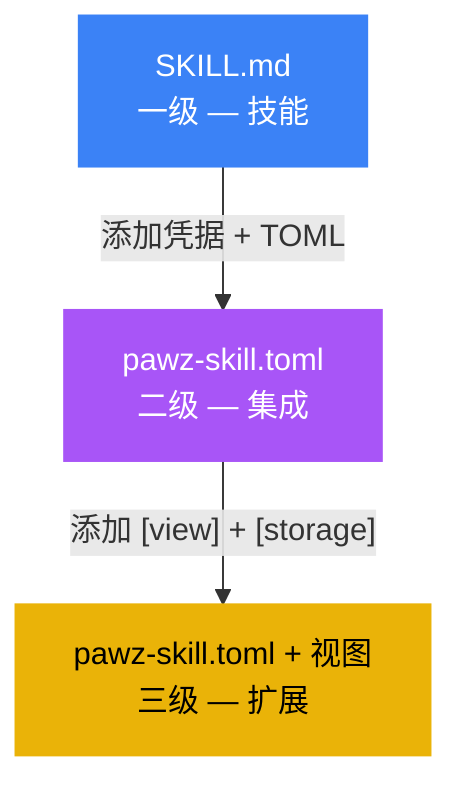

# 扩展

扩展是 Pawz 可扩展性系统的最高层级。它们拥有 [集成](/docs/guides/integrations) 的全部功能——凭据、说明、小部件——以及 **自定义侧边栏视图** 和 **持久数据存储**。



**扩展与集成**: 一个 [集成](/docs/guides/integrations) 将您的智能体连接到 API 或命令行工具，配有加密凭据和可选的仪表板小部件。扩展则包含了所有这些功能**还**注册了自定义侧边栏视图，并且可以在会话之间保持结构化数据。

---

## 扩展增加的功能

| 功能 | 技能 | 集成 | 扩展 |
|---------|-------|-------------|-----------|
| 提示注入 | ✓ | ✓ | ✓ |
| 凭据库 | — | ✓ | ✓ |
| 二进制检测 | — | ✓ | ✓ |
| 仪表板小部件 | — | ✓ | ✓ |
| **自定义侧边栏视图** | — | — | **✓** |
| **持久存储** | — | — | **✓** |
| **数据绑定 UI** | — | — | **✓** |

---

## 扩展如何工作

1. **清单** — 一个含有 `[view]` 和/或 `[storage]` 部分的 `pawz-skill.toml`
2. **侧边栏视图** — 扩展在其自身的图标和标签注册侧边栏中的一个选项卡
3. **持久数据** — 扩展声明存储表；智能体使用 `skill_store_*` 工具在会话之间保持结构化数据
4. **数据绑定渲染** — 自定义视图读取扩展的存储并呈现实时数据（表格、图表、管道、流）
5. **小部件** — 一个可选的仪表板卡片在今日页面显示摘要



---

## 扩展清单

扩展是一个具有额外的 `[view]` 和 `[storage]` 部分的 `pawz-skill.toml`：

```toml
[skill]
id = "simple-crm"
name = "简易 CRM"
version = "1.0.0"
author = "community"
category = "productivity"
icon = "contacts"
description = "轻量级客户关系管理工具，包含联系人、交易和活动跟踪"

[[credentials]]
key = "CRM_WEBHOOK"
label = "导入 Webhook (可选)"
description = "用于从外部系统导入联系人的传入 webhook URL"
required = false
placeholder = "https://..."

[instructions]
text = """
您有一个带有持久化存储的 CRM 系统。使用存储工具来管理数据：

## 联系人
- skill_store_set: 添加或更新联系人 (姓名、邮箱、公司、阶段)
- skill_store_query: 按姓名、公司或阶段搜索联系人
- skill_store_get: 按 ID 获取特定联系人

## 交易
- skill_store_set: 创建或更新交易 (姓名、价值、阶段、联系人_id)
- skill_store_query: 按阶段过滤交易 (新增、合格、提案、封闭)

## 活动
- skill_store_set: 记录活动 (类型: 通话/邮件/会议)、备注、联系人_id)
- skill_store_query: 获取联系人的活动信息流或日期范围

当用户询问他们的线索池、联系人或交易时，首先查询存储。
"""

[widget]
type = "table"
title = "活跃交易"
refresh = "5m"

[[widget.fields]]
key = "name"
label = "交易"
type = "text"

[[widget.fields]]
key = "value"
label = "金额"
type = "currency"

[[widget.fields]]
key = "stage"
label = "阶段"
type = "badge"

[view]
id = "crm-pipeline"
label = "CRM"
icon = "contacts"

[storage]
namespace = "crm"
tables = ["contacts", "deals", "activities"]
```

### `[view]` 部分

| 字段 | 类型 | 必须 | 描述 |
|-------|------|----------|-------------|
| `id` | string | ✓ | 唯一视图标识符 (用于路由). |
| `label` | string | ✓ | 侧边栏选项卡标签. |
| `icon` | string | ✓ | Material Symbols 图标名称. |

视图被注册为侧边栏选项卡。选中后，Pawz 使用小部件字段架构从存储渲染扩展的数据。

### `[storage]` 部分

| 字段 | 类型 | 必须 | 描述 |
|-------|------|----------|-------------|
| `namespace` | string | ✓ | 存储命名空间 (每个扩展隔离). |
| `tables` | string[] | ✓ | 扩展可读写的表名. |

存储由 SQLite 支持。每个扩展都有其专属命名空间——无扩展能够读取另一扩展的数据。

---

## 存储工具

扩展暴露三个智能体工具用于持久数据管理：

| 工具 | 参数 | 描述 |
|------|-----------|-------------|
| `skill_store_set` | `namespace`, `table`, `id`, `data` (JSON) | 创建或更新一条记录 |
| `skill_store_get` | `namespace`, `table`, `id` | 按 ID 获取记录 |
| `skill_store_query` | `namespace`, `table`, `filter` (JSON) | 查询带滤器的记录 |

### 示例: 智能体交互

**用户**: "添加一个新联系人 — 约翰·史密斯，john@acme.com，Acme 公司"

**智能体** 调用 `skill_store_set`:
```json
{
  "namespace": "crm",
  "table": "contacts",
  "id": "john-smith",
  "data": {
    "name": "约翰·史密斯",
    "email": "john@acme.com",
    "company": "Acme 公司",
    "stage": "new",
    "created": "2025-01-21T10:30:00Z"
  }
}
```

**用户**: "展示 Acme 的所有联系人"

**智能体** 调用 `skill_store_query`:
```json
{
  "namespace": "crm",
  "table": "contacts",
  "filter": { "company": "Acme 公司" }
}
```

---

## 扩展示例

### CRM 管道

跟踪联系人、交易和活动。侧边栏视图显示带交易阶段的看板样式的管道。仪表板小部件显示活跃交易摘要。

| 凭据 | 存储 | 小部件 |
|-------------|---------|--------|
| 可选的 webhook 导入 | 联系人、交易、活动 | 表格: 活跃交易 |

### 智能家居仪表板

从专用侧边栏选项卡控制和监控您的 IoT 设备。整合飞利浦 Hue、Sonos 和 Eight Sleep 到统一视图。

| 凭据 | 存储 | 小部件 |
|-------------|---------|--------|
| 设备 API 令牌 | 设备、场景、自动化 | KV: 设备状态 |

### 组合跟踪器

跨所有交易所和钱包统一组合视图。侧边栏显示分配图表、盈亏和交易历史。

| 凭据 | 存储 | 小部件 |
|-------------|---------|--------|
| 交易所 API 密钥 | 资产持有、交易、快照 | 度量: 组合价值 |

### 内容日历

在平台上规划、安排和跟踪内容。侧边栏显示带发布日期和状态徽章的日历网格。

| 凭据 | 存储 | 小部件 |
|-------------|---------|--------|
| 社交媒体令牌 | 文章、活动、分析 | 表格: 即将发布的文章 |

---

## 模块化工作区集成

扩展侧边栏视图集成了 [模块化工作区](/docs/guides/modular-workspace) 系统：

- 扩展视图出现在 **自定义** 工作区配置文件切换网格中
- 用户可以像任何内置视图一样显示/隐藏扩展视图
- 扩展视图遵从激活的工作区配置文件
- 隐藏的扩展视图保有其数据 — 没有任何丢失

当您安装扩展时，其侧边栏标签会自动出现。如果您使用预设工作区配置文件 (开发者、营销人员等)，可能需要切换到 **自定义** 或 **全部** 来看到扩展视图。

---

## 按智能体的作用域

与技能和集成一样，从 **智能体** 选项卡分配扩展给智能体：

1. 打开**智能体**选项卡 → 选择一个智能体 → 进入他们的 **技能** 子选项卡
2. 启用或禁用该智能体的扩展
3. 只有分配的智能体在提示中接收扩展的说明和凭据
4. 所有智能体都可以*读取*扩展的存储 (用于仪表板渲染)
5. 只有分配的智能体可以*写入*扩展的存储
6. 扩展的侧边栏视图始终可见 (它显示数据，不显示代理商环境)

---

## 创建扩展

扩展以与集成同样的方式创建，只是增加了 `[view]` 和 `[storage]` 部分：

1. 从**应用程序内置向导**或模板开始
2. 添加您的凭据和说明 (与集成相同)
3. 添加 `[view]` 部分来声明侧边栏选项卡
4. 添加 `[storage]` 部分来声明持久表
5. 用实时智能体测试 — 使用聊天填充存储，验证视图渲染
6. 发布至 PawzHub

### 升级路径

您可以渐进式地将技能升级到集成再到扩展：



每个步骤都是累加的。您永远无需重写——只需向清单添加更多部分。

---

## 安全

扩展与集成有相同的安保模型，但对存储增加了保护措施：

| 层 | 保护 |
|-------|-----------|
| **凭据** | 在操作系统钥匙串中的 32 字节密钥进行了XOR 加密 |
| **网络** | 每次`fetch`都有域名白名单/黑名单策略 |
| **Shell** | 启用时的 Docker 沙盒路由 |
| **存储** | 命名空间隔离——扩展无法读取/写入其他扩展的数据 |
| **写隔离** | 只有分配的智能体可写入存储 |
| **视图渲染** | 视图由应用渲染，不由扩展渲染 |
| **资源限制** | 存储配额防止单个扩展填满磁盘 |

扩展不能：
- 执行任意的 Rust 代码
- 渲染任意 HTML/JavaScript (视图使用应用的渲染器)
- 访问其他扩展的存储命名空间
- 从未分配的智能体写入存储
- 绕过域名或 Shell 策略

---

## 级别徽章

技能选项卡中的每一项都显示其级别徽章：

| 徽章 | 颜色 | 含义 |
|-------|-------|---------|
| 🔵 **技能** | 蓝色 `#3B82F6` | SKILL.md — 仅提示注入 |
| 🟣 **集成** | 紫色 `#8B5CF6` | TOML — 凭据、二进制、小部件 |
| 🟡 **扩展** | 金色 `#F59E0B` | TOML — 视图、存储、全功能 |

附加质量徽章：

| 徽章 | 含义 |
|-------|---------|
| ✓ **经验证的** | 在真实工作区测试过，CI 验证的 |
| ★ **官方的** | 由 Pawz 团队发布的 |
| 🔥 **流行的** | 50K+ 次安装 |
