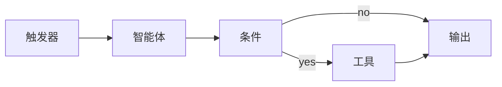

# 流程

流程是一个用于创建多步 AI 管道的可视化工作流构建器。将集成拖放到画布上，连接它们，然后运行 — 无需编写代码。

## 工作原理



1. 从侧边栏打开**流程**
2. 点击**+ 新建**或在文本框中描述一个流程
3. 将集成拖动到画布上并将它们链接起来
4. 在属性面板中配置每个集成
5. 点击**运行**执行流程

## 集成类型

流程中的每一步都是一个集成。有 10 种类型：

| 类型 | 图标 | 目的 |
|------|------|---------|
| **触发器** | ⚡ | 启动流程的事件 — webhook、cron 或用户输入 |
| **智能体** | 🤖 | AI 智能体处理步骤 — 发送提示并获取响应 |
| **工具** | 🔧 | MCP 工具调用 — 调用任何已连接的工具 |
| **条件** | 🔀 | If/else 分支 — 根据表达式路由数据 |
| **数据** | 📊 | 数据转换 — 映射、解析、格式化、转换 |
| **代码** | 💻 | 内联 JavaScript — 带 `input`/`context` 的沙箱执行 |
| **输出** | 📤 | 终端步骤 — 日志、发送、存储或发布到聊天 |
| **错误** | ⚠️ | 错误处理 — 捕获来自上游集成的失败 |
| **分组** | 📁 | 子流程 — 包含嵌套步骤的复杂集成 |
| **事件地平线** | 🌀 | 同步屏障 — 在继续之前从并行的时空单元收集输出 |

## 边缘类型

边缘连接集成。四种类型控制数据流方向：

| 边缘 | 含义 |
|------|---------|
| **前向** | 正常 `A → B` — 数据从源流向目标 |
| **反向** | 拉取 `B ← A` — 目标从源请求数据 |
| **双向** | 握手 `A ↔ B` — 双向数据交换 |
| **错误** | 备用 `A --err→ B` — 失败时路由到错误处理程序 |

## 构建流程

### 画布控件

| 操作 | 方法 |
|--------|-----|
| **平移** | 点击并拖动画布背景 |
| **添加集成** | 点击工具栏中的添加按钮，或在文本框中输入 |
| **选择** | 点击画布上的集成 |
| **移动** | 拖动选定的集成 |
| **连接** | 从输出端口 (右侧) 拖动到输入端口 (左侧) |
| **删除** | 选择一个集成或边缘，然后按删除按钮 |
| **缩放** | 在画布上滚动滚轮 |

### 文本转流程

在顶部的文本框中键入自然语言描述并按 Enter。解析器识别关键字并自动创建流程：

```
webhook → 代理概括 → 如果重要 → 发送邮件
```

关键词检测将词语映射到集成类型：

| 关键词 | 映射到 |
|----------|---------|
| `trigger`、`webhook`、`cron`、`on`、`when` | 触发器 |
| `agent`、`ai`、`llm`、`ask`、`think` | 智能体 |
| `tool`、`mcp`、`call`、`api`、`fetch` | 工具 |
| `if`、`condition`、`branch`、`check` | 条件 |
| `data`、`transform`、`map`、`parse` | 数据 |
| `output`、`send`、`email`、`notify`、`save` | 输出 |

### 属性面板

点击画布上的任何集成立即打开其配置面板：

- **标签** — 画布上的显示名称
- **描述** — 副标签 (模型名称、工具 ID 等)
- **类型** — 集成类型 (触发器、智能体、工具等)
- **配置** — 类型特定设置：
  - **智能体**: 提示文字、分配的智能体 (下拉菜单中的真实智能体)
  - **代码**: 带 `input` 和 `context` 变量的内联 JavaScript
  - **条件**: 要评估的表达式
  - **工具**: MCP 工具名称和参数

未选中任何集成时，面板显示**流程属性** — 名称、描述、文件夹和统计。

## 文件夹

流程可以组织到文件夹中：

1. 打开流程属性 (点击画布背景)
2. 设置**文件夹**字段 (如 `生产`、`草稿`)
3. 流程在带有可折叠标题的侧边栏中按文件夹分组

在侧边栏中拖放流程到不同文件夹。

## 模板

切换到侧边栏中的**模板**选项卡以浏览预先构建的流程模式。

### 类别

| 类别 | 示例 |
|----------|----------|
| **AI 和智能体** | 每日摘要、多智能体辩论、智能体链 |
| **通信** | 电邮自动回复、团队通知 |
| **DevOps 和 CI** | 部署管道、健康监控 |
| **生产力** | 任务分类、会议准备 |
| **数据和转换** | CSV 管道、数据丰富 |
| **研究** | 深度研究、文献综述 |
| **社交和内容** | 内容日历、社交监听 |
| **金融和交易** | 组合监控、价格警报 |
| **支持** | 工单路由器、FAQ 机器人 |
| **自定义** | 从头开始构建自己的 |

点击**使用模板**创建具有自动布局的新流程实例。

### 搜索与过滤

- 在搜索框中键入内容以按名称、描述或标签过滤
- 单击类别芯片以按类别过滤
- 单击**全部**重置

## 执行

### 运行流程

1. 从侧边栏中选择一个流程
2. 单击工具栏中的**运行**按钮 (▶)
3. 观察集成顺序执行 — 状态指示器显示进度：
   - 🔴 **运行中** — 红色闪烁脉冲
   - 🟢 **成功** — 淡绿色边框
   - ❌ **错误** — 红色边框
   - ⏸ **暂停** — 金色振荡边框

数据沿着边缘流动，显示动画信号扫描。

### 调试模式

逐步执行流程中的一个集成：

1. 单击工具栏中的**调试**按钮 (🐛)
2. 右键单击集成来设置**断点**
3. 使用**逐步**一次推进一个集成
4. 检查显示在边缘的中间数据值
5. 查看**调试检查器**面板以了解每步的完整输入/输出

执行光标用金圈高亮当前集成。

### 错误处理

- **错误边缘**将故障路由到错误处理集成
- **错误集成**捕捉并处理故障 (日志、警报、重试)
- 聊天中的流程报告显示带有时序的逐步结果

## 安排计划

流程可以使用 cron 表达式定时运行：

1. 打开一个流程的属性面板
2. 启用**计划**开关
3. 输入一个 cron 表达式

```
0 9 * * *       每天上午9点
0 */2 * * *     每两小时
0 9 * * 1-5     工作日上午9点
*/30 * * * *    每30分钟
```

调度程序每**30秒**检查一次待触发的流程。

顶部统计计数器显示有多少流程具有活动计划。

## 代码集成

代码集成运行沙箱化的 JavaScript：

```javascript
// 可用变量：
// input  — 前一个集成的输出
// context — { flowId, nodeId, runId }

const data = JSON.parse(input);
return data.items.filter(item => item.score > 0.8);
```

- 代码在沙箱的 `Function()` 构造函数中运行 — 没有访问 DOM、fetch 或文件系统的权限
- 返回值成为集成的输出，传递给下游集成
- 超时限制防止无限循环

## 聊天报告器

当流程运行时，**流程报告**出现在聊天对话中，显示：

- 流程名称和步骤计数
- 进度条
- 每个步骤的状态、持续时间和输出
- 最终摘要，包括成功/错误数量和总时长

## 导演协议

导师层是一个自动优化层，在执行前分析流程图表。当中有可并行化结构时，导演出一个具有优化单元的 `ExecutionStrategy`：

| 原语 | 作用 |
|-----------|-------------|
| **折叠** | 将非分支节点序列合并为单个执行单元 |
| **提取** | 将无内部依赖的节点隔离，提前执行 |
| **并行化** | 通过 `Promise.all` 并行运行独立分支 |
| **聚集** | 在继续之前等待所有并行分支完成 |
| **超立方体** | 协调跨阶段和深度的并行单元，同步事件地平线 |

当流程有 4+ 个节点、任何并行分支或智能体和非智能体节点混合时，自动激活导演。无需手动配置。

→ 深入了解：[导演协议参考](/reference/conductor-protocol)

### 超立方流程

**超立方流程**将图分割为独立的**单元**— 彼此间没有数据边共享的子图。每个单元按照拓扑顺序执行其智能体，所有单元并发运行。**事件地平线**节点作为同步障碍，通过 `mergeAtHorizon` 从每个单元收集输出，然后流程继续。

当图中包含由非智能体边界分离的 2+ 个不连通智能体集群时，会自动检测超立方流程。

### 记忆集成

任何节点执行之前，流程执行器将从前 Engram 记忆系统预召回相关长期记忆。智能体节点在其提示中的 `[Relevant Memory]` 部分接收这些记忆。

在超立方流程中，每个单元都获得自己的**单元范围记忆**——从单元特定的智能体提示中解析得出——因此并行单元永远不会因共享记忆状态而竞争。

→ 深入了解：[记忆指南](/guides/memory#flow-memory-integration)

## 持久化

- 流程存储在本地 `localStorage` 中，键为 `openpawz-flows`
- 所有数据保留在您机器上——无云同步
- 通过 JSON 序列化导入/导出

## 键盘快捷键

| 键 | 操作 |
|-----|--------|
| `Delete` / `Backspace` | 删除选定的集成或边缘 |
| `Escape` | 取消选择所有 |
