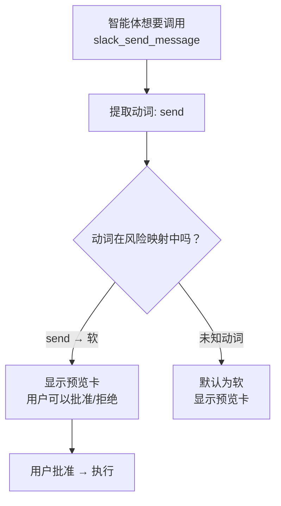
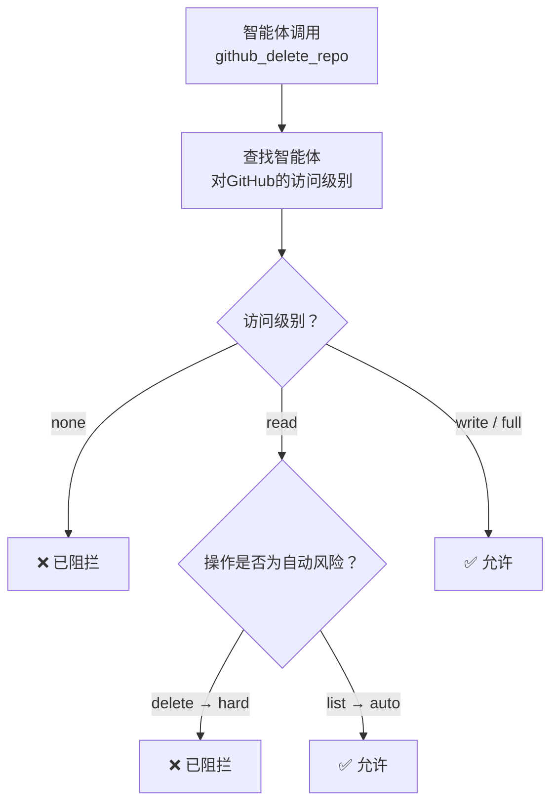

# 集成护栏

当智能体与第三方服务（Slack、GitHub、Gmail、Stripe等）交互时，护栏确保它们不会在不经过监督的情况下执行破坏性操作、超出速率限制或在其分配的权限之外运行。

<Note>
护栏在**引擎级别**强制执行——它们适用于所有通道、所有智能体和所有集成方法（MCP桥接器、REST API和直接工具调用）。
</Note>

---

## 动作风险分类

每个集成功能根据其动词被分成三个风险等级之一：

| 风险级别 | 行为 | 示例动词 |
|------------|----------|---------------|
| **自动** | 立即执行，无需审批 | `list`, `get`, `search`, `read`, `fetch`, `count`, `check` |
| **软** | 执行前显示预览卡片 | `send`, `create`, `update`, `post`, `comment`, `assign`, `move`, `upload`, `pin` |
| **硬** | 需要明确确认对话框 | `delete`, `remove`, `archive`, `close`, `bulk_send`, `transfer`, `modify_billing`, `revoke` |

### 分类如何工作

引擎扫描动词中的已知关键字。首个匹配的动词确定风险级别。如果找不到已知动词，动作默认为**软**（需要预览）——偏向于谨慎。



### 风险元数据

每个风险级别都携带UI元数据以确保一致显示：

| 级别 | 图标 | 标签 | 颜色 |
|-------|------|-------|-------|
| 自动 | `check_circle` | 自动批准 | 绿色 |
| 软 | `visibility` | 预览 | 黄色 |
| 硬 | `warning` | 确认 | 红色 |

---

## 速率限制

按服务设置的速率限制防止失控智能体滥发API请求。每个服务都有配置的最大操作数在一个滑动时间窗口内。

### 默认限制

| 服务 | 最大操作数 | 时间窗口 |
|---------|------------|--------|
| Slack | 30 | 15分钟 |
| Discord | 30 | 15分钟 |
| Telegram | 30 | 15分钟 |
| Gmail | 10 | 15分钟 |
| SendGrid | 10 | 15分钟 |
| GitHub | 20 | 15分钟 |
| Jira | 20 | 15分钟 |
| Linear | 20 | 15分钟 |
| HubSpot | 20 | 15分钟 |
| Salesforce | 20 | 15分钟 |
| Trello | 20 | 15分钟 |
| Notion | 20 | 15分钟 |
| Google Sheets | 30 | 15分钟 |
| Shopify | 15 | 15分钟 |
| Stripe | 10 | 15分钟 |
| Twilio | 15 | 15分钟 |
| Zendesk | 20 | 15分钟 |
| **其他** | 50 | 15分钟 |

<Tip>
未列出的服务回退到通用限制**每15分钟50次操作**。您可以在设置中覆盖特定服务的限制。
</Tip>

### 速率限制如何工作

引擎跟踪服务在滑动时间窗口内的操作次数：

1. 每次操作都会增加该服务计数
2. 如果计数超过`maxActions`，操作被**阻止**
3. 窗口会在`windowMinutes`分钟后自动重置
4. 您可以手动重置服务的时间窗口（例如，在解决问题后）

### 速率限制响应

当智能体触达速率限制时，它收到：

```json
{
  "allowed": false,
  "remaining": 0,
  "limit": 30
}
```

智能体会被告知操作被阻止以及当前窗口剩余多少次操作。

---

## 智能体服务权限

可以为每个智能体分配特定的**访问级别**，用于各个集成服务，控制其允许执行的操作种类。

### 访问级别

| 级别 | 可执行 | 图标 |
|-------|--------|------|
| **无** | 什么都不做——服务完全被阻止 | `block` |
| **只读** | 仅限自动风险操作（list, get, search, read） | `visibility` |
| **写入** | 所有操作包括读取、写入和删除 | `edit` |
| **全功能** | 一切权限——完全没有限制 | `admin_panel_settings` |

### 权限检查方式



<Tip>
将研究智能体设为**读取**访问，将操作智能体设为**写入**。保留**全功能**访问给您的主要智能体。
</Tip>

---

## 预执行计划

在执行多步骤集成功能流之前，智能体可以生成一个**预执行计划**，显示他们打算采取的每一个操作——包括风险级别、目标和预览。

### 计划结构

| 字段 | 描述 |
|-------|-------------|
| **步骤** | 智能体将采取的动作顺序列表 |
| **服务** | 每一步指向特定集成 |
| **动作** | 具体动作（例如：`send_message`, `delete_repo`） |
| **目标** | 动作操作对象（例如：`#general`, `my-repo`） |
| **风险** | 自动/软/硬分类 |
| **预览** | 动作的可选人类可读描述 |

### 需要自动确认

当满足以下条件时，需要明确用户确认：

- **任意一步是高风险**（删除、归档、转移等）
- **计划包含超过3步**（不管风险级别如何）

这可以防止智能体默默执行长链操作。

### 示例计划

```
计划: 部署通知管道
─────────────────────────────────
1. [自动]  GitHub → list_repos → org/backend "列出仓库"
2. [软]  GitHub → create_issue → org/backend #142 "创建部署跟踪问题"
3. [软]  Slack → send_message → #deployments "通知团队"
4. [硬]  GitHub → archive → org/backend-old "归档旧库存"

⚠️ 此计划需要确认（包含高风险操作）
```

---

## 凭证审核日志

每个集成功能操作都会被记录到审计跟踪日志中，以供安全审查和合规性检查：

| 字段 | 描述 |
|-------|-------------|
| **时间戳** | 执行操作的时间 |
| **智能体** | 执行操作的智能体 |
| **服务** | 目标集成服务 |
| **动作** | 所采取的具体操作 |
| **访问级别** | 执行时智能体的权限级别 |
| **批准情况** | 操作是否获得批准（通过人机交互或自动） |
| **结果** | `success`, `denied`, 或 `failed` |

---

## 相关内容

- [安全](/reference/security) — 完整的纵深防御概述
- [集成](/guides/integrations) — 集成功能如何运作
- [MCP桥](/guides/mcp-bridge) — 通过 n8n 提供的 25,000+ 工具
