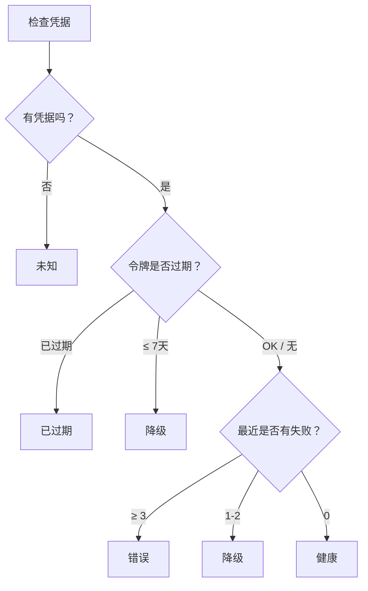

# 集成健康

集成健康系统实时监测您所有的已连接服务——跟踪连接状态、令牌过期、故障率，并生成智能建议以保持一切正常运转。

---

## 健康状态

每个已连接的集成都会报告五种状态之一：

| 状态 | 图标 | 颜色 | 含义 |
|--------|------|-------|---------|
| **健康** | `check_circle` | 绿色 | 已连接并正常工作 |
| **降级** | `warning` | 黄色 | 正常工作但遇到问题（令牌即将过期，偶尔失败） |
| **错误** | `error` | 红色 | 多次最近失败——可能已中断 |
| **已过期** | `lock_clock` | 红色 | OAuth令牌或API密钥已过期 |
| **未知** | `help` | 灰色 | 未配置凭据 |

### 状态如何确定

引擎来自三个信号自动派生健康状态：

| 信号 | 阈值 | 结果 |
|--------|-----------|--------|
| 无凭据 | — | 未知 |
| 令牌已过期 | ≤ 0 天 | 过期 |
| 令牌即将过期 | ≤ 7 天 | 降级 |
| 频繁失败 | ≥ 3 最近 | 错误 |
| 偶尔失败 | 1-2 最近 | 降级 |
| 完全没问题 | — | 健康 |

<Tip>
令牌过期优先于失败计数。如果令牌已过期，则状态始终为**已过期**，不管失败计数是多少。
</Tip>

---

## 健康摘要

仪表板显示所有已连接集成的聚合健康摘要：

| 指标 | 说明 |
|--------|-------------|
| **总计** | 已连接集成的数量 |
| **健康** | 正常运行的服务 |
| **降级** | 存在警告的服务 |
| **错误** | 存在持续故障的服务 |
| **过期** | 凭据已过期的服务 |
| **需要关注** | 列出降级、错误和过期的服务 |

### 仪表板视图

今日视图在顶部显示一个紧凑的健康条。需要关注的服务会以状态图标和问题简短描述来高亮显示。

---

## 令牌过期跟踪

对于使用OAuth令牌的集成，OpenPawz会跟踪到期日期，并在它们过期前警告您。

| 到期天数 | 动作 |
|-------------------|--------|
| > 7 天 | 无警告——状态保持健康 |
| ≤ 7 天 | 状态变为**降级**——显示重新认证提醒 |
| ≤ 0 天（已过期） | 状态变为**过期**——集成功能停止工作 |

<Note>
并非所有集成都有令牌到期。基于API密钥的服务（如GitHub个人访问令牌或Stripe API密钥）不会自动过期——它们的状态仅基于失败计数。
</Note>

---

## 智能建议

当集成连接后，OpenPawz 会在今日视图上生成情境相关的建议，帮助您每天开始工作。

### 可用建议

| 服务 | 建议 | 动作 |
|---------|-----------|--------|
| **Gmail** | "您有未读邮件——需要我为您总结吗？" | 总结收件箱 |
| **Slack** | "查看您的Slack消息和提及" | 检查Slack |
| **GitHub** | "审阅指派的问题和开放的PR" | 检查GitHub |
| **HubSpot** | "查看您的销售管道和交易" | 查看交易 |
| **Trello** | "检查您的看板上的陈旧卡片" | 审查看板 |
| **Jira** | "查看您负责的工单" | 检查Jira |

每次会话最多提供**3个**建议，以免信息超载。它们从您的已连接服务生成——未连接的服务不产生建议。

---

## 服务健康数据

每个集成跟踪以下指标：

| 字段 | 说明 |
|-------|-------------|
| **服务** | 集成标识符（例如 `slack`, `github`） |
| **状态** | 当前健康状态 |
| **上次检查** | 上次验证服务的时间 |
| **令牌到期** | OAuth令牌到期日期（如果适用） |
| **距离到期天数** | 到令牌到期的日倒计时 |
| **近期失败** | 在近期窗口中失败操作的数量 |
| **今日操作** | 今天执行成功的操作 |
| **消息** | 可选状态信息（例如，错误详情） |

---

## 链式规则

链式规则让您在特定集成功能事件发生时创建自动后续操作。例如："当创建GitHub问题时，向Slack发送消息。"

### 规则结构

| 字段 | 说明 |
|-------|-------------|
| **触发器** | 启动链条的服务+操作（例如，`github:create_issue`） |
| **然后** | 要执行的服务+动作（例如，`slack:send_message`） |
| **参数** | 后续操作的可选参数 |
| **启用** | 开启/关闭此规则 |

### 示例链条

| 触发器 | 随后动作 | 说明 |
|---------|------|-------------|
| `github:create_issue` | `slack:send_message` → `#dev` | 创建问题时通知团队成员 |
| `gmail:receive_email` | `trello:create_card` | 从邮件自动生成任务卡 |
| `stripe:payment_received` | `slack:send_message` → `#revenue` | 收入通知 |

<Tip>
链式规则是完整 n8n 工作流程的轻量替代方案。使用它们进行简单的"如果这样-那么那样"自动化。对于复杂的多步骤流程，请改用[n8n集成](/guides/n8n)。
</Tip>

---

## 相关

- [集成护栏](/guides/integration-guardrails) — 风险分类和速度限制
- [集成](/guides/integrations) — 如何安装和配置集成
- [安全](/reference/security) — 凭据加密和访问控制
