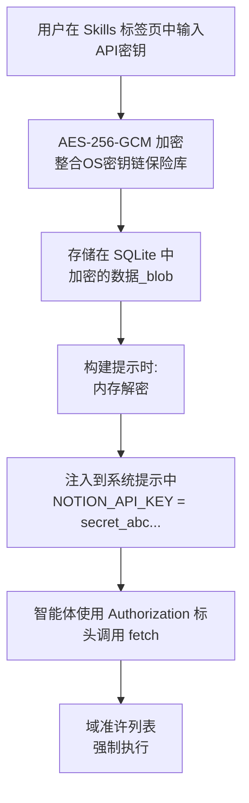

# 集成

集成是Pawz扩展系统中的第二层。它们通过完整的凭证管理和二进制检测将您的智能体与第三方API和CLI工具连接，还包含可选的仪表板小组件。OpenPawz内置了**400多个内置集成**，编译到了Rust二进制文件中，涵盖了12个类别，并且还通过[n8n的MCP桥](/guides/mcp-bridge)提供了**25,000多个社区节点类型**。社区集成可以通过来自PawzHub的TOML清单文件安装，或者手动安装到`~/.paw/skills/`目录下。


**集成与技能**：[技能](/docs/guides/skills)是一个SKILL.md文件，它将指令注入到智能体的提示中——零配置。集成是一个`pawz-skill.toml`文件，除了声明**凭证**（加密存储在保险库中）、**必需的二进制文件**（自动检测）和可选的**仪表板组件**之外，还将这些信息加入到提示中。

---

## 集成反转

与其他自动化平台不同，OpenPawz不将集成锁定在手动工作流构建器内部。所有集成——包括全部25,000多的n8n社区包——**同时**作为直接智能体工具和可视化工作流节点发挥作用。

<Tip>
当您安装一个社区包（例如 `n8n-nodes-slack`）时，Paw 会自动部署一个工作流，您的智能体可以直接在聊天中执行**——只需提问：*"嘿 Pawz，向 #general 发送hello"*。MCP桥会自动处理工作流发现、执行和结果传递。
</Tip>

| | Zapier / Make / n8n (独立模式) | OpenPawz |
|---|---|---|
| **工具可用性** | 锁定在手动工作流内部 | 在聊天和视觉流程中均可使用 |
| **使用集成** | 构建触发器 → 操作链 | 直接询问您的智能体 |
| **AI的角色** | 管道内的一个节点 | 管道在智能体内 |
| **安装新包** | 手动创建工作流程 | 自动部署工作流程 + 即时聊天访问 |

**工作原理：** OpenPawz 将 n8n 嵌入为一个[MCP服务器](/guides/mcp-bridge)。n8n 的 MCP 暴露三个工作流级别的工具（`search_workflows`、`execute_workflow`、`get_workflow_details`）。当您安装一个社区包时，Paw 会自动部署一个针对该服务的工作流并对其进行索引。[图书管理员](/reference/librarian-method) 通过语义搜索查找工作流，而 [工头](/reference/foreman-protocol) 在最小成本下执行它们。对于需要分支、循环或调度的多步编排，[流程构建器](/guides/flows)是有的；但对于单一操作，只需聊天即可。

---

## 集成如何工作

1. **作者**创建一个 `pawz-skill.toml` 清单，声明集成的功能、所需凭据及智能体如何使用它
2. **安装** 通过 PawzHub（应用内浏览器）或手动放入 `~/.paw/skills/{id}/`
3. **配置** 凭据在 **Skills** 标签页中——Pawz 会根据清单自动生成输入表单
4. **分配给智能体** —— 打开 **Agents** 标签页，选择一个智能体并在其 Skills 子标签页中启用集成
5. **使用** —— 智能体在其系统提示中接收解密后的凭证和指令，然后通过 `fetch` 调用 API，或通过 `exec` 调用 CLI 工具



---

## 清单格式

所有集成都是单一的 `pawz-skill.toml` 文件：

```toml
[skill]
id = "notion"
name = "Notion"
version = "1.0.0"
author = "yourname"
category = "productivity"
icon = "edit_note"
description = "通过 API 读取和写入 Notion 页面、数据库和块"
install_hint = "在 https://www.notion.so/my-integrations 获取您的 API 密钥"

[[credentials]]
key = "NOTION_API_KEY"
label = "Integration Token"
description = "您的 Notion 内部集成令牌"
required = true
placeholder = "secret_..."

[instructions]
text = """
您可以通过用户的集成令牌访问 Notion API。

## 阅读页面
使用 `fetch` 通过：
- URL: `https://api.notion.so/v1/pages/{page_id}`
- Headers: `Authorization: Bearer {NOTION_API_KEY}`, `Notion-Version: 2022-06-28`

## 搜索
使用 POST 方法的 `fetch` 访问 `https://api.notion.so/v1/search`
主体: {"query": "搜索词"}
"""

[widget]
type = "table"
title = "最近页面"
refresh = "10m"

[[widget.fields]]
key = "title"
label = "页面"
type = "text"

[[widget.fields]]
key = "updated"
label = "上次更新"
type = "datetime"

[[widget.fields]]
key = "status"
label = "状态"
type = "badge"
```

### 清单字段

#### `[skill]` — 必需

| 字段 | 类型 | 必需 | 说明 |
|-------|------|----------|-------------|
| `id` | string | ✓ | 唯一标识符。仅允许字母数字和连字符。 |
| `name` | string | ✓ | 显示名称。 |
| `version` | string | ✓ | semver 版本（例如 `1.0.0`）。 |
| `author` | string | ✓ | 作者名称或 GitHub 用户名。 |
| `category` | string | ✓ | 可选项：`vault`, `cli`, `api`, `productivity`, `media`, `smart_home`, `communication`, `development`, `system`。 |
| `icon` | string | — | Material Symbol 图标名称（例如 `edit_note`）。 |
| `description` | string | ✓ | 简短描述（10–500 个字符）。 |
| `install_hint` | string | — | 获取凭据的说明。 |

#### `[[credentials]]` — 可选，可重复

声明集成所需的 API 密钥、令牌或密钥。用户在 Skills 标签页输入这些信息。Pawz 使用 AES-256-GCM（32字节随机密钥存储在统一操作系统密钥链中）对其进行加密，并在运行时将解密后的值注入智能体的系统提示中。

| 字段 | 类型 | 必需 | 说明 |
|-------|------|----------|-------------|
| `key` | string | ✓ | 环境变量名（例如 `NOTION_API_KEY`）。 |
| `label` | string | ✓ | 向用户显示 UI 标签。 |
| `description` | string | — | 关于在哪里找到此凭证的帮助文字。 |
| `required` | bool | ✓ | 是否集成必须依赖此项。 |
| `placeholder` | string | — | 输入字段中的示例值。 |

:::info 凭据安全
凭据永远不会以明文形式存储。它们使用 AES-256-GCM 在 SQLite 中加密，其中 32 字节随机密钥存储在您统一的操作系统密钥链中（服务: `openpawz`）。解密后的值仅在运行时存在于智能体的系统提示中——从不记录，从不在磁盘上写入且未经加密，也不传输到外部。
:::

#### `[instructions]` — 必需

| 字段 | 类型 | 必需 | 说明 |
|-------|------|----------|-------------|
| `text` | string | ✓ | 智能体指令。 |

指令告诉智能体调用哪些端点、运行哪些 CLI 命令、如何进行身份验证、如何解析响应以及如何处理错误。在运行时，引擎会附加凭据块：

```
凭据（直接使用这些值——不要要求用户提供）：
- NOTION_API_KEY = secret_abc123...
```

#### `[widget]` — 可选

声明一个仪表板组件，以便在今日/仪表板视图上持久显示可视输出。

| 字段 | 类型 | 必需 | 说明 |
|-------|------|----------|-------------|
| `type` | string | ✓ | `status`, `metric`, `table`, `log` 或 `kv`。 |
| `title` | string | ✓ | 组件卡片标题。 |
| `refresh` | string | — | 自动刷新间隔（例如 `5m`, `1h`）。 |

查看 [组件类型](#组件类型) 了解各类型的示例。

---

## 组件类型

集成可以声明一个仪表板组件来显示持久化的结构化数据。该组件卡片出现在仪表板上，与天气、任务和快捷操作一起显示。

### 状态

单一状态指示符——服务健康状况、连接状态、开关检查。

```toml
[widget]
type = "status"
title = "服务器状态"

[[widget.fields]]
key = "status"
label = "状态"
type = "badge"

[[widget.fields]]
key = "uptime"
label = "正常运行时间"
type = "percentage"
```

### 度量

单一较大数值与趋势 —— KPI、收入、统计数量。

```toml
[widget]
type = "metric"
title = "月收入"

[[widget.fields]]
key = "value"
label = "月经常性收入"
type = "currency"

[[widget.fields]]
key = "change"
label = "与上月相比"
type = "percentage"
```

### 表格

结构化数据行 —— 问题、部署、记录。

```toml
[widget]
type = "table"
title = "活动问题"

[[widget.fields]]
key = "title"
label = "问题"
type = "text"

[[widget.fields]]
key = "priority"
label = "优先级"
type = "badge"
```

### 日志

时间序列事件流 —— 事件、消息、活动。

```toml
[widget]
type = "log"
title = "最近事件"

[[widget.fields]]
key = "message"
label = "事件"
type = "text"

[[widget.fields]]
key = "severity"
label = "级别"
type = "badge"
```

### 键值 (KV)

键值对 —— 统计、配置摘要、元数据。

```toml
[widget]
type = "kv"
title = "项目统计"

[[widget.fields]]
key = "total_records"
label = "记录"
type = "number"

[[widget.fields]]
key = "storage_used"
label = "存储"
type = "text"
```

### 字段类型

| 类型 | 呈现方式 | 示例 |
|------|-----------|---------|
| `text` | 纯文本 | "部署到生产环境" |
| `number` | 区域格式 | "1,234,567" |
| `badge` | 彩色标签（绿色/黄色/红色） | "活跃" |
| `datetime` | 相对时间 | "2小时前" |
| `percentage` | 进度条 + 数字 | "94.5%" |
| `currency` | 美元符号 + 格式 | "$12,450.00" |

---

## 内置集成

Pawz 随附**400多个内置集成**，涵盖 12 个类别。这些集成被编译到二进制文件中，可以立即使用——配置凭据并分配给智能体。无需安装插件，也无需浏览市场。

| 类别 | 数量 | 实例 |
|----------|-------|----------|
| **生产力** | 40个以上 | Notion, Trello, Obsidian, Linear, Jira, Asana, Todoist, Apple Notes, Reminders, Things 3, Bear Notes, Google Workspace |
| **通讯** | 30个以上 | Slack, Discord, Telegram, WhatsApp, Teams, 邮件 (IMAP/SMTP), iMessage, Intercom |
| **开发** | 50个以上 | GitHub, GitLab, Bitbucket, Docker, Kubernetes, Vercel, Netlify, tmux, 会话日志 |
| **数据与分析** | 35个以上 | PostgreSQL, MongoDB, Redis, Elasticsearch, BigQuery, Snowflake, Supabase |
| **媒体与内容** | 25个以上 | Spotify, YouTube, Whisper, ElevenLabs, Image Gen, DALL-E, Video Frames, GIF Search |
| **智能家居与IoT** | 20个以上 | Philips Hue, Sonos, Home Assistant, Eight Sleep, MQTT, Zigbee, Camera Capture |
| **金融与交易** | 30个以上 | Coinbase, Solana DEX, Ethereum DEX, Stripe, PayPal, QuickBooks, Plaid |
| **云与基础设施** | 40个以上 | AWS, GCP, Azure, Cloudflare, DigitalOcean, Terraform, Pulumi |
| **安全与监控** | 25个以上 | 1Password, Vault, Datadog, PagerDuty, Sentry, Grafana, Peekaboo |
| **AI与ML** | 20个以上 | Hugging Face, Replicate, Stability AI, Pinecone, Weaviate, OpenAI |
| **CRM与营销** | 30个以上 | Salesforce, HubSpot, Mailchimp, SendGrid, ActiveCampaign |
| **杂项** | 55个以上 | 天气, RSS, 博客监视器, 网络抓取, PDF, OCR, 二维码, Google 地点, 摘要 |

可在 [技能](/docs/guides/skills#skill-categories) 中查看完整目录。

---

## 按智能体范围划分

集成限定于特定智能体。当您安装一个社区集成时，您可以将其分配给一个或多个智能体。

- **市场营销智能体**可能启用了 Notion、SendGrid 和 X/Twitter 集成
- **DevOps 智能体**可能启用了 GitHub、Vercel 和 Cloudflare 集成
- **交易智能体**可能启用了 Coinbase 和 DEX 交易集成

每个智能体仅接受为其分配的集成的指令和凭据。这可防止提示膨胀，并让每个智能体聚焦于其领域。

### 将集成分配给智能体

技能和集成的分配是在**智能体**标签页管理，而不是在技能视图中：

1. 在侧栏中打开**智能体**标签页
2. 选择一个智能体（例如您的市场营销智能体）
3. 进入该智能体的**技能**子标签页
4. 启用或禁用该智能体的个别技能和集成
5. 仅为启用的项目注入到该智能体的提示中

---

## 安装集成

### 从 PawzHub（应用内）

1. 在侧栏中打开**技能**标签页
2. 搜索或浏览 PawzHub 目录
3. 点击任何集成上的**安装**（注意带 🟣 紫色徽章的集成）
4. 在自动生成的表单中配置凭据
5. 通过**智能体 → [智能体] → 技能**分配给智能体

### 手动安装

将在技能目录中放置 `pawz-skill.toml` 文件：

```
~/.paw/skills/{skill-id}/pawz-skill.toml
```

例如：

```
~/.paw/skills/notion/pawz-skill.toml
~/.paw/skills/linear/pawz-skill.toml
~/.paw/skills/stripe/pawz-skill.toml
```

Pawz 热加载技能目录——该集成将以紫色“集成”徽章出现在技能标签页中。

### 卸载

**TOML 技能：** 在技能标签页中点击**卸载**。这将从 `~/.paw/skills/` 中移除技能文件夹，清理存储的凭据并移除启用状态。

**社区包（n8n）：** 在社区浏览器的**已安装**标签页中，点击任意包的**删除**图标。Paw 在 n8n 数据目录中运行 `npm uninstall`，重启引擎并刷新 MCP 桥使其移除过时工具。“移除中……”旋转指示器显示进度。

---

## 创建集成

### 应用内向导

技能标签页中的**创建技能**向导引导您通过构建无需手写 TOML 的集成：

1. **基本信息** — 命名、类别、图标、描述
2. **凭据** — 添加 API 密钥字段及其标签和占位符
3. **说明** — 写入或粘贴智能体说明（为 REST API、CLI 工具和网络爬虫提供模板）
4. **小组件** — 选择性声明仪表板输出
5. **测试** — 启用集成并使用实时智能体验证其是否正常工作
6. **发布** — 本地保存、导出 TOML 或直接发布到 PawzHub

### AI 辅助创建

询问您的智能体：

> "为 Linear API 创建一个集成"

智能体获取 API 文档，使用端点、授权头和说明生成完整的`pawz-skill.toml`，并为审查预填充向导。

### 模板入门

- **REST API** — 使用授权头、JSON 解析的 `fetch` 调用
- **CLI 工具** — 使用标志参考和二进制检测的 `exec` 命令
- **网页抓取** — `fetch` + HTML 解析说明

---

## 发布至 PawzHub

1. **Fork** [`OpenPawz/pawzhub`](https://github.com/OpenPawz/pawzhub) 仓库
2. 创建 `skills/{your-skill-id}/pawz-skill.toml`
3. **提交 Pull Request** — CI 自动验证您的清单
4. **维护者审核并合并**
5. 您的集成将在应用内 PawzHub 浏览器中出现

### CI 验证

| 检查项 | 描述 |
|-------|-------------|
| 有效 TOML | 语法正确，存在必填字段 |
| 唯一 ID | 没有与现有技能冲突 |
| 有效类别 | 必须是允许的类别 |
| 安全 ID 格式 | 字母数字加连字符（无路径遍历） |
| Semver 版本 | `X.Y.Z` 格式 |
| 描述长度 | 10–500 字符 |
| 小组件验证 | 字段类型符合允许值 |
| 纯说明 | 没有可执行代码模式 |

---

## 安全性

### 集成能做什么
- 注入指令到智能体的系统提示
- 声明凭据字段（由引擎加密）
- 声明组件模式（由应用程序渲染）

### 集成不能做什么
- 执行任意 Rust 代码
- 绕过域允许列表/阻止列表
- 直接访问操作系统密钥链
- 读取引擎源代码
- 安装受阻包
- 启用 Docker 沙盒时运行未沙盒命令

### 运行时保护

| 层 | 保护 |
|-------|-----------|
| **凭据** | AES-256-GCM 加密，32 字节密钥在统一的 OS 密钥链保险库中 |
| **网络** | 每次 `fetch` 的域名允许列表/阻止列表 |
| **Shell** | 启用时的 Docker 沙盒路由 |
| **文件系统** | 引擎源码读取阻止 |
| **软件包** | `exec` 时的禁止列表 |
| **智能体隔离** | 智能体专用工作目录 |

---

## 准备就绪检查

在设置中每个集成卡片显示状态指示器：

| 状态 | 含义 |
|--------|---------|
| **就绪** ✅ | 所有凭据已提供，二进制文件已检测到 |
| **缺少凭据** ⚠️ | 需要 API 密钥——单击进行配置 |
| **缺少二进制** ⚠️ | 命令行工具不在 PATH — 安装提示显示 |
| **已禁用** 🔘 | 对该智能体禁用集成 |
