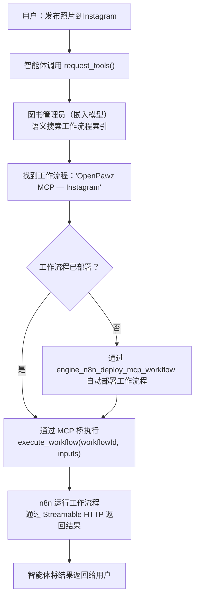
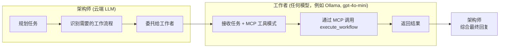

# MCP 桥 — 零间隙自动化

OpenPawz 配备了 400 多个内置集成，编译到 Rust 二进制文件中。**MCP 桥**通过嵌入 n8n 引擎并利用模型上下文协议（MCP）连接它，将这一数量扩展到**25,000+**。您的智能体发现、安装和执行 n8n 的任何社区软件包——自动、运行时、零配置。

<Note>
这是使 OpenPawz 成为现有最连接的 AI 智能体平台的功能。没有其他工具——开源或商业——能提供这种级别的集成覆盖。
</Note>

---

## 工作原理



流程是完全自动的。用户只需提出需求——智能体决定使用哪个工作流程，在必要时部署它，并执行。

---

## 架构

MCP 桥有四个层面：

### 1. 嵌入式 n8n 引擎

n8n 在应用启动时自动配置，无需用户配置：

| 方法 | 如何 | 何时 |
|--------|-----|------|
| **Docker** (推荐) | `bollard` crate 管理一个映射端口 5678 的容器 | 检测到系统上的 Docker |
| **npx** (备用) | `npx n8n start` 作为子进程 | 无 Docker 可用 |

引擎在应用启动8秒后在后台线程中启动。健康检查通过 `lazy_ensure_n8n()` 在每次 MCP 操作前运行。

### 2. MCP 通信 — Streamable HTTP

n8n 的 MCP 服务器使用**Streamable HTTP**于 `/mcp-server/http`。这已被确认与 n8n MCP Server v1.0.0（协议版本 `2024-11-05`）兼容。

| 细节 | 值 |
|--------|-------|
| **端点** | `POST /mcp-server/http` |
| **认证** | `Authorization: Bearer <mcp-api-key-jwt>` |
| **Accept** | `application/json, text/event-stream` |
| **Content-Type** | `application/json` |
| **响应格式** | SSE (`事件: message\n数据: {json}\n\n`) |

通信实现在 `transport.rs` 中，与标准输入输出和旧版 SSE 通信并列。

### 3. n8n MCP 工具 — 工作流程级操作

n8n 的 MCP 服务器公开了**三个工作流程级工具**——不是单个节点操作。这是关键的架构洞察：

| MCP 工具 | 目的 | 参数 |
|----------|---------|------------|
| `search_workflows` | 按名称或描述查找工作流程 | `query`, `limit`, `projectId` |
| `execute_workflow` | 运行具有类型化输入的工作流程 | `workflowId`, `chatInput` / `formData` / `webhookData` |
| `get_workflow_details` | 检查工作流程的节点、触发器和连接 | `workflowId` |

`execute_workflow` 工具支持三种输入类型：

| 输入类型 | 使用时机 | 字段 |
|-----------|-----------|--------|
| **聊天** | 具有聊天触发器的工作流程 | `chatInput` (字符串) |
| **表单** | 具有表单触发器的工作流程 | `formData` (键值对对象) |
| **Webhook** | 具有Webhook触发器的工作流程 | `method`, `query`, `body`, `headers` |

n8n 还声明了 `listChanged: true` 功能——当有新工作流程出现时服务器会发出通知。

### 4. 工作流程优先集成

当智能体需要使用一个社区包（例如 Instagram、Puppeteer）时：

1. 通过 npm 在 n8n 容器内安装社区包
2. n8n 重启并加载新的节点类型
3. Paw 通过 `engine_n8n_deploy_mcp_workflow` **自动部署一个工作流程**——例如“OpenPawz MCP — Instagram”
4. 通过 `execute_workflow(workflowId, inputs)` 可以执行该工作流程
5. 图书管理员将新工作流程加入语义搜索索引

这与将单独的节点类型暴露为 MCP 工具有根本不同。工作流程是可组合的——单个工作流程可以将多个节点（凭证绑定、错误处理、重试、数据转换）链接为一个连贯的操作。

---

## 架构师/工作者模式

云端 LLM（Gemini、Claude、GPT）充当**架构师**——他们进行规划和协调。更便宜的**工作者**模型执行 MCP 工具调用，降低成本（如果在 Ollama 上本地运行，则为零成本）。这对主聊天循环进行了直接整合：从您的云端 AI 发出的每个 MCP 工具调用都会自动拦截并委托给工作者。任何来自任何提供商的模型都可以当作工作者——推荐使用本地 Ollama 进行零成本执行。



| 角色 | 模型 | 成本 | 用途 |
|------|-------|------|---------|
| **架构师** | Gemini / Claude / GPT | 按标记收费 | 规划、推理、用户交互 |
| **工作者** | 任何更便宜的模型（例如 Ollama `worker-qwen`，或云端 `gpt-4o-mini`） | 本地免费 / 云端低费 | MCP 工具执行、结构化输入/输出 |
| **图书管理员** | 任何嵌入模型（例如 Ollama `nomic-embed-text`，或云端嵌入 API） | 本地免费 / 云端低费 | 语义工作流程检索（嵌入） |

### 实践中如何工作

当您说*"向Slack上的#general发送一条消息"*时：

1. **架构师**（Gemini/Claude）决定调用用于 Slack 消息工作流的 `execute_workflow`
2. 引擎在执行前**拦截**MCP 工具调用
3. **工作者**（本地 Ollama，免费）接收任务和 MCP 工具模式
4. 工作者通过 MCP 调用 `execute_workflow(workflowId, webhookData)`，n8n 执行工作流，调用 Slack API
5. 结果流动：工作者 -> 引擎 -> 架构师 -> 用户

架构师从不直接接触 MCP 层。工作者不需要预先了解 Slack、Trello 或任何集成——MCP 提供工具模式，而每个工作流封装了集成逻辑。

<Note>
**这是突破点：** 工作者模型不需要知道如何使用 25,000+ 集成。n8n 的 MCP 服务器是自我描述的——它告诉工作者哪些工作流可用以及如何执行它们。Paw 部署的任何新工作流都能够在零配置、零训练、零成本的情况下立即被发现和执行。
</Note>

### 回退行为

如果没有在**设置 → 模型 → 模型路由**中配置 `worker_model`，MCP 工具调用会回退到直接 JSON-RPC 执行（引擎直接调用 MCP 服务器）。这仍然有效，但这意味着架构师模型处理工具调用格式化，花费更多代币。

### 设置 (Ollama — 零成本)

1. 安装 Ollama 并拉取基础模型：`ollama pull qwen2.5-coder:7b`
2. 转到**设置 → 高级 → Ollama**并点击**设置工作者智能体**
3. 在**设置 → 模型 → 模型路由**中，将 `worker_model` 设为 `worker-qwen`
4. 就这些——所有 MCP 工具调用现在通过免费本地工作者路由

### 设置 (云端 — 任何提供商)

1. 转到**设置 → 模型 → 模型路由**
2. 将您的工作者模型设置为任意廉价模型（例如 `gpt-4o-mini`, `gemini-2.0-flash`, `claude-haiku-4-5`）
3. 所有 MCP 工具调用现在通过云端工作者路由，成本仅为其架构师的一小部分

---

## 智能体可以做什么？

通过 MCP 桥，您的智能体可以访问具有 n8n 社区包的任何服务——通过自动部署工作流。以下是一些**不需要API密钥**的例子：

| 类别 | 示例 |
|----------|----------|
| **数据处理** | 二维码生成、PDF 创建、CSV 解析、JSON 转换 |
| **实用工具** | UUID 生成、散列计算、日期/时间转换、正则表达式匹配 |
| **格式转换** | Markdown → HTML、XML → JSON、图像调整大小、base64 编码/解码 |

以及配置了 API 密钥的 n8n：

| 类别 | 示例 |
|----------|----------|
| **CRM** | 销售管理、HubSpot、Pipedrive、Zoho、Freshdesk |
| **项目管理** | Jira、Asana、Monday.com、ClickUp、Basecamp |
| **通信** | Twilio、SendGrid、Mailgun、Vonage、Intercom |
| **分析** | Google Analytics、Mixpanel、Amplitude、Segment |
| **云** | AWS S3、Google Cloud Storage、Azure Blob、DigitalOcean Spaces |
| **数据库** | Airtable、Supabase、Firebase、FaunaDB、CockroachDB |
| **电子商务** | Shopify、WooCommerce、Stripe、Square、PayPal |
| **社交媒体** | Twitter/X、LinkedIn、Facebook、Instagram、TikTok |
| **DevOps** | PagerDuty、Datadog、New Relic、Sentry、Grafana |
| **人工智能服务** | OpenAI、Anthropic、Hugging Face、Replicate、Stability AI |

---

## 所有五个方向

流程优先架构支持每个集成模式：

| 方向 | 如何 | 示例 |
|-----------|-----|---------|
| **正向** | 智能体 → `execute_workflow` → 外部服务 | "发送一个Slack消息" |
| **反向** | n8n 触发器 → webhook → 智能体 | 接收邮件触发智能体响应 |
| **双向** | 相同对话中读写 | 读取 Jira 工单，然后更新它们 |
| **一次使用** | 智能体即时构建临时流程 | 一次性数据迁移 |
| **流水线** | 协调者编排多流程链条 | 每日报告 → 邮件 → Slack 总结 |

---

## 设置

MCP 桥对于基本操作**不需要任何配置**。一切都是自动设置的。

### 先决条件

| 需求 | 是否必需 | 目的 |
|-------------|-----------|---------|
| **Docker** | 推荐 | 主要 n8n 运行时（容器隔离） |
| **Node.js 18+** | 后备 | 若 Docker 不可用则使用（`npx n8n start`） |
| **Ollama** | 推荐 | 本地工作者模型 + 嵌入模型（零成本）。若使用云计算两个角色，此非必需。|

### Ollama 模型（推荐用于零成本）

如果在本地使用 Ollama，三个模型驱动系统：

```bash
# 工作者模型 — 执行 MCP 工具调用
ollama pull qwen2.5-coder:7b

# 嵌入模型 — 语义工作流发现 + 记忆
ollama pull nomic-embed-text

# 聊天回退 — 离线默认聊天模型
ollama pull llama3.2:3b
```

### 验证它是否工作

启动 OpenPawz 后，在日志中查找：

```
[n8n] 启动嵌入的 n8n 引擎...
[mcp] 自动将 n8n 注册为 MCP 服务器，位于 http://127.0.0.1:5678/mcp-server/http
[mcp:http] 连接到 n8n MCP — 协议 2024-11-05
[mcp:http] 可用工具: search_workflows, execute_workflow, get_workflow_details
```

您也可以在**设置 → 高级 → n8n 引擎**中检查 n8n 状态。

---

## 社区节点浏览器

OpenPawz 包含内置的**社区浏览器**界面，用于发现和管理 n8n 社区软件包：

1. 打开**集成**标签 → **社区**部分
2. 搜索 n8n 社区注册表（25,000+ 包来自 ncnodes.com + npm）
3. 点击**安装**添加一个包——Paw 运行 `npm install`，重启 n8n，刷新 MCP 工具
4. 切换到**已安装**标签查看所有已安装的包
5. 点击**删除**图标卸载——显示"正在移除…"旋转器，然后重启 n8n 并清除过时的工具

当 REST API 不可用时（n8n 2.9.x），所有操作都会回退到直接 `npm` 命令。进程模式下使用 `~/.openpawz/n8n-data` 中的 `npm`；Docker 模式下使用 `docker exec`。

另外，智能体可以通过对话发现和安装程序包：

> "我需要生成二维码"
>
> *智能体搜索社区节点，找到二维码包，安装它，部署一个工作流程，在一个对话中生成二维码。*

---

## 相比于 Zapier / Make / n8n 独立版

| | **OpenPawz MCP 桥** | **Zapier** | **Make** | **n8n（独立版）** |
|---|---|---|---|---|
| **集成** | 25,000+ | 7,000+ | 2,000+ | 400+ 内置 |
| **AI 驱动** | 智能体发现和执行工作流程 | 手动设置 | 手动设置 | 手动设置 |
| **自动部署** | 在运行时创建工作流程 | 预配置 | 预配置 | 手动工作流程构建 |
| **成本** | 本地免费 / 云费用低 | $20–600/月 | $9–300/月 | 免费（自托管） |
| **自然语言** | "发布一张照片到 Instagram" | 拖放 | 拖放 | 拖放 |
| **隐私** | 100% 本地 | 云端 | 云端 | 自托管选项 |
| **多智能体** | 是 | 否 | 否 | 否 |

---

## 故障排除

| 问题 | 解决方案 |
|---------|----------|
| n8n 无法启动 | 检查 Docker 正在运行 (`docker ps`) 或 Node.js 18+ 可用 (`node --version`) |
| MCP 403 "access is disabled" | Paw 通过 `PATCH /rest/mcp/settings` 自动启用 MCP。如果是手动，确保 `mcpAccessEnabled: true`。 |
| MCP 406 "must accept both" | 传输必须发送 `Accept: application/json, text/event-stream`。检查传输配置。 |
| "No MCP tools available" | 运行 `mcp_refresh` 或重新启动应用。检查 n8n 在 `http://localhost:5678` 是否正常运行。 |
| 社区包安装失败 | 确保 n8n 有网络访问权限。对于进程模式，检查 `~/.openpawz/n8n-data` 是否存在并且 npm 在 PATH 上。对于 Docker 模式，检查容器日志：`docker logs paw-n8n`。 |
| 社区包卸载无效果 | 确保您在最新构建版本上。较早版本使用 `window.confirm()`，在 macOS 上的 Tauri WKWebView 中不会呈现。 |
| MCP 令牌被隐藏 | Paw 通过 `POST /rest/mcp/api-key/rotate` 自动轮换。如果这失败了，n8n 的所有者会话可能已经过期——重新启动应用。 |
| 安装后找不到工作流程 | 自动部署步骤可能已失败。检查 `engine_n8n_deploy_mcp_workflow` 错误的日志。 |
| 工作者模型未找到 | 如果使用 Ollama，请运行 `ollama pull qwen2.5-coder:7b`。否则，按设置 → 模型 → 模型路由将任意模型配置为工作者。 |

---

## 安全性

- n8n 运行在**本地**——无云中继，无数据离开您的机器
- 社区包从**官方 npm 注册表**安装
- MCP 传输仅使用**本地主机**连接（127.0.0.1:5678）
- MCP 认证使用带有 `mcp-server-api` 观众的**JWT**——区分于 REST API 密钥。过时/重掩密钥通过 `/rest/mcp/api-key/rotate` 自动轮换
- n8n 加密密钥存储在您**统一操作系统密钥链**(`openpawz`) 中，而不是存储在文件系统上
- 所有工具调用都通过 OpenPawz 的**人在环审批**系统
- n8n 节点的凭据注入使用相同的**AES-256-GCM 加密保险库**
- MCP 桥继承核心平台的所有 10 级安全
