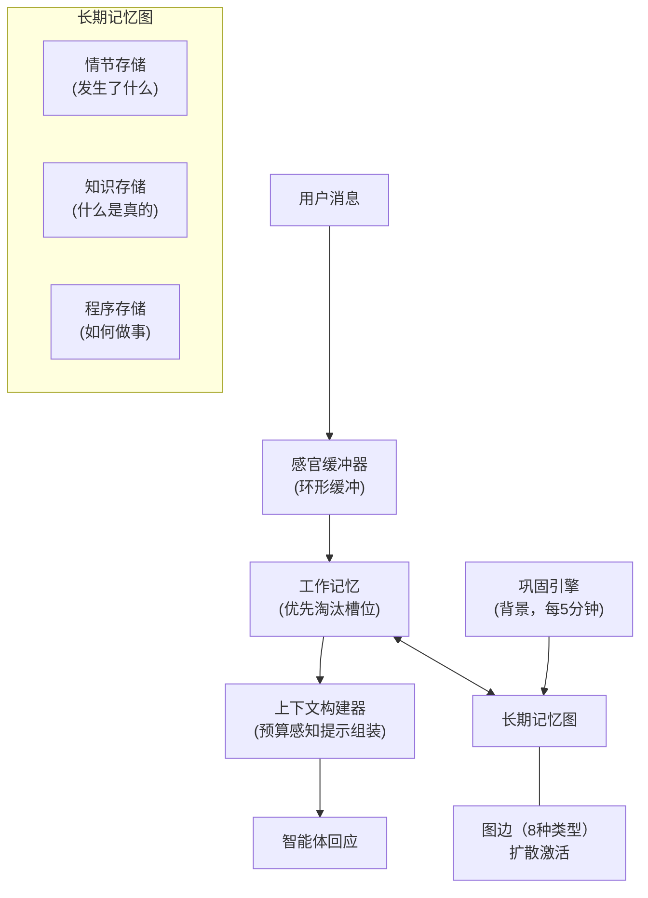
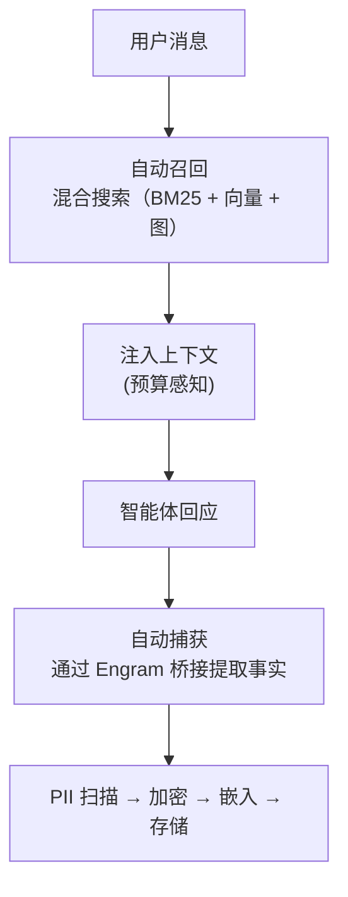
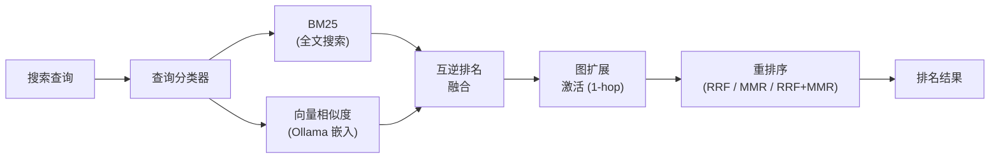

# 记忆

Pawz 使用**项目Engram**，这是一种受生物学启发的三层记忆架构，让智能体能够记住在对话中发生的事实、偏好和上下文，具有基于图表的知识管理、混合搜索和自动PII加密。

## 架构

Engram 根据人类认知架构对人体记忆进行建模，具有三个层次：



| 层 | 类比 | 角色 |
|------|---------|------|
| **感官缓冲器** | 图像/回声记忆 | 环形缓冲区保存原始令牌；在每次轮次后丢弃 |
| **工作记忆** | 短期记忆 | 优先淘汰的槽位为上下文窗口提供输入 |
| **长期记忆** | 陈述性和程序性记忆 | 带有情节、知识和程序存储的持久图 |

### 工作原理



## 配置

转到**设置 → 会话**来配置记忆：

| 设置 | 默认 | 说明 |
|---------|---------|-------------|
| **嵌入模型** | `nomic-embed-text` | 用于创建向量嵌入的模型 |
| **嵌入基础URL** | `http://localhost:11434` | 用于嵌入的 Ollama 端点 |
| **嵌入维度** | 768 | 向量大小（与您的模型匹配） |
| **自动召回** | 开启 | 自动检出相关记忆 |
| **自动捕获** | 开启 | 自动从对话始提取事实 |
| **召回限制** | 5 | 每次消息注入的最大记忆数 |
| **召回阈值** | 0.3 | 最低相关性得分 (0-1) |

## 记忆类别

每条记忆都被标记有类别：

| 类别 | 用例 |
|----------|----------|
| `general` | 通配 |
| `preference` | 用户喜好，风格偏好 |
| `instruction` | 常设命令，规则 |
| `context` | 背景信息 |
| `fact` | 具体事实，日期，数字 |
| `project` | 项目特定上下文 |
| `person` | 关于人的信息 |
| `technical` | 技术细节，工具，配置 |
| `task_result` | 完成任务的结果 |
| `session` | 压缩的会话摘要 |
| `observation` | 智能体对模式的观察 |
| `goal` | 用户目标和目的 |
| `skill` | 学得的能力和程序 |
| `relationship` | 实体间的连接 |
| `temporal` | 基于时间的事件和期限 |
| `emotional` | 情感和情感语境 |
| `creative` | 创意作品、草稿、想法 |
| `system` | 系统状态和配置说明 |

## 混合搜索

记忆检索使用三信号混合算法，并融合了互逆排名融合（RRF）：



1. **BM25** — 通过 porting 词干提取进行的相关性全文搜索
2. **向量余弦相似度** — 通过 Ollama 嵌入实现的语义含义
3. **图扩展激活** — 遍历类型的记忆边缘，发现相关记忆
4. **RRF 融合** — 融合所有三信号，无需进行分数标准化
5. **重排序** — 可配置的策略：RRF，MMR（最大边际相关性）或组合
6. **关键词回退** — 当 BM25 和矢量搜索均未返回结果时，引擎将回退到对内存内容使用 SQL 的关键词搜索。这确保即使在嵌入不可用或全文索引错过匹配的情况下，记忆也能被找到。

:::tip 关键词回退
关键词回退是自动的——您无需配置任何内容。如果语义搜索和BM25均对某查询返回空结果，Pawz将透明地尝试通过简单子串匹配，这样您永远不会收到错误的“找不到结果”的提示。
:::

### 调优搜索

在记忆宫殿中，您可以调整：

| 参数 | 默认 | 效果 |
|-----------|---------|--------|
| BM25权重 | 0.4 | 文本匹配重要性 |
| 向量权重 | 0.6 | 语义匹配重要性 |
| 衰减半衰期 | 30天 | 老记忆褪色的速度 |
| MMR λ | 0.7 | 1.0 = 纯相关性，0.0 = 最大多样性 |
| 阈值 | 0.3 | 包含的最低得分 |

## 记忆宫殿

记忆宫殿是一个用于管理所有存储记忆的专用视图。它分为四个标签：

### 标签

| 标签 | 功能 |
|-----|-------|
| **回忆** | 语义搜索界面 — 输入自然语言查询并查看带相关性评分的排名结果 |
| **记住** | 手动创建记忆的表格 — 设置内容、类别和重要性再保存 |
| **图谱** | 强制导向的图形可视化记忆关系，按类别分组，并根据重要性编码彩色圆泡 |
| **文件** | 浏览存储在磁盘上的智能体个性文件（`IDENTITY.md`、`SOUL.md`等） |

#### 回忆

在搜索框输入查询并按**Enter**（或点击搜索按钮）。结果显示为卡片，显示类别标签、相关性得分（百分比）、内容预览和重要性。点击侧边栏中某个记忆，也将其在回忆标签里打开。

#### 记住

填写以下内容手动存储新记忆：
- **内容** — 需要记住的文本
- **类别** — 从标准类别中选择（一般, 偏好, 指令等 )
- **重要性** — 1-10 级

点击 **保存记忆** 来持久化它。侧边栏和统计信息自动更新。

#### 图谱

点击 **渲染** 生产泡泡图可视化。记忆按类别分组，并布局在圆形中。每个泡泡代表一个记忆 — 它的大小反映出重要性，颜色映射到类别。这为你代理了解的知识以及知识集中的地方快速直观概览。

#### 文件

浏览并编辑保存在磁盘上的智能体身份和个性文件。即使是未配置嵌入模型的时候，这个标签也总是可用。

### 嵌入状态横幅

在记忆宫殿的顶部，一个状态横幅显示嵌入模型是否被加载并运行：

| 状态 | 横幅 |
|--------|--------|
| Ollama 未运行 | ⚠️ 警告 — 语义搜索已禁用，退回到关键词匹配 |
| 模型未拉取 | ℹ️ 信息 — 提示您通过一键按钮用 (~275 MB) 的拉取模型 |
| 记忆需要矢量 | ℹ️ 信息 — 提供一个**嵌入全部**按钮来为现有记忆补充嵌入 |
| 合适 | ✅ 成功 — 显示激活模型名称 (例如 `nomic-embed-text` 通过 Ollama) |

:::note
当嵌入不可用时，横幅会提示您内存搜索将退回到关键词匹配。你仍然可以存储和检索记忆 — 只没有语义排名。
:::

### 最近的记忆侧边栏

在记忆宫殿的右侧，边栏显示**20 个最近存储的记忆**供快速参考。每张卡片显示：
- 类别标签
- 内容预览（前 60 个字符）
- 重要性得分

点击任何卡片跳转到其详细信息在回忆标签。侧边栏顶部搜索框让您按关键词过滤可见卡片。

### JSON 导出

单击记忆宫殿工具栏中的**导出**按钮，以JSON文件的形式下载所有记忆。导出内容包括：

```json
{
  "exportedAt": "2026-02-20T12:00:00.000Z",
  "source": "Paw Desktop — Memory Export",
  "totalMemories": 42,
  "memories": [
    {
      "id": "...",
      "content": "用户喜欢暗色主题",
      "category": "preference",
      "importance": 7,
      "created_at": "..."
    }
  ]
}
```

文件名为`paw-memories-YYYY-MM-DD.json`。用于备份或在机器之间转移记忆。

## 斜杠命令

从任何聊天快速进行记忆操作：

```
/remember <文本>    手动存储一个记忆
/forget <id>        通过ID删除一个记忆
/recall <查询>     搜索记忆并显示结果
```

## 自动捕捉

启用自动捕捉后，引擎会用启发式方法从对话中提取可记事实。寻找：
- 用户偏好("我喜欢...", "我不喜欢...")
- 显式指示("总是...", "绝不...")
- 个人上下文（姓名，地点，角色）
- 具体事实（日期，数字，决定）

## 嵌入设置

Pawz 使用 Ollama 自动管理嵌入：

1. 检查Ollama是否可达
2. 如需要，自动启动 Ollama
3. 检查嵌入模型是否可用
4. 如缺失，则自动拉取模型
5. 测试嵌入生成

如果切换嵌入模型，请使用**回填**重新嵌入现有记忆。

## 嵌入后端

引擎依次尝试端点：
1. Ollama `/api/embed` (当前API)
2. Ollama `/api/embeddings` (旧API)
3. OpenAI 兼容 `/v1/embeddings`

这意味着你可以通过更改基本 URL 来使用任何与 OpenAI 兼容的嵌入 API。

## 安全性

Pawz 中的记忆在多层进行保护：

| 层 | 保护 |
|-------|-----------|
| **PII加密** | 两层 PII 防御：第1层使用 17 种正则表达式模式（电子邮件、SSN、信用卡、JWT、AWS密钥、私钥、IBAN 等）检测敏感内容，并使用 AES-256-GCM 加密。第2层使用LLM辅助扫描上下文依赖的 PII（"母亲的婚前姓"，"出生在斯普林菲尔德"）。通过 HKDF 派生每个代理的加密密钥，从统一的 OS 密钥链 (`openpawz`) 派生。 |
| **静止时** | 每代理HKDF派生的AES-256-GCM密钥——每个智能体的记忆都是密码学隔离的。密钥带版本（`enc:v1:`前缀）自动 90 天轮换。 |
| **传输时** | SSL证书固定到嵌入提供商的连接（仅 Mozilla 根 CA，排除 OS 信任存储） |
| **RAM 中** | 提供商 API 密钥包装在 `Zeroizing<String>` 中——在下降时自动从内存中清零 |
| **传出** | 每次嵌入请求 SHA-256 签名并记录到 500 条目审核环形缓冲区 |
| **查询清理** | 所有搜索查询运算符在执行之前被剥离，以防止注入 |
| **提示注入** | 10 模式扫描器用 `[REDACTED:injection]` 标记删除记忆内容中的提示注入尝试 |
| **智能体内信任** | 记忆总线在发布和读取路径上强制执行能力令牌（HMAC-SHA256签名）——范围/重要性的上限、按智能体设定速率限制、带 4 步验证的签名范围令牌和信任加权矛盾解析 |
| **抗司法取证** | 数据库填充到 512KB 边界；双相安全删除防止纯文本恢复；快照 HMAC 检测篡改 |
| **GDPR 合规** | 第 17 条清除命令删除用户的所有记忆、嵌入、搜索索引和图表边 |

:::info PII 自动加密
Engram 自动扫描记忆内容以使用两层防御寻找 PII：
- **第1层（正则表达式）：** 17 个模式检测邮箱、电话号码、SSN、信用卡、JWT、AWS 密钥等。
- **第2层（LLM）：** LLM 辅助扫描程序识别正则表达式遗漏的上下文相关 PII（例如，“我的母亲的婚前姓是史密斯”）。被第1层标记的内容或超过大小阈值的内容会被发送到活跃模型以分类。

所有包含 PII 的内容都使用每个代理的 AES-256-GCM 密钥加密（通过 HKDF 从操作系统密钥链中派生）。检索时自动解密。
:::

## 合并引擎

Engram 每5分钟运行后台合并周期，以保持记忆健康：

| 操作 | 目的 |
|-----------|---------|
| **模式聚类** | 语义相关性对相关记忆分组 |
| **矛盾检测** | 识别并解决矛盾的事实 |
| **FadeMem双层衰减** | 权重重要性 Ebbinghaus 曲线（第1层）+ LRU访问频率提升（第2层）——高重要性和访问频繁的记忆抵抗衰减 |
| **垃圾收集** | 删除强度低于阈值的记忆 |
| **GraphRAG 社区检测** | Louvain 模块度聚类识别内存图中的知识社区，以增强检索 |

### 记忆强度

每个记忆都有一个强度分数(0.0–1.0)，由**FadeMem 双层衰减**系统管理：

- **第1层（Ebbinghaus 曲线）：** 时间指数衰减可配置半衰期。高重要性记忆（重要性 > 0.7）衰减速度减半。衰减因子为：`0.5^(age_days / half_life) × importance_weight`。
- **第2层（LRU 提升）：** 每次记忆访问（搜索命中，回忆，显式读取）增加一个频率计数器。频繁访问的记忆可获得一个反衰变的提升：`min(access_count × 0.05, 0.3)`。

合并强度决定垃圾收集资格。这样确保常用知识保持持久，并真正陈旧的信息自然修剪掉。

### GraphRAG 社区检测

内存图定期使用 Louvain 模块度优化进行分析，以查找相关的知识集群:

- **社区标签** 分配给记忆，从而启动社区范围检索
- **模块度分数** 跟踪集群质量——较高的分数表示良好的知识领域分离
- **跨社区边** 突出了知识领域的连接关系
- 在合并周期期间，随着新记忆的到达重新计算社区

## 智能体记忆工具

智能体可访问7个记忆工具用于直接记忆管理：

| 工具 | 说明 |
|------|-------------|
| `memory_store` | 使用类别和重要性存储新记忆 |
| `memory_search` | 在所有记忆存储中进行混合搜索 |
| `memory_delete` | 按 ID 删除指定记忆 |
| `memory_list` | 列出带有可选类别筛选的最新记忆 |
| `memory_update` | 更新现有的记忆内容或元数据 |
| `memory_link` | 在两个记忆间创建一个有类型链接 |
| `memory_snapshot` | 导出记忆图的即时状态快照 |

## 流程内存集成

当流程运行时，执行器会自动检索长期记忆，使得智能体节点在**之前**生成响应时拥有相关的上下文。

### 在流程开始时预先召回

在节点执行前，流执行器从图名称和流中的所有智能体提示中构建一个记忆查询，然后调用 `pawEngine.memorySearch()`。顶尖结果（筛选于分数 ≥ 0.3）被串联成 `memoryContext` 字符串并存储在 `FlowRunState` 中。

所有智能体节点都在一个 `[相关记忆]` 部分接收此上下文，该部分通过 `buildNodePrompt()` 预加到其自身的提示前。

### Tesseract 流中的单元范围内存

Tesseract 流拆分工作到并发运行的并行**单元**——执行时相互独立的子图。每个单元因服务于不同目的（例如一个研究单元对一个分析单元）的智能体需求不同的记忆。

指挥器通过**按单元内存隔离**解决了这个问题：

1. 对于每个单元，从单元的智能体提示构建一个重点查询（最多3个智能体，每个200字符，总计不超过300个字符）
2. 通过 `deps.searchMemory()` 并发解析所有单元查询，这个功能调用 `pawEngine.memorySearch()` 并按分数 ≥ 0.3 过滤
3. 结果存储在不可变的 `resolvedCellMemory` 映射中——在执行开始前一次性计算
4. 每个单元的执行器接收一个 `ConductorDeps` 包装器，将其内存覆盖绑定到每个 `executeNode` 和 `executeAgentStep` 调用

这样消除了共享状态变异——并行单元绝不会在 `runState.memoryContext` 上竞赛。

### 搜索内存 IPC 桥

`ConductorDeps` 上的 `searchMemory` 函数桥接流引擎到 Rust 内存后端：

```typescript
searchMemory: async (query: string, limit: number) => {
  const results = await pawEngine.memorySearch(query, limit, agentId);
  return results
    .filter(m => m.score >= 0.3)
    .map(m => `[${m.category}] ${m.content}`)
    .join('\n');
}
```

这就是在聊天会话中使用的相同混合搜索流程（BM25 + 向量 + 图传播激活），因此流智能体受益于完整的 Engram 检索堆栈。
