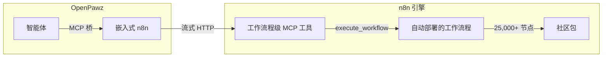
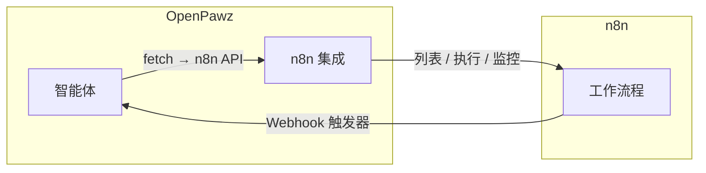
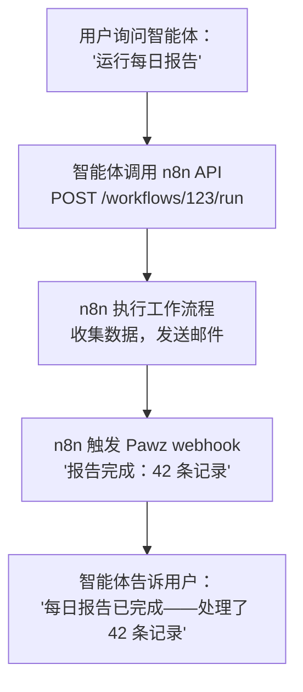

# n8n — 嵌入式自动化引擎

OpenPawz 将 [n8n](https://n8n.io) 直接嵌入到桌面应用程序中。它在启动时自动配置（通过 Docker 或 npx），通过 **模型上下文协议（MCP）** 连接，并通过自动部署工作流程提供对 **25,000+ 社区集成** 的访问。无需手动设置。

<Note>
OpenPawz 中的 n8n **不是一个您管理的独立服务**。它是一个嵌入式引擎，自动启动，在本地运行，并通过 MCP 桥由您的智能体完全控制。
</Note>

---

## 工作原理

OpenPawz 以两种方式使用 n8n：

### 1. MCP 桥（主要）

MCP 桥通过模型上下文协议将您的智能体连接到 n8n。n8n 的 MCP 服务器公开 **三个工作流程级工具**（`search_workflows`、`execute_workflow`、`get_workflow_details`）。Paw 自动部署按服务的工作流程，智能体可以发现并执行：



请参阅 [MCP 桥指南](/guides/mcp-bridge) 了解完整架构，包括其中的 **架构师/工作器模式**，其中本地 Ollama 模型零成本执行 MCP 工具调用——您的云 AI 方案中，本地工作器执行。

### 2. REST API（旧版——仍支持）

传统的 n8n REST API 集成，用于直接管理工作流程：



---

## 社区包

OpenPawz 包含一个内置的 **社区浏览器**，用于发现、安装和卸载 n8n 社区包——无需终端。

### 安装

1. 转到 **集成** 选项卡 → **社区** 部分
2. 搜索 n8n 社区注册表（25,000+ 包）
3. 点击 **安装** —— Paw 在 n8n 数据目录中运行 `npm install`，重启引擎，然后刷新 MCP 桥
4. 新工具立即可供您的智能体使用

### 卸载

1. 在社区浏览器中切换到 **已安装** 选项卡
2. 点击任何包旁边的 **删除** 图标
3. 在对话框中确认
4. Paw 运行 `npm uninstall`，重启 n8n，移除陈旧 MCP 工具

在卸载过程中，删除按钮会替换为旋转的"正在删除…"指示器。忽略双击。

<Note>
n8n 2.9.x 移除了 `/api/v1/community-packages` REST 端点。OpenPawz 自动回退到直接在 n8n 数据目录中使用 `npm install`/`npm uninstall`（进程模式）或 `docker exec`（Docker 模式）。
</Note>

### 数据目录

社区包安装在 `~/.openpawz/n8n-data` 中。此路径特意避免空格——macOS 默认的 `~/Library/Application Support/` 路径会破坏原生 npm 包的 `node-gyp` 构建。如果您有旧的安装，则在首次启动时自动迁移数据。

---

## 设置

### 自动（MCP 桥——推荐）

当您启动 OpenPawz 时，**自动配置** n8n。无需手动设置。

1. **Docker 用户**：n8n 作为容器启动，通过 `bollard` crate（端口 5678）
2. **无 Docker**：n8n 作为子进程，通过 `npx n8n start` 启动
3. **所有者账户** 在无头操作期间自动创建
4. **MCP 访问** 自动启用（带重试逻辑——最多 3 次尝试）
5. 在 `http://127.0.0.1:5678/mcp-server/http` 处自动连接 MCP 桥

这一切都在 **每次重新连接** 时发生，而不仅仅是首次启动——因此，如果 n8n 在外部重启或之前的 MCP 设置失败，它会自我修复。

通过检查日志验证是否正常工作：
```
[n8n] Starting embedded n8n engine...
[n8n] Owner setup succeeded
[n8n] MCP access enabled
[mcp] Auto-registering n8n as MCP server at http://127.0.0.1:5678/mcp-server/http
[mcp:http] Available tools: search_workflows, execute_workflow, get_workflow_details
```

### 手动（REST API——可选）

如果要使用与 **外部** n8n 实例的 REST API 集成：

#### 1. 获取您的 n8n API 密钥

1. 打开你的 n8n 实例（例如 `http://localhost:5678`）
2. 前往 **设置 → API**
3. 点击 **创建 API 密钥**
4. 复制密钥

#### 2. 安装集成

<Tabs>
  <Tab title="从 PawzHub">
    1. 在侧边栏中打开 **技能** 选项卡
    2. 搜索 **n8n**
    3. 点击 **安装**
  </Tab>
  <Tab title="手动">
    在以下位置放置清单：
    ```
    ~/.paw/skills/n8n/pawz-skill.toml
    ```
  </Tab>
</Tabs>

#### 3. 配置凭证

1. 前往 **设置 → 技能**
2. 找到 **n8n** 集成
3. 输入：
   - **n8n API 密钥** — 第一步中的密钥
   - **n8n 实例 URL** — 您的 n8n 基础 URL（例如 `http://localhost:5678`，无末尾斜杠）

#### 4. 分配给智能体

1. 打开 **智能体** 选项卡
2. 选择您想要连接的智能体
3. 前往该智能体的 **技能** 子选项卡
4. 启用 **n8n**

---

## 您的智能体可以做什么

| 动作 | 描述 |
|--------|-------------|
| **列出工作流程** | 查看所有工作流程及其激活/非激活状态 |
| **执行工作流程** | 按名称或 ID 触发任何工作流程，可选择传递输入数据 |
| **通过 webhook 触发** | 使用 JSON 载荷命中工作流程的 webhook URL |
| **激活 / 停用** | 打开或关闭工作流程 |
| **检查执行情况** | 查看最近的执行历史记录，成功/失败状态 |
| **调试失败** | 获取执行详细信息，以查看哪个节点失败以及原因 |

---

## 示例提示

一旦启用了集成，只需与智能体交流：

> "列出我的所有 n8n 工作流程"

> "运行'每日报告'工作流程"

> "检查'邮件摘要'的上次运行是否成功"

> "停用名称中包含'test'的所有工作流程"

> "使用此数据触发入职 webhook：{name: 'Alice', email: 'alice@example.com'}"

---

## 双向：n8n 触发智能体

n8n 还可以通过 OpenPawz 内置的 webhook 服务器触发您的 Pawz 智能体：

1. 在 OpenPawz 中启用 webhook 服务器（设置 → Webhook）
2. 在 n8n 中，添加一个指向您 Pawz webhook 端点的 **HTTP 请求** 节点
3. 发送带有消息和目标智能体的 JSON 载荷

这样就形成了一个完整的闭环：智能体触发 n8n 工作流程，n8n 工作流程触发智能体。



---

## 仪表板小部件

该集成包括仪表板上的 **工作流程** 小部件，显示：

| 列 | 描述 |
|--------|-------------|
| **工作流程** | 工作流程名称 |
| **状态** | 激活（绿色）或未激活（灰色） |
| **最后更新** | 工作流程最后一次修改的时间 |

该小部件每 5 分钟刷新一次。

---

## 故障排除

| 问题 | 解决方案 |
|---------|----------|
| 401 未经授权 | 验证您在技能设置中的 API 密钥。过期则重新生成。 |
| 连接被拒绝 | 检查 n8n 实例是否正在运行且 URL 正确。 |
| 工作流程未找到 | 首先让智能体列出所有工作流程，以确认可用的 ID。 |
| 执行失败 | 让智能体获取执行细节——它会显示哪个节点出错。 |
| Webhook 不工作 | 确保 n8n 工作流程为 **活动状态**，且 webhook 路径匹配。 |
| 社区安装失败（node-gyp） | 确保数据目录位于 `~/.openpawz/n8n-data`（无空格路径）。检查日志中的 npm 错误。 |
| 已安装标签页显示 0 个包 | 在 n8n 2.9.x 中 REST API 返回 404 —— Paw 回退到从数据目录读取 `package.json`。如果数据目录为空，可能并未正确安装软件包。 |
| 卸载按钮不起作用 | 确保您运行的是最新版本。较旧版本使用的 `window.confirm()` 在 macOS 上的 Tauri's WKWebView 中不渲染。 |
| MCP 令牌检索失败 | 检查日志中的"MCP API 密钥已被隐藏"—— Paw 自动轮换过期密钥。如果是 n8n 正在重启中，请稍等几秒再重试。 |
| 重启时加密密钥不匹配 | 加密密钥存储在统一的操作系统密钥库中（`openpawz`）。如果您清除了密钥库，请删除 `~/.openpawz/n8n-data` 开始全新安装。 |

---

## 安全注意事项

- 您的 n8n API 密钥在 Pawz 保险库中 **加密**（AES-256-GCM，密钥存储在统一的操作系统密钥链中）——永不以纯文本形式存储
- **n8n 加密密钥** 存储在统一的操作系统密钥库中（`openpawz`），绝不以明文形式存储在文件系统中。只同步到 n8n 的配置文件中以防止启动错误。
- **MCP API 密钥** 是带有 `mcp-server-api` 受众的 JWT，与 REST API 密钥分开。过时/隐藏的密钥会自动轮换。
- 在内存中，API 密钥包装在 `Zeroizing<String>` 中——当提供程序丢弃时自动从内存中归零
- API 调用直接从您的计算机到您的 n8n 实例——无云中继
- 所有出站请求使用**证书绑定 TLS 客户端**（仅 Mozilla 根 CA，操作系统信任存储除外）
- 每个出站请求都用 **SHA-256 签名** 并记录到环形审计缓冲区以进行篡改检测
- 应用获取域名白名单——确保您的 n8n 域名在允许列表中，如果您配置了阻止列表
