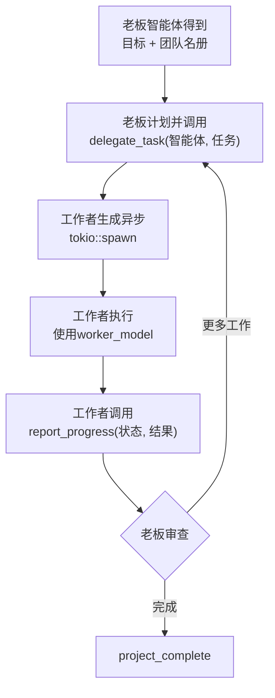

# 编排器

编排器支持多智能体项目，其中一个老板智能体会将任务委派给工作智能体。

## 概念

| 角色 | 模型 | 描述 |
|------|-------|-------------|
| **老板** | `boss_model` (昂贵，强大) | 计划，委派，审查结果 |
| **工作者** | `worker_model` (便宜，快速) | 执行特定任务 |

## 创建项目

1. 前往侧边栏中的 **编排器**
2. 点击 **新项目**
3. 填写：
   - **标题** — 项目名称
   - **目标** — 项目应完成的内容
   - **老板智能体** — 领导的智能体
   - **_workers_ — 添加具有专长的智能体**

## 智能体专长

项目团队中的每个智能体都有一个 **专长**，决定如何提示它以及使用哪种模型。根据上下文，编排器支持两组专长：

### 项目子智能体 (`create_sub_agent`)

当老板智能体在项目运行期间动态创建子智能体时：

| 专长 | 最适合 |
|-----------|----------|
| `coder` | 编写、审阅和调试代码 |
| `researcher` | 查找信息、网页研究 |
| `designer` | 创意工作、UI/UX、视觉内容 |
| `communicator` | 撰写电子邮件、消息、文档 |
| `security` | 安全审查、审计 |
| `general` | 上述未涵盖的任何内容 |

### 独立智能体 (`create_agent`)

通过 `create_agent` 工具或智能体视图创建智能体时：

| 专长 | 最适合 |
|-----------|----------|
| `coder` | 编写、审阅和调试代码 |
| `researcher` | 查找信息、网络研究、调查 |
| `writer` | 长篇文章、报告、文档、文案撰写 |
| `analyst` | 数据分析、评估、比较、评估 |
| `general` | 上述未涵盖的任何内容 |

:::tip 自定义系统提示
每个智能体——无论专长如何——都可以在创建时通过 `system_prompt` 参数设置 **自定义系统提示**。这使您可以完全控制智能体的行为和个性，超越专业标签。老板智能体可以在 `create_sub_agent` 中使用详细的 `system_prompt` 来动态创建高度定制的工作智能体。
:::

可以根据专长在 **设置 → 引擎** 下的模型路由中配置专长模型。例如，将`coder`设置为`gemini-2.5-pro`会将所有编码任务路由到该模型。

## 工作原理



## 老板智能体工具

| 工具 | 描述 |
|------|-------------|
| `delegate_task` | 将工作分配给工作智能体 |
| `check_agent_status` | 查看工作智能体在做什么 |
| `send_agent_message` | 给工作智能体发送消息 |
| `project_complete` | 标记项目已完成 |
| `create_sub_agent` | 动态创建新智能体 |

## 工具工作者

工作者可以访问所有标准安全工具，还包括：
- `report_progress` — 向老板发送状态更新
  - 状态：`working`(工作中)，`done`(已完成)，`error`(错误)，`blocked`(阻塞)

工作者还可以在无需人类智能体审核(HIL)批准的情况下使用:电子邮件、slack、GitHub、REST API、webhooks和图像生成。

## 项目状态

| 状态 | 含义 |
|--------|---------|
| `planning` | 已创建，未开始 |
| `running` | 老板正在主动分派 |
| `paused` | 手动暂停 |
| `completed` | 老板调用了project_complete |
| `failed` | 不可恢复的错误 |

## 消息总线

项目详细视图显示实时消息总线(每3秒轮询一次):

| 消息类型 | 来源 |
|-------------|------|
| `delegation` | 老板分配任务 |
| `progress` | 工作者报告状态 |
| `result` | 工作者完成任务 |
| `error` | 发生了一些错误 |
| `message` | 智能体间通信 |

## 模型路由

在 **设置 → 引擎** 中配置哪个模型处理什么：

| 设置 | 目的 |
|---------|---------|
| `boss_model` | 老板智能体的模型(通常昂贵/强大) |
| `worker_model` | 工作者的默认模型(通常廉价/快速) |
| `specialty_models` | 专业覆盖(例如，`coder` → `gemini-2.5-pro`) |
| `agent_models` | 智能体覆盖(优先级最高) |
| `cheap_model` | 当启用`auto_tier`时用于简单任务的预算模型 |
| `auto_tier` | 自动为简单任务选择`cheap_model` |

**解析优先级：** agent_models > specialty_models > role-based > fallback

### 便宜模型和自动分级

**便宜模型** 设置可通过将简单任务路由到更小、更快的LLM来降低成本，同时将完整模型保留用于复杂工作。

当启用 `auto_tier` 时，每个传入消息在模型选择之前由复杂度启发式算法进行分类：

| 复杂度 | 路由到 | 示例 |
|------------|-----------|----------|
| **简单** | `cheap_model` | "现在几点了？"，"将5公斤转换为磅"，基本问答 |
| **复杂** | 默认模型 | 代码生成、多步骤推理、分析、研究 |

分类器会寻找信号，比如代码关键词(`implement`，`refactor`，`debug`)，推理短语(`analyze`，`compare`，`step by step`)，多步骤模式(`and then`，`first,`，数字列表)和消息长度(>1500字符 → 复杂)。

```json title="示例模型路由配置"
{
  "boss_model": "gemini-2.5-pro",
  "worker_model": "gemini-2.0-flash",
  "cheap_model": "claude-3-haiku",
  "auto_tier": true,
  "specialty_models": {
    "coder": "gemini-2.5-pro",
    "researcher": "gemini-2.0-flash"
  }
}
```

:::info
`auto_tier` / `cheap_model` 机制适用于常规聊天会话。在编排器项目内，模型选择使用 `boss_model` → `worker_model` → `specialty_models` → `agent_models` 路由链。
:::

### 执行限制

编排器项目受引擎的全局执行限制约束：

| 设置 | 默认 | 描述 |
|---------|---------|-------------|
| `max_tool_rounds` | 20 | 每个智能体循环(老板或工作者)中 LLM ↔ 工具调用回合的最大数量。超过时，智能体停止并返回其最后一个输出。 |
| `tool_timeout_secs` | 300 | 单个工具调用批准(HIL)的超时秒数。如果用户在此窗口内未批准，将拒绝工具调用。 |
| `max_concurrent_runs` | 4 | 整个引擎(聊天 + 定时 + 编排器)中最大的同时智能体运行数。聊天始终优先。 |

老板智能体循环在以下情况退出：
- 调用 `project_complete`
- 超过 `max_tool_rounds`
- 发生不可恢复的错误

工作智能体循环在以下情况退出：
- 以 `done` 状态调用 `report_progress`
- 超过 `max_tool_rounds`
- 发生错误

:::警告
没有项目级超时。如果工作者慢或被阻塞，具有许多委派任务的项目可能长时间运行。监控消息总线并使用 **check_agent_status** 捕获停滞的智能体。您也可以从UI手动暂停或删除项目。
:::
