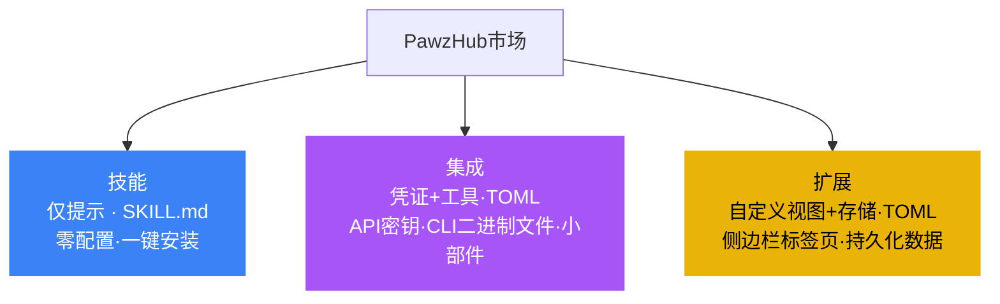
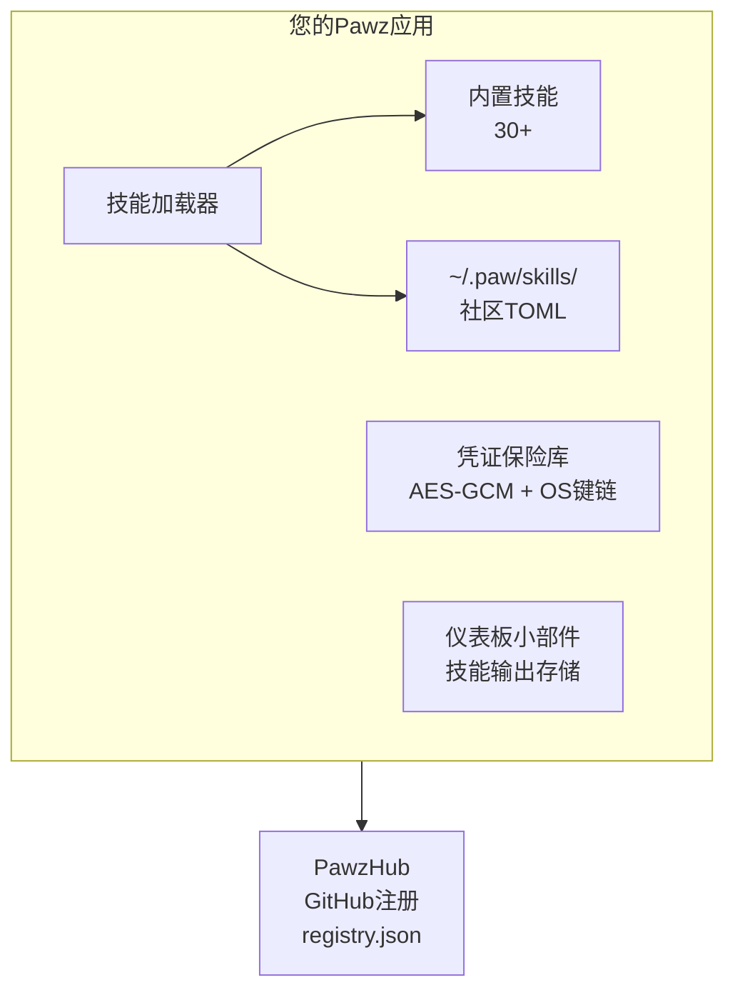
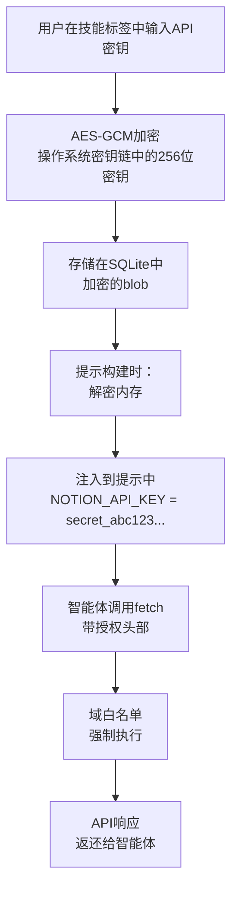

# PawzHub — 市场

PawzHub是Pawz的社区驱动市场。它托管可扩展性系统的三个层级——[技能](/docs/guides/skills)、[集成](/docs/guides/integrations)和[扩展](/docs/guides/extensions)——使Pawz成为一个无穷可扩展的平台，任何人都可以创建、发布和安装能力。

## 三个层级，一个市场



| 层级 | 徽章 | 格式 | 安装源 |
|------|-------|--------|---------------|
| 技能 | 🔵 蓝色 | SKILL.md | [skills.sh](https://skills.sh) + GitHub仓库 |
| 集成 | 🟣 紫色 | pawz-skill.toml | PawzHub注册(通过GitHub) |
| 扩展 | 🟡 金色 | pawz-skill.toml + [view]/[storage] | PawzHub注册(通过GitHub) |

## 工作原理



无论是内置技能还是社区技能，都遵循相同的架构：

1. **技能清单**声明了技能的功能、所需凭证和输出数据
2. **凭证保险库**使用AES-GCM加密API密钥(密钥存储在操作系统键链中)，并在运行时将其注入到智能体提示中
3. **引擎工具**(`fetch`、`exec`、`read_file`、`write_file`)执行实际的API调用和命令
4. **仪表板小部件**将技能的结构化输出渲染为持久化视觉卡片

技能作者从未编写Rust代码。他们只需在TOML文件中描述API集成。引擎负责执行、安全和凭证管理。

---

## 技能清单格式

每个PawzHub技能都是单个`pawz-skill.toml`文件：

```toml
[skill]
id = "notion"
name = "Notion"
version = "1.0.0"
author = "yourname"
category = "productivity"
icon = "edit_note"
description = "通过API读写Notion页面、数据库和块"
install_hint = "在https://www.notion.so/my-integrations获取您的API密钥"

[[credentials]]
key = "NOTION_API_KEY"
label = "集成令牌"
description = "您的Notion内部集成令牌"
required = true
placeholder = "secret_..."

[instructions]
text = """
您可以通过用户的集成令牌访问Notion API。

## 读取页面
使用`fetch`:
- URL: `https://api.notion.so/v1/pages/{page_id}`
- Headers: `Authorization: Bearer {NOTION_API_KEY}`, `Notion-Version: 2022-06-28`

## 搜索
使用`fetch`向`https://api.notion.so/v1/search`发起POST
Body: {"query": "search term"}

## 创建页面
使用`fetch`向`https://api.notion.so/v1/pages`发起POST
Headers: `Authorization: Bearer {NOTION_API_KEY}`, `Notion-Version: 2022-06-28`
Body: {"parent": {"database_id": "..."}, "properties": {...}}
"""

[widget]
type = "table"
title = "最近的页面"
refresh = "10m"

[[widget.fields]]
key = "title"
label = "页面"
type = "text"

[[widget.fields]]
key = "updated"
label = "最后更新"
type = "datetime"

[[widget.fields]]
key = "status"
label = "状态"
type = "badge"
```

### 清单字段

#### `[skill]` — 必需

| 字段 | 类型 | 必需 | 描述 |
|-------|------|----------|-------------|
| `id` | 字符串 | 是 | 唯一标识符。仅限字母数字和连字符。 |
| `name` | 字符串 | 是 | 人类可读的显示名称。 |
| `version` | 字符串 | 是 | Semver版本(例如`1.0.0`)。 |
| `author` | 字符串 | 是 | 作者名或GitHub用户名。 |
| `category` | 字符串 | 是 | 有效类别之一(请参见下面)。 |
| `icon` | 字符串 | 否 | Material Symbols图标名称(例如`edit_note`)。 |
| `description` | 字符串 | 是 | 简短描述(10-500字符)。 |
| `install_hint` | 字符串 | 否 | 获取凭证的说明。 |

**有效类别:** `vault`, `cli`, `api`, `productivity`, `media`, `smart_home`, `communication`, `development`, `system`

#### `[[credentials]]` — 可选(可重复)

声明技能所需的API密钥、令牌或密钥。用户在技能选项卡中输入这些信息。Pawz使用AES-GCM加密它们并将加密密钥存储在操作系统键链中。在运行时，解密后的值自动注入到智能体的系统提示中。

| 字段 | 类型 | 必需 | 描述 |
|-------|------|----------|-------------|
| `key` | 字符串 | 是 | 环境变量名(例如`NOTION_API_KEY`)。 |
| `label` | 字符串 | 是 | 显示给用户UI标签。 |
| `description` | 字符串 | 否 | 帮助文本说明在哪里能找到这个凭证。 |
| `required` | 布尔值 | 是 | 不存在这个凭证时是否还能工作。 |
| `placeholder` | 字符串 | 否 | 在输入框中显示的示例值。 |

:::info 凭证安全
凭证永远不会以明文存储。它们在一个使用AES-GCM以及存储在您的操作系统键链(os键链)中的256位密钥的SQLite中的加密的。智能体只能在其运行时系统提示中接收解密后的数值——它们从不会被记录、从不会被写入未加密的磁盘，也从未传输到外部。
:::

#### `[instructions]` — 必需

| 字段 | 类型 | 必需 | 描述 |
|-------|------|----------|-------------|
| `text` | 字符串 | 是 | 代理指令说明如何对此技能。 |

这些说明告知智能体：
- 调用哪些API端点（使用 `fetch` 工具）
- 运行哪些CLI命令（使用 `exec` 工具）
- 如何格式化请求头部、正文和认证
- 如何解析和展示回应
- 错误处理指导

引擎在运行时会自动将凭证块附加到说明中：

```
凭证（直接使用这些值——不要向用户询问）：
- NOTION_API_KEY = secret_abc123...
```

#### `[widget]` — 可选

声明一个用于持久化视觉输出的仪表盘组件。

| 字段 | 类型 | 必需 | 描述 |
|-------|------|----------|-------------|
| `type` | 字符串 | 是 | 小部件类型：`status`、`metric`、`table`、`log`或`kv`。 |
| `title` | 字符串 | 是 | 小部件卡片标题。 |
| `refresh` | 字符串 | 否 | 自动刷新间隔（例如`5m`，`1h`）。 |

#### `[[widget.fields]]` — 如果 `[widget]` 存在则是必需

| 字段 | 类型 | 必需 | 描述 |
|-------|------|----------|-------------|
| `key` | 字符串 | 是 | 与JSON输出匹配的数据键。 |
| `label` | 字符串 | 是 | 小部件中显示的列/字段标签。 |
| `type` | 字符串 | 是 | 字段类型：`text`、`number`、`badge`、`datetime`、`percentage`或`currency`。 |

---

## 小组件类型

技能可以声明一个仪表板小部件显示持久化结构化数据。小组件出现在今日/仪表板视图中，旁边还有天气、任务和快速操作。

### 状态

单个状态指示器——适用于服务健康状况、连接状态或简单开/关检查。

```toml
[widget]
type = "status"
title = "服务器状态"

[[widget.fields]]
key = "status"
label = "状态"
type = "badge"

[[widget.fields]]
key = "uptime"
label = "正常运行时间"
type = "percentage"

[[widget.fields]]
key = "last_check"
label = "最后检查"
type = "datetime"
```

### 指标

带有趋势的大号码——适用于关键绩效指标、计数、收入或任何头条数字。

```toml
[widget]
type = "metric"
title = "月收入"

[[widget.fields]]
key = "value"
label = "月经常性收入"
type = "currency"

[[widget.fields]]
key = "change"
label = "与上月相比"
type = "percentage"
```

### 表格

结构化数据的行——适用于列表、记录、部署或任何表格输出。

```toml
[widget]
type = "table"
title = "活跃问题"

[[widget.fields]]
key = "title"
label = "问题"
type = "text"

[[widget.fields]]
key = "assignee"
label = "负责人"
type = "text"

[[widget.fields]]
key = "priority"
label = "优先级"
type = "badge"

[[widget.fields]]
key = "updated"
label = "更新"
type = "datetime"
```

### 日志

时间顺序事件流——适用于通知、事件、消息或活动流。

```toml
[widget]
type = "log"
title = "最近事件"

[[widget.fields]]
key = "message"
label = "事件"
type = "text"

[[widget.fields]]
key = "severity"
label = "级别"
type = "badge"

[[widget.fields]]
key = "timestamp"
label = "当"
type = "datetime"
```

### 键值 (KV)

键值对——适用于配置摘要、统计或元数据。

```toml
[widget]
type = "kv"
title = "项目统计"

[[widget.fields]]
key = "total_records"
label = "记录"
type = "number"

[[widget.fields]]
key = "storage_used"
label = "存储"
type = "text"

[[widget.fields]]
key = "last_sync"
label = "最后同步"
type = "datetime"
```

### 字段类型

| 类型 | 渲染 | 示例 |
|------|-----------|---------|
| `text` | 纯文本 | "部署到生产环境" |
| `number` | 带本地化分隔符格式化 | "1,234,567" |
| `badge` | 彩色药丸（绿/黄/红） | "活跃"（绿），"警告"（黄） |
| `datetime` | 相对时间 | "2小时前" |
| `percentage` | 进度条+数字 | "94.5%" |
| `currency` | 美元符号+格式化 | "$12,450.00" |

---

## 安装技能

### 来自 PawzHub（应用内）

1. 打开侧边栏中的 **技能** 标签
2. 点击 **浏览 PawzHub** 部分
3. 按名称或类别浏览或搜索可用技能
4. 点击任何技能的 **安装**
5. 如需要，请配置凭据
6. 通过 **智能体 → [agent] → 技能** 分配到智能体

### 手动安装

下载 `pawz-skill.toml` 文件并将其放在技能目录中：

```
~/.paw/skills/{skill-id}/pawz-skill.toml
```

例如：

```
~/.paw/skills/notion/pawz-skill.toml
~/.paw/skills/linear/pawz-skill.toml
~/.paw/skills/stripe/pawz-skill.toml
```

重新启动 Pawz（或者技能加载器热重载）。技能将以"社区"徽章出现在技能标签中。

### 卸载

- **社区技能**：在技能标签中点击 **卸载** 按钮。这将从 `~/.paw/skills/` 删除技能文件夹并清理存储的凭据和启用状态。
- **核心技能**：无法卸载（它们编译到二进制文件中）。相反，请在 **智能体 → [agent] → 技能** 中逐个智能体禁用它们。

---

## 创建技能

### 应用内向导

技能标签中的 **创建技能** 向导将引导您构建技能而不需手动编写 TOML：

1. **基本信息** — 名称、类别、图标、描述
2. **凭据** — 添加 API 密钥字段，标签和占位符
3. **指令** — 编写或粘贴智能体指令（REST API、CLI 工具和网页抓取器已有模板可用）
4. **小部件** — 可选地声明仪表盘输出及字段类型
5. **测试** — 启用技能，并使用实时智能体验证其工作情况
6. **发布** — 本地保存，导出 TOML，或直接通过 GitHub PR 发布到 PawzHub

### AI 辅助创建

让您的智能体为您创建一个技能：

> "为 Notion API 创建 PawzHub 技能"

智能体获取 API 文档，生成完整的 `pawz-skill.toml` 包含端点、认证头部和指令，然后为您预填充向导进行审查。

### 模板起步

向导包括起始模板：

- **REST API** — 带认证头部的提取调用和 JSON 解析
- **CLI 工具** — 带标志参考的执行命令
- **网页抓取** — 提取 + HTML 解析指令

---

## 发布到 PawzHub

### 提交流程

1. **派生** [`OpenPawz/pawzhub`](https://github.com/OpenPawz/pawzhub) 仓库
2. **创建** `skills/{your-skill-id}/pawz-skill.toml`
3. **提交拉取请求** — CI 自动验证您的清单
4. **维护者审查** 并合并
5. **`registry.json`** 重新自动构建 — 您的技能会在应用内浏览器中出现

### 一键发布（来自 Pawz）

如果您使用应用内向导创建了一个技能：

1. 点击向导最后一步中的 **发布到 PawzHub**
2. Pawz 在 `OpenPawz/pawzhub` 上打开预填的 GitHub PR
3. CI 验证，维护者审查，完成

### CI 验证

每个 PR 都会自动检查：

| 检查项目 | 描述 |
|-------|-------------|
| 有效的 TOML | 语法正确，必填字段存在 |
| 唯一 ID | 与内置或其他现有技能无冲突 |
| 有效类别 | 必须是已定义类别之一 |
| 安全 ID 格式 | 仅允许字母数字+连字符（无路径遍历） |
| 语义化版本号 | 版本遵循 `X.Y.Z` 格式 |
| 描述长度 | 在10到500个字符之间 |
| 小部件验证 | 如果声明了小部件，字段类型匹配允许的值 |
| 仅指令 | 没有检测到可执行代码模式 |

### 质量指导原则

技能接受质量为基础，而非数量。我们从 OpenClaw 的 ClawHub 学到了教训——接受所有东西会导致 48% 的垃圾（5,705次提交中有1,180条垃圾帖子，396恶意帖子）。

**必须具备：**
- 有效且充分测试的 `pawz-skill.toml`
- 清晰准确的描述
- 智能体可以遵循的工作指令

**推荐（获得"验证"徽章）：**
- 在真实 Pawz 工作环境中测试
- 包括仪表盘输出的小组件
- PR 描述中的截图或演示
- 使用应用内向导创建

---

## 技能架构深入剖析

### 凭证流动方式



### 指令如何工作

技能指令与所有其他启用的技能一起注入到智能体的系统提示中：

```
# 启用的技能
您拥有以下可用技能。使用exec, fetch,
read_file, write_file,和其他内置工具来利用它们。

## Notion技能 (notion)
您可以通过用户的集成令牌访问Notion API。
[...完整指令...]

凭证（直接使用这些值——不要向用户询问）：
-NOTION_API_KEY = secret_abc123...

## Linear 技能 (linear)
 [... instructions ...]
```

然后，智能体会使用内置的 `fetch` 工具（支持带有自定义头部和正文的GET/POST/PUT/PATCH/DELETE）或 `exec` 工具（shell配Docker沙盒路由）执行实际的API调用。

### 小部件如何工作

1. 技能清单声明一个带有类型和字段的 `[widget]`
2. 智能体运行技能并产生符合小部件模式的结构化JSON
3. 智能体调用 `skill_output` 工具以保持数据
4. 仪表板读取 `skill_outputs` 表并呈现小部件卡
5. 可选的 `refresh` 间隔触发定期重新获取

---

## 安全模型

### 社区技能可以做什么

- 注入文本到智能体系统提示（指令）
- 声明凭证字段（由引擎加密，默认不通过技能处理）
- 声明小部件模式（由应用程序渲染，不是由技能渲染）

### 社区技能不能做什么

- 执行任意 Rust 代码（无编译的工具函数）
- 绕过域白名单/黑名单（在 `execute_fetch` 上强制执行）
- 直接访问操作系统密钥链（凭证注入是引擎侧的）
- 读取引擎源代码（被 `execute_read_file` 阻止）
- 安装已阻止的包（在 `execute_exec` 上强制执行）
- 在启用Docker沙箱时运行未沙箱化的命令

### 运行时保护

| 层面 | 保护措施 |
|-------|-----------|
| **凭证** | AES-GCM加密，密钥在操作系统密钥链中 |
| **网络** | 每个 `fetch` 调用上的域白名单/黑名单 |
| **Shell** | 启用时Docker沙箱路由 |
| **文件系统** | 引擎源码读取被阻止 |
| **包** | 在exec上实施阻塞包列表 |
| **智能体隔离** | 每个智能体有自己的工作目录 |

---

## PawzHub与其他技能注册表比较

| | ClawHub (OpenClaw) | PawzHub (Pawz) |
|--|---|---|
| **层级** | 单层（仅提示） | 三层：技能、集成、扩展 |
| **格式** | 自由格式SKILL.md | SKILL.md（第1层）+结构化 `pawz-skill.toml`（第2-3层） |
| **凭证** | 手动环境变量 | 类型字段 → 保险库存储加密（AES-GCM） |
| **输出** | 仅聊天文字 | 仪表板小组件（5种）+聊天+自定义视图 |
| **质量控制** | 48%垃圾/恶意软件 | CI验证，应用内测试 |
| **安全** | 发布后VirusTotal检测 | 提交时验证，运行时策略强制执行 |
| **创建** | 手动编写markdown | 应用内向导+AI生成 |
| **模块化** | 放入文件夹 | 按智能体范围+按工作组配置 |
| **版本** | 无 | 语义化版本+更新检测 |
| **存储** | 无 | 持久的键值存储（扩展） |
| **自定义UI** | 无 | 自定义侧边栏视图（扩展） |
