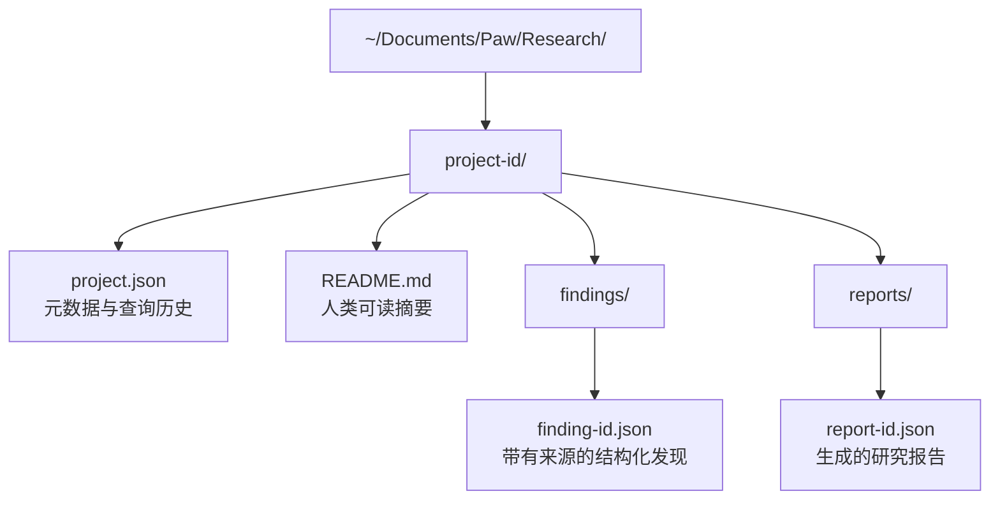

# 研究

研究视图让智能体可以进行结构化网络研究，并具有来源跟踪和可信度评分。

## 模式

| 模式 | 来源 | 超时 | 使用场景 |
|------|---------|---------|-------------|
| **快速** | 3-5 个来 | 120 秒 | 快速回答，简单问题 |
| **深度** | 10+ 个来 | 300 秒 | 彻底调查，复杂主题 |

## 工作流程

1. 输入研究查询
2. 选择**快速**或**深度**模式
3. 查看实时进度：
   - **搜索中** — 寻找来源
   - **阅读中** — 获取页面
   - **分析中** — 处理内容
   - **已发现** — 发现结果
   - **总结中** — 生成综合内容
4. 审查带来源的发现内容

## 发现

每项研究发现包括：

- **摘要** — 关键要点
- **内容** — 全部提取的文本
- **关键点** — 重点的项目符号
- **来源** — 带有标题和可信度评分（1-5）的 URL

### 来源可信度

来源按 1-5 分制进行评分，用点数显示：
- ●●●●● — 高可信度（学术界、官方文档）
- ●●●●○ — 一般可靠
- ●●●○○ — 可靠性混合
- ●●○○○ — 谨慎使用
- ●○○○○ — 不可靠

## 行动

您可以对每一项发现执行以下操作：
- **深入挖掘** — 就此项发现在提问后续问题
- **寻找相关** — 搜索相关主题
- **查看完整** — 查看完整内容
- **删除** — 删除发现

## 报告

根据您的发现生成一份编制报告：
- 保存为 markdown 文件至 `~/Documents/Paw/Research/`
- 包含所有发现、来源和关键点
- 按项目会话及查询历史记录

## 深入研究模式

深度模式执行多步骤网络研究并进行综合：

1. **查询扩展** — 智能体将您的主题分解为多个子查询
2. **并行搜索** — 为每个子查询搜索DuckDuckGo（10+
3. **来源获取** — 从每个结果 URL 读取完整的页面内容
4. **交叉引用** — 在多个来源之间比较说法
5. **综合** — 生成全面的发现，包含要点和可信度评分

| 设置 | 快速模式 | 深度模式 |
|---------|-----------|----------|
| 拉取来源 | 3-5 | 10+
| 超时 | 120 秒 | 300 秒 |
| 子查询 | 1 | 多个（自动生成） |
| 交叉引用 | 否 | 是 |
| 最佳使用场景 | 简单的实情问题 | 复杂主题、比较、分析 |

:::tip
深度研究消耗更多令牌并耗费更长时间。从快速模式开始验证查询，然后切换到深度模式进行全面调查。
:::

## 研究笔记本集成

所有研究数据保存在本地工作区 `~/Documents/Paw/Research/` 中：

每个项目维护：
- **查询历史** — 您运行的每一次研究查询
- **发现** — 带有内容、摘要、要点和来源的结构化结果
- **报告** — 编制多项发现的报告

使用项目标题中的**文件夹图标**在您的文件管理器中打开研究文件夹。

## 引用和来源跟踪

每项研究发现都会追踪其来源的完整谱系：

| 字段 | 描述 |
|-------|-------------|
| `url` | 原始来源网址 |
| `title` | 页面标题或域名 |
| `credibility` | 1-5分（参见[来源可信度](#source-credibility)） |
| `extractedAt` | 获取来源的时间戳 |
| `snippets` | 来源中的相关文本片段 |

右侧边栏中的**来源面板**汇总在当前项目中跨发现的所有来源，便于审查查阅了哪些网站。

### 实时源供稿

在主动研究过程中，实时供稿显示智能体处理时的实时发现来源。每个来源显示其域名和可信度评分。

## 研究导出格式

研究可以通过多种方式进行导出：

| 格式 | 方法 | 内容 |
|--------|-----|----------|
| **Markdown报告** | 点击**生成报告** | 执行摘要、关键发现、分析、结论、参考文献 |
| **个别发现** | 点击任意发现的**完整** | 完整内容，含来源和关键点 |
| **原始JSON** | 打开`~/Documents/Paw/Research/` | 含所有元数据的机器可读发现 |
| **项目文件夹** | 点击**在Finder中打开** | 所有发现、报告和项目配置 |

### 生成报告

1. 执行几个研究查询以积累发现  
2. 点击**生成报告**
3. 智能体将所有发现合成一份结构化的报告：
   - 执行摘要
   - 关键发现（按主题组织）
   - 详细分析
   - 结论和建议
   - 来源参考文献
4. 报告以markdown形式保存在项目的`reports/`文件夹中

## 提示

- 从宽泛的快速搜索开始，然后在有趣的发现上深入挖掘
- 利用来源可信度评分优先考虑可靠信息
- 将发现连结在一起：深入挖掘 → 寻找相关 → 综合
