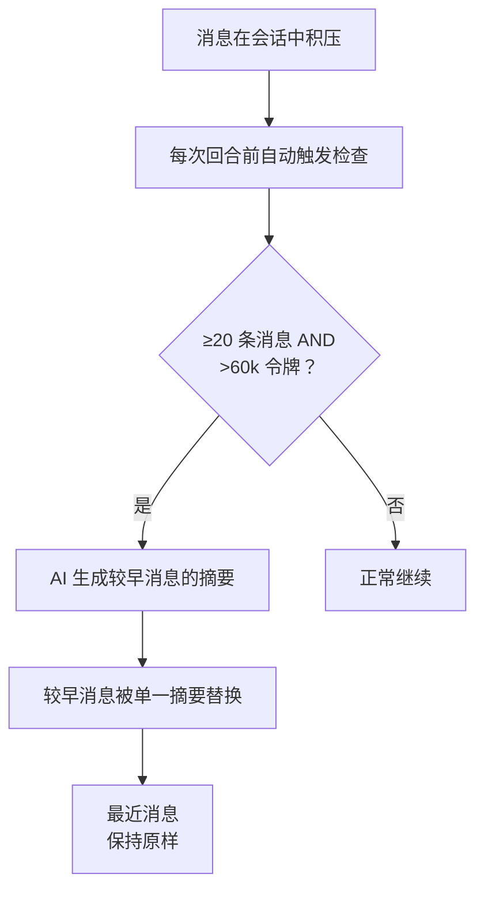

# 会话管理

会话是在Pawz中的核心对话单元。每个会话保存您与智能体之间的完整聊天历史，内置用于重命名、清除、压缩和删除对话的工具。

## 会话数据模型

每个会话都存储在引擎端SQLite数据库中，字段如下：

| 字段 | 类型 | 描述 |
|-------|------|-------------|
| `id` | UUID | 唯一会话标识符 |
| `label` | 字符串 | 用户友好的显示名称 |
| `model` | 字符串 | 此会话使用的AI模型 |
| `system_prompt` | 字符串 | 自定义系统提示（如有） |
| `agent_id` | 字符串 | 分配给此会话的智能体 |
| `message_count` | 数值 | 会话中的总消息数量 |
| `created_at` | 时间戳 | 会话创建时间 |
| `updated_at` | 时间戳 | 上次活动时间 |

## 会话操作

### 列出

检索所有会话，可按智能体筛选。会话以卡片形式展示在**设置 → 会话**中，显示标签、模型徽章、消息数和时间戳。

### 重命名

更新会话标签以获得更有意义的名称。使用斜杠命令：

```
/rename 我对量子计算的研究
```

或者在设置中的会话卡上点击重命名操作。

### 清除

从会话中移除**所有消息**，同时保留会话本身。当您想要全新开始而不丢失会话配置时这很有用。

:::warning
清除会话是破坏性的——所有消息都被永久删除。Pawz 需要在继续之前进行二次确认。
:::

### 删除

从数据库中永久移除会话及其所有消息。

:::warning
删除是不可逆的。删除会话之前会出现二次确认对话框。
:::

### 压缩

使用AI生成的摘要压缩会话的消息历史。请参阅下面的[会话压缩](#会话压缩)。

## 会话压缩

长对话会占用大量上下文窗口，这会增加成本并可能达到模型令牌限制。会话压缩通过替换旧消息为简洁的AI生成摘要来解决这个问题。

### 工作原理



### 压缩配置

| 设置 | 默认值 | 描述 |
|---------|---------|-------------|
| `min_messages` | 20 | 触发压缩前的最小消息数 |
| `token_threshold` | 60,000 | 预估的令牌数量阈值 |
| `keep_recent` | 6 | 保留的最新消息数不变 |
| `max_summary_tokens` | 2,000 | 生成摘要的最大令牌数 |

### 令牌估算

Pawz使用简单启发式方法估算令牌数：**~4个字符每令牌**。这是为了保守起见，避免超出模型上下文限制。

### 自动触发

在每次新对话回合前，该引擎检查：

1. 此会话是否有**≥20条消息**？
2. 估算令牌数是否**>60,000 令牌**？

如果满足这两个条件，则在处理新消息前自动运行压缩。

### 手动触发

您可以随时使用斜杠命令强制压缩：

```
/compact
```

这在您想在对话中的任意时刻回收上下文空间而不用等待自动触发阈值时非常有用。

:::tip
在长会话中开始复杂任务之前主动使用 `/compact`。这样可以为智能体提供最大的上下文空间来工作。
:::

## 直令牌计量器

每个聊天会话都在标题中显示实时**令牌计量器**，展示当前上下文窗口的使用量。

### 视觉指示

| 上下文用量 | 颜色 | 含义 |
|--------------|-------|---------|
| 0–59% | 绿色 | 很多余地 |
| 60–79% | 黄色 | 渐满 — 考虑尽快压缩 |
| 80–100% | 红色 | 接近上限 — 自动压缩将被触发 |

### 上下文细分

点击令牌计量器查看令牌去向的详细细目：

- **系统提示** — 基础指令、个性、灵魂文件
- **技能说明** — 注入到上下文的工具文档
- **记忆上下文** — 自动召回的记忆
- **对话** — 消息历史
- **总计** 与 **限制** — 显示百分比

这有助于您了解确切是什么占用了上下文位置以及何处优化。

### 会话成本

令牌计量器还显示运行中的会话成本（例如 `$0.0042`）。成本是使用每模型定价率分别计算输入和输出令牌。输入/输出令牌数量在**任务控制**侧边面板中与总量消息数一起跟踪。

## 可配置的上下文窗口

每个智能体都可以有一个自定义上下文窗口大小，在**设置 → 高级 → 上下文窗口（令牌数）** 中配置。

| 设置 | 默认值 | 范围 | 描述 |
|---------|---------|-------|-------------|
| 上下文窗口 | 32,000 | 4,000 – 1,000,000 | 每轮智能体看到多少对话历史 |

**为什么这很重要：**
- **更大窗口** = 更好地跟踪长对话中的主题，但每轮成本更高
- **更小窗口** = 每轮成本更低，压缩更快启动
- 大多数模型支持 128K-1M 令牌，因此默认 32K 有意保守以控制成本
- 增加用于复杂研究任务；减少用于简单 Q&A 机器人

上下文窗口限制确定令牌计何时变为黄色（60%）和红色（80%），以及何时自动压缩触发。

## 会话设置界面

导航到**设置 → 会话**以便在一个位置管理所有会话：

- **会话卡片** 显示标签、模型徽章、消息数量和时间戳
- **可展开的操作** 每张卡片：重命名、清除、删除
- **双重确认模式** 对于所有破坏性操作（清除和删除）

## 会话斜杠命令

| 命令 | 描述 |
|---------|-------------|
| `/new [标签]` | 开始新会话（可选标签） |
| `/rename <标签>` | 重命名当前会话 |
| `/clear` | 清除当前会话中的所有消息 |
| `/compact` | 手动触发会话压缩 |

## 消息历史管理

Pawz 自动在每个智能体回合前维护清晰的对话上下文。

### 失败消息清理

加载对话历史时，Pawz 完全从上下文窗口删除失败的交换。这包括：

- **失败的工具调用** — 辅助 + 工具消息对，其中所有工具结果都是错误
- **放弃回应** — 包含道歉螺旋或拒绝语言的辅助消息（例如"我一直遇到阻力"、"我对困难表示歉意"）

这遵循 Visual Studio Code 模式：模型永远不会看到以前的失败，因此不会锚定它们或发展"习得性无助"。每次重试都有一个崭新起点。

:::tip
如果智能体在任务上挣扎，只需发送新消息——失败的尝试将从上下文中自动删除，给予智能体一个新的视角。
:::

### 请求队列

当您发送新消息而智能体仍在处理先前请求时，Pawz 排队此消息而不是拒绝。活动智能体接收一个让位信号，并在下一个环节边界处结束。然后自动处理排队消息。

这意味着您不需要等智能体完成后才能键入下一条消息。

### 智能体范围历史

在多智能体会话中，每个智能体只看到与其自身上下文相关的消息。跨智能体委托结果（来自 `agent_send_message` 和 `agent_read_messages` 等工具）对于非默认智能体被过滤掉，避免一个智能体的上下文污染另一个智能体的对话。

:::info
会话数据存储在引擎端SQLite数据库中，独立于前端状态。这意味着会话将在应用程序重启时保持，且与后端引擎绑定。
:::
