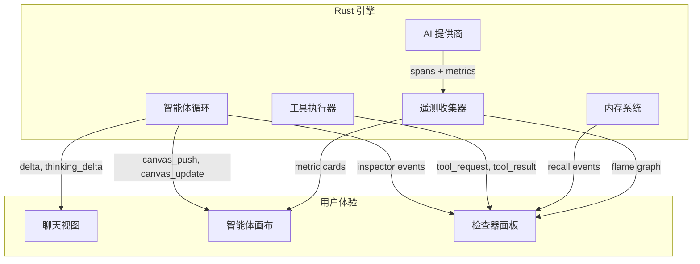
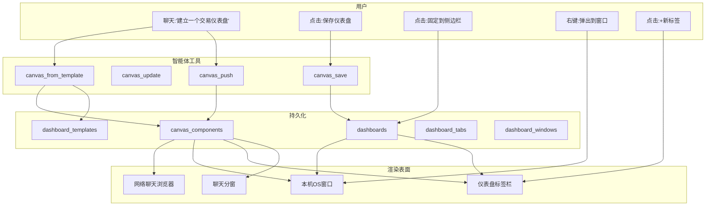

# 智能体画布

**生成式 UI、实时可观察性和智能体构建的仪表盘**

*开源（MIT协议）。是 OpenPawz 项目的一部分。*

---

## 问题

目前的 AI 智能体是输出文本的黑盒。您要求智能体分析您的 CI 流水线时，它会写出四个段落。您要求它监控投资组合时，它会把一个表放在聊天气泡里。您要求它跟踪部署时，它说"完成"——但您无法 _看到_ 任何实际效果。

这导致了三个方面的问题，而且随着智能体变得更有能力而更加突出:

1. **不可见的执行**。智能体当前在做什么？为什么它已经"思考"了12秒？调用了哪些工具，按什么顺序？调试智能体行为意味着阅读日志——相当于通过在文本文档中阅读 `console.log` 输出来调试 Web 应用。

2. **扁平输出**。智能体产生文本，但人类使用仪表盘、图表和空间布局思维。交易智能体应该显示您实时的盈亏曲线，而不是一段描述您的仓位的段落。研究智能体应该显示结构化的发现表格，而不是一屏的 markdown。

3. **短暂的结果**。即使智能体产生了有用的结构化数据，在向上滚动后也会消失。没有持久界面可以累积智能体生成的见解并保持可见性。

微软的"黄金三角形"——[AG-UI](https://docs.ag-ui.com/introduction)、DevUI 和 OpenTelemetry——确定了这些确切的差距。Agent Canvas 是 Pawz 如何在一个单一连贯的架构中解决全部三个问题的方法。

---

## 发明

Agent Canvas 引入了协同工作的三层:

| 层级 | 功能 | 类比 |
|-------|-------------|---------|
| **Canvas**（生成式 UI） | 智能体推送实时 UI 组件——图表，表格，指标，表单——到一个持久的可视化界面 | AG-UI |
| **Inspector**（智能体X光） | 实时连锁思维，工具路由，内存召回和上下文利用——在聊天旁边可见 | DevUI |
| **Telemetry**（可观察性） | 针对完整请求生命周期的结构化跟踪，带有在 UI 中展现的成本，延迟和标记指标 | OpenTelemetry |

每层单独都有用。在一起，它们将 Pawz 从"与智能体聊天"转型为"与智能体合作，展示它正在做什么和发现了什么。"



---

## 第一层: 画布——生成式 UI

### 今天存在的东西

Pawz 已经有一个生成式 UI 基元: **技能输出** 系统。

智能体使用结构化数据 (type, title, JSON payload) 调用 `skill_output` 工具，这被持久化到 `skill_outputs` SQLite 表并在 Today 仪表板中作为小部件卡片呈现。存在五种小部件类型: `status`, `metric`, `table`, `log`, `kv`。

这有效，但它受三个方面的限制:

1. **仅事后显示**。小部件在执行后出现在 Today 仪表板 — 在智能体轮次期间不可见。
2. **静态**。一旦渲染，小部件不能实时更新。智能体需要再次调用 `skill_output` 且用户需要刷新。
3. **平面命名空间**。所有小部件共享 Today 仪表板。没有概念化的会话级或智能体级画布来将相关的小部件归类为一致视图。

### 改变内容

Agent Canvas 引入了一种**实时渲染界面**，智能体在执行过程中填充。组件在智能体流式传输时出现 — 用户观察仪表板逐步呈现。

```
用户: "分析我的项目的 CI 流水线，展示瓶颈"

智能体轮次 (流式传输):
  轮次 1: 智能体调用 request_tools("GitHub CI analytics")
           → 图书管理员返回 github_list_workflows, github_get_run
  轮次 2: 智能体调用 github_list_workflows(...)
           → 返回 12 个工作流程
           智能体调用 canvas_push({
             type: "table",
             title: "CI 工作流程",
             columns: ["名称", "最后一次运行", "持续时间", "状态"],
             rows: [...]
           })
           ← TABLE APPEARS IN CANVAS (live)
  轮次 3: 智能体分析持续时间, 调用 canvas_push({
             type: "chart",
             title: "构建持续时间趋势 (30天)",
             chart_type: "line",
             series: [...]
           })
           ← CHART APPEARS BELOW TABLE (live)
  轮次 4: 智能体调用 canvas_push({
             type: "metric",
             title: "最慢的步骤",
             value: "TypeScript编译",
             detail: "平均4分23秒 — 占整个构建时间的62%"
           })
           智能体调用 canvas_push({
             type: "card",
             title: "建议",
             body: "启用增量 TS 构建...",
             actions: [{ label: "创建问题", tool: "github_create_issue", args: {...} }]
           })
           ← METRIC + ACTION CARD APPEAR (live)
  完成: "我已经分析了你的 CI 流水线 — 仪表板已准备就绪。"
```

画布窗口展示了以响应式布ento网格布局的四个组件。用户可以与"创建问题"操作卡片互动，触发带确认的工具调用。

### 架构

#### 新的 Tauri 事件

两种新的 `EngineEvent` 变量:

```rust
pub enum EngineEvent {
    // ... 现有变量 ...

    /// Agent推送新组将件到画布。
    CanvasPush {
        session_id: String,
        run_id: String,
        agent_id: String,
        component_id: String,
        component: CanvasComponent,
    },

    /// Agent就地更新现有画布组件。
    CanvasUpdate {
        session_id: String,
        run_id: String,
        agent_id: String,
        component_id: String,
        patch: CanvasComponentPatch,
    },
}
```

这些使用现有的 Tauri 事件系统(`app_handle.emit("engine-event", &event)`)——无需新传输。

#### 画布组件

```rust
pub struct CanvasComponent {
    pub component_type: CanvasComponentType,
    pub title: String,
    pub data: serde_json::Value,
    pub position: Option<CanvasPosition>,  // 可选网格放置提示
}

pub enum CanvasComponentType {
    Metric,     // 单个值 + 趋势 + 标签
    Table,      // 列 + 行 (带分页)
    Chart,      // 线图, 柱图, 区域图, 饼图 (轻量级——没有 JS 图表库)
    Log,        // 按级别分组的时间戳条目
    Kv,         // 键值对，带类型格式
    Card,       // markdown 内容 + 可选动作按钮
    Status,     // 图标 + 文字 + 徽章
    Progress,   // 标签 + 百分比 + 预计剩余时间
    Form,       // 输入字段 → 在提交时触发工具调用
    Markdown,   // 自由形式渲染的 markdown
    Timeline,   // 带状态的可视化阶段/里程碑时间线
    Checklist,  // 进度条的任务列表
    Gauge,      // 动画径向仪 (SVG)
    Countdown,  // 实时倒计时器到目标日期
    Image,      // 带标题的图像显示
    Embed,      // 隔离的 HTML/CSS/JS (支持 three.js, anime.js, D3 等)
}
```

这是在原始5个`skill_output`小部件类型基础上增加11个类型。保持原有类型是为了向后兼容。

#### 智能体工具

提供给智能体的两个新工具:

| 工具 | 目的 |
|------|---------|
| `canvas_push` | 将新组件添加到活动画布。返回 `component_id`。 |
| `canvas_update` | 按照 `component_id` 更新现有组件。接受部分数据（补丁）。 |

这些在 `dashboard` 工具域中注册，所以当意图建议可视化("show me", "display", "chart", "dashboard", "monitor")时，智能体可以通过图书管理员发现它们。

```
智能体调用: request_tools("data visualization and dashboards")
图书管理员返回: canvas_push, canvas_update, skill_output, delete_skill_output
```

#### 持久化

画布组件被持久化到新的 `canvas_components` 表:

```sql
CREATE TABLE IF NOT EXISTS canvas_components (
    id TEXT PRIMARY KEY,                              -- component_id
    session_id TEXT,                                   -- 绑定到会话 (NULL表示仪表盘范围)
    dashboard_id TEXT,                                 -- 绑定到已保存的仪表盘 (NULL表示会话范围)
    agent_id TEXT NOT NULL DEFAULT 'default',
    component_type TEXT NOT NULL,
    title TEXT NOT NULL,
    data TEXT NOT NULL DEFAULT '{}',                   -- JSON
    position TEXT,                                     -- JSON 网格提示
    created_at TEXT NOT NULL DEFAULT (datetime('now')),
    updated_at TEXT NOT NULL DEFAULT (datetime('now'))
);
CREATE INDEX IF NOT EXISTS idx_canvas_session ON canvas_components(session_id);
CREATE INDEX IF NOT EXISTS idx_canvas_dashboard ON canvas_components(dashboard_id);
CREATE INDEX IF NOT EXISTS idx_canvas_agent ON canvas_components(agent_id);
```

设置了 `session_id` 的组件是临时的——捆绑到对话。设置了 `dashboard_id` 的组件属于一个已保存的仪表盘。当画布保存为仪表盘时，其组件的作用域从会话重新设置到仪表盘。

#### 不用图表库的图表

对于 `chart` 组件，Canvas 直接渲染轻量级 SVG 图表——没有 D3、Chart.js 或其他依赖项。这与 Pawz 无框架哲学相匹配：

- **折线/面积图**: SVG `polyline` + `polygon` 带计算的视框
- **柱状图**: SVG `rect` 元素带比例高度
- **饼图**: SVG `path` 与圆弧计算
- **火花线图**: 小部件度量卡中的最小 SVG

图表渲染器是一个纯函数: `(data: ChartData) → string` (SVG 标记)。这使包体积很小，并避免了在桌面应用中的图表库的安全面。

#### 富可视小部件

除了静态内容，Canvas 还包括使用动画、交互和嵌入内容让仪表盘生动的部件：

| 部件 | 数据形状 | 渲染 |
|--------|-----------|-----------|
| `timeline` | `{ events: [{ label, time?, detail?, status: "done"\|"active"\|"pending" }] }` | 垂直时间线，彩色点 (完成=绿色，活跃=脉动高亮色，待定=空心) |
| `checklist` | `{ items: [{ label, checked: bool }] }` | 带进度条和动画填充的任务列表 |
| `gauge` | `{ value, min?, max?, unit?, label?, level?: "ok"\|"warning"\|"error" }` | SVG 半圆形径向表，带动画入口 |
| `countdown` | `{ target: "ISO-date", label?, format?: "dhms" }` | 实时滴答倒计时器 (天:小时:分钟:秒) |
| `image` | `{ src: "url", alt?, caption? }` | 带可选标题的图像显示 |
| `embed` | `{ html?, css?, js?, height?, libraries?: ["url", ...] }` | **隔离 iframe** — 全 HTML/CSS/JS 带外部库支持 |

#### `embed` 部件——无限视觉力量

`embed` 类型是 Canvas 的逃生舱。它渲染一个**隔离 iframe** (`sandbox="allow-scripts"` 没有 `allow-same-origin`) 包含任意 HTML、CSS 和 JavaScript。代理可以通过 CDN 包含外部库:

```
智能体调用: canvas_push({
  type: "embed",
  title: "3D 投资组合可视化",
  data: {
    libraries: [
      "https://cdnjs.cloudflare.com/ajax/libs/three.js/r128/three.min.js"
    ],
    html: "<div id='scene'></div>",
    css: "#scene { width: 100%; height: 100%; }",
    js: "const scene = new THREE.Scene(); ...",
    height: 400
  }
})
```

支持的库包括（不仅限于此）:
- **three.js** — 3D 场景、数据可视化、粒子效果
- **anime.js** — 连锁动画、变形、时间轴
- **D3.js** — 高级数据驱动的可视化
- **Chart.js** — 用于内置 SVG 渲染之外的快速图表
- **p5.js** — 创意编程、生成艺术
- 任何可通过 CDN `<script>` 标签加载的库

安全：iframe 沙盒防止访问父页面的 DOM、cookie、存储和导航。嵌入内容运行在完全隔离的状态。

### 与技能输出的关系

保留现有的 `skill_output` 系统。它服务于不同的目的：

| 特性 | 技能输出 | 画布 |
|---------|--------------|--------|
| **时刻** | 智能体轮结束后 | 智能体轮期间（实时流）|
| **位置** | Today 仪表板（全局）| 会话画布（每次对话）|
| **范围** | 跨会话（以 skill_id 持久化）| 每会话（以 session_id 持久化）|
| **更新** | (skill_id, agent_id) 上升 | 以 component_id 打补丁 |
| **用例** | 技能状态卡、扩展仪表板 | 动态分析、监控、工作流 |

代理可以同时使用这两种功能：`canvas_push` 在对话期间进行实时可视化，`skill_output` 完成后将摘要小部件保留在首页仪表板上。

---

## 保存的仪表板、模板、标签页和多窗口

并不是每个画布都是即用即扔的。每天早上查看的交易仪表盘、发布期间保持打开的 CI 监控、持续几周的项目健康总览——有些仪表盘成为你工作方式的永久组成部分。

Canvas 支持完整的**仪表板生命周期**：临时 → 保存 → 固定 → 活跃。它支持**模板**的可重复使用蓝图，**标签页系统**管理多个仪表板，以及**原生操作系统窗口**让仪表板完全脱离应用程序。

### 仪表板生命周期

| 状态 | 行为 |
|-------|----------|
| **临时状态** | 默认。绑定到聊天会话。代理在对话中构建它。保留在 `canvas_components` 中，但只有在重新打开该会话时才加载。 |
| **已保存状态** | 用户点击"保存仪表板"或代理调用 `canvas_save`。获得一个名称、图标和仪表板列表中的条目。独立于来源会话存在。 |
| **已固定状态** | 已保存的仪表板标记为始终可用。出现在侧边栏下的"仪表板"群组中，同一级别如 Today、Tasks、Research。 |
| **活跃状态** | 带有关联的智能体+刷新计划的已保存仪表板。智能体定期重新运行以更新组件。就像一个给仪表板涂色的定时任务。 |

#### 保存过程如何工作

```
用户: "把这保存为我的 CI 仪表板"

智能体调用： canvas_save({
  name: "CI 仪表板",
  icon: "rocket_launch",
  pinned: true,
  refresh: { agent_id: "default", interval: "30m", prompt: "刷新 CI 指标" }
})

→ 引擎创建仪表板记录
→ 组件从会话范围克隆到仪表板范围
→ 仪表板出现在侧边栏
→ 每30分钟, 智能体重运行刷新提示针对此仪表板
```

或者手动操作——用户点击 Canvas 工具栏中的保存图标, 命名, 并可选择固定.

#### 持久化

```sql
CREATE TABLE IF NOT EXISTS dashboards (
    id TEXT PRIMARY KEY,
    name TEXT NOT NULL,
    icon TEXT NOT NULL DEFAULT 'dashboard',
    agent_id TEXT NOT NULL DEFAULT 'default',
    source_session_id TEXT,                           -- 来源会话 (可选)
    template_id TEXT,                                 -- 如果从模板创建 (可选)
    pinned INTEGER NOT NULL DEFAULT 0,
    refresh_interval TEXT,                            -- NULL = 手动, '30m', '1h', '6h', '1d'
    refresh_prompt TEXT,                              -- 刷新运行的智能体提示
    last_refreshed_at TEXT,
    created_at TEXT NOT NULL DEFAULT (datetime('now')),
    updated_at TEXT NOT NULL DEFAULT (datetime('now'))
);
CREATE INDEX IF NOT EXISTS idx_dashboards_pinned ON dashboards(pinned);
```

#### 仪表板生命周期的智能体工具

| 工具 | 用途 |
|------|---------|  
| `canvas_save` | 将当前 Canvas 保存为指定名称的仪表板。参数: `name`, `icon`, `pinned`, `refresh`。 |
| `canvas_load` | 通过名称或 ID 加载保存的仪表板到活动 Canvas。 |
| `canvas_list_dashboards` | 列出所有保存的仪表板（供智能体引用）。 |
| `canvas_delete_dashboard` | 删除保存的仪表板及其组件。 |

这些工具与其他 `canvas_push` / `canvas_update` 工具一样，都在 `dashboard` 工具域中。

### 仪表板模板

模板是**可重复使用的仪表板蓝图** - 一组带有占位符数据的组件定义，智能体实例化并填充的定义。可以将它们想象成空白电子表格模板和填写后的电子表格之间的区别。

#### 模板来自何处

1. **智能体创建**。任何保存的仪表板都可以通过去掉动态数据并保留组件结构，导出为模板:

```
用户: "把我的 CI 仪表板转换为模板"

智能体调用: canvas_create_template({
  name: "CI 流水线监控",
  description: "GitHub Actions 构建健康状况，持续时间趋势和瓶颈分析",
  components: [
    { type: "metric", title: "最慢的步骤", data_hint: "构建步骤名称 + 持续时间" },
    { type: "metric", title: "通过率", data_hint: "绿色构建的百分比" },
    { type: "table", title: "流水线", columns: ["名称", "持续时间", "状态", "最终运行"] },
    { type: "chart", title: "构建持续时间 (30天)", chart_type: "line", data_hint: "每日构建持续时间" }
  ],
  tags: ["ci", "github", "devops"],
  setup_prompt: "获取用户的仓库中 GitHub Actions 流水线和构建指标"
})
```

2. **内建**。Pawz 搭载了常见用途的起始模板:

| 模板 | 组件 | 领域 |
|----------|-----------|--------|
| 交易概览 | 投资组合价值，盈亏图表，未平仓头寸表，最近交易日志 | 交易 |
| 项目健康 | 任务燃尽图，智能体活动日志，文件变更指标，阻碍表 | 项目 |
| 系统监控 | CPU/内存指标，令牌使用图表，成本跟踪器，活动通道状态 | 系统 |
| 研究版 | 发现表，源日志，关键洞察卡片，主题进度条 | 研究 |
| 邮件摘要 | 未读数指标，优先收件箱表，对话活动图表 | 邮件 |

3. **社区**。模板可以通过 PawzHub (已有的技能市场) 分享。模板只是一个 JSON 清单——与社区技能相同的分布机制:

```
pawzhub://template/ci-pipeline-monitor
```

#### 实例化过程如何工作

```
用户: "设置一个交易仪表盘"

代理：
  1. 发现模板：request_tools("dashboard templates") → canvas_list_templates
  2. 找到匹配项：canvas_list_templates() → [ ..., { id: "trading-overview", name: "交易概观"} ]
  3. 实例化：canvas_from_template({ template_id: "trading-overview" })
     → 引擎按照模板骨架创建一个新的仪表盘
     → 以空/占位符数据创建组件
  4. 填充：代理使用模板的setup_prompt针对实时数据运行
     → 使用实际数据对每个组件进行canvas_update
  5. 保存：canvas_save({ name: "我的交易仪表盘", pinned: true, refresh: { interval: "5m" } })
```

模板提供结构。代理提供数据。用户在一个对话回合中得到一个完全填充的仪表盘。

#### 持久化

```sql
CREATE TABLE IF NOT EXISTS dashboard_templates (
    id TEXT PRIMARY KEY,
    name TEXT NOT NULL,
    description TEXT NOT NULL DEFAULT '',
    icon TEXT NOT NULL DEFAULT 'dashboard_customize',
    components TEXT NOT NULL DEFAULT '[]',           -- JSON 数组的组件骨架
    tags TEXT NOT NULL DEFAULT '[]',                 -- JSON 数组的字符串标签
    setup_prompt TEXT,                               -- 代理提示，基于实时数据填充
    source TEXT NOT NULL DEFAULT 'builtin',          -- 'builtin', 'user', 'community'
    created_at TEXT NOT NULL DEFAULT (datetime('now'))
);
```

#### 模板的代理工具

| 工具 | 用途 |
|------|---------|  
| `canvas_list_templates` | 列出可用的模板（内置 + 用户创建 + 社区）。 |
| `canvas_from_template` | 将模板实例化为包含占位组件的新仪表盘。 |
| `canvas_create_template` | 将当前仪表盘结构保存为可重用的模板。 |

### 标签页——一个视图中的多仪表盘

一个使用 Pawz 开发的用户可能在某个时候关心三、五或十个仪表盘。Canvas 使用**标签页栏**来在一个视图中管理多个仪表盘——与浏览器标签页或 VS Code 编辑器标签页相同的 UX 模式。

#### 标签页布局

```
┌─────────────────────────────────────────────────────────────────┐
│  ┌──────────┐ ┌─────────────┐ ┌──────────┐ ┌───┐              │
│  │ 交易 ▼│ │ CI 流程 │ │ 研究 │ │ + │              │
│  └──────────┘ └─────────────┘ └──────────┘ └───┘              │
│  ─────────────────────────────────────────────────────────────  │
│                                                                 │
│  ┌─────────┐ ┌─────────┐ ┌───────────────────────────────┐    │
│  │ 指表  │ │ 指表  │ │ 图表                         │    │
│  │ 盈亏     │ │ 赢单率  │ │ 仓位 (7天)                │    │
│  │ +$1,247 │ │ 68.4%   │ │ ╱╲  ╱╲                      │    │
│  │ ▲ +3.2% │ │ ▲ +1.1% │ │╱  ╲╱  ╲____                │    │
│  └─────────┘ └─────────┘ └───────────────────────────────┘    │
│                                                                 │
│  ┌─────────────────────────────────────────────────────────┐   │
│  │ 表格：未平仓头寸                                      │   │
│  │ 代币  │ 入市   │ 当前  │ 盈亏     │ 大小            │   │
│  │ ETH    │ $3,120  │ $3,245  │ +$125   │ 1.2 ETH        │   │
│  │ SOL    │ $142    │ $156    │ +$84    │ 6.0 SOL        │   │
│  └─────────────────────────────────────────────────────────┘   │
│                                                                 │
│  ┌──────────────────────────────────┐                          │
│  │ 日志：近期交易                  │                          │
│  │ 14:32  买进 1.2 ETH @ $3,120  │                          │
│  │ 14:28  卖出 0.5 SOL @ $155      │                          │
│  └──────────────────────────────────┘                          │
└─────────────────────────────────────────────────────────────────┘
```

#### 标签页类型

| 标签页类型 | 源 | 行为 |
|----------|--------|----------|
| **会话标签页** | 当前聊天会话的 canvase | 临时的——会话变更时消失 |
| **已保存标签页** | 保存的仪表板 | 永久的——跨应用重启保持 |
| **固定标签页** | 已固定的仪表板 | 总是在标签页栏中可见，不可意外关闭 |
| **活动标签页** | 有刷新计划的仪表板 | 显示脉冲指示，按计划自动更新 |

#### 标签页操作

- **点击**标签页切换仪表板
- **中键点击**或 **×** 以关闭（固定标签页需要确认）
- **拖拽**重新排序
- **右键点击** 打开上下文菜单：关闭，关闭其他标签页，固定/取消固定，弹出到窗口，复制，立即刷新
- **`+` 按钮** 打开仪表板选择器：已保存的仪表板、模板或"新建空白画布"
- **标签页溢出** — 当标签页超出可用宽度时，`›`下拉菜单显示完整列表（与 VS Code 标签页溢出相同模式）

#### 标签页状态持久化

打开的标签页被持久化以便工作区在应用启动时恢复：

```sql
CREATE TABLE IF NOT EXISTS dashboard_tabs (
    id TEXT PRIMARY KEY,
    dashboard_id TEXT NOT NULL,
    tab_order INTEGER NOT NULL DEFAULT 0,
    active INTEGER NOT NULL DEFAULT 0,               -- 1 = 当前可见标签页
    window_id TEXT NOT NULL DEFAULT 'main',           -- 哪个操作系统窗口拥有这个标签页
    created_at TEXT NOT NULL DEFAULT (datetime('now'))
);
```

启动时，Pawz 准确地恢复用户离开时的标签页栏——相同的顺序，相同的活动标签页。

### 多窗口——作为原生操作系统窗口的仪表板

这是关键的用户体验解锁：**仪表板不必生活在 Pawz 应用内**。任何标签页都可以弹出到自己的原生操作系统窗口。用户以他们想要的方式将 Pawz 和他们的仪表板窗口安排在多个显示器，工作空间或虚拟桌面上。

#### 它如何工作

Tauri v2 的 `WebviewWindowBuilder` 在运行时创建额外的原生窗口。每个窗口都是轻量级的 webview，渲染单个仪表板（或其本身的仪表板标签栏）——没有侧边栏，没有聊天，也没有导航界面。只有一系列布ento网格的组件。

```rust
use tauri::WebviewWindowBuilder;

pub fn pop_out_dashboard(
    app: &tauri::AppHandle,
    dashboard_id: &str,
    title: &str,
) -> Result<(), String> {
    let label = format!("canvas-{}", dashboard_id);
    WebviewWindowBuilder::new(app, &label, tauri::WebviewUrl::App(
        format!("/canvas?dashboard={}", dashboard_id).into()
    ))
    .title(title)
    .inner_size(900.0, 700.0)
    .resizable(true)
    .build()
    .map_err(|e| e.to_string())?;
    Ok(())
}
```

#### 多窗口工作流程

```
┌─ 监视器 1 ──────────────────────────────────────────────────┐
│                                                               │
│  ┌─ Pawz 主窗口 ───────────────────────────────────┐    │
│  │  [侧边栏] │ 与智能体聊天                         │    │
│  │            │                                         │    │
│  │  今天     │  用户：我的交易情况如何？         │    │
│  │  智能体    │                                         │    │
│  │  任务     │  智能体：您的 ETH 头寸上涨了 4%     │    │
│  │  研究  │  我已在第2个窗口更新交易仪表板     │    │
│  │  ─────     │  │    │
│  │  仪表板│                                         │    │
│  │   交易 ◉│                                         │    │
│  │   CI      ◉│                                         │    │
│  │   研究 │                                         │    │
│  │            │                                         │    │
│  └────────────┴─────────────────────────────────────────┘    │
│                                                               │
└───────────────────────────────────────────────────────────────┘

┌─ 监视器 2 ──────────────────────────────────────────────────┐
│                                                               │
│  ┌─ 交易仪表板 (原生窗口) ──────────────────┐   │
│  │  ┌─────────┐ ┌─────────┐ ┌─────────────────────────┐ │   │
│  │  │ 盎亏     │ │ 胜率   │ │ 仓位 (7天)          │ │   │
│  │  │ +$1,247 │ │ 68.4%   │ │ ╱╲  ╱╲                │ │   │
│  │  └─────────┘ └─────────┘ └─────────────────────────┘ │   │
│  │  ┌───────────────────────────────────────────────────┐│   │
│  │  │ 未平仓头寸                                       ││   │
│  │  │ ETH  +$125   SOL  +$84   BTC  -$32              ││   │
│  │  └───────────────────────────────────────────────────┘│   │
│  └──────────────────────────────────────────────────────┘    │
│                                                               │
│  ┌─ CI 仪表板 (原生窗口) ───────────────────────┐   │
│  │  通过率: 94.2%   │  30天构建趋势             │   │
│  │  最慢: TS 编译   │  ╱╲  ╱╲                       │   │
│  │  4分 23秒              │ ╱  ╲╱  ╲____                 │   │
│  └──────────────────────────────────────────────────────┘    │
│                                                               │
└───────────────────────────────────────────────────────────────┘
```

监视器 1 上是 Pawz 主应用程序，用于聊天。监视器 2 上有两个仪表板窗口，用于一目了然的监控。每个窗口独立更新——当智能体推送 `CanvasUpdate` 时，事件到达所有渲染该仪表板的窗口。

#### 窗口管理

| 操作 | 方式 |
|--------|-----|
| **弹出** | 右键单击标签 → "弹出到窗口"，或将标签从标签栏中拖出 |
| **弹回** | 关闭窗口 → 仪表板回到主应用程序标签页 |
| **多个实例** | 同一仪表板可以作为标签和窗口同时打开（两者保持同步） |
| **窗口记忆** | 每个仪表板记住窗口位置和大小。下次弹出会恢复相同的几何形状。 |
| **退出应用程序** | 所有窗口一起关闭。重新启动时，弹出的仪表板恢复为标签（或可选择恢复完整的窗口布局）。 |

#### 跨窗口的事件路由

当引擎发出 `CanvasPush` 或 `CanvasUpdate` 时，Tauri 会在**每一个窗口**中传递该事件。每个窗口的事件监听器会按仪表板进行过滤：

```typescript
pawEngine.on('canvas_push', (event) => {
  if (event.dashboard_id === currentDashboardId) {
    renderComponent(event.component_id, event.component);
  }
});
```

主应用程序标签、弹出窗口和 WebChat 都会自动保持同步。一个智能体更新 → 所有视图都会立即反映。

#### 窗口持久化

```sql
CREATE TABLE IF NOT EXISTS dashboard_windows (
    dashboard_id TEXT PRIMARY KEY,
    x INTEGER,
    y INTEGER,
    width INTEGER NOT NULL DEFAULT 900,
    height INTEGER NOT NULL DEFAULT 700,
    monitor INTEGER,
    popped_out INTEGER NOT NULL DEFAULT 0,
    updated_at TEXT NOT NULL DEFAULT (datetime('now'))
);
```

### 刷新——保持仪表板最新

活跃仪表板需要最新数据。刷新系统与 Pawz 现有的任务/cron 基础设施集成：

| 模式 | 行为 |
|------|----------|
| **手动** | 用户点击刷新或说"刷新我的交易仪表板"。智能体重新执行一次。 |
| **计划** | 仪表板有 `refresh_interval`（5分钟、30分钟、1小时、6小时、1天）。引擎按照设定的时间触发分配的智能体，使用 `refresh_prompt`。 |
| **事件驱动** | 仪表板在特定事件触发时刷新——webhook、频道消息、任务状态更改。使用现有的 `events.rs` 调度程序。 |
| **智能体触发** | 智能体自行决定更新仪表板——例如，交易智能体检测到价格暴涨时推送 `canvas_update`。 |

#### 计划刷新如何工作

```
每30分钟：
  1. 引擎加载仪表板"交易概览"(仪表板ID:"dash-abc123")
  2. 将活动画布上下文设置为此仪表板
  3. 使用提示:"刷新交易指标"运行智能体"默认"
  4. 智能体为每个组件用新鲜数据调用canvas_update
  5. 所有显示该仪表板的窗口/标签立即更新
  6. 引擎更新最后一次刷新时间戳
```

刷新是不明显的——没有聊天通知，没有弹窗。仪表板悄无声息地获取新数据。头部的微妙时间戳显示"最后更新：3分钟前。"

### 它们如何合为一体



---

## 第二层：检查器——智能体X光

### 概念

检查器是一个可折叠的面板，显示智能体在执行过程中底层所做的事情——实时。想一下"浏览器开发工具，但针对你的 AI 智能体。"

虽然 Canvas 面向用户（"告诉我结果"），检查器则面向开发人员/高级用户（"告诉我过程"）。

### 显示内容

| 部分 | 数据源 | 显示 |
|---------|-----------|---------|
| **轮次计数器** | 智能体循环迭代 | "第 3/8 轮"配进度圆环 |
| **加载工具** | 图书馆员发现 | chips: `github_list_workflows`, `github_get_run` — 显示何时加载了哪些工具 |
| **内存回忆** | `run_agent_turn` 中的自动回忆 | 列出回忆的内存及相似度分数和衰减权重 |
| **上下文窗口** | 每轮的令牌计数 | 显示输入/输出标记对比模型限制 — 接近容量时警告 |
| **工具调用** | `ToolRequest` / `ToolResultEvent` | 带有名称、持续时间、成功/失败和截断输出的工具调用时间线 |
| **思考** | `ThinkingDelta` 事件（Claude, Gemini） | 可折叠的推理追踪 — 智能体的连锁思维 |
| **指挥视图** | 执行策略（仅适用于流程）| 阶段图：哪些节点被折叠，哪些并行运行，突出当前阶段 |

### 架构

检查器**不需要**新的 Rust 事件。其所需的数据都已通过现有的 `engine-event` 通道流动:

- `delta` → 显示智能体正在生成
- `thinking_delta` → 连锁思考（Anthropic/Google 提供商已经发送）
- `tool_request` → 将要执行的工具
- `tool_result` → 工具完成（带耗时）
- `tool_auto_approved` → 工具基于政策自动批准
- `complete` → 轮次结束（带 `usage` 标记计数）

唯一新增的是某些事件上的**小型元数据封包**:

```rust
// Added to ToolRequest:
pub memory_context: Option<Vec<RecalledMemory>>,  // 上下文中的记忆
pub loaded_tools: Option<Vec<String>>,              // 当前加载的工具
pub round_number: Option<u32>,                      // 智能体循环中的当前轮次
pub context_tokens: Option<u32>,                    // 估计的上下文标记计数
```

这些可选字段对现有消费者被忽略，只有检查器消费它们。

### 前端

检查器渲染为聊天视图右侧的**可折叠抽屉**（或者当 Canvas 都打开时位于其下方）。通过键盘快捷键（`Cmd+Shift+I` / `Ctrl+Shift+I`）或聊天工具栏中的按钮切换。

```
┌──────────────────────────────────────────────┐
│  检查器                         [关闭]  │
│                                              │
│  ● 轮次 3 / 最大 12         ████████░░ 67%  │
│                                              │
│  工具加载 (4)                            │
│  ┌──────────────────────────────────────┐    │
│  │ github_list_workflows  │ 0.4s ✓     │    │
│  │ github_get_run          │ 1.2s ✓     │    │
│  │ canvas_push             │ 0.01s ✓    │    │
│  │ canvas_push             │ 0.01s ✓    │    │
│  └──────────────────────────────────────┘    │
│                                              │
│  内存上下文 (2)                          │
│  ┌──────────────────────────────────────┐    │
│  │ "CI 流水线配置在 .github"   │    │
│  │ 相关性: 0.84  衰减: 0.92         │    │
│  └──────────────────────────────────────┘    │
│                                              │
│  上下文使用                               │
│  ████████████████░░░░░░░  72% (58k/80k)     │
│  ┌────────────────────────────┐              │
│  │ system: 12k │ history: 31k│              │
│  │ tools: 8k   │ recall: 7k  │              │
│  └────────────────────────────┘              │
│                                              │
│  ▸ 思考 (点击展开)                │
│  ▸ 工具调用日志 (4 次调用, 1.6s 总计)       │
└──────────────────────────────────────────────┘
```

### 指挥器集成

对于多代理流（老板/工人协调和指挥协议流），检查器显示其他上下文：

- **代理名单**: 活跃的代理，他们的角色，当前状态
- **委派图**: 老板 → 工人分配的消息流
- **指挥策略**: 阶段图表显示合并，平行分支和循环轮次 — 匹配指挥协议编译步骤的执行策略

这取代了需要单独调试工具的需求。检查器_就是_DevUI。

---

## 第三层：遥测——可观测性

### 概念

全请求生命周期的结构化追踪，在 Canvas 和检查器中展示，而不是要求像 Jaeger 这样的外部工具。

### 插装

Rust 后端使用 `tracing` 库（已经在 Tauri 生态系统中），配合 OpenTelemetry 兼容的跨度名称：

```rust
// 在智能体循环中创建的跨度：
#[instrument(name = "agent_turn")]
pub async fn run_agent_turn(...) {
    // ─── 内存回忆 ───
    let _recall_span = info_span!("memory_recall").entered();
    let memories = recall_memories(&state, &agent_id, &query).await;
    drop(_recall_span);

    // ─── 工具发现 ───
    let _discovery_span = info_span!("tool_discovery").entered();
    let tools = request_tools(&state, &query).await;
    drop(_discovery_span);

    // ─── llm_request ───
    let _llm_span = info_span!("llm_request", model = %model, provider = %provider).entered();
    let response = stream_chat(&state, &messages, &tools).await;
    drop(_llm_span);

    // ─── 工具执行 ───
    for call in &tool_calls {
        let _tool_span = info_span!("tool_execution", tool = %call.name).entered();
        execute_tool(&state, call).await;
    }
}
```

### 收集的指标

| 指标 | 来源 | 细节程度 |
|--------|--------|-------------|
| **LLM 延迟** | 提供程序流（首次输出延迟，总计） | 每轮 |
| **标记使用** | 提供程序响应（`usage` 字段） | 每轮，每轮询，每日期 |
| **标记成本** | `pricing.rs` 成本表 | 每轮，每轮询，每日期 |
| **工具持续时间** | `execute_tool` 周围跨度计时 | 每工具调用 |
| **内存回忆时间** | `recall_memories` 周围跨度计时 | 每轮 |
| **工具发现时间** | 图书管理员搜索周围的计时跨度 | 每轮 |
| **MCP 调用持续时间** | Foreman 工作执行周围计时跨度 | 每 MCP 调用 |
| **上下文利用率** | 标记计数与模型上下文窗口 | 每轮 |

### 显示

遥测数据流向两个地方:

1. **检查器面板** — 现在代理执行的实时火焰图。每个跨度是一行带有对应持续时间条。用户清楚地看到时间花费在哪里。

2. **Canvas/Today 仪表盘** — 代理可以自动生成的摘要指标卡片:

```
智能体: 这是您今天的使用情况总结。
  [canvas_push: 指标 "已使用的标记" 数值="142,380" 趋势="下降" 变化="-12%"]
  [canvas_push: 指标 "API 费用" 数值="$0.47" 趋势="平稳"]
  [canvas_push: 图表 "标记使用情况 (7天)" 图表类型="区域" 系列=[...]]
  [canvas_push: 表格 "最慢的工具" 列=["工具","平均 (毫秒)","调用"] 行=[...]]
```

3. **可选导出** — 对于此希望完整分布式追踪的用户，通过环境变量可以将 `tracing` 跨度导出到任何 OTLP 兼容的后端（Jaeger、Grafana Tempo、Azure Application Insights）:

```bash
PAWZ_OTLP_ENDPOINT=http://localhost:4317
PAWZ_OTLP_ENABLED=true
```

这完全是可选的。检查器提供了"80% 解决方案"，无需任何外部基础设施。

---

## 实施计划

### 阶段 1：Canvas 核心

**目标**: 智能体可以推送到持久的每会话界面的实时 UI 组件。

| 任务 | 范围 | 文件 |
|------|-------|-------|
| `CanvasComponent` 类型 | Rust | `atoms/types.rs` |
| `canvas_components` 表 + CRUD | Rust | `sessions/canvas.rs`, `sessions/schema.rs` |
| `canvas_push` / `canvas_update` 工具 | Rust | `tools/canvas.rs` |
| `CanvasPush` / `CanvasUpdate` 事件 | Rust | `atoms/types.rs`, `agent_loop/mod.rs` |
| Canvas 视图（分割窗格） | TypeScript | `views/canvas/` (atoms, molecules, index) |
| SVG 图表渲染器 | TypeScript | `components/molecules/canvas-chart.ts` |
| 事件监听 + 增量渲染 | TypeScript | `views/canvas/molecules.ts` |
| Canvas 持久化（在会话打开时加载） | 两端 | `commands/canvas.rs`, `engine-bridge.ts` |
| 在 `dashboard` 域注册 `canvas_push`/`canvas_update` | Rust | `tools/mod.rs`, `tool_index.rs` |

### 阶段 2：保存的仪表盘 + 模板

**目标**: 仪表盘持久化为命名实体，模板启用复用，侧边栏显示固定仪表盘。

| 任务 | 范围 | 文件 |
|------|-------|-------|
| `dashboards` 表 + CRUD | Rust | `sessions/dashboards.rs`, `sessions/schema.rs` |
| `dashboard_templates` 表 + CRUD | Rust | `sessions/templates.rs`, `sessions/schema.rs` |
| `canvas_components` 表的 `dashboard_id` 列 | Rust | `sessions/canvas.rs`, `sessions/schema.rs` |
| `canvas_save` / `canvas_load` / `canvas_list_dashboards` 工具 | Rust | `tools/canvas.rs` |
| `canvas_list_templates` / `canvas_from_template` / `canvas_create_template` 工具 | Rust | `tools/canvas.rs` |
| 内置模板（交易、项目、系统、研究、邮件） | Rust | `tools/canvas_templates.rs` |
| 侧边栏带固定入口的"仪表盘"分组 | TypeScript | `main.ts`, `views/canvas/index.ts` |
| 仪表盘计划刷新（cron 集成） | Rust | `engine/events.rs`, `sessions/dashboards.rs` |
| PawzHub 中的模板浏览 | TypeScript | `views/settings-skills/pawzhub.ts` |

### 阶段 3：标签页 + 多窗口

**目标**: 在多个仪表板同时打开，可以弹出式原生窗口。

| 任务 | 范围 | 文件 |
|------|-------|-------|
| 标签栏组件 | TypeScript | `components/molecules/canvas-tabs.ts` |
| `dashboard_tabs` 表 + 状态持久性 | Rust | `sessions/schema.rs`, `commands/canvas.rs` |
| 标签操作（打开, 关闭, 重新排序, 固定） | TypeScript | `views/canvas/molecules.ts` |
| 标签栏溢出下拉菜单 | TypeScript | `components/molecules/canvas-tabs.ts` |
| `dashboard_windows` 表 + 几何持久性 | Rust | `sessions/schema.rs` |
| `WebviewWindowBuilder` 弹出命令 | Rust | `commands/canvas.rs`, `main.rs` |
| 弹出窗口路径 (`/canvas?dashboard=X`) | TypeScript | `views/canvas/window.ts` |
| 跨窗口事件路由 | 两端 | `engine-bridge.ts`, `views/canvas/molecules.ts` |
| 应用启动时恢复窗口 | Rust | `main.rs` |
| 针对多窗口的 Tauri 设置 | 两端 | `tauri.conf.json`, `capabilities/default.json` |

### 阶段 4：检查器面板

**目标**: 智能体执行期间的内部实时可见性。

| 任务 | 范围 | 文件 |
|------|-------|-------|
| 添加元数据字段到 `ToolRequest` 事件 | Rust | `atoms/types.rs`, `agent_loop/mod.rs` |
| 检查器抽屉组件 | TypeScript | `components/molecules/inspector.ts` |
| 轮次计数器 + 进度圈 | TypeScript | `components/molecules/inspector.ts` |
| 工具调用时间线渲染器 | TypeScript | `components/molecules/inspector.ts` |
| 思考追踪 (可折叠) | TypeScript | `components/molecules/inspector.ts` |
| 上下文利用率栏 | TypeScript | `components/molecules/inspector.ts` |
| 记忆回忆显示 | TypeScript | `components/molecules/inspector.ts` |
| 键盘快捷连接线 | TypeScript | `main.ts` |

### 阶段 5：遥测

**目标**: 结构化追踪，指标显示在 UI 中，并可选导出。

| 任务 | 范围 | 文件 |
|------|-------|-------|
| 添加 `tracing` + `opentelemetry` crates | Rust | `Cargo.toml` |
| 使用跨度装饰 `run_agent_turn` | Rust | `agent_loop/mod.rs` |
| 为提供商调用添加插装 | Rust | `providers/*.rs` |
| 为工具执行添加插装 | Rust | `tools/mod.rs` |
| 跨度收集器 → 检查器火焰图 | 两端 | 新的遥测桥接 |
| 每日/每周指标聚合 | Rust | `sessions/telemetry.rs` |
| OTLP 导出（可选） | Rust | `engine/telemetry.rs` |

---

## 设计原则

### 1. 无框架，无依赖

Canvas 与 Pawz 其余部分一样采用原生 DOM 方法渲染。图表是 SVG 字符串，布局是 bento grid CSS。没有 React、D3 或图表库。这使得包体积较小，安全性攻击面更少。

### 2. 现有传输

所有内容都通过现有的 `engine-event` Tauri 通道流动。没有新的 WebSocket 服务器，没有 HTTP 端点，没有开放端口。Canvas 只是同一 IPC 桥接上的新事件类型。

### 3. 智能体驱动，模板辅助

Canvas 不会决定要显示什么——智能体决定。模板提供结构，但智能体会用实时数据填充它们，并可以随时修改布局。这意味着 Canvas 可以用于_任何_领域：模板加速常见场景，智能体从基础组件处理其余一切。

### 4. 渐进式披露

- **普通用户** 只看 Canvas（结果），从不接触检查器
- **高级用户** 切换检查器以了解智能体行为
- **开发者** 导出 OTLP 跨度到 Jaeger 获取完整分布式追踪

每层都增加了深度而不必依赖其他层。

### 5. 向后兼容

现有的 `skill_output` 系统保持不变。今天使用 `skill_output` 的智能体将继续工作。Canvas 是附加的——新工具、新事件、新视图。没有破坏性变更。

---

## 通道集成

通道中的智能体（Slack、Discord、Telegram）可以通过名称引用已保存的仪表盘:

```
Slack 用户: @pawz 显示我的交易仪表盘
智能体: 您的交易仪表盘已启动 — 在此处打开: pawz://dashboard/dash-abc123

（链接在 Pawz 桌面或 WebChat 中打开仪表盘）
```

```
Discord 用户: @pawz 为我们的仓库创建一个 CI 仪表盘
智能体: 完成了 — 我已设置了一个 CI 流水线监控仪表盘。
  查看: pawz://dashboard/dash-def456
  它会每 30 分钟自动刷新。
```

深层链接使用 `pawz://dashboard/{dashboard_id}` 保存仪表盘和 `pawz://canvas/{session_id}` 临时会话 canvas。两种格式都路由到 Canvas 视图。对于 WebChat 用户，仪表盘在浏览器聊天界面中内联渲染。对于桌面用户，它打开仪表盘标签（如果用户偏好，也可以弹出新窗口）。

---

## 参考来源

此架构借鉴了以下内容：

- **[AG-UI 协议](https://docs.ag-ui.com/introduction)** — 标准化代理-用户交互，带有流式响应、服务端 UI 推送和人工控制环节。Canvas 在 Pawz 的原生 Tauri 架构中实现了 AG-UI 的生成式 UI 概念。
- **DevUI（微软代理框架）** — 内环调试，带有连锁思维可视化和实时状态监控。Inspector 是 Pawz 对 DevUI 的回答，集成到应用中而非独立工具。
- **OpenTelemetry** — 分布式追踪和指标收集。Telemetry 层使用相同的跨度/指标模型，可选导出到 OTLP。

(输出限制为 50 KB。显示行 1-1022。使用 offset=1023 继续。)
