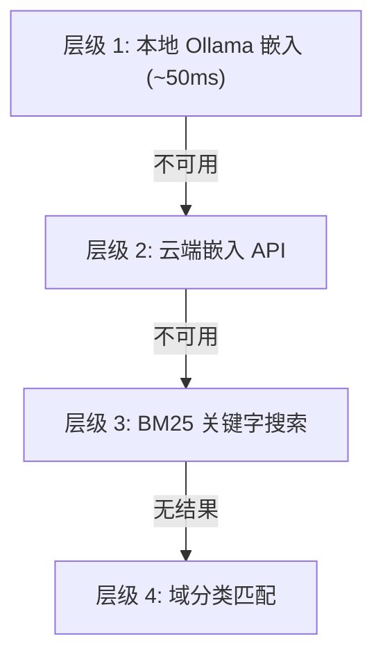

# 智能体执行架构

**5阶段优化管道——消减智能体循环中的浪费**

*开放源码（MIT）。OpenPawz项目的一部分。*

---

## 问题

今天的每个 AI 智能体平台——包括我们之前的版本——都遵循相同的循环：

```
用户讲话 → 模型阅读所有内容 → 模型思考 → 模型输出文本 →
引擎解析文本 → 引擎调用API → API返回数据 →
引擎序列化结果 → 模型读取结果 → 模型再次思考 → ……重复
```

每次循环需耗时 2–10 秒（大语言模型推理）加上网络延迟。5步任务需要 20–50 秒。瓶颈不在于模型思维的速度——而在于**调用它们思维的频次**。

---

## 架构

五个阶段，每一个阶段消减一个特定类型的浪费。所有阶段均已实现，测试过（162个专用测试）并接入到现有的智能体循环中。


| 指标 | 之前 | 所有阶段之后 |
|--------|--------|-----------------|
| **每任务平均推理调用** | 3–5 次连续 | 1 次规划 + 1 次合成 |
| **JSON 解析失败** | 工具调用的约 5% | 0% （约束解码） |
| **工具发现延迟** | ~2s （首次调用时构建索引） | <100ms （预建的持久索引） |
| **内部序列化** | JSON 文本 | MessagePack 二进制 |
| **多步任务延迟** | 20–50 秒 | 4–12 秒 |
| **每个任务的代币费用** | 100% 基线 | 基线的大约 40% |

---

## 阶段 0——动作 DAG 规划

**20个测试 · `engine/plan/` · 风险：低**

不是逐个工具顺序执行，模型在一个推理调用中输出一个完整的执行计划，作为有向无环图(DAG)。引擎并行执行独立节点。

```
用户: "设置周例会，邀请团队，概括上周行动事项"

之前（顺序执行）：
  回合 1: 智能体思考 → gmail_search → 等待      (4s)
  回合 2: 智能体读取 → calendar_create → 等待     (4s)
  回合 3: 智能体读取 → gmail_send → 等待           (4s)
  回合 4: 智能体读取 → 合成响应          (3s)
  总计: 4 次推理调用, ~15s

之后（DAG 规划）：
  回合 1: 智能体输出计划:
    A(gmail_search) ‖ B(calendar_create) → C(gmail_send)
  引擎: A 和 B 并行运行 → 结果馈送 C → C 运行
  回合 2: 智能体合成交互
  总计: 2 次推理调用, ~5s
```

### 运行方式

1. 系统提示中的一个部分（`prompts/plan.md`）指示模型输出一个包含动作 DAG 的 `execute_plan` 工具调用
2. Rust 计划模块验证 DAG（无环，有效的依赖关系，所有工具均存在）
3. `tokio::JoinSet` 并行执行独立节点
4. 结果被组装并注入上下文以进行最终综合调用
5. **故障转移：** 如果模型没有输出计划，现有的顺序循环继续不变

### 故障转移

- **每个节点错误隔离** — 每个节点在自己独立的 `tokio::spawn` 内运行，并设置捕获边界
- **退避重试** — 可重试错误（429, 5xx, 超时）重试最多 2 次，并以指数退避方式
- **依赖感知降级** — 如果节点 B 失败，则依赖节点 C 被跳过；独立节点继续
- **局部结果综合** — 模型告诉用户什么成功了什么失败了

**文件:** `engine/plan/atoms.rs`, `engine/plan/molecules.rs`, `engine/plan/executor.rs`

---

## 阶段 1——约束解码

**19个测试 · `engine/constrained/` · 风险：低-中等**

强制 Ai 供应商在调用工具时只能生成**有效的 JSON**。由于标记采样器仅限于有效的 schema 标记，因此模型不能产生格式错误的工具调用。

| 提供者 | 机制 | 结果 |
|----------|-----------|--------|
| **OpenAI** | 函数定义中的 `strict: true` | 100% 模式合规 |
| **Anthropic** | `tool_choice` 强制 | 模型保证工具选择 |
| **Google Gemini** | 配合 `function_calling_config` 的 `tool_config` | 模式约束输出 |
| **Ollama** | `format: "json"` | 仅 JSON 输出 |
| **其他** | 现有重试逻辑（回退） | ~95% 解析率 |

### 影响

解析失败会导致重试循环 — 每次重试都需要另一次 2–10s 的推理调用。约束解码完全消除了对支持的提供商的这种情况。

**文件:** `engine/constrained/atoms.rs`, `engine/constrained/molecules.rs`

---

## 阶段 2——嵌入索引工具注册表

**31个测试 · `engine/tool_registry/` · 风险：低**

扩展 [图书馆管理方法](/reference/librarian-method)，加入一个**持久 SQLite 支持的工具注册表**和四层搜索故障转换。

### 四层搜索故障转换



1. **向量相似性** — 在持久化嵌入上进行基于余弦的搜索（SQLite `tool_embeddings` 表）
2. **BM25 全文** — SQLite FTS5 关键字匹配
3. **域扩展** — 同一技能域中的兄弟工具
4. **关键字回退** — 在工具名称/描述中的子字符串匹配

### 重点功能

- **持久性** — 嵌入信息可在重启后继续使用（vs 内存重建）
- **增量式** — 仅重新嵌入新增或更改的工具
- **MCP 自动索引** — 在发现时对新的 MCP 工具进行嵌入
- **优雅降级** — 即使嵌入模型不可用，缓存的嵌入仍然保留

**文件：** `engine/tool_registry/atoms.rs`, `engine/tool_registry/molecules.rs`

---

## 阶段 3 — 二进制 IPC

**38 个测试 · `engine/binary_ipc/` · 风险：中等**

使用 **MessagePack**（通过 `rmp-serde`）来替换 JSON 序列化，用于高频内部路径。

### 组件

| 组件 | 目标 |
|-----------|---------|
| **EventBatcher** | 将流引擎事件批处理到 MessagePack 帧中 |
| **ResultAccumulator** | 将并行 DAG 执行结果组装到一个二进制缓冲区中 |
| **BatchConfig** | 可配置的批量大小、刷新间隔、压缩 |

### 更改内容

| 路径 | 之前 | 之后 |
|------|--------|-------|
| SSE 令牌流 | 每令牌 JSON | MessagePack 批次 |
| 计划 DAG 结果汇编 | N × JSON 解析 | 1 × 二进制累加 |
| 内部事件总线 | JSON 事件 | MessagePack 帧 |

外部协议（OpenAI API、Gmail、MCP JSON-RPC）仍使用 JSON——我们只对我们双方控制的路径进行优化。

**预期延迟降低：15–30%**，在此之上阶段 0 的减少推理调用次数。

**文件：** `engine/binary_ipc/atoms.rs`, `engine/binary_ipc/molecules.rs`

---

## 阶段 4 — 投机执行

**54 个测试 · `engine/speculative/` · 风险：中等至高等**

**应用到智能体的 CPU 分支预测。** 引擎学习工具转换模式，而在当前工具仍在执行时，为最有可能的下一个工具预先加载连接（或预先获取结果）。

### 工作方式

1. **模式学习** — 工具调用序列记录在 `tool_sequences` SQLite 表中，构建转换概率矩阵
2. **预测** — 当工具 A 完成后，引擎根据历史模式预测下一个工具
3. **阈值** — 只有当 P(next | current) > 0.5 时才投机
4. **仅限读取** — 只投机读取操作（列出、搜索、获取）。永远不要投机执行写操作
5. **连接预热** — 预先建立通往可能的下一个 API 端点的 TCP/TLS 连接（节省 100–300 毫米）
6. **匹配失败时不执行** — 如果模型调用不同的工具，则投机的工作被悄悄丢弃

### 示例

```
模型调用: google_calendar_list
  引擎学习: P(google_calendar_create | google_calendar_list) = 0.45
                 P(gmail_send | google_calendar_list) = 0.62

   当 calendar_list 运行时:
     → 预热 Gmail API 连接
     → 预先使用 Gmail OAuth 令牌认证

   模型的下个调用: gmail_send  ← 预测命中！
     → 连接已预热。节省 200–800 毫米。
```

**预期命中率：60–70%** 对常见工作流。

**文件：** `engine/speculative/atoms.rs`, `engine/speculative/molecules.rs`

---

## 跨阶段数据流程

当所有五个阶段在单个用户请求上一起工作时：

```
用户: "建立每周站会，邀请团队并
        从邮件总结上周的行动项"

阶段 2：工具发现 (<100ms)
    → 嵌入搜索找到: calendar_create, gmail_search, gmail_send

阶段 0：单次推理 → DAG 计划：
    A(gmail_search) ‖ B(calendar_create) → C(gmail_send)

阶段 1：计划 JSON 通过约束解码确保有效

阶段 3：A & B 的结果通过二进制 ResultAccumulator 汇总

阶段 4：A 运行时，Gmail send API 预热

结果：2 次推理调用而非常规的 6+
    任务在 4–12 秒内完成，而非 20–50 秒。
```

---

## 与其他协议的关系

| 协议 | 层面 | 关系 |
|----------|-------|-------------|
| [指挥官协议](/reference/conductor-protocol) | 流程层面 | 指挥官编译工作流程图；阶段 0 将并行执行扩展到对话中 |
| [工长协议](/reference/foreman-protocol) | 成本层面 | 工长减少了每次调用的成本；这些阶段减少了调用*数量* |
| [图书管理员方法](/reference/librarian-method) | 发现阶段 | 阶段 2 使用持久存储和 4 层回退扩展了图书管理员方法 |

---

## 实施状态

所有阶段**均已实现、测试并通过并接入实时智能体循环。**

| 阶段 | 测试 | 模块 | 状态 |
|-------|-------|--------|--------|
| 阶段 0 — 动作 DAG | 20 | `engine/plan/` | ✅ 现行 |
| 阶段 1 — 约束解码 | 19 | `engine/constrained/` | ✅ 现行 |
| 阶段 2 — 工具注册中心 | 31 | `engine/tool_registry/` | ✅ 现行 |
| 阶段 3 — 二进制 IPC | 38 | `engine/binary_ipc/` | ✅ 现行 |
| 阶段 4 — 投机执行 | 54 | `engine/speculative/` | ✅ 现行 |
| **总计** | **162** | | |

详细技术细节：[Agent Execution Roadmap](https://github.com/OpenPawz/openpawz/blob/main/docs/reference/agent-execution-roadmap-internal.md)

---

## 版权和署名

智能体执行架构是 **OpenPawz** 的一部分，并在 **MIT 许可证** 下发布。您可以自由在任何项目中使用、修改和重新分发这些技术，商业或其他用途均可。署名是欢迎但非必需的。

如果您在学术论文或技术写作中引用此工作：

> OpenPawz (2025). "智能体执行架构: 用于智能体 AI 系统的 5 阶段优化管道。" https://github.com/OpenPawz/openpawz

（文件末尾——共 275 行）
