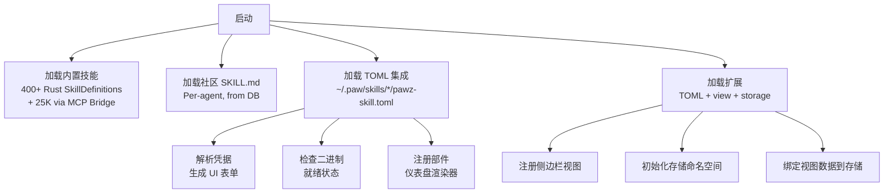
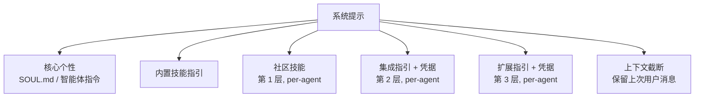
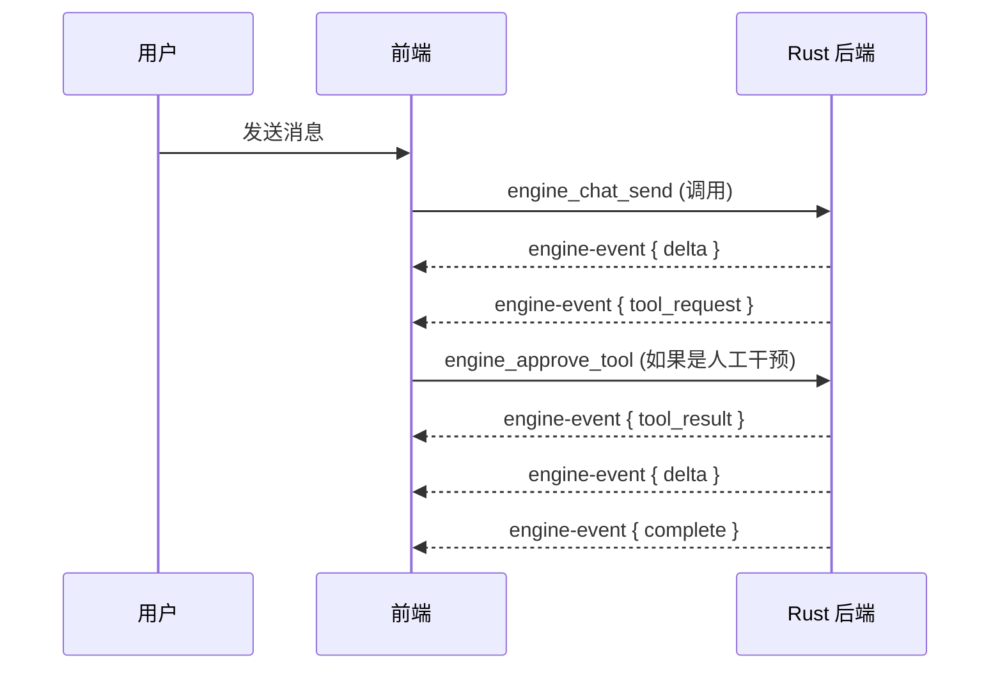

# 架构

OpenPawz 是一款 Tauri v2 桌面应用，配有 Rust 后端和 TypeScript 前端。

## 系统概述

<Columns cols={1}>
<Card title="Tauri Shell">
    <Columns cols={1}>
        <Card title="TypeScript 前端" horizontal>
        视图 · 功能模块 · IPC 桥接
        </Card>
    </Columns>
    <p style={{ textAlign: 'center', margin: '4px 0', opacity: 0.5 }}>↕ IPC (invoke / events)</p>
    <Columns cols={1}>
        <Card title="Rust 引擎" horizontal>
        智能体循环 · 提供程序 · 渠道 · 记忆 · 技能 · 协调器 · 沙盒
        </Card>
    </Columns>
    <p style={{ textAlign: 'center', margin: '4px 0', opacity: 0.5 }}>↕</p>
    <Columns cols={1}>
        <Card title="SQLite 数据库" horizontal>
        会话 · 消息 · 记忆 · 任务 · 技能 · 智能体 · 项目 · 交易
        </Card>
    </Columns>
</Card>
</Columns>

## 可扩展性——三层系统

Pawz 采用三层可扩展架构。每一层都比前一层提供更多权力。

<Columns cols={1}>
  <Card title="第 3 层——扩展" color="#EAB308">
    自定义侧边栏视图 · 仪表盘部件 · 持久数据<br />
    `pawz-skill.toml` + `[view]` + `[storage]`
  </Card>
</Columns>
<Columns cols={1}>
  <Card title="第 2 层——集成" color="#A855F7">
    凭据保险库 · API 访问 · CLI 二进制文件 · 部件<br />
    `pawz-skill.toml` + `[[credentials]]` + `[instructions]`
  </Card>
</Columns>
<Columns cols={1}>
  <Card title="第 1 层——技能" color="#3B82F6">
    仅提示注入 · 零配置 · `SKILL.md` 格式<br />
    skills.sh 生态 · 智能体可安装
  </Card>
</Columns>

| 层级 | 格式 | 功能 |
|------|--------|-------------|
| **技能** | `SKILL.md` | 提示注入，零配置 |
| **集成** | `pawz-skill.toml` | + 凭据，二进制检测，部件 |
| **扩展** | `pawz-skill.toml` + `[view]`/`[storage]` | + 自定义侧边栏视图，持久数据 |

### 技能加载流水线



### 智能体提示装配



了解更多详细信息：[技能](/docs/guides/skills) · [集成](/docs/guides/integrations) · [扩展](/docs/guides/extensions) · [PawzHub](/docs/guides/pawzhub)

## 前端 (`src/`)

使用 DOM 操作的纯 TypeScript——无框架。每个视图都是渲染到主要内容区域的模块。

### 视图

| 视图 | 文件 | 用途 |
|------|------|---------|
| 今日 | `views/today/` | 包含快速操作的仪表盘 |
| 智能体 | `views/agents/` | 创建、编辑、管理智能体 |
| 任务 | `views/tasks/` | 看板任务板 |
| 技能 | `views/skills/` | 技能库管理 |
| 研究 | `views/research/` | 研究工作流 |
| 协调器 | `views/orchestrator/` | 多智能体项目 |
| 记忆宫 | `views/memory-palace/` | 记忆浏览器/搜索 |
| 邮件 | `views/mail/` | 邮件集成 |
| 交易 | `views/trading/` | 交易仪表盘 |
| 自动化 | `views/automations/` | Cron 任务管理 |
| 设置 | `views/settings-*/` | 11 个设置标签 |

### 功能模块（`src/features/`）

原子设计模式——每个功能都有 `atoms.ts`（数据/状态）、`molecules.ts`（UI 组件）和 `index.ts`（导出）。

| 模块 | 用途 |
|--------|---------|
| `agent-policies` | 每个智能体的工具白/黑名单 |
| `browser-sandbox` | 浏览器配置和网络策略 |
| `channel-routing` | 消息路由规则 |
| `container-sandbox` | Docker 沙箱配置 |
| `memory-intelligence` | 记忆搜索和配置 |
| `prompt-injection` | 注入检测模式 |
| `session-compaction` | 会话摘要 |
| `slash-commands` | 聊天斜杠命令定义 |
| `action-dag` | 动作 DAG 规划可视化 (Phase 0) |

### 流程引擎 (`src/views/flows/`)

可视工作流程构建器有自己的执行引擎，基于指挥协议——一个在流程图中检测并行性、收敛和高维度结构的优化器。

| 模块 | 用途 |
|--------|---------|
| `executor.ts` | 主要流执行器 —— 图遍历，记忆预检索，智能体步骤调度 |
| `executor-conductor.ts` | 指挥协议运行时 —— 并行执行，超立方体单元调度，每个单元记忆隔离 |
| `executor-atoms.ts` | 共享流程类型 —— `FlowRunState`，`buildNodePrompt()`，`cellMemoryContexts` |
| `conductor-atoms.ts` | 指挥类型 —— `ExecutionUnit`，`ExecutionStrategy`，策略编译，`shouldUseConductor()` 检测 |
| `conductor-tesseract.ts` | 超立方体基元 —— 单元格检测，BFS 深度，子图构建，`findCellSinkNode`，`mergeAtHorizon` |
| `simulation-runtime.ts` | 生产执行器的模拟镜像，用于调试/虚拟运行模式 |

### IPC 桥 (`src/engine-bridge.ts`)

所有与 Rust 后端的通信都通过 Tauri 的 `invoke()` 和事件系统。桥梁为每个引擎命令提供类型化包装器。

## 后端 (`src-tauri/src/engine/`)

基于 Tokio 构建的 Rust 异步引擎。

### 核心模块

| 模块 | 用途 |
|--------|---------|
| `agent_loop/` | 智能体会话循环，包括 yield 信号、请求队列和计划拦截 |
| `chat.rs` | 系统提示构建器、工具装配、循环检测 |
| `state.rs` | 引擎状态 (YieldSignal、RequestQueue、活跃运行) |
| `providers/` | AI 提供商工厂和路由（及受限解码） |
| `channels/` | 通道桥消息处理器 |
| `memory/` | 混合搜索 (BM25 + 向量 + 时间) |
| `skills/` | 技能目录和凭据库 |
| `orchestrator/` | 多智能体项目执行 |
| `sandbox.rs` | Docker 容器执行 |
| `tools/` | 工具分派和执行 |
| `sessions/` | 会话和消息持久化 |
| `compaction.rs` | 会话压缩/摘要 |
| `http.rs` | 重试逻辑、断路器、TLS 锁定客户端工厂、请求签名审计日志 |
| `routing.rs` | 通道到智能体路由 |
| `injection.rs` | 提示注入检测 |
| `plan/` | Phase 0: Action DAG 计划 — DAG 验证、循环检测、并行执行器 |
| `constrained/` | Phase 1: 受限解码 — 特定提供者的模式强制 |
| `tool_registry/` | Phase 2: 持久化工具注册表 — SQLite 支持的嵌入、四层备用 |
| `binary_ipc/` | Phase 3: 二进制 IPC — MessagePack EventBatcher + ResultAccumulator |
| `speculative/` | Phase 4: 推测执行 — 转换预测、连接预热 |

### 通道桥

每种通道有其自己的桥模块：

`telegram.rs` · `discord.rs` · `slack.rs` · `matrix.rs` · `irc.rs` · `mattermost.rs` · `nextcloud.rs` · `nostr.rs` · `twitch.rs` · `webchat.rs` · `whatsapp/`

### 提供者实现

| 实现 | 提供者 |
|---------------|-----------|
| `OpenAiProvider` | OpenAI, Ollama, OpenRouter, DeepSeek, Grok, Mistral, Moonshot, Custom. 约束：在函数上 `strict: true` |
| `AnthropicProvider` | Anthropic. 约束：`tool_choice` 强制 |
| `GoogleProvider` | Google Gemini. 约束：`tool_config` 与 `function_calling_config` |

`ProviderKind` 实现 `Copy + Eq` — 每个提供商跟踪其种类以实现特定阶段的行为（例如，选择正确的受限解码模式）。

## 数据库

Pawz 使用**两个 SQLite 数据库**——一个由 Rust 引擎管理，一个由 TypeScript 前端管理。

### 引擎数据库（Rust——`rusqlite`）

| 表 | 内容 |
|-------|----------|
| `sessions` | 每个智能体的聊天会话 (id, label, model, system_prompt, agent_id, 所有时间戳) |
| `messages` | 所有消息，包含角色、内容、工具调用 JSON、工具调用 ID、名称 |
| `engine_config` | 用于引擎设置的键值配置存放处 |
| `agent_files` | 每个代理的代理人格文件 (SOUL.md, AGENTS.md 等) |
| `memories` | 存储的事实，包含嵌入向量、类别、重要性、时间戳 |
| `tasks` | 看板任务，包含标题、描述、状态、优先级、Cron 计划、模型覆盖 |
| `task_activity` | 任务活动馈送 (已创建、分配、状态变化、代理开始等) |
| `task_agents` | 多代理任务分配 (agent_id, 角色：领导/合作者) |
| `projects` | 协调项目，包含标题、目标、状态、老板代理 |
| `project_agents` | 项目代理分配 (角色、专长、状态、当前任务、模型) |
| `project_messages` | 代理间消息 (委托、进展、结果、错误) |
| `trade_history` | 交易记录（交易、转让、去中心化交易所交换）包含数额和状态 |
| `positions` | 开放交易位置，包含止损/止盈目标 |
| `skill_credentials` | 每个技能的加密 API 密钥和机密 |
| `skill_state` | 每个技能的启用/禁用状态 |
| `skill_custom_instructions` | 用户编辑的技能指南（覆盖默认值） |
| `community_skills` | 从.skills.sh生态系统安装的社区技能（名称，描述，指导，来源，启用） |

### 前端数据库（TypeScript——`@tauri-apps/plugin-sql`）

| 表 | 内容 |
|-------|----------|
| `agent_modes` | 聊天模式（常规、代码审查、快速聊天）包含模型、提示、温度 |
| `projects` | 用户工作区项目（构建、研究、创建） |
| `project_files` | 工作区项目内的文件（路径、内容、语言） |
| `automation_runs` | Cron 作业执行历史（作业ID，状态，输出，错误） |
| `research_findings` | 研究发现，包含标题、内容、源URL |
| `content_documents` | 内容工作室文档（markdown、HTML、纯文本） |
| `email_accounts` | 邮箱账户配置（IMAP/SMTP主机、端口） |
| `emails` | 缓存的电子邮件（正文、已读/已标星状态、代理草稿字段） |
| `credential_activity_log` | 每次凭证访问的审计跟踪（操作、工具、是否允许） |
| `security_audit_log` | 安全事件（exec_approval、config_change、auto_deny 等） |
| `security_rules` | 用户定义的命令执行的允许/拒绝模式 |

### Canvas 数据库 (Rust — `rusqlite`)

| 表 | 内容 |
|-------|----------|
| `canvases` | Canvas 工作空间（标题，时间戳） |
| `canvas_nodes` | Canvas 上的节点（类型、位置、大小、数据） |
| `canvas_edges` | 连接 Canvas 节点的边（源，目标，标签） |

:::info
前端数据库中的敏感字段使用存储在操作系统密钥链中的密钥以 AES-256-GCM 加密。加密值以 `enc:` 为前缀以便识别。
:::

## IPC 桥梁架构

TypeScript 前端与 Rust 后端之间的所有通信均使用 Tauri 的 IPC 系统。桥接 (`src/engine/molecules/ipc_client.ts`) 为每一个 invoke 命令提供类型化的包装。

### Invoke 命令 (前端 → 后端)

命令通过 `invoke()` 调用并返回 Promise：

| 分类 | 命令 |
|----------|----------|
| **聊天** | `engine_chat_send`, `engine_chat_history` |
| **会话** | `engine_sessions_list`, `engine_session_rename`, `engine_session_delete`, `engine_session_clear`, `engine_session_compact` |
| **配置** | `engine_get_config`, `engine_set_config`, `engine_upsert_provider`, `engine_remove_provider`, `engine_status`, `engine_auto_setup` |
| **智能体文件** | `engine_agent_file_list`, `engine_agent_file_get`, `engine_agent_file_set`, `engine_agent_file_delete` |
| **记忆** | `engine_memory_store`, `engine_memory_search`, `engine_memory_list`, `engine_memory_delete`, `engine_memory_stats`, `engine_get_memory_config`, `engine_set_memory_config`, `engine_test_embedding`, `engine_embedding_status`, `engine_embedding_pull_model`, `engine_ensure_embedding_ready`, `engine_memory_backfill` |
| **技能** | `engine_skills_list`, `engine_skill_set_enabled`, `engine_skill_set_credential`, `engine_skill_delete_credential`, `engine_skill_revoke_all`, `engine_skill_get_instructions`, `engine_skill_set_instructions` |
| **社区技能** | `engine_community_skills_list`, `engine_community_skills_browse`, `engine_community_skills_search`, `engine_community_skill_install`, `engine_community_skill_remove`, `engine_community_skill_set_enabled` |
| **任务** | `engine_tasks_list`, `engine_task_create`, `engine_task_update`, `engine_task_delete`, `engine_task_move`, `engine_task_activity`, `engine_task_set_agents`, `engine_task_run`, `engine_tasks_cron_tick` |
| **TTS / STT** | `engine_tts_speak`, `engine_tts_get_config`, `engine_tts_set_config`, `engine_tts_transcribe` |
| **交易** | `engine_trading_history`, `engine_trading_summary`, `engine_trading_policy_get`, `engine_trading_policy_set`, `engine_positions_list`, `engine_position_close`, `engine_position_update_targets` |
| **项目** | `engine_projects_list`, `engine_project_create`, `engine_project_update`, `engine_project_delete`, `engine_project_set_agents`, `engine_project_messages`, `engine_project_run` |
| **代理** | `engine_list_all_agents`, `engine_create_agent`, `engine_delete_agent`, `engine_approve_tool` |
| **浏览器** | `engine_browser_get_config`, `engine_browser_set_config`, `engine_browser_create_profile`, `engine_browser_delete_profile` |
| **截图** | `engine_screenshots_list`, `engine_screenshot_get`, `engine_screenshot_delete` |
| **工作区** | `engine_workspaces_list`, `engine_workspace_files`, `engine_workspace_delete` |
| **网络** | `engine_network_get_policy`, `engine_network_set_policy`, `engine_network_check_url` |
| **渠道** | `engine_<渠道>_start`, `engine_<渠道>_stop`, `engine_<渠道>_status`, `engine_<渠道>_get_config`, `engine_<渠道>_set_config`, `engine_<渠道>_approve_user`, `engine_<渠道>_deny_user`, `engine_<渠道>_remove_user` （对于 telegram, discord, irc, slack, matrix, mattermost, nextcloud, nostr, twitch） |
| **Tailscale** | `engine_tailscale_status`, `engine_tailscale_get_config`, `engine_tailscale_set_config`, `engine_tailscale_serve_start`, `engine_tailscale_serve_stop`, `engine_tailscale_funnel_start`, `engine_tailscale_funnel_stop`, `engine_tailscale_connect`, `engine_tailscale_disconnect` |
| **邮件** | `read_himalaya_config`, `write_himalaya_config`, `remove_himalaya_account`, `fetch_emails`, `fetch_email_content`, `send_email`, `move_email`, `delete_email` |
| **安全** | `get_db_encryption_key` |

### 智能体内置工具

每个智能体都可以访问这些内置工具（在 `tools.rs` 中定义，在 `tool_executor.rs` 中执行）：

| 工具 | 参数 | 描述 |
|------|-----------|-------------|
| `skill_search` | `query` (string) | 按关键词搜索在 skills.sh 目录中的社区技能 |
| `skill_install` | `source` (owner/repo), `path` (skills/id/SKILL.md) | 从 GitHub 安装社区技能 |
| `skill_list` | — | 列出所有已安装的社区技能及其启用/禁用状态 |

这些工具允许代理在会话中发现、安装和管理社区技能，而无需用户访问技能标签。

## 事件（后端 → 前端）

引擎通过 Tauri 的事件系统与前端进行实时通信。前端使用 `listen()` 订阅，后端异步发出事件。

| 事件 | 负载 | 目的 |
|-------|---------|--------|
| `engine-event` | `EngineEvent` | 流式数据块、工具请求、工具结果、完成和错误 |
| `project-event` | `{ project_id, agent_id, kind }` | 项目/代理完成通知 |
| `agent-profile-updated` | `{ agent_id }` | 代理资料变更（姓名、头像、个人简介） |

### EngineEvent 种类

`engine-event` 载荷包含一个 `kind` 字段，确定事件类型：

| 类型 | 字段 | 描述 |
|------|--------|-------------|
| `delta` | `text`, `session_id`, `run_id` | 来自 AI 模型的流式文字块 |
| `tool_request` | `tool_call` (id, function name, arguments) | 代理想要调用一个工具——可能需要人工审批 |
| `tool_result` | `tool_call_id`, `output`, `success` | 工具执行结果 |
| `complete` | `tool_calls_count`, `usage` (tokens), `model` | 代理轮次完成 |
| `error` | `message` | 代理执行期间出错 |
| `plan_start` | `plan_id`, `node_count` | Action DAG 计划执行开始 (Phase 0) |
| `plan_node_start` | `plan_id`, `node_id`, `tool` | 单个 DAG 节点开始执行 |
| `plan_complete` | `plan_id`, `results` | Action DAG 计划执行完成，带有所有节点结果 |

### 事件流



## 构建流水线

Pawz 使用双重构建流水线——前端采用 **Vite**，后端采用 **Cargo**，通过 Tauri 编排：

### 开发

```bash
pnpm tauri dev
```

1. **Vite 开发服务器** 在 `http://localhost:1420` 上启动（HMR 启用）
2. **Cargo** 以调试模式编译 Rust 后端
3. **Tauri** 启动指向 Vite 开发服务器的应用窗口
4. `src/` 中的文件更改触发 Vite HMR；`src-tauri/` 中的更改触发 Cargo 重建

### 生产构建

```bash
pnpm tauri build
```

1. `pnpm build` — 将 TypeScript → `dist/` 打包（优化、压缩）
2. `cargo build --release` — 优化后编译 Rust 后端
3. Tauri 将两者打包成原生安装程序（`.dmg`、`.AppImage`、`.msi`）

### 构建配置

| 配置文件 | 用途 |
|-------|--------|
| `vite.config.ts` | Vite 设置：端口 1420，忽略 `src-tauri/`，在端口 1421 上启用 HMR |
| `src-tauri/tauri.conf.json` | Tauri 设置：`beforeDevCommand`，`beforeBuildCommand`，CSP 策略，窗口配置 |
| `src-tauri/Cargo.toml` | Rust 依赖项和构建配置文件 |
| `tsconfig.json` | TypeScript 编译选项 |

### 内容安全策略

生产版 CSP 限制了前端：

default-src 'self'; script-src 'self'; style-src 'self' 'unsafe-inline';
connect-src 'self' ws://127.0.0.1:* https://127.0.0.1:*;
img-src 'self' data: blob:; font-src 'self' data:;
object-src 'none'; frame-ancestors 'none'

## 技术栈

| 层 | 技术 |
|-------|------------|
| Shell | Tauri v2 |
| 前端 | TypeScript，原生 DOM |
| 后端 | Rust、Tokio 异步 |
| 数据库 | SQLite (rusqlite + @tauri-apps/plugin-sql) |
| HTTP | reqwest |
| 浏览器 | headless_chrome (Chrome DevTools Protocol) |
| HTML 解析 | scraper (Rust) |
| Docker | bollard |
| 构建 (前端) | Vite |
| 构建 (后端) | Cargo |
| 图标 | Material Symbols Outlined |
| 字体 | Inter, JetBrains Mono |

（文件结束 - 共 386 行）
