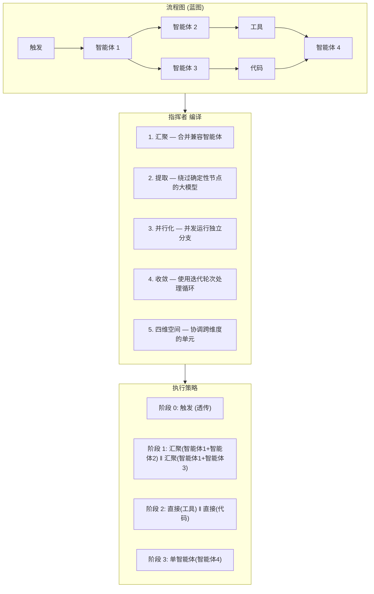
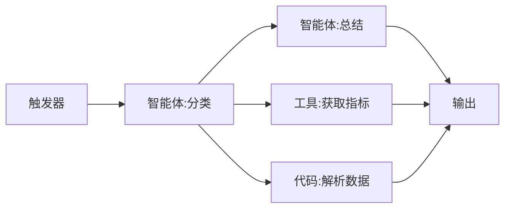
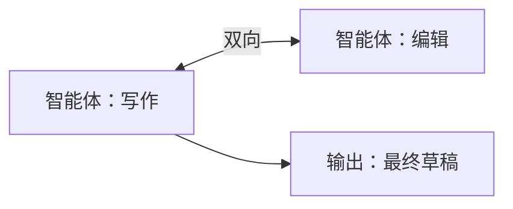
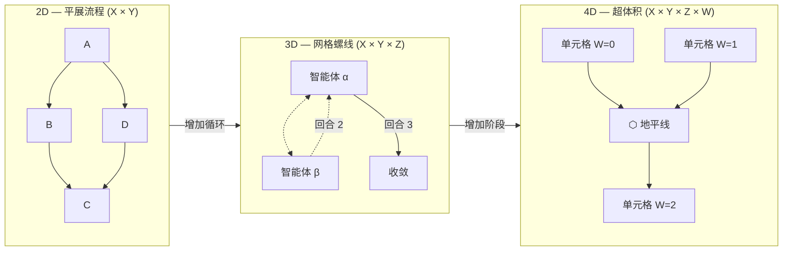
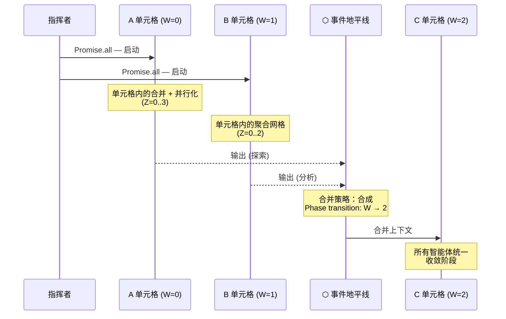
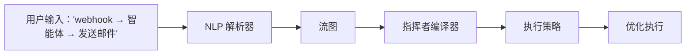

# 指挥者协议

**AI 编译流程执行 —— 汇聚、提取、并行化、收敛、四维空间**

*开源（MIT许可证）。OpenPawz 项目的一部分。*

---

## 问题

每个工作流自动化平台——n8n、Zapier、Make、Prefect、Airflow——都以同样的方式执行：按拓扑顺序逐个遍历图节点。节点 A 完成，将数据传递给节点 B，节点 B 完成，将数据传递给节点 C。顺序的、同步的，每个智能体节点一次大模型调用。

当工作流简单且节点成本低时，这种方式运行良好。但 AI 工作流根本不同：

- **智能体节点很昂贵。** 每个智能体步骤都是一个大模型调用——延迟 2-10 秒且有实际代币消耗。
- **链接变得很长。** 一个真正的管道可能有 8-20 个节点：触发 → 解析数据 → 智能体分析 → 条件 → 智能体重写 → 工具调用 → 智能体审查 → 输出。
- **分支是浪费的。** 当两个独立分支可以并行运行时，顺序执行会等待每一个完成才开始下一个。
- **循环是不可能的。** n8n、Zapier 和 Make 都需要 DAGS（有向无环图）。不允许循环、反馈或迭代改进。如果你想让两个智能体展开辩论直到达成一致，无法表达这一点。

### 数学很简单且残酷

一个包含 6 个智能体步骤的 10 节点流，每个平均延迟 4 秒的大模型延迟：

| 平台 | 执行 | 时间 | 大模型调用 |
|----------|-----------|------|-----------|
| n8n / Zapier / Make | 顺序遍历 | **24s+** | 6 |
| OpenPawz (指挥者) | 编译策略 | **4–8s** | 2–3 |

指挥者并不跳过工作。它做的是一样的工作 *更聪明* —— 合并兼容的智能体调用，在独立分支上同时运行，并且完全绕过大模型，对不需要它的节点不使用大模型。

---

## 发明

指挥者协议把流程图看作不是要执行的程序，而是 **意图的蓝图**，可以在任何单一节点运行之前将其编译成优化的执行策略。

传统的平台解释过程是命令式的——"做这个，然后这个，然后这个。" 指挥者解释流程是声明式的——"这是需要发生的事情；让我来弄明白最快使其发生的方法。"

编译步骤产生一个 `ExecutionStrategy`（执行策略）：一系列的阶段，其中每个阶段包括同时运行的单元，而每个单元代表一个或多个经过合并或分类以便最优化执行的原始节点。

### 五个基本要素

指挥者分析任意流程图并应用五种优化基础要素：



---

## 基础要素 1: 汇聚

**相邻且具有兼容配置的智能体节点合并为单个大模型调用。**

当两个或三个智能体节点形成一个链——每个将输出传递给下一个——指挥者将它们的提示合并到一个带有步边界复合提示中。一个LLM调用即可完成多项工作。

### 之前（传统）：

```
智能体 1: "总结这些数据"        → 大模型调用 (4s)  → 结果
智能体 2: "从…中提取关键指标"  → 大模型调用 (4s)  → 结果
智能体 3: "基于…写一份报告"   → 大模型调用 (4s)  → 结果
总计: 3个大模型调用，约12秒
```

### 之后（指挥者汇聚）：

```
汇聚提示：
  "第1步：总结这些数据
   ---步边界---
   第2步：从上述摘要中提取关键指标
   ---步边界---
   第3步：根据上述指标写报告"
→ 1个大模型调用 (5s) → 解析回3个节点输出
总计：1个大模型调用，约5秒
```

#### 兼容性规则

当两个智能体节点：
- 共享相同的模型（或都使用默认模型）
- 共享相同的温度设置（或都使用默认设置）
- 没有配置工具调用（工具调用需要单独会话）
- 形成直接链（A → B），它们之间没有分支
  可以进行收敛。

指挥者通过 `detectCollapseChains()` 自动检测这些链条，通过 `buildCollapsedPrompt()` 构建合并提示。执行后，`parseCollapsedOutput()` 使用 `---STEP_BOUNDARY---` 分隔符将响应分开回到单个节点结果。

---

## 基础要素 2: 提取

**确定性节点完全绕过大模型并直接执行。**

并非AI工作流中的每个节点都需要人工智能。工具调用、HTTP请求、代码执行、数据转换和MCP调用都是完全确定性的——他们不需要大型语言模型来格式化JSON-RPC调用或运行JavaScript函数。指导者会分类每个节点，并将确定性工作路由到直接执行：

| 节点分类 | 执行路径 | 示例 |
|---------------------|---------------|----------|
| **智能体** | 通过引擎的大模型调用 | `智能体`, `团队` |
| **直接执行** | 绕过大模型——通过Rust后端或沙箱执行 | `工具`, `代码`, `http`, `mcp-tool`, `循环`, `内存`, `内存召回` |
| **透传** | 无需执行——仅数据转发 | `触发`, `输出`, `错误`, `组` |

在一个包含4个智能体节点和6个直接/透传节点的10节点流程中，指挥者将大模型调用从10减少到4——或者更少，如果某些智能体可以合并的话。

### 提取如何与领班协议配合使用

提取和[领班协议](/reference/foreman-protocol)是在不同层次上运行的互补优化：
- **提取** 在*流程级别*消除不必要的大模型调用——流程中的工具节点不需要任何模型来执行
- **领班** 在 *智能体级别* 减少必要工具调用的成本——当智能体决定在对话期间调用工具时，领班委派给较便宜的模型

结合使用：指挥者完全跳过大模型对确定性流程节点的处理，而当智能体节点确实需要调用工具时，领班以最低成本处理执行。

---

## 基础要素 3：并行化

**同一深度级别的独立分支并发执行。**

当一个工作流扩展——一个节点馈送到彼此不依赖的多个下游分支——顺序执行浪费时间等待每个分支完成后再启动下一个。指挥者通过深度分析和联合查找分组检测独立分支，然后在同一执行阶段内同时运行它们。



### 顺序（传统）:
```
触发器 → 分类 → 总结 → 获取指标 → 解析数据 → 输出
总览: 6 个步骤，~16 秒
```

### 指挥者（并行）:
```
阶段 0: 触发器 (透明转发)
阶段 1: 分类 (单个智能体)
阶段 2: 汇总 ‖ 获取指标 ‖ 解析数据  ← 三个同时运行
阶段 3: 输出 (透明转发)
总共: 4 个阶段，~8 秒
```

分组算法使用 `groupByDepth()` 根据根节点最长路径为其分配深度级别，然后 `splitIntoIndependentGroups()` 使用并查集识别在同一深度级别内共享依赖项的节点。在同一阶段中的不同依赖组中的节点作为并发执行单元运行。

---

## 基础元素 4：收敛（收敛网格）

**循环子图作为共享上下文的对话进行迭代，直到输出稳定。**

这是现有任何其他工作流平台上都没有等价物的基础元素。n8n、Zapier、Make、Airflow、Prefect——它们都要求是DAG（有向无环图）。循环是错误的。反馈循环是不可能的。

一些最强大的AI模式本质上是循环的：
- **辩论与共识**：两个智能体就某个话题进行争论直到达成协议
- **迭代完善**：作者和编辑互相传递草稿，直到质量稳定
- **自我修正**：一个智能体检查自己的输出，发现错误，修复它们，然后再次检查
- **多视角分析**：三位分析师各自审视他人的研究成果并更新自己

指挥者通过**双向边**和收敛网络执行启用这些模式。

### 工作原理



1. 指挥者检测流程图中的循环（通过形成循环的双向或反向边相连的节点）
2. 重叠循环通过 `buildMeshConfigs()` 合并到 **网组** 中
3. 每个网组在迭代轮次中执行：
    - 第1轮：网组中的每个节点以其初始输入执行
    - 第2轮：每个节点使用所有其他节点第1轮输出的共享上下文重新执行
    - 第N轮：继续直到输出**收敛**或达到最大迭代次数
4. **收敛检测** 对单词标记使用Jaccard相似度——当同一节点连续输出的相似度≥85%时，该节点已稳定
5. 当网组中的所有节点都已收敛，或达到最大迭代次数（默认值：5）时，网络完成，后续节点接收最终输出

### 示例：作者-编辑辩论

```
第1轮：
  作者：生成初稿
  编辑：审阅初稿，建议修改

第2轮：
  作者：根据编辑反馈修改
  编辑：再次审阅——“好了很多，第3段语法微调”

第3轮：
  作者：应用语法修正
  编辑：审阅——“看起来不错，已批准”  ← 与第2轮输出相似度92%

检测到收敛（0.92 > 0.85阈值）。网格完成。
输出：最终批准的草案流转至后续节点。
```

没有其他自动化平台能表达这种模式。在n8n中，你需要手动构建带有外部状态管理的循环，并希望它能终止。在Zapier中，这完全不可能。

---

## 原语 5: 超立方体（超维流）
**沿深度和阶段维度运行的并行工作流单元，在事件视界处融合。**

原语 1-4 操作于平面图上——序列（X）和平行度（Y）二维画布上的操作。但指挥者已经隐式地在更高维度中工作。当收敛网格迭代时，每轮都是一个独特的状态——具有累积上下文的不同拓扑结构。当并行分支在合并之前独立运行时，它们占据独立的“空间”，在连接点处崩溃。

超立方体原语使这些隐藏的维度显式并可控。

### 工作流的四个维度

| 维度 | 轴 | 表示 | 例如 |
|-----------|------|-----------|---------|
| **第一** (X) | 序列 | 步骤排序，因果关系 | A → B → C |
| **第二** (Y) | 并行度 | 并发分支，条件分割 | A → {B ‖ C} → D |
| **第三** (Z) | 深度 | 迭代层，抽象嵌套，并行流堆叠 | 网格回合 1 → 回合 2 → 回合 3 （螺旋形而非环形）|
| **第四** (W) | 阶段 | 上下文积累时的行为模式变化 | 探索 → 精炼 → 收敛 → 成固化 |

标准流是一个 2D 投影（X × Y）。收敛网格是一个 3D 螺旋（X × Y × Z）。超立方体流是完整 4D 物体（X × Y × Z × W）——可以在四个维度上并行运行的独立工作流单元，只在它们同步和合并的指定 **事件视界** 处连接。

### 立方体内的立方体: 施莱格尔图
超立方体（4D 超立方）有 8 个立方形单元。当投影到 2D 显示时，它呈现出 **内立方外立方** 的形态——施莱格尔图。在工作流方面：

```mermaid actions={false}
graph TD
    subgraph Outer["◻ 单元格 W=0 —— 探索"]
        C["🔍 智能体 C\n(研究)"] --> D["📊 智能体 D\n(分类)"]
        subgraph Inner["◻ 单元格 W=1 —— 精炼"]
            A["🧠 智能体 A\n(分析员)"] <-.-> B["🧠 智能体 B\n(评论员)"]
        end
    end
    D --> H{"⬡ 事件视界"}
    B --> H
    H --> Next["✦ 合并输出\nW → 2 (收敛)"]
    style Outer fill:#1a1a2e,stroke:#8b5cf6,stroke-width:2px
    style Inner fill:#0f0f23,stroke:#06b6d4,stroke-width:2px
    style H fill:#f59e0b,stroke:#f59e0b,color:#000,stroke-width:3px
    style Next fill:#10b981,stroke:#10b981,color:#000
```



**内部单元** 和 **外部单元** 是独立的工作流区域，它们并行运行——可能在不同的深度层级（Z）和行为阶段（W）。它们只通过 **事件视界** 节点连接：所有单元必须在流程继续之前汇聚的同步点。

### 维度递进

随着复杂度增加，流程自然升级：


### 事件视界
事件视界是一个节点，多个四维单元格在此折叠成单个输出。它是 4D 相当于连接节点，但语义更丰富：

- **所有单元必须到达视界** 流程才会继续——这是一个硬同步屏障
- **阶段转换在视界处发生** ——W坐标发生变化（例如，从“探索”转为“精炼”）
- **深度在视界处重置** ——完成的迭代轮次结晶为单一状态（Z折叠）
- **上下文合并** ——来自所有单元的累积状态统一为一个共享上下文

这与简单的并行合并根本不同。合并等待分支。事件地平线跨维度同步，触发阶段转换，并控制不同深度和阶段的累计状态如何合并。

### 为什么这对AI工作流很重要

考虑一个复杂的科研管线：

**A区（外层 — 探索）：** 三个研究智能体独立搜索不同领域，与主管一起迭代（Z=0..3，网格精细化）。W=0阶段（探索）。

**B区（内层 — 分析）：** 两个分析智能体辩论先前运行的结果，提炼其综合（Z=0..2，收敛网状）。W=1阶段（基于前数据已精细化）。

```mermaid actions={false}
graph TD
    subgraph CellA["◻ A区 — W=0 探索"]
        R1["🔍 研究1"] <-.-> S["👁 督导"]
        R2["🔍 研究2"] <-.-> S
        R3["🔍 研究3"] <-.-> S
        S -.->|"Z=0..3\n迭代"| R1
    end
    subgraph CellB["◻ B区 — W=1 分析"]
        An1["🧠 分析师1"] <-.->|"辩论\nZ=0..2"| An2["🧠 分析师2"]
    end
    S --> EH{"⬡ 事件地平线\n合并: 合成"}
    An2 --> EH
    EH -->|"W → 2"| Conv["✦ 收敛区\n所有智能体统一"]
    style CellA fill:#1a1a2e,stroke:#8b5cf6,stroke-width:2px
    style CellB fill:#0f0f23,stroke:#06b6d4,stroke-width:2px
    style EH fill:#f59e0b,stroke:#f59e0b,color:#000,stroke-width:3px
    style Conv fill:#10b981,stroke:#10b981,color:#000
```



这些单元独立工作——不同的主题，不同的模型，不同的迭代深度。在**事件地平线**上，它们的输出合并：研究提供给分析师，分析重定向研究，并且整个系统从W=1过渡到W=2（收敛阶段），在此所有智能体朝着单一统一输出工作。

没有任何其他自动化平台可以表示这一点。它需要对时间（迭代深度）、行为模式（阶段）和空间独立性（并行单元）进行推理——全部同时进行。

### 实现：它是如何编译的

指挥者将每个四维单元视为一个独立的子策略：

```typescript
interface TesseractCell {
  id: string;
  phase: number;          // W坐标——行为模式
  depthRange: [number, number]; // Z范围——迭代界限
  subgraph: FlowGraph;    // 此单元内的2D流程
  strategy: ExecutionStrategy;  // 此单元的预编译策略
}
interface EventHorizon {
  id: string;
  cellIds: string[];      // 哪些单元在这里汇聚
  mergePolicy: 'concat' | 'synthesize' | 'vote' | 'last-wins';
  phaseTransition?: number; // 地平线后的新W值
}

interface TesseractStrategy {
  cells: TesseractCell[];
  horizons: EventHorizon[];
  // 单元格之间的并发组
}
```

执行：
1. 所有第一个事件地平线之前的单元格并发运行（`Promise.all`）
2. 每个单元格执行自身的编译策略（合并、提取、并行化、汇合同等地应用于单元格内）
3. 到达事件地平线时，执行暂停——所有单元格必须完成
4. 上下文根据地平线的合并策略合并
5. 应用阶段性转换（W 递增）
6. 后续单元格在合并后的上下文中执行



这是指挥官现有体系结构的自然扩展。并行化已经在独立分支上并发运行。汇聚已经处理迭代深度。四维体只需使这些维度成为一级特性，并添加事件地平线作为同步原语。

### 映射到指挥者基元

| 基元 | 2D 角色 | 4D 角色 |
|-----------|---------|---------|
| **合并** | 合并相邻智能体链 | 合并*单元格内*的链 |
| **提取** | 绕过确定性节点的LLM | 同样适用——单元格内执行 |
| **并行化** | 并发运行分支 | 并发运行*单元格* |
| **汇聚** | 迭代网格直到稳定 | 在单元格内迭代（Z） |
| **四维体** | — | 在相位（W）和深度（Z）上协调单元格，在地平线上同步 |

### 单元格范围内存

四维体单元在不同行为模式中运行——研究单元格和分析单元格需要不同的长期记忆上下文。指挥者提供**每个单元格的内存隔离**，这样并行单元永远不会竞争共享状态：

1. **查询构建** - 对于每个单元格，从单元格的智能体提示构建一个集中的内存查询（最多 3 个智能体，每个 200 个字符，总计不超过 300 个字符）
2. **并行分辨率** - 所有单元格查询通过 `deps.searchMemory()` 并发解决，通过 `pawEngine.memorySearch()` 调用，得分 ≥ 0.3 过滤
3. **不可变上下文映射** - 解决的内存字符串存储在 `resolvedCellMemory` 映射中，在执行前计算一次
4. **每个单元格依赖包装器** - 每个单元格接收自己的 `ConductorDeps` 包装器，绑定其内存覆盖到 `executeNode` 和 `executeAgentStep`，通过调用链进行穿线，而不改变 `runState.memoryContext`

这消除了由并行单元格变异共享字段可能导致的 `Promise.all` 竞争条件。每个单元格的代理节点在其提示的 [相关内存] 部分接收各自的解析内存上下文。

### 执行强化

每个四维单元格受到多种安全机制保护：
| 保护 | 详细信息 |
|-----------|--------|
| **单元格超时** | 每个单元格在 `DEFAULT_CELL_TIMEOUT_MS`（5分钟，可通过 `cellTimeoutMs` 重写）下竞赛。超时时，单元格生成 `[Cell error: ...]` 输出，而不是阻塞地平线。 |
| **中断传播** | 每个单元格任务顶部的 `if (deps.isAborted())` return; 防止流程被中断后工作。 |
| **拓扑基于输出** | `findCellSinkNode(cell, graph)` 遍历边缘以找到单元格内没有传出边缘的节点——无论节点插入顺序如何，都可靠 |
| **平稳降级** | 单元格失败被捕获并记录为错误输出；地平线 proceeding 以部分数据执行，而不是崩溃流程。 |
| **圆形导入预防** | `conductor-tesseract.ts` 只导入 `type ExecutionStrategy` 从 `conductor-atoms.ts`（仅类型，runtime 擦除）。编译器注入为 `compileSubgraph?` 回调。 |
| **BFS 缓存** | `computeTopoDepth()` 每次编译运行一次并通过所有功能，通过可选参数 `topoDepths?` 分发——没有冗余图形遍历。 |

### 视觉化: 渐进式披露

画布使用**渐进式公开**来避免让用户不知所措：

1. **默认（2D）：** 标准平展画布——大多数用户永远不需要更多
2. **网格提升 (3D)：** 当收敛网状迭代时，深度指示器显示 Z 层——"螺旋观看"
3. **四维体 (4D)：** 当流程包含事件地平线和并行单元格时，施莱格尔重叠层渲染出内部立方体与相位环和地平标记

施莱格尔投影显示：
- **外部矩形：** 当前相位单元格
- **内部矩形：** 嵌套或并行相位单元格
- **角落线条：** 相位转移边缘 (W 轴连接)
- **地平环：** 单元格会合点发光环
- **相位标签：** 小标签显示每个单元格当前的 W 值

---

## 执行策略

指挥者将所有五种原语编译成一个统一的`ExecutionStrategy`：

```typescript
interface ExecutionStrategy {
  graphId: string;
  phases: ExecutionPhase[];        // 顺序阶段
  totalNodes: number;
  estimatedLlmCalls: number;       // 经合并 + 提取后的数量
  estimatedDirectActions: number;  // 提取的节点
  conductorUsed: boolean;
  meta: {
    collapseGroups: number;        // 已合并的链
    parallelPhases: number;        // 有多并发单元的阶段
    meshCount: number;             // 收敛网
    extractedNodes: number;        // 绕过LLM的节点
    tesseractCells: number;        // 超维度细胞
  };
}

interface ExecutionPhase {
  index: number;
  units: ExecutionUnit[];          // 各单元在一阶段并发运行
}

interface ExecutionUnit {
  id: string;
  type: 'collapsed-agent' | 'direct-action' | 'single-agent' | 'single-direct' | 'mesh' | 'tesseract';
  nodeIds: string[];               // 此单元代表的原始节点
  mergedPrompt?: string;           // 合并单元使用
  maxIterations?: number;          // 网络单元使用
  cells?: TesseractCell[];         // 超立方体单元使用
  horizons?: EventHorizon[];       // 超立方体单元使用
  dependsOn: string[];             // 单元间依赖
}
```

在执行开始前，该策略仅计算一次。执行器随后按顺序遍历各个阶段，同时通过 `Promise.all` 运行每个阶段中的所有单元。如果因任何原因策略执行失败，执行器会自动退回为逐节点顺序执行——指挥者总是附加型的，从不会破坏现有流程。

---

## 自适应激活

指挥者不会盲目地编译每个流程。小型、简单的流程通过直接顺序执行更快。`shouldUseConductor()` 函数评估编译开销是否值得：

| 条件 | 阈值 |
|-----------|-----------|
| 节点数 | ≥ 4个节点 |
| 分支 | 任一节点扇出 > 1 |
| 循环 | 任一双向边 |
| 混合类型 | 既有智能体又有动态动作节点存在 |
| 四维结构 | 使用 cellId 分配的任何事件地平线节点 |

一个 3 节点线性流程（触发 → 智能体 → 输出）跳过指挥器并顺序运行。包含分支、工具调用和智能体链的 6 节点流程激活指挥器。包含事件地平线节点和单元格 ID 分配的流程无论节点计数如何都会激活四维原语。标准流程的交叉点大约为 4 个节点——低于此数编译开销超过节省。

---

## 性能

比较顺序 DAG 遍历（n8n/Zapier 模型）与指导者编译执行的基准：

| 流程模式 | 节点数 | 顺序执行 | 指导者 | 加速 | 大模型调用节省 |
|-------------|-------|------------|-----------|---------|-----------------|
| 线性链（3 个智能体） | 5 | 20–45s | 4–9s | **4–5×** | 2（合并） |
| 扇出（并行分支） | 8 | 35–70s | 5–10s | **5–7×** | 3（合并 + 并行） |
| 双向辩论 | 6 | ∞（不可行） | 15–25s | **∞** | 不适用（新功能） |
| 生产管线 | 20 | 80–160s | 8–18s | **8–10×** | 12+（所有原语） |
| 四维科研管道 | 12 | ∞（不可能） | 20–40s | **∞** | N/A（新功能） |

收益叠加：汇聚减少大模型总调用次数，提取消除不必要调用，并行化并发运行剩余工作。在一个20节点生产流程中，指导者可以将墙钟时间减少一个数量级。

---

## 与其他平台相比

| 功能 | n8n | Zapier | Make | Airflow | OpenPawz指导者 |
|-----------|-----|--------|------|---------|--------------------|
| **执行模型** | 顺序DAG遍历 | 顺序DAG遍历 | 顺序DAG遍历 | 任务调度（DAG） | AI编译策略 |
| **循环/反馈回路** | 错误 | 错误 | 错误 | 错误 | 收敛网格 |
| **智能体作为节点** | 通过HTTP/代码包装器 | 通过HTTP包装器 | 通过HTTP包装器 | 外部操作员 | 第一类，流式 |
| **大模型调用优化** | 无 | 无 | 无 | 无 | 汇集（N个智能体→1个调用） |
| **确定性绕过** | 所有节点同路径 | 所有节点同路径 | 所有节点同路径 | 所有节点同路径 | 提取（跳过大模型） |
| **自动并行化** | 手动拆分/合并 | 无 | 手动路由 | 执行器级别 | 自动深度分析 |
| **双向边** | 没有 | 没有 | 没有 | 没有 | 是（前进，后退，双向，错误） |
| **调试步骤** | 受限 | 无 | 受限 | 日志为基础 | 全断点 + 光标 + 边缘检查 |
| **自我修复** | 没有 | 仅重试 | 仅重试 | 仅重试 | 错误诊断 + 修复提案 + 自动重试 |
| **内存集成** | 没有 | 没有 | 没有 | 没有 | 内存写/召回节点 |
| **多智能体团队** | 没有 | 没有 | 没有 | 没有 | 小队节点 |
| **4D超维流** | 没有 | 没有 | 没有 | 没有 | 超立方细胞 + 事件视界 |
| **成本** | 自托管免费/云端付费 | 按任务定价 | 按操作定价 | 自托管免费 | 本地免费（Ollama）或云端 |

### 根本差异

传统平台将工作流视为 **命令式程序**——计算机按字面意思遵循的固定步骤序列。指挥者将工作流视为**声明式蓝图**——一个所需发生事情的描述，系统将此编译为最高效的执行计划。

这正是将 SQL 与过程式数据库查询分离开的概念性飞跃，正如将 React 的声明式 UI 与其命令式 DOM 操作分离一样。你描述的是*什么*，而不是*如何*。运行时决定了*怎么*。

---

## 边类型

指挥者的力量部分来自于 OpenPawz 的四种边类型——比任何其他工作流平台更丰富：

| 边种类 | 方向 | 目的 | 启用 |
|-----------|-----------|---------|---------|
| **前进** | A → B | 正常数据流 | 标准管道 |
| **反向** | A ← B | 数据拉取——B 从 A 请求数据 | 惰性求值，按需数据 |
| **双向** | A ↔ B | 握手——互数据交换 | 循环、辩论、迭代优化 |
| **错误** | A --err→ B | 故障路由 | 高级降级、后备链 |

n8n、Zapier 和 Make 仅支持正向边。Airflow 支持正向边并具有有限的错误处理。OpenPawz 的反向边和双向边使得在其他平台上结构性的不可能出现新的工作流模式。

---

## 调试模式

指挥者包括一个完整的逐步调试器——workflow 平台上较为少见，并在 Zapier 和 Make 等自动化工具中缺失：

- **断点**: 点击任何节点设置断点。当指挥者到达该节点时执行暂停。
- **逐步执行**: 逐个执行节点，检查每一步的输入和输出。
- **边缘数据检查**: 查看执行过程中流经每个边缘的实际数据（为可读性截取为80个字符）。
- **光标跟踪**: 可视化光标在画布上跟随执行，突出显示正在执行的节点。
- **暂停/恢复/终止**: 在任何执行过程中的完整生命周期控制——无论是顺序执行还是指挥者编译执行。

调试模式可用于顺序执行和指挥者编译执行。调试指挥者策略时，调试器通过阶段中的执行单元进行逐个步骤，将折叠单元显示为单个步骤并展开网格迭代。

---

## 自愈功能

当节点在执行过程中失败时，指导者不会盲目重试。自愈系统：

1. **分类错误** 为类别：超时、限频、认证、网络、无效输入、配置、代码错误、API错误
2. **生成诊断** 解释发生了什么以及为什么会发生
3. **提出修复方案** 带有置信分数——例如，"将超时增加到60秒（置信度：0.85）"或"检查保险库中的API密钥（置信度：0.92）"
4. **带退避重试** — 配置的最大重试次数、延迟和指数退避
5. **路由至错误处理程序** — 如果重试失败，错误边会路由到指定错误处理节点，成功路径子树跳过

这将脆弱的自动化转变为有弹性的管道。受限速的API调用不会导致流程崩溃——它会退避、重试，如果仍然失败，会转向备用路径。

---

## 三位一体

指导者协议是 OpenPawz 三重互补发明中的第三个。它们一同解决了 AI 驱动自动化的完整生命周期：

| 协议 | 问题 | 解决方案 |
|----------|---------|----------|
| [**图书馆员方法**](/reference/librarian-method) | *选择哪一个* 工具？ | 通过语义嵌入进行意图驱动发现 |
| [**领班协议**](/reference/foreman-protocol) | *如何* 廉价地执行工具？ | 通过自描述 MCP 实现工人模型委托 |
| **指导者协议** | *什么是最优执行计划？* | AI 编译流程策略：汇总、提取、并行化、收敛、四维立方体 |

在单一流程执行过程中：
1. **指导者** 将图表编译为优化策略——汇总智能体，提取直接动作，并行化分支
2. 需要工具的智能体节点使用 **图书馆员** 发现哪些工作流工具是相关的
3. 工具调用委托给 **领班**，通过工作模型实现廉价或免费的执行

结果是：一个在 n8n 上执行超过 2 分钟的 20 节点工作流在 OpenPawz 上执行不到 20 秒，成本更低，并具备 n8n 等其他平台无法表达的特性（循环、内存、小队）。

---

## 重新构想 25,000 个节点

n8n 拥有超过 25,000 个社区贡献的集成节点——Slack、Jira、GitHub、Stripe、Airtable、Google Sheets 等成千上万。它们都设计用于相同的范式：人类拖拽节点到画布上，手动连接它们，然后构建一个顺序自动化。这些节点很强。范式有限。

指挥者协议改变了这些节点的作用。

n8n 的 MCP 服务器暴露了工作流程级别的工具: `search_workflows`, `execute_workflow`, 和 `get_workflow_details`。Paw 将 n8n 节点组成每个服务的工作流，这些工作流被自动部署并通过 MCP 可用。然后指挥者可以将这些工作流作为更大规模、AI 编译的执行策略的一部分来协调:

- **合并**: 将多个顺序工作流的执行合并为单个编排调用
- **提取**: 提取简单的工作流执行并直接运行——不需要 LLM 推理
- **并行化**: 自动并行执行独立工作流分支
- **聚合**: 在交互反馈循环中汇聚连接工作流的智能体，这是 n8n 本身无法表达的

这不是对 n8n 的包装器。这是一种从根本上不同的执行模式，它使用 n8n 的集成生态系统作为 AI 编译工作流的构建模块。

### 实际意义

用户输入:

> *"当一个 webhook 触发时，让智能体对数据进行分类，然后并行执行以下操作：对其摘要并将其存储在 Airtable 中，如果是紧急情况，则在 Slack #alerts 中发布"*

NLP 解析器构建了一个 7 节点流图。指挥者对其进行编译:

- **阶段 0**: 触发（透传）
- **阶段 1**: 智能体分类（单次 LLM 调用）
- **阶段 2**: 智能体摘要 ‖ Airtable 存储 ‖ 条件检查——全部同时进行
- **阶段 3**: Slack 发布（直接，无 LLM）

Airtable 和 Slack 操作是通过 `execute_workflow` 执行的 n8n 工作流。它们通过提取实现——直接 MCP 调用，零 LLM 成本。需要 AI 智力的智能体步骤尽可能合并。独立分支自动并行化。

n8n 的 25,000 个节点并未改变。改变的是协调它们的引擎——以及 Paw 将这些节点组合成成为一流工具的工作流这一事实。

---

## 自然语言到编译流

传统工作流平台要求用户手动构建自动化——拖拽节点，配置每个节点，连线连接。指挥者协议位于一个完全消除这些操作的流水线的末端：



1. **自然语言输入** — 用户在 Flows 文本框中用普通英语描述工作流
2. **NLP 解析** — 文到流解析器从描述中识别节点类型、关系和配置
3. **图结构构造** — 构建包含节点、边、位置和默认配置的完整`FlowGraph`
4. **指挥者编译** — 图形被分析并编译成优化的 `ExecutionStrategy`
5. **执行** — 策略以所有五个原语执行

整个从"我希望一个 webhook 对传入数据进行分类并发布紧急项目到 Slack"到编译优化执行，用户从未拖拽过节点或连接过线。

这以其他平台无法实现的方式弥补了 **意图**和**执行**间的差距。Zapier 要求手动 Zap 构建。n8n 要求手动节点连线。Make 要求手动场景构建。即使是像 Zapier 的 AI 这样的 AI 辅助工具也仅帮助*配置*个别步骤——它们不能编译执行。

指挥者进行编译。这就是区别。

---

## 实现

指挥者协议作为 OpenPawz 流引擎的一部分，使用 TypeScript 实现：

| 模块 | 目的 |
|--------|---------|
| `conductor-atoms.ts` | 核心类型 — `ExecutionStrategy`、`ExecutionPhase`、`ExecutionUnit`、`shouldUseConductor()` |
| `conductor-graph.ts` | 图分析 — `classifyNode()`、`computeDepths()`、`findCycles()` |
| `conductor-collapse.ts` | 合并原语 — `detectCollapseChains()`、`buildCollapsedPrompt()`、`parseCollapsedOutput()` |
| `conductor-parallel.ts` | 并行化原语 — `groupByDepth()`、`splitIntoIndependentGroups()` (并查集) |
| `executor-conductor.ts` | 策略执行 — `runConductorStrategy()`、`executeCollapsedUnit()`、`executeMeshRounds()` |
| `executor.ts` | 主执行器 — `createFlowExecutor()`、顺序回退 |
| `executor-debug.ts` | 调试模式 — 断点、逐步执行、边缘检查 |
| `executor-handlers.ts` | 节点处理器 — HTTP、MCP、Squad、内存、循环执行 |
| `self-healing-atoms.ts` | 错误分类、诊治、修复建议 |

### 策略编译（简化版）

```typescript
function compileStrategy(graph: FlowGraph): ExecutionStrategy {
  // 1. 分类每一个节点
  const classifications = graph.nodes.map(n => classifyNode(n));

  // 2. 检测可合并的智能体链
  const collapseGroups = detectCollapseChains(graph);

  // 3. 检测收敛网格（循环子图）
  const meshes = buildMeshConfigs(graph);

  // 4. 计算并行化深度级别
  const depths = groupByDepth(graph, collapseGroups, meshes);

  // 5. 将每个深度级别分割为独立组
  const phases = depths.map(level => ({
    units: splitIntoIndependentGroups(level)
  }));

  return {
    phases,
    estimatedLlmCalls: countAgentUnits(phases),
    estimatedDirectActions: countDirectUnits(phases),
    conductorUsed: true,
    meta: { collapseGroups: collapseGroups.length, ... }
  };
}
```

### 策略执行

```typescript
async function runConductorStrategy(strategy: ExecutionStrategy) {
  for (const phase of strategy.phases) {
    // 同一阶段的所有单元同时运行
    await Promise.all(phase.units.map(unit => {
      switch (unit.type) {
        case 'collapsed-agent':
          return executeCollapsedUnit(unit);   // 1个LLM调用，N个节点
        case 'direct-action':
          return executeDirectAction(unit);    // 无LLM——Rust/沙箱
        case 'single-agent':
          return executeAgentStep(unit);        // 1个LLM调用
        case 'mesh':
          return executeMeshRounds(unit);       // 迭代收敛
        case 'tesseract':
          return executeTesseractUnit(unit);    // 并行单元 + 地平线
      }
    }));
  }
}
```

---

## 尝试

### 建立一个流程

1. 从侧边栏打开**流程**
2. 点击**+**创建一个新的流程，或在文本框中描述一个流程：*"webhook → 人工代理摘要 → 人工代理格式化 → 发送邮件"*
3. NLP 解析器自动构建图

### 看看指挥者协议在运行中

1. 建立一个包含 4 个以上节点并至少有一个分支的流程
2. 点击**运行**（▶）——指挥者协议会编译一个策略并执行它
3. 当独立分支并发运行时看到节点点亮
4. 执行后，可通过`getLastStrategy（）`获得该策略进行检查

### 调试逐步执行

1. 点击**调试**（🐛）进入调试模式
2. 点击任何节点设置断点
3. 单击**步进**（⏭）逐个节点推进
4. 检查边缘数据标签查看流经图的数据

### 尝试收敛网格

1. 创建两个代理节点
2. 使用**双向**边连接它们（按住Shift拖动或从边类型中选择双向）
3. 添加一个后续的输出节点
4. 运行——观察代理节点持续迭代直到收敛

### 尝试超立方体流程

1. 打开**流程**并创建一个新流程
2. 在两个逻辑组中添加几个代理节点（如"研究"代理节点和"分析"代理节点）
3. 从工具栏添加一个**事件地平线**节点（⬡按钮）
4. 将两组连接到事件地平线
5. 在地平线后添加一个输出节点
6. 运行——观察单元格并发运行，然后在地平线处与阶段转换收敛
7. 谢阁拉投影自动出现，显示带相位彩色边框的立方体投影

或在自然语言中描述它：

> *"三个研究代理节点并行探索，两个分析代理节点辩论发现，在事件地平线合并为最终合成结果"*

---

## 与智能体执行架构的关系

指挥者协议在**流程层面**运行——编译多节点工作流程图。[智能体执行架构](/reference/agent-execution-roadmap)将并行执行扩展到**对话层面**，借助操作 DAG 计划（第 0 阶段）。当用户请求涉及多个独立步骤时，智能体会在单次推断调用中发出 DAG 计划。引擎的 DAG 执行器并发运行独立分支——与指挥者协议的并行化原语相同的原理，作用于对话轮次中单个工具调用。

总而言之，指挥者协议优化了编译后的流，而 Action DAG 策划优化了临时智能体推理——每一层都有并行执行机制。

---

## 许可证和归属

指挥者协议是 **OpenPawz** 的一部分，并根据 **MIT 许可证** 发布。您可以自由地在任何项目中使用、修改和重新分发该技术和协议，商业与否都可以。署名是受赞赏但非必需的。

如果您在学术论文或技术写作中引用这项工作:

> OpenPawz (2025). "The Conductor Protocol: AI-Compiled Flow Execution via Collapse, Extract, Parallelize, Converge, and Tesseract." https://github.com/OpenPawz/openpawz

</content>
