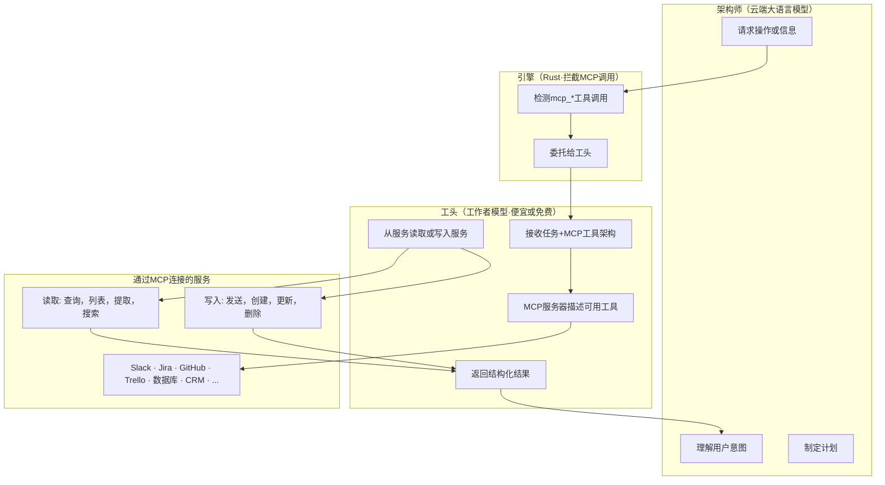

# 领班协议

**通过工作模型和自描述MCP访问 25,000+ 服务的双向通道**
*开源（MIT）。OpenPawz项目的一部分。*
---

## 问题

当一个人工智能智能体执行一个工具时——发送Slack消息、生成二维码、查询数据库——实际的API调用通常都很简单。昂贵的部分是云计算大模型在其周围处理的一切事务：阅读工具架构、推理参数格式化、生成结构性JSON参数以及解释结果。所有这些操作都消耗付费云代币。

对于发布Slack消息这一简单操作，Slack API本身是免费的。但是，云计算大模型需要处理工具架构，决定参数，格式化调用，等待结果，然后再向用户总结结果。每个步骤都会在您提供商的费率下消费代币。

现在将此乘以一个自动执行 50 条信息发送、创建 10 张票证以及更新 5 张电子表格的过程。云 API 的成本占主导地位——不是因为工具本身昂贵，而是因为 *关于如何调用它们的推理* 很昂贵。并且随着添加到智能体上下文中的工具而增加，这种成本会扩大。

### 扩展壁垒

更深层的问题是，传统架构要求云大模型将工具框架保留在其上下文窗口中以调用它们。随着集成的增长，这完全会瓦解：

- 具有 10 个工具的小聊天机器人 —— 可管理的上下文开销
- 具有 400+ 内置工具的平台 —— 仅框架就显著消耗上下文
- 连接到 25,000+ 集成的系统 —— 无法加载到任何上下文窗口

即使加载一个子集也意味着每次工具调用都要通过堆栈中最昂贵的模型进行，而这些工作不需要前沿智能。格式化一个 JSON-RPC 调用并不是需要 GPT-4 或 Claude Opus 的任务。

---

## 发明

领班协议将智能体分成两个角色：

- **建筑师** (云端大模型): 规划、推理、与用户交谈. 决定 *需要发生什么*。
- **领班** (工作者模型): 与外部服务接口. 处理 *它是如何发生的* —— 既读又写. 可以是本地 Ollama 模型 (零成本) 或便宜的云端模型 (例如 gemini-2.0-flash、gpt-4o-mini、claude-haiku —— 架构师成本的一小部分).

关键在于 **MCP 的自描述架构**。当领班连接到 MCP 服务器 (n8n) 时，服务器告诉它确切可用的工具及调用方式——参数名称、类型、描述、示例。领班不需要对 Slack、Trello 或任何集成的预训练知识。MCP 在运行时提供指令手册。

### 双向，而不是单向流程

领班不是一个序列中的一次性执行器。它是您的智能体与所有已连接服务之间的 **双边桥梁**。它可以：

- **读取** — 查询数据库，列出 Slack 频道，获取开放的 Jira 票据，检查 GitHub PR 状态
- **写入** — 发送消息，创建票据，更新电子表格，发布到 webhook
- **一次任务中两项操作** — 读取开放票据，然后将汇总发布到 Slack

而且它不需要是流程或自动化链的一部分。智能体可以在对话的任何时间点访问任何连接的服务，由于任意原因——回答问题，核查事实，在决策之前拉取上下文。没有预定的序列。如果您连接了 Slack、Jira、数据库、CRM——智能体可以通过领班随时获得所有服务的实时双向访问。

这是它与 Zapier 或 Make 等自动化平台根本不同的原因，后者中你只能建立*流程*——预定义的步骤序列。有了领班协议，智能体实时决定它需要什么信息以及采取什么行动，在当前对话相关的任何服务能力方面伸缩。



### 示例

工头以相同方式处理读取和写入 —— 任一方向上都只是一个工具调用：

**读取（查询信息）：**
> *"我在 Jira 中有哪些未完成的任务？"*
> → 架构师决定它需要 Jira 数据 → 工头通过 MCP 查询 Jira → 返回票据列表 → 架构师向用户总结

**写入（执行操作）：**
> *"向 Slack 上的 #general 发送 '你好'"
> → 架构师决定发布消息 → 工头通过 MCP 调用 Slack → 发送消息 → 架构师确认

**对话中两者兼备：**
> *"总结我的未完成 GitHub PR 并将其摘要发布到 Slack 上的 #engineering"*
> → 架构师规划两项步骤 → 工头从 GitHub 读取，然后写入 Slack → 架构师呈现结果

**即刻访问（无流程，无序列）：**
> *"我 Slack 中有多少未读消息？"*
> → 智能体只需进入 Slack，检查，再回答。无自动化。无工作流。只有一个来自实时数据源的问题回答。

架构师从未看到 MCP 架构。工头从不推理用户意图。每个模型只做适合它的事。

---

## 为什么自描述 MCP 是关键

没有自描述工具架构，领班协议无法工作。以下是原因：

**传统工具执行：** LLM 必须将其上下文中的工具架构已知，以了解如何调用它。由于潜在的数千集成，您无法在任何上下文窗口中适应它们所有的架构。

**与 MCP 一起：** 领班连接到 MCP 服务器并询问 *"您有什么工具？"* n8n 的 MCP 服务器使用工作流程级别的工具（`search_workflows`, `execute_workflow`, `get_workflow_details`）及其完整架构作出响应。领班使用这些来查找和执行正确的作业流程。

没有预先训练。没有静态配置。没有上下文窗口超载。

这意味着：
- **任何新的 n8n 社区节点都是可访问的** —— 安装 npm 包，Paw 自动部署作业流程，领班可以执行它
- **每个服务零配置** —— 没有提示工程，没有少量示例，没有微调
- **任何模型工作** —— 只要领班遵循 JSON-RPC 格式，任何代码能力模型都能做到
- **读取与写入一样自然** —— 查询数据库和发送 Slack 消息都通过 `execute_workflow` 路径

---

## 这改变了什么

### 成本结构颠倒了

在传统的智能体架构中，云模型处理所有内容——意图、规划、工具格式化、执行、响应。您为所有这一切支付云费用。

使用领班协议，云模型仅处理意图和规划。所有服务交互——读取和写入——都被委托给便宜的工作人员模型。架构师只为实际需要前沿智能的令牌付费——理解用户并决定做什么。与外部服务接口的机械工作转移到一个只需要一小部分成本——或者如果在 Ollama 上本地运行，则完全免费。

节省随使用量扩展。您的代理与连接服务的交互越多，您就能节省更多——因为本应燃烧预付令牌的每一次读取和写入都由堆中代价最小且有能力的模型处理。

### 与自动化平台对比

| 平台 | 人工智能驱动？ | 工具执行成本 | 集成 | 双向？ |
|----------|------------|---------------------|--------------|----------------|
| **OpenPawz（工头）** | 是——自然语言 | 免费（本地）或便宜（云端） | 25,000+ | 是——读取 + 写入，任何时间 |
| **Zapier** | 部分 | 按任务定价 | 7,000 | 否——预定义流程 |
| **Make** | 否 | 按操作定价 | 2,000 | 否——预定义流程 |
| **n8n 独立版** | 否——手动工作流 | 免费（自托管） | 400+ 内置 | 否——预定义流程 |

OpenPawz 是唯一一个你可以这样说的平台："我的 GitHub 开放 PR 是什么，以及将其摘要发布到 Slack 的 #engineering 频道？"并让它生效——使用自然语言、AI 驱动的执行、双向服务访问以及跨越 25,000+ 集成的本地工具执行。

---

## 关键设计决策

### 1. 拦截，而非路由

领班协议嵌入在主要 agent 循环的 `execute_tool()` 路径中。任何 `mcp_*` 工具调用都会被自动拦截——架构师无需知晓领班的存在。这意味：
- 不需要更改 agent 提示或系统指令
- 适用于任何云提供商
- 如果未配置工作模型则透明回退

### 2. 迷你 Agent 循环（最多 8 轮）

领班运行受限制的 agent 循环——最多 8 轮的工具调用。这处理了多步任务（例如，查询数据库 → 格式化结果 → 发布到 Slack）和多次读取场景（例如，检查 Jira + 检查 GitHub + 检查 Slack），而不会导致无限循环风险。

### 3. 无递归

领班不能生成子工作者或委托给其他代理。它接收一个任务，执行 MCP 工具，返回结果。这可防止失控的委托链。

### 4. 直接 MPC 执行

领班直接通过 JSON-RPC 调用 MPC 服务器——它不会通过引擎的 `execute_tool()` 路径。这防止工作者的 MPC 调用再次被拦截（无限循环）并保持执行路径简单。

### 5. 优雅回退

如果在 **设置 → 模型 → 模型路由** 中未配置 `worker_model`，MCP 工具调用将像以前一样通过 JSON-RPC 直接执行。领班协议是附加的——它提高成本效率但并非必要。

---

## 实现

Foreman 协议在 OpenPawz Rust 引擎中实现：

| 文件 | 目的 |
|------|------|
| `engine/tools/worker_delegate.rs` | 核心模块 — `delegate_to_worker()`, `run_worker_loop()`, `execute_worker_tool()` |
| `engine/tools/mod.rs` | MCP 拦截点在 `execute_tool()` |
| `engine/mcp/registry.rs` | MCP 工具架构发现 |
| `engine/mcp/client.rs` | JSON-RPC 工具执行 |
| `commands/ollama.rs` | 工作模型管理 (pull, Modelfile) |

### 核心流程（简化版）
```rust
// 在 execute_tool() — MCP 路径中
if tool_name.starts_with("mcp_") {
    // 首先尝试 Foreman 委托
    if let Some(result) = delegate_to_worker(
        tool_name, tool_args, engine_state
    ).await? {
        return Ok(result); // Foreman 在本地处理
    }
    // 回退: 直接 JSON-RPC 执行
    registry.execute_tool(tool_name, tool_args).await
}

// delegate_to_worker 检查是否已配置 worker_model
// 如果找到: 使用工作模型 (任何提供商) 生成迷你智能体循环
// 如果未找到: 返回 None (回退到直接执行)
```

### 工作模型设置（Ollama 示例）

当使用本地 Ollama 模型时，Foreman 可以使用基于 `qwen2.5-coder:7b` 构建的自定义 Modelfile：
```dockerfile
FROM qwen2.5-coder:7b
SYSTEM 你是精确的工具执行器。给定一个任务和可用的 MCP 工具，
执行正确的工具调用并返回结果。简洁一点。
PARAMETER temperature 0.1
PARAMETER num_ctx 8192
```

低温确保结构化的、确定性的工具调用。7B 参数模型足以为可靠的 JSON-RPC 格式，但足够小可以在消费者硬件上运行。

---

## 模型要求

Foreman 可以运行 **任何提供商的任何模型**:

- **本地 (Ollama)**: 默认 `qwen2.5-coder:7b` 大约需要 5GB 磁盘，可在 8+GB RAM (CPU) 或 5+GB VRAM (GPU) 畅快运行。在苹果芯片 (M1+) 上，推理速度快到足以让工具执行感觉即时。零 API 成本。
- **云端 (任何提供商)**: 使用现有提供商的便宜模型 —— `gemini-2.0-flash`, `gpt-4o-mini`, `claude-haiku-4-5`, `deepseek-chat`。无需本地硬件。适合无法运行 Ollama 的企业环境。

---

## 尝试一下

### 选项 A: 本地工作器 (Ollama — 免费)

```bash
ollama pull qwen2.5-coder:7b
```

1. 前往 **设置 → 高级 → Ollama** 并点击 **设置工作智能体**
2. 在 **设置 → 模型 → 模型路由** 中，将工作模型设置为 `worker-qwen`

### 选项 B: 云端工作器 (任何提供商 — 便宜)

1. 前往 **设置 → 模型 → 模型路由**
2. 设置你的主管模型（例如 `gemini-3.1-pro-preview`, `gpt-4o`, `claude-opus-4-6`）
3. 将你的工作者模型设置为相同或不同提供商的便宜模型（例如 `gemini-2.0-flash`, `gpt-4o-mini`, `claude-haiku-4-5`）
4. 使用预设芯片快速设置

### 使用方法

正常聊天即可。当你的智能体调用任何 MCP 工具时，Foreman 会自动处理执行：
>
> "为 https://openpawz.ai 生成二维码"
>
> *主管确定任务 → 图书馆员查找 n8n 二维码节点 → 通过 MCP 由 Foreman 执行 → 返回二维码——工具执行由工作模型完成，而不是昂贵的主管模型。*

---

## 与图书馆员方法的关系

Foreman 协议和 [图书馆员方法](/reference/librarian-method) 是解决同一问题不同部分的补充创新：

| | 图书管理员方法 | 领班协议 |
|--- |--- |--- |
| **解决方案** | 大规模工具发现 | 服务访问成本和双向访问 |
| **答案问题** | *哪一个* 工具要使用？ | *如何* 在没有云成本的情况下访问任何服务？ |
| **使用模型** | 任何嵌入模型（例如 `nomic-embed-text` 本地，或云嵌入 API） | 任何便宜模型（本地或云） |
| **可以独立工作吗？** | 是 | 是 |
| **更好一起？** | 图书管理员找到合适工具，然后领班免费执行它 |

结合起来，它们使一个智能体能够发现并执行 25,000+ 集成，花费接近零成本通过自动部署的工作流程——这是任何其他 AI 智能体平台都无法实现的。

---

## 与智能体执行架构的关系

领班协议降低了每次工具调用的成本。[智能体执行架构](/reference/agent-execution-roadmap)减少了调用的*数量*：

- **第 0 阶段 (Action DAG)** — 通过 DAG 计划并行运行多个由领班执行的工具，削减排队时间
- **第 1 阶段 (约束解码)** — 主管工具调用 JSON 是有效的保证，消除重试循环，这浪费了领班周期
- **第 4 阶段 (推测执行)** — 在领班需求前预热 MCP 端点连接，减少了每次工具调用 200–800 毫秒

领班处理*如何*廉价执行；执行管道处理*何时*和*多少次*。

---

## 许可证和归属

领班协议是 **OpenPawz** 的一部分，并根据 **MIT 许可证** 发布。您可以在任何项目中免费使用、修改和重新分发此技术，商业或非商业均可。署鸣感谢但非必需。

如您在学术论文或技术写作中引用此作品：

> OpenPawz (2025). "The Foreman Protocol: Zero-Cost Tool Execution via Local Models and Self-Describing MCP." https://github.com/OpenPawz/openpawz

</content>
