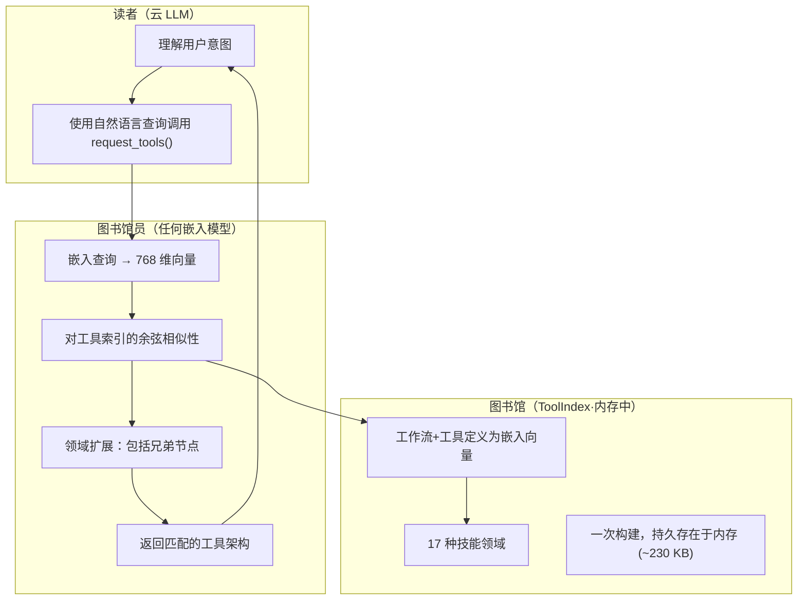

# 图书管理员方法

**通过嵌入实现意图驱动的工具发现**

*开源（MIT许可证）。OpenPawz项目的一部分。*

---

## 问题

每个 AI 智能体平台都会面临相同的扩展障碍: **工具膨胀**。

一个可以发送电子邮件、管理文件、查询数据库、生成图像、发布到 Slack 和交易加密货币的智能体需要将数十个工具定义注入到其上下文窗口中。当您连接到像 n8n 这样拥有数千个可用工作流和集成的自动化引擎时，这就会变得灾难性——您根本无法将所有那些工具架构放入一个32K甚至128K的上下文窗口中。

传统方法都有致命缺陷：

| 方法 | 问题 |
|----------|---------|
| **加载所有工具** | 在扩展时不可行。数百个工作流程定义将消耗过多令牌。 |
| **通过关键字预筛选** | 脆弱的。"向 John 发送消息"——这是电子邮件、Slack、短信、WhatsApp 还是 Telegram？关键字过滤器猜测错误。 |
| **分类菜单** | 需要用户提供他们的请求所属类别。打破了自然语言互动。 |
| **静态工具集每智能体** | 限制每个智能体的能力。击败了通用平台的目的。 |

根本问题：**系统在 LLM 之前决定哪些工具相关，是在解决错误的问题。** 只有 LLM 知道用户真正想要什么。

---

## 发明

图书管理员方法颠覆了这个问题。不是让系统猜测要加载哪些工具，**智能体本身要求所需的工具**——在理解了用户的意图之后。

这个比喻是字面意义的：一个图书馆读者（智能体）走到图书管理员面前并描述他们需要什么。图书管理员找到正确的书籍。读者永远不需要知道杜威十进制分类法。

### 三种角色



| 角色 | 实现 | 成本 |
|------|----------------|------|
| **读者** | 云 LLM (Gemini, Claude, GPT) | 按令牌计费（付费）|
| **图书管理员** | 任何嵌入模型 (例如使用 Ollama `nomic-embed-text` 本地，或云嵌入 API) | 本地 $0 / 云低费用 |
| **_library** | 内存 `ToolIndex` 具有预计算的嵌入 | 约 230 KB RAM |

### 工作原理——逐轮

```
第 1 轮: 用户说 "给 John 发送有关季度报告的邮件"
  ┌─ 智能体拥有：小集合的核心工具 (memory, filesystem, identity, request_tools)
  ├─ 智能体理解意图：需要邮件功能
  └─ 智能体调用：request_tools({"query": "发送邮件功能"})

  ┌─ 图书管理员将"发送邮件功能"嵌入到 → 向量
  ├─ 对工具索引进行余弦相似性搜索
  ├─ 最佳匹配：email_send, email_read
  └─ 域扩展：email_send → 同样返回 email_read（兄弟节点）

第 2 轮：工具热加载到本轮
  ┌─ 智能体现在拥有：核心工具 + email_send + email_read
  ├─ 智能体调用：email_send({to: "john@...", subject: "Q4 报告", ...})
  └─ 完成 ✅

智能体仅使用了它所需的工具，
而非在其上下文窗口中携带每个可用的工具定义。
```

---

## 关键设计决策

### 1. 智能体驱动的发现

LLM 形成搜索查询，而不是预过滤器从原始用户消息中猜出。这是关键的洞察——智能体有**解析的意图**，所以它对图书管理员的查询是精确且上下文相关的。

当用户说 "你能检查一下部署是否通过了吗？" 时，关键词过滤器可能会匹配 `deploy`、`check` 或 `container`。智能体理解意图是监控并调用 `request_tools("部署状态监控CI/CD")`——一个更好的搜索查询。

### 2. 领域扩展

当图书管理员找到 `email_send` 时，它也会返回 `email_read` —— 来自相同领域的工具一起传送。这可以防止智能体需要第二次 `request_tools` 调用来发现相关功能。

17 个领域：
`system` · `filesystem` · `web` · `identity` · `memory` · `agents` · `communication` · `squads` · `tasks` · `skills` · `dashboard` · `storage` · `email` · `messaging` · `github` · `integrations` · `trading`

### 3. 轮次承载

在轮次 N 加载的工具在同一次聊天回合中仍然在轮次 N+1 可用。智能体不会失去刚发现的工具访问权限。在聊天回合之间清除工具以防止陈旧积累。

### 4. 群体绕行

编排/群体智能体完全跳过工具 RAG 并提前收到所有工具。这些智能体是自主运行的，没有交互式发现——`request_tools` 调用的开销会不必要地减慢它们。

### 5. 多层次回退

如果语义搜索返回没有结果:
1. **精确名称匹配** —— 直接工具名称查找
2. **域匹配** —— 将所有来自命名域的工具都加载
3. **全领域列表** —— 返回可用域的列表以便智能体可以细化其查询

智能体总是会得到一些有用的东西。

---

## 为什么这个新颖

据我们研究，以下五个属性的结合在任何之前的系统中均未出现过：
| 属性 | 描述 |
|----------|-------------|
| **智能体表述的意图** | 大语言模型在理解用户意图后编写搜索查询——而不是对原始输入的预过滤 |
| **本地嵌入** | 通过本地模型（例如 Ollama）或低成本云嵌入 API 实现零成本语义搜索 |
| **按需热加载** | 工具注入到活动智能体回合中，而不是预配置 |
| **领域扩展** | 自动包含兄弟工具以减少来回次数 |
| **规模无关** | 无论你有 50 个工具还是 50,000 个，效果都一样 |

### 先前研究比较

存在关于 LLM 工具检索（ToolGen, ICLR 2025; ToolWeaver, ICLR 2026; ToolkenGPT, NeurIPS 2023）的研究，但这些系统关注于微调LLM以生成工具token或在工具文档上训练检索模型。需要高成本的训练流水线，且不能平稳扩展。

图书管理员方法需要**零训练**。它使用现成的嵌入模型（例如 `nomic-embed-text`，OpenAI `text-embedding-3-small`，或任何产生向量嵌入的模型），并适用于工具索引中的任何添加的工具——包括在嵌入模型训练时不存在的工具。

---

## 为什么这对成本和上下文重要

没有图书管理员，每个请求都会在上下文窗口中携带可用工具定义的完整集合。在图书管理员的帮助下，只有当前任务的相关工具被加载——通常是几个而不是几十个或几百个。

这有两个复合效应：

1. **较低的标记用量** —— 较少的工具定义意味着每个请求消耗的标记较少，这直接降低了 API 成本，无论您使用哪个提供商或模型。
2. **为对话留出更多空间** —— 从工具架构中释放的上下文窗口空间可用于实际对话、内存、推理和技能指令。

嵌入搜索本身由任何您配置的嵌入模型驱动。通过 Ollama 运行本地是免费的；像 OpenAI 的text-embedding-3-small这样的云嵌入 API 每次查询成本不到几分之一美分。

---

## 实施

图书管理员方法在OpenPawz Rust引擎的五个文件中实现：

| 文件 | 用途 |
|------|---------|
| `engine/tool_index.rs` | `ToolIndex` 结构体 — 嵌入存储，余弦相似性，领域映射 |
| `engine/tools/request_tools.rs` | `request_tools` 元工具 — 智能体界面的图书管理员调用 |
| `engine/chat.rs` | `build_chat_tools()` — 过滤工具列表为核心 + 加载的工具 |
| `engine/agent_loop/mod.rs` | 在回合之间热加载新发现的工具 |
| `engine/state.rs` | `tool_index` + `loaded_tools` 在 `EngineState` 上 |

### 核心流程（简化版）

```rust
// 1. 智能体用自然语言查询调用 request_tools
fn request_tools(query: &str, state: &EngineState) -> Vec<ToolDef> {
    let index = state.tool_index.lock();

    // 2. 使用 Ollama（nomic-embed-text）嵌入查询
    let query_embedding = ollama_embed(query); // ~50ms, $0

    // 3. 对所有索引工具进行余弦相似性搜索
    let matches = index.search(query_embedding, threshold: 0.5);

    // 4. 领域扩展 — 包括兄弟工具
    let expanded = index.expand_domains(matches);

    // 5. 返回工具定义以供热加载
    expanded
}
```

`ToolIndex` 在第一次`request_tools`调用时惰性构建——所有注册的工具（内建 + MCP）都被嵌入和储存为向量。后续搜索纯粹是对内存索引的向量运算。

---

## 尝试

图书管理员方法默认在 OpenPawz 中处于激活状态。除了确保可用的嵌入模型之外，无需额外配置。为了零成本的本地操作，请运行带有安装的 `nomic-embed-text` 的 Ollama：

```bash
ollama pull nomic-embed-text
```

然后要求您的智能体执行需要特定工具的操作：

> "检查我的 GitHub 通知"
>
> *智能体调用 `request_tools("GitHub notifications")`，图书管理员找到 `github_notifications` 和 `github_list_repos`，智能体继续——携带仅需的工具而不是所有可用工具。*

---

## 与智能体执行架构的关系

图书管理员方法通过内存中的嵌入向量发现工具。[智能体执行架构的二阶段](/reference/agent-execution-roadmap) 通过 **持久化工具注册表** 延伸这——`PersistentToolRegistry` 使用 SQLite（`tool_embeddings` 表）备份嵌入索引，并添加四层搜索回退：

1. **向量相似性** — 在持久化嵌入上进行余弦搜索
2. **BM25 全文** — SQLite FTS5 关键词匹配
3. **领域扩展** — 同一技能领域的兄弟工具
4. **关键词回退** — 在工具名称/描述上进行子串匹配

图书管理员的内存中 `ToolIndex` 仍然是热门路径。持久化工具注册表增加了重启的耐久性，并在亚 100 毫秒内发现 10 万+ 工具。

---

## 版权与归属

图书管理员方法是 **OpenPawz** 的一部分，并在 **MIT 许可证** 下发布。您可以自由地在任何项目中使用、修改和重新分发此技术，无论商业与否。署名表示感谢但不是必须的。

如果您在学术论文或技术写作中引用此工作：

> OpenPawz (2025). "The Librarian Method: Intent-Stated Tool Discovery via Local Embeddings." https://github.com/OpenPawz/openpawz

</content>
