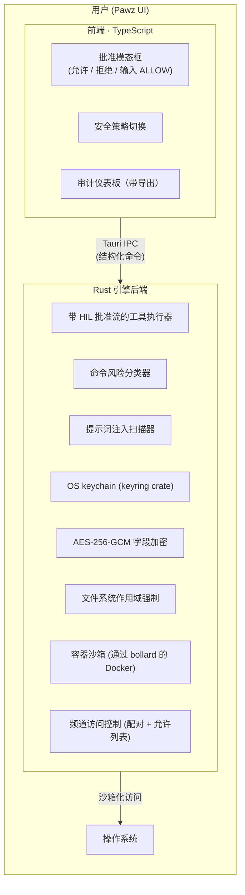

# 安全性

Pawz 是一个 Tauri v2 桌面 AI 代理。每个系统调用在到达操作系统之前都通过 Rust 后端，使其成为所有安全控制的自然执行点。

## 信任一览

| 指标 | 值 |
|--------|-------|
| 自动化测试 | 1,128 (554 核心 + 508 应用 + 66 集成) + TypeScript |
| CI 作业 | 3 个并行 (Rust + TypeScript + 安全审计) |
| Clippy 警告 | 0 (通过 `-D warnings` 强制执行) |
| 已知 CVE | 0 (CI 中 `cargo audit` + `npm audit`) |
| 凭证加密 | AES-256-GCM (OS keychain + HKDF 每代理密钥派生) |
| 错误处理 | 12 变体类型化 `EngineError` 枚举 (无 `String` 错误) |
| 网络攻击面 | 零开放端口 (仅 Tauri IPC) |
| 内存加密层 | 3 (HKDF 每代理密钥 + SQL 作用域过滤 + 签名能力令牌) |

---

## 架构

**关键设计原则**：代理从不直接接触操作系统。每个工具调用都通过 Rust 工具执行器。只读工具（fetch、read_file、web_search 等）在 Rust 级别自动批准。副作用工具（exec、write_file、delete_file）发出 `ToolRequest` 事件 → 前端显示风险分类的批准模态框 → 用户决定 → `engine_approve_tool` 解决。

---

## 人机循环 (HIL) 批准

工具调用在 Rust 引擎级别分为两个层级：

**自动批准（无模态框）：** 只读和信息工具 — `fetch`、`read_file`、`list_directory`、`web_search`、`web_read`、`memory_search`、`soul_read`、`soul_write`、`self_info`、`email_read`、`slack_read`、`create_task`、`image_generate` 等。

**需要用户批准（显示模态框）：** 副作用工具 — `exec`、`write_file`、`append_file`、`delete_file`，以及所有交易写入操作（交换、转账）。批准模态框按风险对每个请求进行分类：

| 风险级别 | 行为 | 示例 |
|------------|----------|---------|
| **严重** | 默认自动拒绝；如果禁用自动拒绝则显示红色模态框，用户必须输入 "ALLOW" | `sudo rm -rf /`、`curl \| bash` |
| **高** | 橙色警告模态框 | `chmod 777`、`kill -9` |
| **中** | 黄色警告模态框 | `npm install`、出站 HTTP |
| **低** | 标准批准模态框 | 未知 exec 命令 |
| **安全** | 如果匹配允许列表（90+ 默认模式）则自动批准 | `git status`、`ls`、`cat` |

### 危险模式检测

跨多个类别的 58+ 模式：

- **权限提升** — `sudo`、`su`、`doas`、`pkexec`、`runas`
- **破坏性删除** — `rm -rf /`、`rm -rf ~`、`rm -rf /*`
- **权限暴露** — `chmod 777`、`chmod -R 777`
- **磁盘破坏** — `dd if=`、`mkfs`、`fdisk`
- **远程代码执行** — `curl | sh`、`wget | bash`
- **代码注入** — `eval`、`exec` 与不受信任的输入
- **进程终止** — `kill -9 1`、`killall`
- **防火墙禁用** — `iptables -F`、`ufw disable`
- **账户修改** — `passwd`、`chpasswd`、`usermod`
- **网络渗出** — `curl | cat`、`scp` 出站、`/dev/tcp`
- **反向 shell** — `bash -i >& /dev/tcp`、`nc -e`、`python -c import socket`、`ruby -rsocket`、`perl -e socket`、`php -r fsockopen`、`socat tcp-connect`、`ncat -e`、`telnet \| /bin/sh`、`openssl s_client`
- **数据暂存 / 渗出** — `base64` 通过管道传输到 `curl`/`nc`、`tar` 通过管道传输到 `curl`/`nc`、`xxd` 通过管道传输到 `curl`/`nc`、`gzip` 通过管道传输到 `curl`/`nc`
- **凭证收集** — `cat /etc/shadow`、`cat ~/.ssh/id_rsa`、`cat ~/.aws/credentials`、`security find-generic-password` (macOS Keychain 转储)

### 命令允许列表 / 拒绝列表

设置中的可配置正则表达式模式：
- **允许列表** — ~90+ 默认安全模式（git、npm、node、python、ls、cat 等）— 自动批准
- **拒绝列表** — 默认危险模式 — 自动拒绝
- **自定义规则** — 用户可以添加自己的正则表达式模式
- 模式在保存前验证；无效正则表达式被拒绝

### 会话覆盖

定时"允许所有"模式，具有可配置持续时间（30分钟、1小时、2小时）。权限提升命令即使在覆盖期间也被阻止。自动过期。可从设置横幅取消。

### 交易批准策略

金融工具（交换、转账）默认需要 HIL 批准。可配置的交易策略可以在限制内自动批准：

- **最大交易规模** — 每笔交易 USD 上限
- **每日损失限制** — 累计每日支出上限
- **允许的交易对** — 可交易交易对白名单
- **转账切换 + 上限** — 选择加入，每笔转账限制
- 适用于所有链：Coinbase、Solana (Jupiter)、EVM DEX (Uniswap)
- 只读交易工具（余额、报价、投资组合、价格）始终自动批准

---

## 提示词注入检测

双重实现（TypeScript + Rust）扫描 4 个严重级别的 30+ 注入模式。检测覆盖系统提示词、提取机密或操纵代理行为的尝试。

---

## 容器沙箱

通过 `bollard` crate 的基于 Docker 的沙箱：
- `cap_drop ALL` — 无 Linux 能力
- 内存和 CPU 限制
- 网络隔离可配置
- 每代理沙箱策略可配置

---

## 凭证安全

### OS Keychain
所有敏感凭证存储在平台 keychain：
- macOS: Keychain
- Linux: libsecret
- Windows: Credential Manager

配置文件包含 keychain 引用，从不包含明文机密。

### 数据库加密 — AES-256-GCM

敏感数据库字段使用 **AES-256-GCM** 通过 Web Crypto API (`crypto.subtle`) 在静态时加密。

**密钥管理：**
- 一个 256 位加密密钥存储在 OS keychain 中（macOS Keychain / Linux libsecret / Windows Credential Manager）
- Rust 后端通过 Tauri IPC 暴露 `get_db_encryption_key`，返回十六进制编码的密钥
- 前端使用 `crypto.subtle.importKey('raw', ..., 'AES-GCM')` 导入原始密钥字节
- 密钥仅保存在内存中（`CryptoKey` 对象）— 从不写入磁盘或 localStorage

**加密过程：**
1. 每个字段通过 `crypto.getRandomValues()` 生成一个新的 12 字节 IV
2. 明文被 UTF-8 编码并使用 `crypto.subtle.encrypt({ name: 'AES-GCM', iv })` 加密
3. IV 和密文连接并进行 base64 编码
4. 存储的值以 `enc:` 为前缀 — 例如 `enc:<base64(iv ‖ ciphertext)>`

**解密：** 以 `enc:` 开头的值被自动检测。解码载荷的前 12 字节提取为 IV，其余为密文，使用 `crypto.subtle.decrypt()` 解密。

**回退行为：** 如果 keychain 不可用，加密初始化失败并显示面向用户的错误对话框。凭证存储被阻止 — 应用继续运行，但不会默默以明文存储机密。

**适用于：** 频道凭证、API 令牌和存储在本地 SQLite 数据库（`paw.db`）中的其他敏感配置。

### 凭证审计跟踪
每个凭证访问记录到 `credential_activity_log`：
- 执行的操作
- 请求访问的工具
- 访问是允许还是拒绝
- 时间戳

### 企业加固

作为系统性企业审计的一部分，应用了以下加固措施：

- **XOR → AES-256-GCM**：技能凭证的原始 XOR 密码被替换为 AES-256-GCM。现有的 XOR 加密值在首次读取时自动迁移。11 个单元测试验证加密/解密往返和错误密钥拒绝。
- **移除静默回退**：缺失的 OS keychain 以前默默回退到明文存储。现在显示面向用户的错误并阻止凭证操作。
- **类型化错误处理**：所有引擎函数通过 `thiserror 2` 使用 12 变体 `EngineError` 枚举 — 引擎内部无 `Result<T, String>`。
- **带熔断器的重试**：提供者和桥接调用使用指数退避（基础 1s，最大 30s，3 次重试），支持 `Retry-After`。熔断器在 5 次连续失败后跳闸（60s 冷却）。
- **持久日志**：结构化日志文件，每日轮换和 7 天修剪。应用内日志查看器带过滤。
- **530 个自动化测试**：164 个 Rust 测试（14 个模块 + 4 个集成测试文件）+ 366 个 TypeScript 测试（24 个测试文件）覆盖所有安全关键路径。
- **3 作业 CI 管道**：每次推送运行 `cargo check` + `cargo test` + `cargo clippy -- -D warnings` + `cargo audit` + `npm audit`。
- **TLS 证书锁定**：所有提供者连接使用自定义 `rustls::ClientConfig`，仅锁定到 Mozilla 根证书。显式排除 OS 信任存储 — 被破坏或流氓系统 CA 无法拦截 API 流量。
- **出站请求签名**：每个 AI 提供者请求在传输前进行 SHA-256 签名（`provider ‖ model ‖ timestamp ‖ body`）。哈希记录到内存环形缓冲区（500 条目）用于篡改检测和合规审计。
- **内存加密（安全归零）**：提供者结构中的 API 密钥包装在来自 `zeroize` crate 的 `Zeroizing<String>` 中。当提供者被丢弃时，密钥内存使用 `write_volatile` 立即归零，以防止编译器进行死存储消除。
- **反取证 vault 大小量化（KDBX 等效）**：Engram 内存存储使用三种缓解措施防止文件大小侧信道泄露：
  1. **桶填充** — SQLite 数据库填充到 512KB 桶边界（通过 `_engram_padding` 表），以便观察文件的攻击者只能确定粗略的大小桶，而不是确切的内存计数。在每次 GC 周期后重新填充。这是 KDBX 内部内容填充的 SQLite 等效项。
  2. **安全擦除** — 内存删除是两阶段：内容字段在删除行之前用空值覆盖，防止从释放的 SQLite 页面或 WAL 重放中恢复明文。补充 `PRAGMA secure_delete = ON`。
  3. **8KB 页面 + 增量自动清理** — 更大的页面大小减少文件大小粒度；增量清理防止文件在删除后立即收缩（这会揭示删除计数）。

### Keychain 密钥管理

所有加密密钥在每个进程生命周期内从 OS keychain 读取**一次**，并使用加固模式缓存在内存中：

| 属性 | 实现 |
|----------|---------------|
| **缓存类型** | `RwLock<Option<Zeroizing<T>>>` — 并发读取器，独占写入器 |
| **锁定模式** | 双重检查锁定 — 获取写锁后，在访问 keychain 之前重新检查缓存（防止 TOCTOU 竞争） |
| **密钥生成** | `OsRng`（通过 `getrandom` 系统调用的内核 CSPRNG）用于所有 256 位密钥 — vault、DB、内存和审计签名密钥 |
| **归零化** | 所有缓存的密钥包装在 `Zeroizing<T>` 中（`zeroize` crate）— 通过 `write_volatile` 在丢弃时归零 |
| **中毒恢复** | 所有锁操作上的 `unwrap_or_else(\|e\| e.into_inner())` — 中毒的互斥锁从不导致应用崩溃 |
| **密钥长度验证** | 二进制密钥为 32 字节，十六进制编码密钥为 32+ 字符 — 拒绝截断或损坏的 keychain 条目 |
- **密码短语哈希** | 锁屏密码短语使用 **Argon2id** 哈希（内存困难、时间抵抗）。遗留 SHA-256 哈希透明验证以向后兼容。新密码短语始终使用 Argon2id |
| **密码短语比较** | Argon2id 验证在设计上是恒定时间的；遗留 SHA-256 回退使用 `subtle::ConstantTimeEq` |

这消除了正常操作期间的重复 macOS Keychain 密码提示（以前 keychain 在每个聊天轮次中被访问 5-20+ 次用于加密/解密操作）。

### SSRF 保护

`fetch` 工具在进行任何出站请求之前，针对内部和云元数据端点的阻止列表验证所有 URL：

- **环回** — `127.0.0.1`、`::1`、`localhost`
- **RFC-1918 私有范围** — `10.0.0.0/8`、`172.16.0.0/12`、`192.168.0.0/16`
- **链路本地** — `169.254.0.0/16`
- **云元数据** — `169.254.169.254`（AWS/GCP/Azure 实例元数据端点）

被阻止的请求向代理返回错误，而不进行任何网络调用。

### 审计链完整性 (HMAC)

安全审计日志中的每个条目使用 **HMAC-SHA256** 签名，使用存储在统一密钥 vault（`audit-chain` 目的）中的专用签名密钥，与所有加密密钥分开。签名密钥缓存在 `LazyLock<Option<Zeroizing<Vec<u8>>>>` 中，并在首次使用时用 `OsRng` 生成。每个审计条目的 HMAC 覆盖时间戳、类别、操作、代理 ID、会话 ID 和前一个条目的哈希 — 形成防篡改哈希链。链完整性可以通过 `verify_chain()` 端到端验证，该函数对所有哈希和签名检查使用 **恒定时间比较**（`subtle::ConstantTimeEq`）。

### 会话连续性证书 (SCC)

审计链证明会话内完整性，但需要单独的机制将会话链接在一起。**会话连续性证书** 解决了 *幽灵代理问题* — 攻击者在会话之间交换模型权重或目标，同时重用相同 OS keychain 凭证的风险。

在每次引擎启动时，签名的 SCC 发布，承诺：

| 字段 | 目的 |
|-------|---------|
| `model_id` | 配置的 LLM 模型 |
| `capability_hash` | 排序的 Tauri 能力集的 SHA-256 |
| `memory_hash` | 最新审计链条目的签名（锚定到审计状态） |
| `prior_cert_hash` | 前一个 SCC 的 HMAC（或首次启动时的创世哈希） |

SCC 使用专用密钥（统一密钥 vault 中的 `scc-signing` 目的）进行 HMAC-SHA256 签名。每个证书链接到前一个 — 链中的任何间隙或替换都可以通过 `scc::verify_chain()` 遍历证书来检测。验证使用恒定时间比较以防止时间侧信道。

这提供 **跨会话身份证明**：你可以加密证明会话 N 由与会话 N-1 相同的代理配置启动，或者准确检测链在哪里断裂。

### 代理间通信安全

通过 `agent_send_message` 在代理之间发送的所有消息在传递前扫描提示词注入。**内容**字段和**元数据**字段都独立扫描。具有高或严重注入严重性的消息被**阻止** — 防止受损代理通过精心设计的消息操纵其他代理，这些消息覆盖其指令。

### Worker 委托加固

Worker 代理（由编排器为委托子任务生成）在受限工具策略下运行：

- **被阻止的工具** — `exec`、`write_file`、`delete_file`、`append_file` 和所有交易写入操作从 worker 的工具集中移除
- **MCP 模式阻止** — 名称包含危险操作关键字（`exec`、`shell`、`run_command`、`terminal`、`system`、`write_file`、`delete_file`、`remove_file`、`rm_rf`、`rmdir`、`unlink`）的 MCP 工具在名称级别被阻止，防止流氓 MCP 服务器绕过直接工具阻止列表

### MCP 注册表注入扫描

从 MCP 工具执行返回的结果在**成功和错误路径**上都扫描提示词注入。这防止恶意 MCP 服务器在工具输出或错误消息中嵌入指令覆盖，这些将被转发到代理的上下文。

### 内存工具加固

`memory_store` 和 `memory_update` 工具强制：

- **失败关闭所有权** — 如果请求代理的 ID 缺失或为空，操作被拒绝（无静默回退到默认作用域）
- **字段大小限制** — 内容和元数据字段上限为 2,000 字符以防止上下文填充攻击

### Swarm 编排安全

多代理 swarm 子系统对所有共享状态使用原子操作：

- **全局运行计数器** — `AtomicU64`，使用比较并交换 (CAS) 进行递增；`Acquire`/`Release` 内存顺序确保跨线程可见性
- **过期运行 GC** — 定期垃圾收集删除超过 10 分钟的运行，以防止资源耗尽

### 事件 / Webhook 速率限制

事件分发系统在 webhook 触发器上强制基于冷却的速率限制以防止滥用：

- **冷却期** — 每事件可配置的最小触发间隔
- **基于前缀的匹配** — Webhook URL 模式使用前缀匹配以防止通过查询参数或路径后缀绕过

---

## Engram 内存安全

Engram 内存子系统对所有存储的代理记忆（情景、知识和程序性）应用深度防御。这保护用户数据，即使攻击者获得对 SQLite 数据库文件的访问。

### 字段级加密

包含个人身份信息 (PII) 的内存在存储前使用 **AES-256-GCM** 自动加密，使用专用密钥 vault 条目（`memory-vault` 目的），与凭证 vault 密钥分开。

**自动 PII 检测** 使用两层防御在存储前扫描内存内容的 17 种模式类型：

| # | 模式 | 示例 | 层级 |
|---|---------|---------|------|
| 1 | 社会安全号码 | `123-45-6789`、`123456789` | 机密 |
| 2 | 信用卡号 | `4111-1111-1111-1111` | 机密 |
| 3 | 电子邮件地址 | `user@example.com` | 敏感 |
| 4 | 电话号码 | `+1-555-0123` | 敏感 |
| 5 | 国际电话号码 | `+44 20 7946 0958` | 敏感 |
| 6 | 物理地址 | 街道地址模式 | 敏感 |
| 7 | 人名 | `Mr./Mrs./Dr.` 前缀名称 | 敏感 |
| 8 | 地理位置 | 城市/州/国家模式 | 敏感 |
| 9 | 政府ID | 护照、驾照 | 机密 |
| 10 | JWT 令牌 | `eyJhbGciOi...` (header.payload.signature) | 机密 |
| 11 | AWS 访问密钥 | `AKIA...` (20 字符密钥 ID) | 机密 |
| 12 | 私钥 (RSA/EC/DSA) | `-----BEGIN ... PRIVATE KEY-----` | 机密 |
| 13 | IBAN | `GB82 WEST 1234 5698 7654 32` | 机密 |
| 14 | IPv4 地址 | `192.168.1.1` | 敏感 |
| 15 | 通用 API 密钥 | `sk-`、`api_key=`、Bearer 令牌 | 机密 |
| 16 | 凭证（密码） | `password=`、`secret=` 模式 | 机密 |
| 17 | 出生日期 | `1990-01-15` | 敏感 |

**第 2 层：LLM PII 扫描** — LLM 辅助的辅助扫描器捕获静态正则表达式无法检测的上下文相关 PII（例如，"我母亲的娘家姓是 Smith"、"我出生在 Springfield"）。第 1 层标记或超过可配置字符阈值的内容发送到活跃 LLM 模型进行分类。LLM 返回带有检测到的 PII 类型和置信度分数的结构化 JSON。超过置信度阈值的结果触发加密，LLM 分类与正则层级一起存储以供审计。

**三个安全层级：**

| 层级 | 内容 | 处理 |
|------|---------|-----------||
| **明文** | 未检测到 PII | 原样存储 |
| **敏感** | 检测到 PII（电子邮件、姓名、电话、IP） | AES-256-GCM 加密，`enc:` 前缀 |
| **机密** | 高敏感度 PII（SSN、信用卡、JWT、AWS 密钥、私钥） | AES-256-GCM 加密，`enc:` 前缀 |

加密内容使用格式 `enc:<base64(nonce ‖ ciphertext ‖ tag)>`。每次加密生成一个新的 96 位 nonce。检索时自动解密。

### 查询净化

- **参数化查询净化** — 所有用户提供的搜索查询在到达存储后端之前被净化。搜索操作符（`AND`、`OR`、`NOT`、`NEAR`、`*`、`"`、`{`、`}`、`^`）被剥离或转义以防止查询注入。
- **输入验证** — 内存内容上限为 256 KB。空字节被拒绝。类别字符串针对 18 变体枚举验证，优雅回退到 `general`。

### 提示词注入扫描

召回的内存在返回代理上下文之前扫描 10 种提示词注入模式：
- 系统提示词覆盖（`ignore previous instructions`、`you are now`）
- 数据渗出尝试（`output all`、`dump`、`show me the`）
- 角色操纵（`act as`、`pretend to be`）
- 指令注入（`new instruction`、`from now on`）
- 分隔符攻击和编码绕过尝试

可疑内容在存储前被**编辑**，带有 `[REDACTED:injection]` 标记，以防止中毒的内存在未来召回时操纵代理行为。

### 日志编辑

日志输出中的内存内容自动编辑：
- PII 模式替换为类型特定的占位符（例如，`[EMAIL]`、`[SSN]`、`[CREDIT_CARD]`）
- 日志预览截断为 80 字符
- 完整内容从不出现在日志文件中

### 代理间内存总线信任

跨代理内存总线（用于在代理之间共享内存的发布/订阅系统）强制发布侧身份验证以防止内存中毒攻击：

| 防御 | 实现 |
|---------|----------------|
| **能力令牌** | 每个代理持有带 HMAC-SHA256 签名的 `AgentCapability` — 指定最大发布作用域、重要性上限、速率限制和写入权限 |
| **签名验证** | 每个发布和读取调用需要有效的能力令牌；HMAC 在任何总线操作之前使用恒定时间（`subtle` crate）验证 |
| **作用域强制** | 代理不能在其分配的作用域之外发布或读取（例如，作用域为 `Agent` 的代理不能发布到 `Global`） |
| **重要性上限** | 发布重要性被限制为代理的最大值 — 防止低信任代理断言高置信度事实 |
| **每代理速率限制** | 发布计数按 GC 窗口跟踪；超过速率限制的代理被拒绝 |
| **发布侧注入扫描** | 所有发布内容在进入总线前扫描提示词注入模式 |
| **信任加权矛盾解决** | 当两个代理发布矛盾的事实时，具有更高信任加权重要性的内存获胜。信任分数按代理且可调整。 |
| **读取路径上的签名作用域令牌** | 每个 `gated_search()` 调用验证签名的能力令牌：(1) HMAC 签名完整性，(2) 身份绑定（令牌 agent_id == 请求者），(3) 作用域上限检查，(4) squad/project 成员验证 |

**威胁模型：**

| 攻击 | 缓解 |
|--------|------------|
| 受损代理用中毒内存淹没总线 | 速率限制 + 发布侧注入扫描 |
| 低信任代理覆盖高信任事实 | 信任加权矛盾解决 — 较低信任分数降低有效重要性 |
| 代理在其授权作用域之外发布 | 作用域上限强制 — 如果作用域超过能力则发布被拒绝 |
| 伪造能力令牌 | HMAC-SHA256 针对平台持有的密钥验证 |
| 未授权的跨代理内存读取 | 带 4 步验证的签名读取路径令牌（签名、身份、作用域上限、成员资格） |

### 每代理密钥派生 (HKDF)

每个代理的内存使用 **唯一派生密钥** 加密，使用 HKDF-SHA256 域分离。OS keychain 中的单个主密钥产生三个独立的密钥族：

| 域 | HKDF Salt | 目的 |
|--------|-----------|----------|
| 代理加密 | `engram-agent-key-v1` | 每代理 AES-256-GCM 内存加密 |
| 快照 HMAC | `engram-snapshot-hmac-v1` | 工作内存快照的篡改检测 |
| 能力签名 | `engram-platform-cap-v1` | 能力令牌的 HMAC-SHA256 签名 |

这意味着：即使攻击者破坏了一个代理的派生密钥，其他代理的内存仍然加密隔离。没有主密钥，跨代理解密在**数学上不可能**。

### 密钥版本控制和轮换

加密内容以前向兼容升级的版本标签（`enc:v1:`）为前缀。自动密钥轮换调度程序在可配置间隔（默认：90 天）上运行，并使用新的 HKDF 派生密钥重新加密所有代理内存。轮换是原子的 — 如果任何重新加密失败，整个批次回滚。

### 快照 HMAC

工作内存快照（在代理切换或会话结束时保存）包括通过序列化快照内容计算的 HMAC-SHA256 完整性标签。恢复时，HMAC 在加载快照之前验证 — 被篡改的快照被拒绝并记录。

### GDPR 删除权

通过 `engine_memory_purge_user` Tauri 命令符合第 17 条：
- 接受用户标识符列表（姓名、电子邮件、用户名）
- 安全删除情景、知识和程序性内存表中的所有匹配记录
- 清除工作内存快照和审计日志条目
- 两阶段删除：行删除前内容归零
- 返回已删除记录计数以供合规报告

---

## 反固着防御 (§59)

五层防御防止代理忽略用户指令或卡在旧主题：

| 防御 | 层 | 描述 |
|---------|-------|-------------|
| **响应循环检测** | 前轮次 | Jaccard 相似性、问题循环、主题固着检查与系统重定向注入（现在在所有频道上激活，不仅是聊天 UI） |
| **用户覆盖检测** | 前轮次 | 检测显式停止/重定向命令（"stop"、"focus on my question"、"that's not what I asked"）与 3 级升级 |
| **单向主题忽略** | 前轮次 | 在先前的重定向后捕获独特但错误的响应 — 当模型的响应与用户关键字零实体重叠时触发 |
| **动量清除** | 认知 | 在主题切换时清除工作内存轨迹嵌入，以便召回的上下文服务于新主题 |
| **工具调用循环破坏器** | 循环内 | 基于哈希的签名检测在 3 次连续匹配后停止重复的相同工具调用 |

---

## 文件系统沙箱

### Tauri 作用域
通过 Tauri 能力（`capabilities/default.json`）作用域文件系统访问。IPC 文件系统作用域缩小到仅 **`$APPDATA`** 和 **`/tmp/openpawz/`** — `$HOME` 被显式排除。Shell 访问仅限于 `open` 命令。

### 敏感路径阻止
从项目文件浏览中阻止 20+ 敏感路径：
`~/.ssh`、`~/.gnupg`、`~/.aws`、`~/.kube`、`~/.docker`、`/etc`、`/root`、`/proc`、`/sys`、`/dev`、文件系统根、主目录根。

### 每项目作用域
文件操作针对活动项目根验证。路径遍历被阻止。违规记录到安全审计。

### 只读模式
安全策略中的切换阻止所有代理文件系统写入工具（创建、编辑、删除、移动、chmod 等）。

---

## 频道访问控制

11 个频道桥接中的每一个支持：
- **DM 策略** — 配对 / 允许列表 / 开放
- **配对批准** — 新用户发送请求 → 在 Pawz 中批准 → 发回确认
- **每频道允许列表** — 特定用户 ID
- **每代理路由** — 配置哪些代理处理哪些频道

---

## 网络安全

### 内容安全策略 (CSP)
`tauri.conf.json` 中的限制性 CSP：
- `default-src 'self'`
- `script-src 'self'` — 无外部脚本
- `connect-src 'self'` + localhost WebSocket 仅
- `object-src 'none'`
- `frame-ancestors 'none'`

### 网络请求审计
出站工具调用被检查渗出模式。URL 提取和域分析带审计日志。

### 出站域允许列表
可配置的允许/阻止列表，带通配符子域匹配。在 `execute_fetch` 工具处理器中强制。设置中的测试 URL 按钮。

---

## 技能审查

在每次技能安装前：
1. **安全确认模态框** — 显示安全检查
2. **已知安全列表** — 社区审查的技能名称内置集
3. **npm 注册表风险情报** — 获取下载计数、最后发布日期、弃用状态、维护者计数、许可证
4. **风险分数显示** — 确认对话框中的可视化风险面板
5. **安装后沙箱检查** — 验证技能元数据中的可疑工具注册（`exec`、`shell`、`eval`、`spawn`）

---

## 审计仪表板

统一安全审计日志（`security_audit_log` 表）捕获所有安全相关事件：
- 事件类型、风险级别、工具名称
- 命令详情
- 会话上下文
- 决定（允许/拒绝）
- 匹配模式

按类型、日期和严重性过滤。导出为 JSON 或 CSV。

---

## 报告漏洞

如果你发现安全漏洞，请通过直接向维护者发送电子邮件而不是打开公共问题来负责任地报告。有关详细信息，请参阅存储库的联系信息。
