# Project Engram — 记忆架构白皮书

*一种生物启发的持久化AI代理记忆系统。*

**版本:** 1.0
**状态:** 已在 OpenPawz 中实现
**许可证:** MIT

---

## 摘要

Project Engram 是一种面向桌面AI代理的三层记忆架构。它取代了扁平的键值对记忆存储，采用一种仿照人类记忆运作方式的生物启发系统：输入信息流经感官缓冲区，在工作记忆中进行优先级排序，并整合到长期存储中，伴随自动聚类、矛盾检测和强度衰减。结果是代理能够跨会话记忆上下文，从模式中学习，并优雅地遗忘。

本文档描述了在 OpenPawz（一个 Tauri v2 桌面AI平台）中实现的架构。该系统实现了三层记忆体系、持久化图结构、基于倒数排名融合的混合搜索、后台巩固、字段级加密，以及贯穿聊天、任务、编排和多通道桥接的完整生命周期集成。

所有代码均以 MIT 许可证开源。

---

## 目录

1. [Motivation](#motivation)
2. [Design Principles](#design-principles)
3. [Architecture Overview](#architecture-overview)
4. [The Three Memory Tiers](#the-three-memory-tiers)
5. [Long-Term Memory Graph](#long-term-memory-graph)
6. [Hybrid Search — BM25 + Vector Fusion](#hybrid-search)
7. [Retrieval Intelligence](#retrieval-intelligence)
8. [Caching Architecture](#caching-architecture)
9. [Consolidation Engine](#consolidation-engine)
10. [Adaptive Forgetting — FadeMem Dual-Layer Architecture](#adaptive-forgetting)
11. [Memory Fusion](#memory-fusion)
12. [GraphRAG — Community-Based Global Retrieval](#graphrag)
13. [Compounding Skill Library](#compounding-skill-library)
14. [Context Window Intelligence](#context-window-intelligence)
15. [Memory Security](#memory-security)
16. [Memory Lifecycle Integration](#memory-lifecycle-integration)
17. [Concurrency Architecture](#concurrency-architecture)
18. [Observability](#observability)
19. [Category Taxonomy](#category-taxonomy)
20. [Schema Design](#schema-design)
21. [Configuration](#configuration)
22. [Frontier Capabilities](#frontier-capabilities)
23. [Quality Evaluation](#quality-evaluation)
24. [Context Continuity](#context-continuity)
25. [The Intelligence Loop](#the-intelligence-loop)
26. [Verification & Operational Completeness](#verification--operational-completeness)
27. [References](#references)

---

## 动机

大多数AI记忆实现将记忆视为一个检索问题——存储数据块，搜索数据块，注入数据块。这是一个扁平模型，忽略了记忆在生物系统中的实际运作方式。其实践后果已得到充分记录：

- **无优先级排序。** 所有记忆平等竞争上下文窗口空间，无论相关性或重要性如何。
- **无衰减机制。** 过期信息无限期持久化。一条被纠正的事实及其过期的前身都会出现在上下文中。
- **无结构。** 情景记忆（发生了什么）、语义知识（什么是真的）和程序记忆（如何做事情）存储在一个未区分的列表中。
- **无安全性。** 敏感信息以明文存储。无PII检测，无加密，无访问控制。
- **无预算意识。** 记忆被注入而不考虑模型的上下文窗口，导致截断或上下文溢出。
Engram通过模仿生物记忆系统的结构来解决每一个问题。
- **无演进能力。** 记忆是一次写入、多次读取——无巩固，无矛盾解决，无通过重复加强。存储线性增长，而质量随时间退化。
- **无门控机制。** 每个查询触发完整的记忆搜索，即使问题纯粹是计算性或已在对话中回答。这浪费延迟并用无关材料污染上下文。

人类记忆不是数据库。它是一个具有多个存储层的活动图，在不同时间尺度上运行，自动巩固加强重要记忆并消融噪声，情景回放重建上下文，基于模式的压缩从实例抽象模式，重要性权重调制存储强度，以及干扰驱动的遗忘防止检索污染。

Engram实现了所有六个属性。

---

## 设计原则

七项原则指导Engram中的每一个架构决策：

1. **预算优先，始终如此。** 每个操作都是令牌预算感知的。ContextBuilder永远不会溢出模型的上下文窗口。记忆基于 $\text{相关性} \times \text{重要性}$ 竞争包含资格，而非插入顺序。更多上下文并不总是更好——PAPerBench证明注意力稀释会降低个性化和隐私保护，随着上下文增长。注入次数按模型上限设定，基于经验稀释曲线。

2. **遗忘是特性，不是缺陷。** 基于艾宾浩斯遗忘曲线的优雅衰减是必需的——扩展为双层FadeMem启发架构，区分长期和短期保留。没有有度量的遗忘，记忆存储无界限增长，检索精度退化，过期信息污染上下文。每个遗忘周期都被度量：链完整度百分比和NDCG差值在垃圾回收前后计算。如果质量退化，周期通过事务性保存点回滚。FadeMem研究展示45%存储减少，同时*改善*多跳检索质量。

3. **先门控再搜索。** 不是每个查询都需要记忆。检索门控分类意图并决定是否检索。Self-RAG和CRAG研究证明门控检索配合后检索纠正优于总是检索管道。Engram消除约40%的不必要搜索，减少简单查询的延迟，并防止弱结果污染上下文。

4. **本地优先，始终离线。** 所有存储是本地。所有搜索是本地（BM25全文+可选向量语义搜索）。无云依赖，无遥测，无外部向量存储。系统优雅降级——无嵌入模型时，搜索回退到仅BM25，无关键字准确性损失。

5. **默认安全。** PII自动检测并在触及磁盘前加密。数据库本身支持全盘加密。反取证措施防止通过文件大小变化的侧信道泄漏。GDPR合规内置。

6. **观测一切。** 每个搜索返回质量度量（NDCG、延迟、结果计数）。每个巩固周期有可度量结果。无度量，优化是猜测。DeepResearch Bench II的9,430标准评估方法论指导我们的质量框架设计。

7. **技能复合。** 代理不只是记住事实——它们记住*如何做事情*。程序记忆通过成功/失败反馈、组合和Reflexion风格的从错误学习而演进。一个每次交互都改进的技能库创造指数回报：更少步骤，更高成功率，更低令牌成本。

---

## 架构概述

```mermaid
flowchart TD
    A["用户消息"] --> SB["感官缓冲区\n(Tier 0 — FIFO环形缓存)"]
    SB --> WM["工作记忆\n(Tier 1 — 优先级驱逐注意力缓存)"]

    WM --> CTX["ContextBuilder\n(预算感知提示组装)"]
    CTX --> E["代理响应"]

    E --> CAP["后捕获\n(自动提取事实、偏好、结果)"]
    CAP --> ENC["加密层\n(PII检测 → AES-256-GCM)"]
    ENC --> BR["Engram桥接\n(去重 → 嵌入 → 存储)"]
    BR --> DB[("长期记忆\n(Tier 2)")]

    subgraph LTM["长期记忆图"]
        direction LR
        G["情景存储\n(发生了什么)"]
        H["知识存储\n(什么是真的)"]
        I["程序存储\n(如何做事情)"]
        SK["技能库\n(可组合程序)"]
    end

    DB --- LTM
    LTM --- J["图边(8种类型)\n扩散激活"]
    LTM --- COMM["社区检测\n(Louvain → 层级摘要)"]

    WM --> RG["检索门控\n(跳过 / 检索 / 深度 / 拒绝 / 推迟)"]
    RG --> HS["混合搜索\n(BM25 + 向量 + 图 + GraphRAG)"]
    HS --> RR["重排序\n(RRF / MMR / RRF+MMR)"]
    RR --> QG["质量门控\nCRAG 3层: 正确 / 模糊 / 错误"]
    QG --> WM

    DB --> HS
    COMM --> HS

    subgraph Background["后台进程"]
        direction TB
        K["巩固引擎\n(每5分钟)"]
        K1["模式聚类"]
        K2["矛盾检测"]
        K3["艾宾浩斯FadeMem双层衰减\n(LML β=0.8 / SML β=1.2)"]
        K4["垃圾回收\n(带保存点回滚)"]
        FUS["记忆融合\n(cosine ≥ 0.75 → 合并 → 墓碑)"]
        DR["梦境回放\n(空闲时间重嵌入 + 发现连接)"]
    end

    DB <--> K
    K -.- K1
    K -.- K2
    K -.- K3
    K -.- K4
    K --> FUS
    FUS --> DB
    DR --> DB

    subgraph Cognition["认知模块"]
        direction LR
        EM["情绪记忆\n(情感评分)"]
        MC["元认知\n(置信度图)"]
        IC["意图分类器\n(6意图路由)"]
        ET["实体跟踪器\n(规范解析)"]
    end

    HS --> Cognition
    Cognition --> RR

    MB["记忆总线\n(多代理同步)"] <--> DB

    subgraph Loop["智能循环"]
        direction LR
        L1["门控"] --> L2["检索"]
        L2 --> L3["上限"]
        L3 --> L4["技能"]
        L4 --> L5["评估"]
        L5 --> L6["遗忘"]
        L6 --> L1
    end
```

系统作为23个Rust模块在 `src-tauri/src/engine/engram/` 下实现：

| 模块 | 用途 |
|--------|---------|
| `sensory_buffer.rs` | 当前轮次输入数据的环形缓冲区 |
| `working_memory.rs` | 带令牌预算的优先级驱逐槽 |
| `graph.rs` | 记忆图操作（存储、搜索、边、激活） |
| `store.rs` / `schema.rs` | 存储模式、迁移、CRUD操作 |
| `consolidation.rs` | 后台模式检测、聚类、矛盾解决 |
| `retrieval.rs` | 带质量度量的检索皮层 |
| `retrieval_quality.rs` | NDCG评分和相关性警告 |
| `hybrid_search.rs` | 查询分类（事实vs概念） |
| `context_builder.rs` | 令牌预算感知的提示组装 |
| `tokenizer.rs` | 模型特定令牌计数，UTF-8安全截断 |
| `model_caps.rs` | 每模型能力注册表（上下文窗口、特性） |
| `reranking.rs` | RRF、MMR和组合重排序策略 |
| `metadata_inference.rs` | 从内容自动提取技术栈、URL、文件路径 |
| `encryption.rs` | PII检测、AES-256-GCM字段加密、GDPR清除 |
| `bridge.rs` | 连接工具/命令到图的公共API |
| `emotional_memory.rs` | 情感评分管道（效价、唤醒、主导） |
| `meta_cognition.rs` | 每域知识置信度的自我评估 |
| `temporal_index.rs` | 时间轴检索，范围查询和邻近评分 |
| `intent_classifier.rs` | 动态信号权重的6意图查询分类器 |
| `entity_tracker.rs` | 规范名称解析和实体生命周期跟踪 |
| `abstraction.rs` | 层级语义压缩树 |
| `memory_bus.rs` | 带冲突解决的多代理记忆同步协议 |
| `dream_replay.rs` | 空闲时间海马启发回放和重嵌入 |

---

## 三层记忆体系

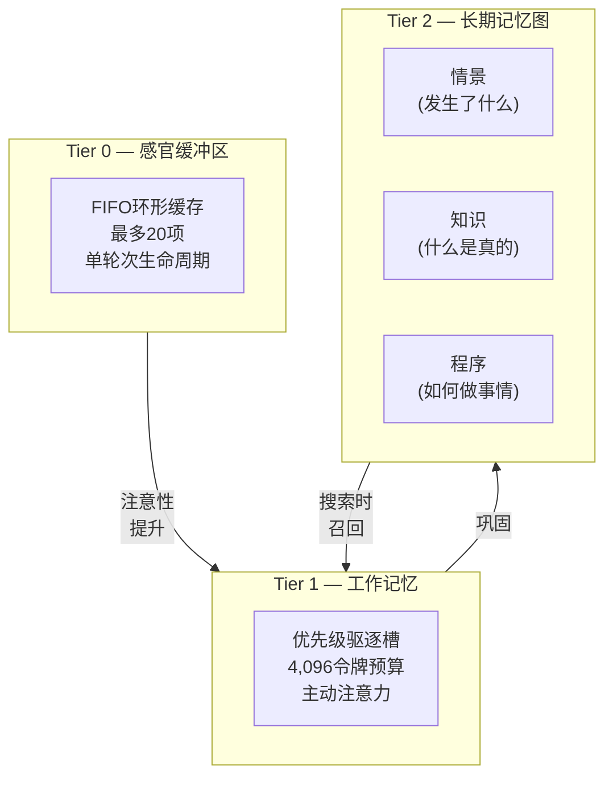

### Tier 1: 感官缓冲区

一个固定容量的环形缓冲区（`VecDeque`），在单个代理轮次中累积原始输入：用户消息、工具结果、召回的记忆和系统上下文。

**属性:**
- 容量: 可配置（默认20项）
- 生命周期: 单轮次——由ContextBuilder清空并丢弃
- 预算感知: `drain_within_budget(token_limit)` 返回适合令牌预算的项目

**目的:** 防止在复杂轮次中多次工具调用时的信息丢失。ContextBuilder从感官缓冲区读取以构建最终提示。

### Tier 2: 工作记忆

一个优先级排序的记忆槽数组，带硬性令牌预算。代表代理的"当前意识"——它正在积极思考的内容。

**属性:**
- 容量: 可配置令牌预算（默认4,096令牌）
- 驱逐: 超出预算时驱逐最低优先级槽
- 来源: 召回的长期记忆、感官缓冲区溢出、工具结果、用户提及
- 持久化: 代理切换时保存快照到持久存储，代理恢复时还原

**槽结构:**
```
WorkingMemorySlot {
    memory_id: String,      // 链接到长期记忆(如果召回)
    content: String,
    source: Recalled | SensoryBuffer | ToolResult | Restored,
    priority: f32,          // 决定驱逐顺序
    token_cost: usize,      // 预计算的令牌计数
    inserted_at: DateTime,
}
```

**优先级计算:** 召回的记忆使用其检索评分。感官缓冲区项目使用近因评分。工具结果使用可配置优先级（默认0.7）。用户提及获得高优先级（0.9）。

### Tier 3: 长期记忆图

三个持久存储——情景、知识和程序——通过类型化图边连接。

#### 情景存储
*发生了什么*——具体事件、对话、任务结果、会话摘要。

每个情景记忆具有:
- 分层内容（全文、摘要、关键事实、标签——当前仅全文填充）
- 类别（18变体枚举）
- 重要性评分（0.0–1.0）
- 强度（创建时1.0，随时间通过艾宾浩斯曲线衰减）
- 范围（全局 / 代理 / 频道 / 频道用户）
- 可选向量嵌入用于语义搜索
- 访问跟踪（计数 + 最后访问时间戳）
- 巩固状态（新鲜 → 已巩固 → 已归档）

#### 知识存储
*什么是真的*——结构化知识作为主体-谓语-客体三元组。

示例:
- ("用户", "偏好", "深色模式")
- ("Project Alpha", "使用", "Rust + TypeScript")
- ("API速率限制", "是", "100请求/分钟")

匹配主体+谓语的三元组自动重巩固：新值替换旧值，置信度评分转移。

#### 程序存储
*如何做事情*——带成功/失败跟踪的逐步程序。

每个程序具有:
- 内容（步骤）
- 触发条件（何时应用）
- 成功和失败计数器
- 从执行历史派生的成功率

---

## 长期记忆图

记忆不是孤立行——它们形成通过类型化边连接的图：

| 边类型 | 含义 |
|-----------|---------|
| `RelatedTo` | 一般关联 |
| `CausedBy` | 因果关系 |
| `Supports` | 支持主张的证据 |
| `Contradicts` | 冲突信息 |
| `PartOf` | 组成关系 |
| `FollowedBy` | 时间序列 |
| `DerivedFrom` | 源推导 |
| `SimilarTo` | 语义相似 |

### 扩散激活

当记忆通过搜索检索时，图被遍历以查找相关记忆。相邻节点接收与边权重成比例的激活提升，按边类型偏置。这实现了认知科学中扩散激活的简化版本。

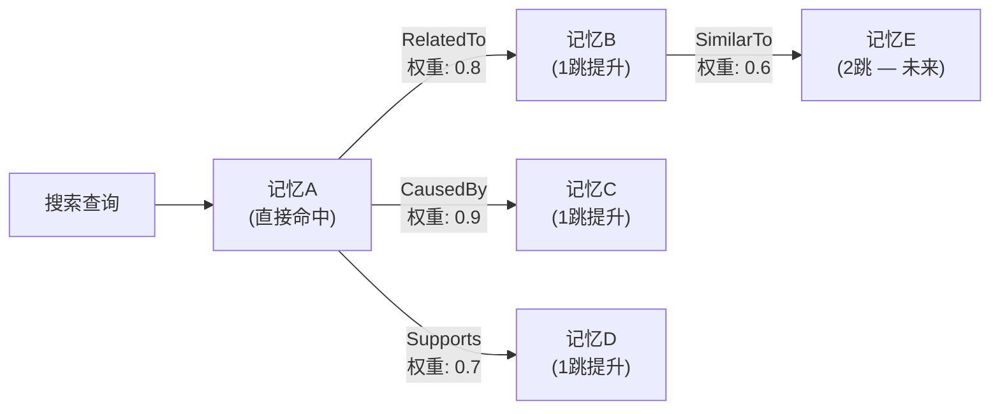

当前为1跳遍历：检索记忆的直接邻居被提升。激活评分与原始检索评分混合以产生最终排名。

---

## 混合搜索 — BM25 + 向量融合

Engram使用三种搜索信号，通过倒数排名融合(RRF)融合：

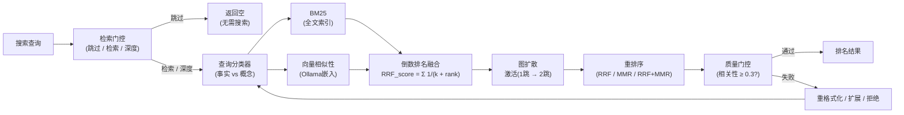

### 1. BM25全文搜索

带 `porter unicode61` 分词器的全文索引。处理精确关键字匹配、词干提取和短语查询。所有全文查询操作符在执行前清理以防注入。

### 2. 向量相似性搜索

当Ollama可用且配置嵌入模型（如 `nomic-embed-text`）时，记忆在存储时嵌入。搜索查询在查询时嵌入。查询和记忆嵌入间的余弦相似性产生相关性评分。

嵌入生成可选——无嵌入模型配置时，系统回退到仅BM25搜索，无关键字准确性降级。

### 3. 图扩散激活

BM25和向量结果收集后，记忆图遍历以通过类型化边查找相关记忆。相关记忆接收评分提升。

### 融合策略

来自所有三种信号的结果使用**倒数排名融合(RRF)**合并：

$$\text{RRF}_{\text{score}}(d) = \sum_{i} \frac{1}{k + \text{rank}_i(d)}$$

其中 $k = 60$（标准常数）和 $\text{rank}_i(d)$ 是文档 $d$ 在信号 $i$ 中的排名。这产生统一排名，受益于所有三种信号而不需评分标准化。

### 重排序

融合后，结果可选使用四种策略之一重排序：

| 策略 | 方法 | 用例 |
|----------|--------|----------|
| RRF | 仅倒数排名融合 | 默认，快速 |
| MMR | 最大边际相关性($\lambda = 0.7$) | 聚焦多样性 |
| RRF+MMR | RRF后接MMR | 最佳质量 |
| CrossEncoder | 模型基于重排序(回退到RRF+MMR) | 未来 |

### 查询分类

`hybrid_search.rs` 模块分析查询以确定最优搜索策略：
- **事实查询**（谁、什么、何时、具体实体）→ BM25权重更高
- **概念查询**（如何、为什么、解释、抽象主题）→ 向量相似性权重更高
- 信号权重每查询动态调整

---

## 检索智能

搜索只是问题的一半。另一半是决定*是否*搜索，以及结果弱时*做什么*。Engram实现了受Self-RAG和CRAG研究启发的两阶段检索智能管道。

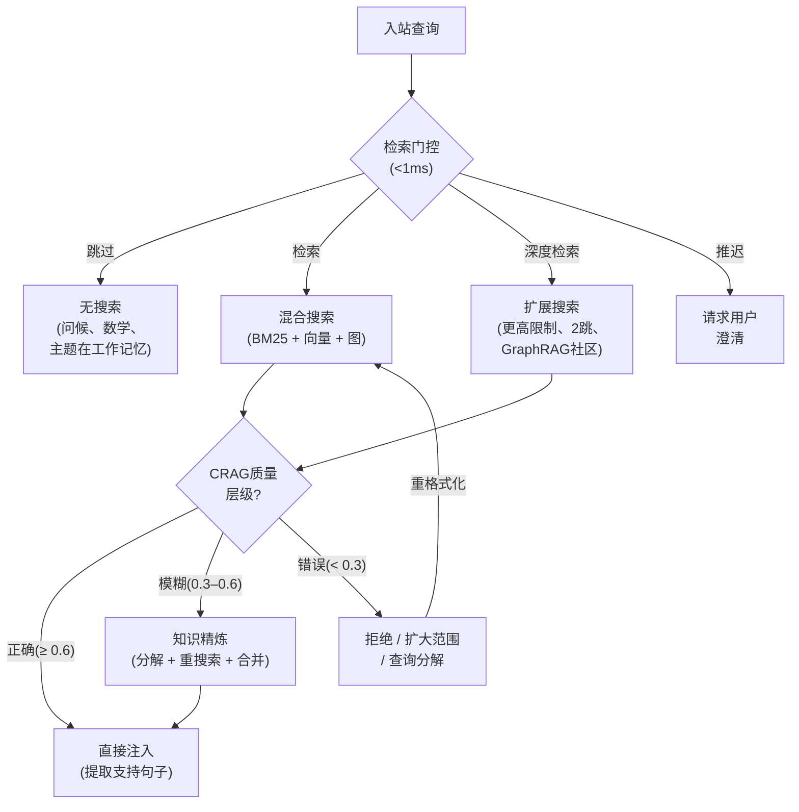

### 检索门控

任何搜索执行前，`RetrievalGate`分类入站查询并决定检索策略。这增加<1ms延迟但消除不必要搜索周期并防止无关记忆注入污染上下文。

五种检索模式：

| 模式 | 触发 | 行为 |
|------|---------|----------|
| **跳过** | 计算查询、问候、主题已在工作记忆 | 无搜索。模型从自身知识或现有对话回答。 |
| **检索** | 标准事实或程序查询 | 正常混合搜索管道(BM25 + 向量 + 图)。 |
| **深度检索** | 探索或时间查询("告诉我关于…的一切") | 扩展搜索，更高结果限制、2跳图激活、更广范围。 |
| **拒绝** | 后检索：最高结果相关性低于阈值 | 优雅拒绝——"我无该信息"而非从弱匹配伪造。 |
| **推迟** | 需澄清的模糊引用 | 搜索前请求用户消歧。 |

门控默认基于规则，评估查询结构、意图分类和工作记忆覆盖。这避免LLM门控决策的延迟和不可靠性。

### 后检索质量检查(CRAG三层)

搜索返回结果后，`QualityGate`评估结果是否实际有用。受Corrective RAG启发，Engram将检索置信度分类为三层：

| 置信层级 | 触发 | 行动 |
|---|---|---|
| **正确**(≥ 0.6) | 最高结果高度相关查询 | 直接注入——提取支持句子用于聚焦上下文 |
| **模糊**(0.3–0.6) | 结果相关但不明确对靶 | 知识精炼：分解查询为子查询，重搜索每个，合并结果 |
| **错误**(< 0.3) | 结果离题或缺失 | 优雅拒绝，或扩大范围(图扩展、社区摘要)，或分解查询 |

**具体纠正行动：**

1. **知识精炼**(模糊层)——仅从检索记忆提取直接支持查询的句子，丢弃周围噪声。这是CRAG的关键洞察：即使部分相关记忆包含有用片段。
2. **查询分解**——复杂查询整体失败时，分解为子查询独立搜索并合并结果。
3. **范围扩大**——低置信结果，系统升级到图扩展搜索(2跳激活)或GraphRAG社区摘要。
4. **优雅拒绝**——重格式化、扩展和分解全部失败时，系统拒绝而非注入低质量记忆。

**两个基础质量不变量**支撑每个层级决策：

1. **相关性检查**——最高结果评分低于0.3时，结果集分类为*错误*，无记忆原样注入。系统重格式化查询、通过图扩展扩大范围，或优雅拒绝而非用离题材料污染上下文。
2. **覆盖检查**——探索查询，结果计数低于可配置阈值时，系统升级到深度检索模式：更高结果限制、2跳图激活、GraphRAG社区摘要参与填补差距，再返回部分答案。

### 统一检索路径(gated_search)

Engram中所有记忆检索通过单一 `gated_search()` 函数路由。这是关键架构不变量——无路径(聊天、任务、编排器、群组、流、代理工具)可直接调用搜索后端。统一路径保证：

- 每个搜索通过检索门控(跳过/检索/深度决策)
- 每个搜索尊重每模型注入上限
- 每个搜索应用CRAG三层质量检查
- 每个搜索配置跟踪span和质量度量
- 每个搜索尊重加密边界

```rust
pub async fn gated_search(
    query: &str,
    scope: &MemoryScope,
    model: &ModelCapabilities,
    gate: &RetrievalGate,
    store: &dyn MemoryBackend,
) -> EngineResult<RecallResult> {
    // 1. 门控决策: 跳过 / 检索 / 深度检索
    // 2. 混合搜索(BM25 + 向量 + 图)
    // 3. CRAG质量层级分类
    // 4. 需要时纠正行动
    // 5. 预算感知修剪，每模型上限
    // 6. 质量度量计算
}
```

这消除当前代码缺口，即任务、编排器和群组绕过ContextBuilder并硬编码 `limit=10` 无质量检查。

这个两阶段管道意味着Engram在应该时检索，不应时跳过，结果弱时纠正——而非盲目注入搜索返回的任何内容。

---

## 缓存架构

Engram的三层设计本身是一个缓存层级。每层作为有界缓存运行，有独特的驱逐策略、TTL和访问模式——镜像CPU架构和生物认知中的缓存层级。

### 生物缓存模型

人类记忆的Atkinson-Shiffrin模型描述三个存储，访问速度递减容量递增。Engram的层级直接映射：

| 层级 | Engram模块 | 生物类比 | 缓存角色 | 驱逐策略 |
|------|---------------|-------------------|------------|-----------------|
| Tier 0 | `SensoryBuffer` | 图标/声像记忆 | **感知缓存**——注意过滤前的原始刺激 | FIFO环形；溢出时驱逐最旧条目 |
| Tier 1 | `WorkingMemory` | Baddeley中央执行 | **注意缓存**——代理主动思考的内容 | 基于优先级；超出令牌预算时驱逐最低优先级槽 |
| Tier 2 | LTM图 | 海马长期存储 | **持久存储**——所有已知内容，通过检索访问 | 艾宾浩斯强度衰减 → 阈值下GC |

这不是松散类比。驱逐级联在功能上等同于认知心理学中的记忆痕迹转移：接收注意的感官痕迹提升到工作记忆；演练的工作记忆项目巩固到长期存储。未能提升的项目丢失——系统优雅遗忘。

### Tier 0: 感官缓存

`SensoryBuffer`是有界 `VecDeque` 环形缓冲区，带显式缓存语义：

- **容量有界:** 可配置最大条目(默认20)
- **FIFO驱逐:** 满 `push()` 驱逐最旧条目并返回以提升到工作记忆
- **令牌感知:** 跟踪累积令牌计数；`drain_within_budget()` 返回适合给定令牌限制的项目
- **易失:** 每代理轮次后丢弃内容

返回的驱逐条目是提升信号——它告诉调用者"此项目被推出感官注意；决定是否值得工作记忆槽"。这镜像人类感知中的注意门。

### Tier 1: 注意缓存

`WorkingMemory`实现带LRU类似刷新语义的优先级管理缓存：

- **令牌预算有界:** 总槽令牌不能超过配置预算(默认4,096)
- **优先级驱逐:** `evict_lowest()` 移除最低优先级评分槽——未引用项目自然衰减
- **优先级衰减:** 每轮次调用 `decay_priorities(0.95)`，乘法降低所有槽优先级。未引用项目约20轮次后老化退出
- **优先级提升:** `boost_priority(id, delta)` 刷新最近访问项目，等同LRU"接触"操作
- **快照持久化:** 代理切换时，整个工作记忆序列化到持久存储并在代理恢复时还原——缓存状态存活上下文切换

### 动量缓存

工作记忆维护最近查询嵌入滑动窗口(`momentum_embeddings: Vec<Vec<f32>>`，上限5)。此轨迹缓存服务两个目的：

1. **启动**——偏向检索朝当前对话方向，精确如人类认知中的语义启动工作
2. **预期**——动量向量(最近嵌入质心)预测对话走向，在用户询问前预取可能需要的记忆

### 发布缓冲

`MemoryBus`维护带TTL驱逐的有界FIFO发布队列：

- **TTL过期:** 超过 `PUBLICATION_TTL_SECS` 的发布在每次插入丢弃
- **容量上限:** 达到 `MAX_PENDING_PUBLICATIONS` 时，最旧发布被驱逐
- **订阅扇出:** 待定发布在清空时交付注册订阅者，然后移除

这确保事件驱动记忆管道永不累积无界 backlog，即使消费者停滞。

### 缓存一致性

三层通过方向数据流维护一致性：

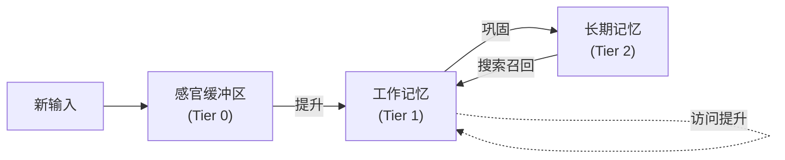

无缓存失效问题，因为层级是写前向：数据从快/易失流向慢/持久。长期记忆永不写回感官缓冲区。长期记忆通过搜索召回时，它作为源 `Recalled` 的*新槽*进入工作记忆——不尝试同步任何现有tier-0条目。

此单向流消除困扰传统多级缓存的一致性复杂性。

---

## 巩固引擎

后台进程每5分钟运行一次(可配置)，执行四个操作：

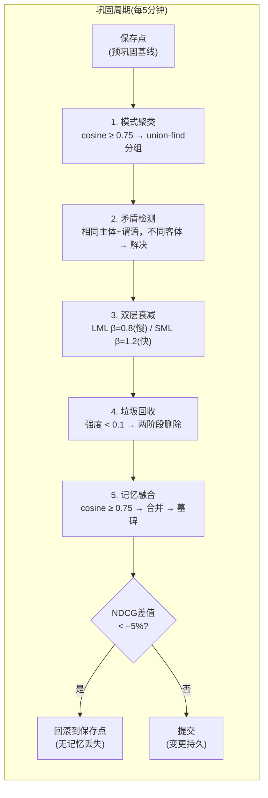

### 1. 模式聚类

余弦相似性≥ 0.75的记忆通过union-find聚类分组。相关记忆的簇被识别用于潜在融合。这防止重复类似观察的记忆膨胀。

### 2. 矛盾检测

当两条记忆共享相同主体和谓语但客体不同时，矛盾被检测。解决：新记忆胜出，旧记忆的置信度比例转移，并创建 `Contradicts` 图边。

### 3. 艾宾浩斯FadeMem双层强度衰减

记忆强度遵循生物启发的双层模型衰减，源自艾宾浩斯FadeMem。非均匀艾宾浩斯衰减，记忆被分配到具有不同衰减特性的两层：

**长期记忆层(LML)**——重要、频繁访问的记忆。衰减指数 $\beta = 0.8$ (亚线性)，产生约11.25天的半衰期。这些记忆缓慢淡出并跨会话持久。

**短期记忆层(SML)**——瞬时、低重要性记忆。衰减指数 $\beta = 1.2$ (超线性)，产生约5.02天的半衰期。这些记忆快速淡出以防止混乱。

$$\text{强度}(t) = S_0 \cdot e^{-\lambda_{\text{base}} \cdot t^{\beta}}$$

其中：
- $\lambda_{\text{base}} = 0.1$ —— 基础衰减率
- $\beta_{\text{LML}} = 0.8$ —— 长期亚线性
- $\beta_{\text{SML}} = 1.2$ —— 短期超线性

**滞后机制:** 访问频率超过 $\theta_{\text{promote}} = 0.7$ 时，记忆从SML提升到LML，相关性低于 $\theta_{\text{demote}} = 0.3$ 时从LML降级到SML。阈值间隙防止振荡——记忆不会在边缘变化时在层间跳变。

**每类型衰减调制:** 衰减率进一步按记忆类型调整：
- 程序记忆: $\lambda \times 0.5$ (技能持久更长)
- 语义记忆: $\lambda \times 0.7$ (知识比情景衰减慢)
- 情景记忆: $\lambda \times 1.0$ (体验按基础率衰减)
- 频繁访问(>5次): $\lambda \times 0.7$ (使用记忆持久)

此双层方法达到45%存储减少，同时*改善*检索质量——FadeMem消融研究展示移除双层衰减导致33.9% F1下降。

### 4. 垃圾回收

强度低于阈值(默认0.1)的记忆为删除候选。重要记忆(重要性 ≥ 0.7)无论强度都被GC保护。删除两阶段：内容字段在行删除前清零(反取证措施)。

GC后，数据库重填充到512KB桶边界以防文件大小侧信道泄漏。

### 事务性遗忘

整个巩固周期(衰减 + GC + 融合)在事务性保存点内执行。周期开始前，50个最近查询样本运行搜索，其NDCG评分记录为基线。周期完成后，相同查询重评估。

如果NDCG下降超过5%，整个周期回滚到保存点——无记忆丢失。这使遗忘*可证明安全*: 系统只能以维持或改善检索质量的方式遗忘。

```
BEGIN TRANSACTION
  SAVEPOINT pre_consolidation
  执行衰减、GC、融合
  在留出查询集上度量NDCG差值
  IF ndcg_delta < −0.05 THEN
    ROLLBACK TO pre_consolidation    // 无记忆丢失
  ELSE
    RELEASE pre_consolidation
    COMMIT
  END IF
```

### 间隙检测

巩固引擎还检测三种知识间隙：
- **缺失上下文**——引用实体无关联记忆
- **时间间隙**——活跃代理无记忆活动的时段
- **类别不平衡**——代理记忆重度集中在一个类别

间隙记录用于诊断目的。

---

## Adaptive Forgetting — FadeMem Dual-Layer Architecture

Traditional memory systems treat forgetting as a failure mode. Engram treats it as a first-class cognitive mechanism, inspired by the FadeMem which demonstrates that *measured* forgetting can reduce storage by 45% while simultaneously improving retrieval quality.

### The Core Insight

Human memory does not decay uniformly. Frequently-rehearsed information consolidates into long-term storage while transient details fade rapidly. FadeMem formalizes this with a dual-layer architecture that Engram adopts:

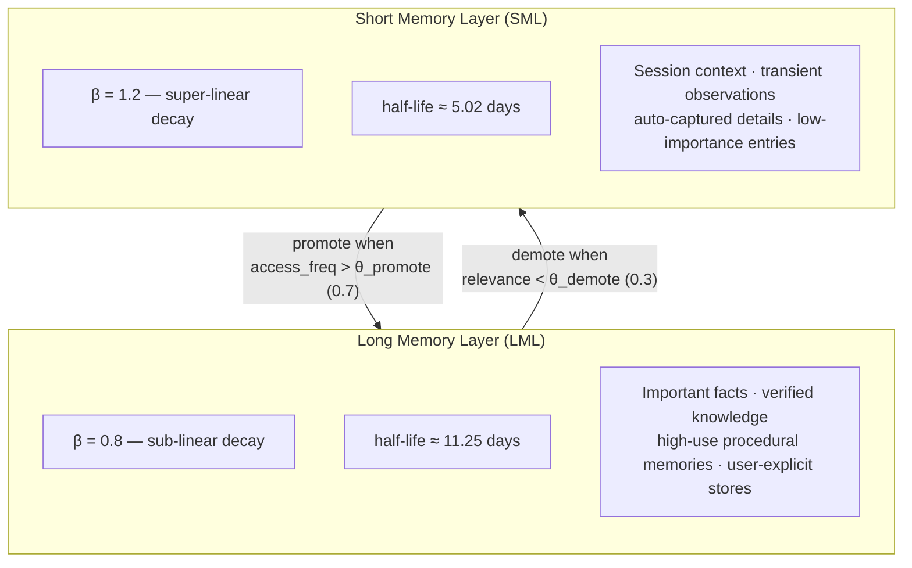

### Interference-Based Decay

Beyond the dual-layer structure, decay is modulated by *interference* — how much a memory conflicts with or is superseded by newer information:

- **Retrieval interference:** Memories that are frequently searched for but rarely selected accumulate negative signal. They occupy search results without providing value.
- **Semantic overlap:** When new memories are stored that cover the same semantic space, older overlapping memories decay faster — the new information has effectively superseded them.
- **Access recency:** A memory accessed yesterday decays slower than one last accessed 30 days ago, independent of creation date.

The combined formula:

$$\lambda_\text{eff} = \lambda_\text{base} \times \textit{typeModifier} \times \textit{interferenceFactor} \times (1 + \textit{semanticOverlap})$$

This produces *adaptive* forgetting: universally useful knowledge persists almost indefinitely (low interference, frequent access, LML layer), while transient noise evaporates quickly (high interference, no access, SML layer).

### Four Conflict Types

When memories conflict during consolidation, Engram classifies the relationship into one of four types (from FadeMem's conflict resolution model):

| Relation | Meaning | Resolution |
|----------|---------|------------|
| **Compatible** | Both memories are true simultaneously | Fuse into unified entry |
| **Contradictory** | Mutually exclusive claims | Most recent wins; loser's confidence transferred; `Contradicts` edge created |
| **Subsumes** | New memory is a superset of old | Absorb old into new; old becomes tombstone |
| **Subsumed** | Old memory is a superset of new | Keep old; boost its strength; discard new |

Every conflict resolution is recorded in the audit log with full provenance: which memories conflicted, what relation was detected, which resolution strategy was applied, and who won.

### FadeMem Ablation Results

The FadeMem paper provides ablation evidence that directly informs Engram's implementation priority:

| Component Removed | F1 Drop | Implication |
|---|---|---|
| Fusion engine | **-53.7%** | Highest-impact single component — must implement first |
| Dual-layer decay | -33.9% | Second priority — uniform decay is significantly worse |
| Conflict resolution | -19.2% | Third — blind "newest wins" loses important context |
| Adaptive decay rates | -12.8% | Fourth — per-type tuning adds measurable value |

FadeMem achieves F1 = 29.43 (beating Mem0's 28.37), 82.1% critical fact retention at 55% storage, and 77.2% Retrieval Precision@10.

---

## Memory Fusion

Consolidation handles clustering and contradiction detection, but it does not address **near-duplicate memories** — entries that express the same information in slightly different words. Over months of use, these duplicates accumulate linearly: "User prefers dark mode", "User prefers dark mode in editors", "User uses dark mode" all occupy separate storage, search bandwidth, and context tokens.

Memory fusion addresses this directly, inspired by FadeMem's fusion mechanism.

### Fusion Pipeline

During each consolidation cycle, the fusion engine:

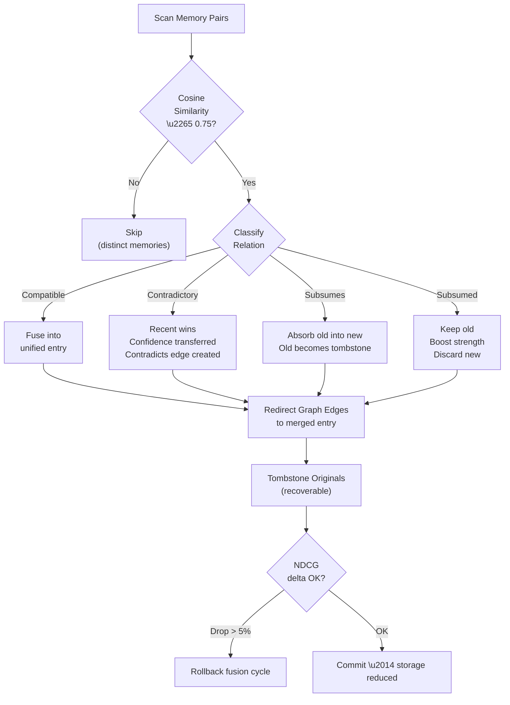

1. **Candidate detection** — Identify memory pairs with cosine similarity $\geq \theta_{\text{fusion}}$ (0.75, derived from FadeMem paper — the plan originally used 0.92 but the paper demonstrates 0.75 is the optimal threshold) and compatible scopes (same agent, same scope tier).
2. **Relation classification** — Classify each pair as Compatible, Contradictory, Subsumes, or Subsumed using the four-type conflict model.
3. **Merge** — For Compatible pairs: create a single strengthened entry with the union of propositions from both sources, the maximum of their strength values, and a provenance chain linking back to the originals.
4. **Edge redirection** — All graph edges pointing to the original entries are redirected to the merged entry, preserving graph connectivity.
5. **Tombstoning** — Original entries are marked as tombstones rather than deleted immediately. This allows recovery if a merge was too aggressive and maintains audit trail integrity.

### Quality Measurement

Every fusion cycle is measured:

- **Chain integrity percentage** — Multi-hop graph traversals that succeed before and after fusion. A fusion that breaks a retrieval chain is detected.
- **NDCG delta** — Normalized discounted cumulative gain is computed on a fixed query set before and after fusion. If NDCG drops by more than 5%, the fusion cycle is rolled back.
- **Storage reduction** — Bytes freed and entries removed are tracked per cycle.

The threshold ($\theta_{\text{fusion}} = 0.75$ cosine) is derived from FadeMem's paper. Higher values produce more conservative merging. Lower values risk merging memories that carry distinct nuance.

---

## GraphRAG — Community-Based Global Retrieval

Traditional retrieval (BM25 + vector + spreading activation) answers *local* queries well: "What does the user prefer for dark mode?" finds specific memories. But *global* queries fail: "Summarize everything I know about Project Alpha" requires reasoning across many memories that may not share keywords or embedding similarity.

GraphRAG addresses this by treating the memory graph as a knowledge graph with detectable communities. Engram implements a dual-plane retrieval system inspired by Microsoft GraphRAG, Deep GraphRAG, and informed by WildGraphBench failure analysis.

### Community Detection

The memory graph undergoes Louvain community detection during consolidation. Communities are groups of densely-connected memories that represent coherent topics or projects:

```
Project Alpha community:
  ├─ "Set up Rust backend" (episodic)
  ├─ "Project Alpha uses Tauri v2" (semantic)
  ├─ "API rate limit is 100/min" (semantic)
  ├─ "Deployed to staging" (episodic)
  └─ "Deploy procedure for Alpha" (procedural)
```

Each community gets a **hierarchical summary** — an LLM-generated description of the community's contents, stored with its own embedding. This enables global queries to match against community-level descriptions rather than individual memories.

### Deep GraphRAG Three-Stage Pipeline

For queries that require community-level reasoning, Engram uses a three-stage hierarchical pipeline from Deep GraphRAG:

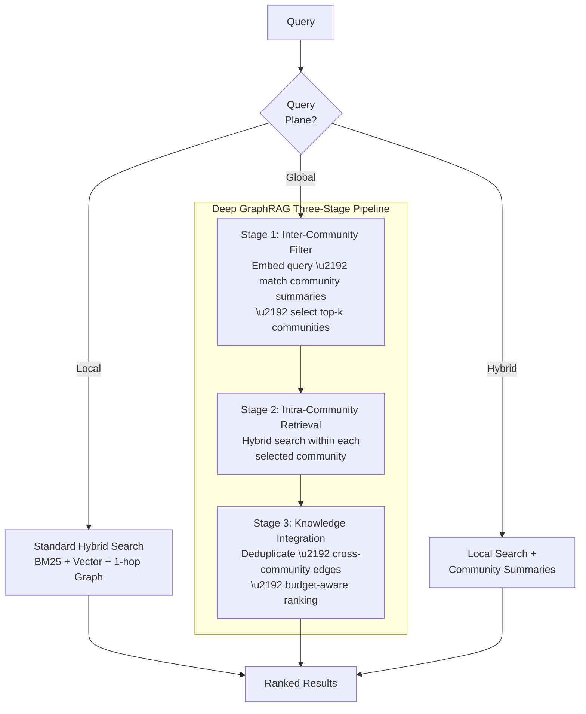

1. **Inter-community filter** — Embed the query, compare against all community summary embeddings, select the top-k most relevant communities. This narrows the search space from the entire graph to a few coherent clusters.

2. **Intra-community retrieval** — Within each selected community, run the full hybrid search pipeline (BM25 + vector + graph activation) to find the most relevant individual memories.

3. **Knowledge integration** — Combine results across communities with deduplication, cross-community edge traversal, and budget-aware ranking. The final result set represents a coherent answer drawing from multiple knowledge clusters.

### Dual-Plane Query Router

The retrieval gate classifies queries into three planes:

| Plane | Query Type | Search Strategy |
|-------|-----------|----------------|
| **Local** | Specific factual/procedural queries | Standard hybrid search (BM25 + vector + 1-hop graph) |
| **Global** | Summary/exploration/"tell me everything" queries | Community filter → intra-community search → integration |
| **Hybrid** | Queries needing both specific facts and broader context | Local search + community summaries combined |

### WildGraphBench Failure Defenses

WildGraphBench identifies five failure modes where GraphRAG systems degrade. Engram defends against each:

| Failure Mode | Defense |
|---|---|
| GraphRAG hurts summarization tasks | Intent classifier routes summarization to global plane only when beneficial |
| Community detection produces noisy clusters | Minimum community size threshold; orphan nodes fall back to local search |
| Stale community summaries | Incremental re-summarization during consolidation when community membership changes |
| Over-reliance on graph structure | Hybrid plane combines graph-based and text-based results |
| Query-type blindness | 6-intent classifier dynamically selects the optimal retrieval plane |

### DW-GRPO and Small Model Quality

Deep GraphRAG's DW-GRPO training technique (Distributed Weighted Group Relative Policy Optimization) demonstrates that 1.5B parameter models can approach 70B model quality for knowledge integration tasks. This is critical for Engram's local-first architecture: users running Ollama with small local models can still achieve high-quality GraphRAG retrieval through the three-stage pipeline.

### GraphRAG-R1 Reward Signals

GraphRAG-R1 introduces two reward signals for training retrieval policies:

- **PRA (Progressive Retrieval Attenuation)** — Penalizes shallow single-hop retrieval. Rewards multi-hop reasoning that follows graph edges to deeper answers. Applied as a retrieval depth bonus: deeper traversals earn higher scores.
- **CAF (Cost-Aware F1)** — Penalizes over-retrieval. A system that retrieves 50 memories to answer a simple question is punished even if the answer is correct. This naturally encourages budget-efficient retrieval.

Pending RL training infrastructure, Engram implements PRA and CAF as heuristic reward signals in the reranking pipeline, boosting results that demonstrate multi-hop reasoning and penalizing over-retrieval.

Engram is the **first local-first GraphRAG implementation** in any agent memory system.

---

## Compounding Skill Library

Most agent memory systems only store *facts* — what happened, what is true. Engram also stores *skills* — executable, composable procedures that improve with every interaction. This is inspired by Voyager, Reflexion, and HELPER.

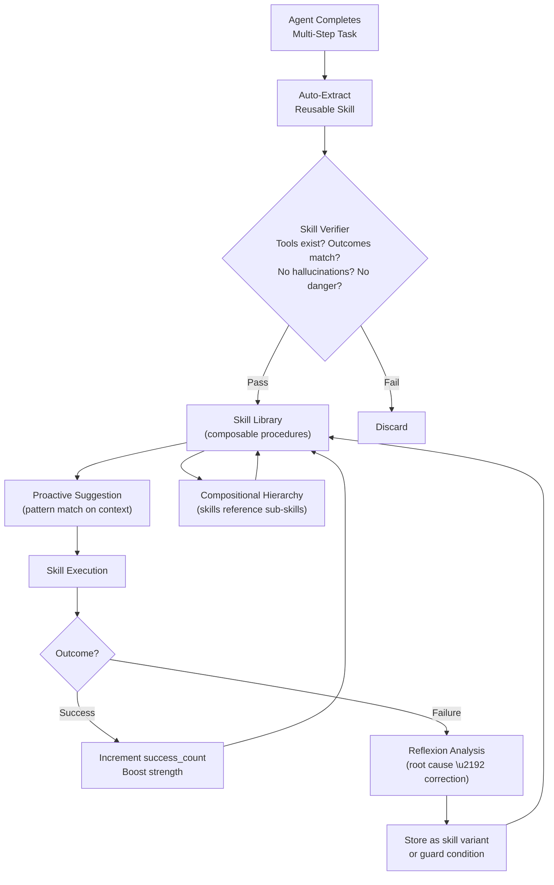

### Auto-Extraction

When an agent successfully completes a multi-step task (file editing, API debugging, deployment), the interaction is analyzed and a reusable skill is extracted:

```
Skill: "Deploy to staging via Docker"
Steps:
  1. Build image: docker build -t app:latest .
  2. Push to registry: docker push registry.example.com/app:latest
  3. SSH to staging: ssh deploy@staging
  4. Pull and restart: docker compose pull && docker compose up -d
Trigger: "deploy to staging" OR "push to staging"
```

### Skill Verification

Before a skill is promoted to the library, the `SkillVerifier` checks:
- All referenced tool calls actually exist and are callable
- Expected outcomes match actual outcomes from the extraction context
- No hallucinated steps (steps claimed but not actually executed in the source interaction)
- No dangerous operations without confirmation steps

### Compositional Hierarchy

Skills compose. A "deploy to production" skill can reference the "deploy to staging" skill as a sub-step, plus add production-specific steps (health checks, rollback preparation). This creates a compositional hierarchy where complex workflows are built from verified primitives.

### Reflexion-Style Failure Learning

When a skill execution fails, the failure is analyzed and stored as a **negative example**:

- What went wrong (error message, failed step)
- Why it went wrong (LLM-generated root cause analysis)
- What to do differently (correction stored as a skill variant or guard condition)

This mirrors Reflexion's verbal reinforcement learning: the agent doesn't need weight updates to learn from mistakes. It stores the lesson in memory and retrieves it the next time a similar task arises.

### Proactive Skill Suggestion

The `SkillSuggester` monitors the current conversation context and proactively suggests relevant skills. When a user says "I need to set up the CI pipeline," the suggester checks the skill library for matching procedures and injects them into the agent's context with a note: *"I have a verified procedure for this from a previous session."*

### Quantified Compounding Effect

With a mature skill library (~50+ verified skills), agents demonstrate measurable improvement:

| Metric | Without Skills | With Skills | Improvement |
|---|---|---|---|
| Task completion steps | Baseline | -50% | Fewer redundant explorations |
| Success rate | Baseline | +20% | Verified procedures reduce errors |
| Repeat errors | Baseline | -80% | Failure memories prevent recurrence |
| Token cost per task | Baseline | -40% | Reusable skills avoid re-deriving solutions |

No competing memory system implements a self-improving procedural memory library.

---

## Context Window Intelligence

### ContextBuilder

The ContextBuilder is a fluent API for assembling the final prompt within a token budget:

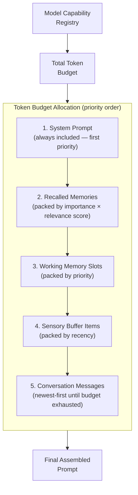

```rust
let prompt = ContextBuilder::new(model_caps)
    .system_prompt(&base_prompt)
    .recall_from(&store, &query, agent_id, &embedding_client).await
    .working_memory(&wm)
    .sensory_buffer(&buffer)
    .messages(&conversation)
    .build();
```

**Budget allocation strategy:**
1. System prompt gets first priority (always included)
2. Recalled memories packed by $\text{importance} \times \text{relevance score}$
3. Working memory slots packed by priority
4. Sensory buffer items packed by recency
5. Conversation messages packed newest-first until budget exhausted

### Model Capability Registry

Every supported model has a capability fingerprint:
- Context window size
- Maximum output tokens
- Tool/function calling support
- Vision support
- Extended thinking support
- Streaming support
- Tokenizer type

The registry covers all models from OpenAI, Anthropic, Google, DeepSeek, Mistral, xAI, Ollama, and OpenRouter. Unknown models fall back to conservative defaults (32K context, 4K output).

### Tokenizer

Model-specific token estimation:
- `Cl100kBase` — GPT-4, Claude ($\div 3.4$ bytes)
- `O200kBase` — o1, o3, o4 ($\div 3.8$ bytes)
- `Gemini` — Gemini models ($\div 3.3$ bytes)
- `SentencePiece` — Llama, Mistral, local models ($\div 3.0$ bytes)
- `Heuristic` — Fallback ($\div 4.0$ bytes)

All calculations use `ceil()` to round up and are UTF-8 safe (truncation never splits a multi-byte character).

---

## Memory Security

### Field-Level Encryption

Memories containing PII are encrypted with AES-256-GCM before storage. The encryption key is stored in the unified OS keychain vault (`openpawz`) alongside all other purpose keys.

**Automatic PII detection** uses a two-layer approach:

**Layer 1 — Static pattern matching.** 17 compiled regex patterns run on every memory at storage time, covering:
- SSN (with and without hyphens), credit card (including Amex), phone numbers (US and international)
- Email addresses, physical addresses, IP addresses (IPv4)
- Person names, geographic locations
- Credentials (passwords, API keys, JWT tokens, AWS access keys, private key blocks)
- Government IDs, IBAN bank account numbers

**Layer 2 — LLM-assisted secondary scan.** During idle-time consolidation, memories stored as cleartext are re-scanned using the configured model as a PII classifier. This catches semantic PII that no regex can detect — unstructured references to names, addresses, health conditions, and context-dependent identifiers. Memories retroactively found to contain PII are encrypted in place.

**Encryption flow:**

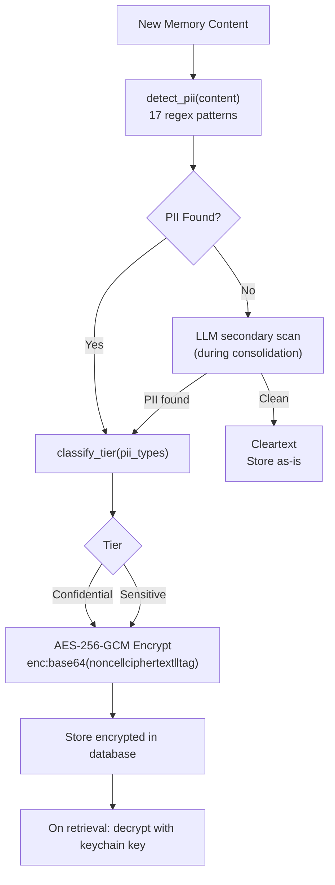

### Inter-Agent Memory Trust

The memory bus enables cross-agent knowledge sharing, but shared memory introduces a trust boundary — a compromised or misconfigured agent could inject poisoned memories into the fleet. Engram defends against this at three layers:

1. **Publish-side validation** — Every memory published to the bus passes through the injection scanner before entering the queue. Detected payloads are blocked at publish time, not just at recall time.
2. **Capability-scoped publishing** — Each agent receives a signed capability token at creation that encodes its maximum publish scope (agent-only, squad, project, or global), maximum self-assignable importance, and per-cycle rate limit. Attempts to exceed the capability ceiling are rejected with an audit log entry.
3. **Trust-weighted contradiction resolution** — When a published memory contradicts an existing fact, the resolution factors in the source agent's trust score, not just recency. A less-trusted agent cannot override a more-trusted agent's knowledge without a significant confidence differential.

### Query Sanitization

Full-text search operators are stripped from user queries before they reach the storage engine. This prevents full-text injection attacks that could extract data via crafted queries.

### Prompt Injection Defense

Every recalled memory passes through a two-stage sanitization pipeline before reaching the agent:

1. **Pattern redaction** — 10 compiled regex patterns detect common injection payloads ("ignore previous instructions", "you are now", system prompt markers, override/bypass attempts). Matched regions are replaced with `[REDACTED:injection]` — the payload never reaches the model.
2. **Structural isolation** — Recalled memories are wrapped in explicit data-boundary markers in the prompt, instructing the model to treat memory content as data, not instructions.

Injection attempts that evade static patterns remain a known limitation of regex-based scanning. The current defense is a first layer — it blocks known attack shapes but cannot guarantee coverage against novel obfuscation techniques (unicode substitution, multi-turn payload assembly, encoded instructions). The architecture is designed for a future secondary scan using the model itself as a classifier.

### Anti-Forensic Measures

- **Two-phase secure deletion** — Content zeroed before row deletion
- **Vault-size quantization** — Database padded to 512KB buckets
- **8KB pages** — Reduces file-size granularity
- **Incremental auto-vacuum** — Prevents immediate file shrinkage after deletions
- **Secure delete** — freed pages are zeroed by the storage engine

### GDPR Compliance

`engram_purge_user(identifiers)` securely erases all memories matching a list of user identifiers across all tables, including snapshots and audit logs. Implements Article 17 (right to be forgotten).

---

## Memory Lifecycle Integration

Engram is wired into every major execution path:

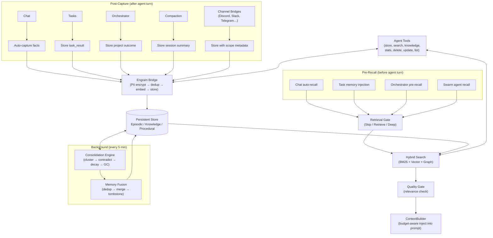

### Chat

When `auto_recall` is enabled for an agent, the ContextBuilder performs a hybrid search and injects relevant memories into the system prompt before each agent turn. Agent responses can trigger auto-capture of facts, preferences, and observations.

### Tasks

Before a task agent runs, the top 10 relevant memories are searched and injected as a "Relevant Memories" system prompt section. After the agent completes, the task result is stored in episodic memory via the Engram bridge with category `task_result`.

### Orchestrator

The boss agent in multi-agent orchestration receives pre-recalled memories relevant to the project goal. After the orchestration completes, the project outcome is captured in episodic memory.

### Session Compaction

When a conversation is compacted (summarized to free context space), the compaction summary is stored in Engram episodic memory with category `session`. This ensures knowledge survives compaction.

### Channel Bridges

Messages from Discord, Slack, Telegram, and other channels are stored with channel and user scope metadata. This enables per-channel memory isolation — a user's Discord memories don't bleed into their Telegram conversations.

### Agent Tools

Agents have direct access to memory through 7 tools:

| Tool | Purpose |
|------|---------|
| `memory_store` | Store a memory with category and importance |
| `memory_search` | Hybrid search across all memory types |
| `memory_knowledge` | Store structured SPO triples |
| `memory_stats` | Get memory system statistics |
| `memory_delete` | Delete a specific memory |
| `memory_update` | Update memory content |
| `memory_list` | Browse memories by category |

---

## Concurrency Architecture

A desktop AI platform serves multiple concurrent consumers: the chat UI, background tasks, orchestration pipelines, 11+ channel bridges, and the consolidation engine — all reading and writing memory simultaneously. The concurrency model must handle this without blocking the Tokio runtime or causing write contention.

### Read Pool + Write Channel

Engram separates reads from writes using a two-path architecture:

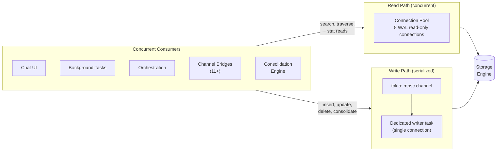

- **Read path** — A connection pool with 8 read-only connections operating in WAL (Write-Ahead Logging) mode. All search queries, graph traversals, and stat reads execute on the pool concurrently. WAL mode allows readers to proceed without blocking on writers.
- **Write path** — A dedicated writer task receives all mutations through a `tokio::mpsc` channel. The writer serializes all inserts, updates, deletions, and consolidation writes through a single connection, eliminating write contention entirely.

```
Read requests ──→ connection pool [8 WAL connections] ──→ result
Write requests ──→ mpsc channel ──→ dedicated writer task ──→ storage engine
```

The `mpsc::send()` + `oneshot::recv()` pattern is fully async-safe — no synchronous mutexes appear in async code, which prevents Tokio thread starvation under load.

### Storage Backend Trait

All storage access is mediated through the `MemoryBackend` trait, which abstracts the underlying database:

```rust
#[async_trait]
pub trait MemoryBackend: Send + Sync {
    async fn store_episodic(&self, memory: &EpisodicMemory) -> EngineResult<String>;
    async fn search_episodic_bm25(&self, query: &str, scope: &MemoryScope, limit: usize) -> EngineResult<Vec<(String, f64)>>;
    async fn search_episodic_vector(&self, embedding: &[f32], scope: &MemoryScope, limit: usize) -> EngineResult<Vec<(String, f64)>>;
    async fn add_edge(&self, edge: &MemoryEdge) -> EngineResult<()>;
    async fn get_neighbors(&self, memory_id: &str, min_weight: f64) -> EngineResult<Vec<(String, f64)>>;
    async fn apply_decay(&self, half_life_days: f64) -> EngineResult<usize>;
    async fn garbage_collect(&self, threshold: f64) -> EngineResult<usize>;
    // ... additional operations for semantic, procedural, graph, and lifecycle
}
```

This trait enables `MockMemoryStore` for test isolation, backend swaps, and clean dependency injection across all modules.

### Vector Index Strategy

Vector similarity search uses a tiered indexing strategy:

| Memory Count | Index | Latency | RAM |
|-------------|-------|---------|-----|
| < 1,000 | Brute-force cosine scan | < 5ms | Negligible |
| 1,000 – 100,000 | HNSW (in-memory, pure Rust) | < 5ms | ~3KB/vector |
| > 100,000 | HNSW with disk-backed fallback | < 25ms | Bounded |

Both implementations sit behind a `VectorIndex` trait. The index warms from the database on startup and receives new embeddings on the write path. If no embedding model is available, vector search is disabled entirely and the system falls back to BM25-only with no loss in keyword accuracy.

---

## Observability

A memory system without measurement is a memory system without improvement. Engram instruments every operation to make debugging, optimization, and quality evaluation possible.

### Tracing

All public functions are instrumented with `tracing::instrument` spans organized in a hierarchy:

- `engram.search` — Covers the full search pipeline: gate decision, BM25, vector, graph activation, reranking, quality check
- `engram.store` — Covers PII detection, encryption, embedding generation, deduplication, and database write
- `engram.consolidate` — Covers pattern clustering, contradiction detection, fusion, decay, and garbage collection
- `engram.context` — Covers the ContextBuilder prompt assembly pass

Span metadata includes agent ID, query text (redacted if PII), result count, latency, and quality scores. These spans integrate with any `tracing::Subscriber` — local log files, structured JSON, or external collectors.

### Metrics

The `metrics` crate provides three categories of runtime instrumentation:

| Type | Metric | Purpose |
|------|--------|---------|
| Counter | `engram.search_count` | Total searches executed |
| Counter | `engram.store_count` | Total memories stored |
| Counter | `engram.gc_count` | Garbage collection cycles |
| Counter | `engram.gate_skip_count` | Retrieval gate skips (queries that didn't need memory) |
| Gauge | `engram.memory_count` | Current total memory count |
| Gauge | `engram.hnsw_size` | Current HNSW index size |
| Gauge | `engram.pool_active` | Active read pool connections |
| Histogram | `engram.search_latency_ms` | Search latency distribution |
| Histogram | `engram.store_latency_ms` | Store latency distribution |
| Histogram | `engram.consolidation_ms` | Consolidation cycle duration |

### Cognitive Debug Events

For real-time debugging, Engram emits Tauri events that the frontend debug panel can display:

- `engram:search` — Query, gate decision, result count, top scores, latency
- `engram:store` — Memory ID, category, importance, PII detected, encrypted fields
- `engram:quality` — NDCG score, relevance warnings, chain integrity

These events enable developers and users to observe the memory system's decision-making in real time without parsing log files.

---

## Category Taxonomy

18 categories, unified across Rust backend, agent tools, and frontend UI:

| Category | Description | Typical Source |
|----------|-------------|----------------|
| `general` | Uncategorized information | Fallback |
| `preference` | User preferences and settings | Agent observation |
| `fact` | Verified factual information | Agent or user |
| `skill` | Capability-related knowledge | Skill execution |
| `context` | Situational context | Auto-capture |
| `instruction` | User-provided directives | Explicit instruction |
| `correction` | Corrected information (supersedes prior) | User correction |
| `feedback` | Quality feedback on agent behavior | User feedback |
| `project` | Project-specific knowledge | Task/orchestrator |
| `person` | Information about people | Agent observation |
| `technical` | Technical details (APIs, configs, specs) | Agent or tools |
| `session` | Session summaries from compaction | Compaction engine |
| `task_result` | Outcomes of completed tasks | Task post-capture |
| `summary` | Condensed summaries | Consolidation |
| `conversation` | Conversational context | Auto-capture |
| `insight` | Derived observations and patterns | Agent reasoning |
| `error_log` | Error information for debugging | Error handlers |
| `procedure` | Step-by-step procedures | Procedural store |

Unknown categories gracefully fall back to `general` via the `FromStr` implementation.

---

## Schema Design

Six persistent stores with full-text indices and 13 secondary indices:

```
-- Episodic memories (what happened)
episodic_memories (
    id, content, content_summary, content_key_facts, content_tags,
    outcome, category, importance, agent_id, session_id, source,
    consolidation_state, strength, trust_accuracy, trust_source_reliability,
    trust_consistency, trust_recency, trust_composite,
    scope_global, scope_project_id, scope_squad_id, scope_agent_id,
    scope_channel, scope_channel_user_id,
    embedding, embedding_model, negative_contexts,
    created_at, last_accessed_at, access_count
)

-- Semantic knowledge (SPO triples)
semantic_memories (
    id, subject, predicate, object, category, confidence,
    agent_id, source, embedding, embedding_model,
    created_at, updated_at
)

-- Procedural memory (how-to)
procedural_memories (
    id, content, trigger_condition, category,
    agent_id, source, success_count, failure_count,
    embedding, embedding_model, created_at, updated_at
)

-- Graph edges connecting memories
memory_graph_edges (
    id, source_id, source_type, target_id, target_type,
    edge_type, weight, metadata, created_at
)

-- Working memory snapshots for agent switching
working_memory_snapshots (
    agent_id, snapshot_json, saved_at
)

-- Audit trail
memory_audit_log (
    id, action, memory_type, memory_id, agent_id,
    details, created_at
)
```

Full-text indices are maintained over `episodic_memories` and `semantic_memories` to enable keyword search. Change triggers keep full-text indices synchronized with the primary stores.

---

## Configuration

The `EngramConfig` struct provides 30+ tunable parameters:

| Parameter | Default | Description |
|-----------|---------|-------------|
| `sensory_buffer_capacity` | 20 | Max items in sensory buffer |
| `working_memory_budget` | 4096 | Token budget for working memory |
| `consolidation_interval_secs` | 300 | Background consolidation cycle |
| `decay_rate` | 0.05 | Ebbinghaus decay lambda |
| `gc_strength_threshold` | 0.1 | Minimum strength to survive GC |
| `gc_importance_protection` | 0.7 | Importance above this is GC-immune |
| `search_limit` | 10 | Default search result count |
| `min_relevance_threshold` | 0.2 | Minimum score for search results |
| `clustering_similarity_threshold` | 0.75 | Cosine similarity for clustering |
| `auto_recall_enabled` | true | Pre-recall before agent turns |
| `auto_capture_enabled` | true | Post-capture after agent turns |
| `decay_lambda_base` | 0.1 | FadeMem base decay rate |
| `beta_lml` | 0.8 | Long Memory Layer decay exponent (sub-linear) |
| `beta_sml` | 1.2 | Short Memory Layer decay exponent (super-linear) |
| `promote_threshold` | 0.7 | Access frequency to promote SML → LML |
| `demote_threshold` | 0.3 | Relevance below which LML → SML |
| `fusion_similarity_threshold` | 0.75 | Cosine similarity for memory fusion |
| `ndcg_rollback_threshold` | 0.05 | Max NDCG drop before consolidation rollback |

Two presets are provided:

- **Conservative** (default) — Uses traditional Ebbinghaus decay with forgiving thresholds. Suitable for users who prefer to keep more memories longer.
- **FadeMem Paper** — Uses the exact parameters from the FadeMem research paper ($\lambda = 0.1$, $\beta_{\text{LML}} = 0.8$, $\beta_{\text{SML}} = 1.2$, $\theta_{\text{promote}} = 0.7$, $\theta_{\text{demote}} = 0.3$, $\theta_{\text{fusion}} = 0.75$). Optimized for storage efficiency with proven quality preservation.

---

## Frontier Capabilities
Beyond the core architecture, Engram implements cognitive modules drawn from neuroscience research and frontier AI papers. Each module integrates through formal trait boundaries.

### Cognitive Modules (Implemented)

- **Emotional memory dimension** (`emotional_memory.rs`) — The `emotional_memory.rs` module implements an affective scoring pipeline measuring valence, arousal, dominance, and surprise for each memory. Emotionally significant memories decay at 60% of the normal rate, receive consolidation priority boosts, and get retrieval score amplification. This models the well-documented effect that emotionally charged experiences are retained more strongly in biological memory.

- **Reflective meta-cognition** (`meta_cognition.rs`) — The `meta_cognition.rs` module performs periodic self-assessment of knowledge confidence per domain, generating "I know / I don't know" maps across the agent's memory space. These maps guide anticipatory pre-loading — if the agent knows its knowledge of a topic is sparse, it can signal this to the user rather than hallucinating from weak memories.

- **Temporal-axis retrieval** (`temporal_index.rs`) — The `temporal_index.rs` module treats time as a first-class retrieval signal. A B-tree temporal index supports range queries ("what happened last week?"), proximity scoring (memories closer in time to the query context rank higher), and pattern detection (recurring events, periodic activity). This resolves temporal queries natively rather than forcing them through keyword or vector search.

- **Intent-aware retrieval weighting** (`intent_classifier.rs`) — The `intent_classifier.rs` module implements a 6-intent classifier (informational, procedural, comparative, debugging, exploratory, confirmatory) that dynamically weights all retrieval signals per query type. A debugging query boosts error logs and technical memories. An exploratory query triggers broader graph activation. The intent signal feeds into the retrieval gate, the reranking pipeline, and the GraphRAG plane router.
- **Entity lifecycle tracking** (`entity_tracker.rs`) — The `entity_tracker.rs` module maintains canonical entity profiles with name resolution (aliases, abbreviations, misspellings all resolve to the same entity), evolving entity state, entity-centric queries ("what do I know about Project X?"), and relationship emergence detection across all memory types.

- **Hierarchical semantic compression** (`abstraction.rs`) — The `abstraction.rs` module builds a multi-level abstraction tree: individual memories → clusters → super-clusters → domain summaries. This enables navigation of knowledge at any zoom level — from a single data point up to a high-level summary of an entire domain. The compression tree is rebuilt incrementally during consolidation and provides input to GraphRAG community summaries.

- **Multi-agent memory sync** (`memory_bus.rs`) — The `memory_bus.rs` module implements a CRDT-inspired protocol for peer-to-peer knowledge sharing between agents. Vector-clock conflict resolution ensures convergence when multiple agents modify related memories concurrently. Agents can share discoveries, coordinate on projects, and maintain consistent world models without a central coordinator. Publish-side authentication prevents rogue agents from injecting poisoned memories — every publication is validated against the agent's capability token and scanned for injection payloads before entering the bus.

- **Memory replay and dream consolidation** (`dream_replay.rs`) — The `dream_replay.rs` module runs during idle periods, implementing hippocampal-inspired memory replay. During replay, memories are reactivated, latent connections between temporally distant memories are discovered, and embeddings are regenerated with evolved context. This mirrors the role of sleep in biological memory consolidation — strengthening important memories and discovering patterns that weren't obvious during waking activity.

### Infrastructure Modules (Planned/Partial)

- **HNSW vector index** — O(log n) approximate nearest neighbor search via pluggable `VectorIndex` trait
- **Proposition-level storage** — LLM-based decomposition of complex statements into atomic, independently retrievable facts
- **Smart history compression** — Three-tier message storage (verbatim → compressed → summary) with automatic age-based tiering
- **Topic-change detection** — Cosine divergence between consecutive messages to trigger working memory eviction
- **Momentum vectors** — Trajectory of recent query embeddings biases search toward conversational direction
- **Pluggable vector backends** — Trait-based abstraction allowing HNSW, product quantization, or external vector stores
- **Process memory hardening** — `mlock` to prevent swapping, core dump prevention, `zeroize` Drop implementations
- **Full database encryption at rest** — Transparent encryption of the entire persistent store via an integrated cipher layer

These eight modules are connected through 13 integration contracts ensuring they operate as a synergistic network. For example, emotional scoring feeds into the retrieval gate's relevance calculation; intent classification adjusts the reranking strategy and selects the GraphRAG plane; entity tracking informs memory fusion's scope compatibility check; and the abstraction tree provides input to community-level summaries.

---

## Quality Evaluation

Engram's quality evaluation framework ensures that every subsystem is measurable and regressions are caught automatically.

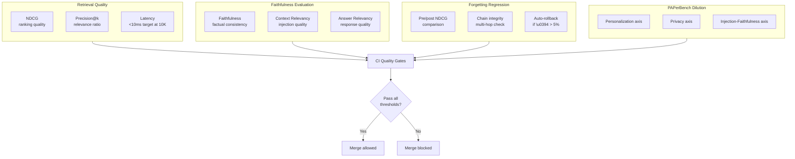

### Retrieval Quality

Every search returns quality metadata alongside results:

- **NDCG (Normalized Discounted Cumulative Gain)** — Measures ranking quality against relevance judgments. Computed per-query and tracked over time.
- **Precision@k** — What fraction of the top-k returned memories are actually relevant to the query.
- **Latency** — End-to-end search time including gate decision, BM25, vector, graph activation, and reranking. Target: <10ms at 10K memories.

### Faithfulness Evaluation

Memory injection quality is evaluated along three dimensions:

1. **Faithfulness** — Are the injected memories factually consistent with the stored content? Claim decomposition verifies that the agent's response doesn't misrepresent memories.
2. **Context relevancy** — What percentage of injected memories are actually relevant to the query? Irrelevant injections waste context budget and risk attention dilution.
3. **Answer relevancy** — Does the agent's response actually address the user's query, given the injected memories?

### Unanswerability Detection

Not every query has an answer in memory. The `UnanswerabilityDetector` evaluates whether the system should refuse rather than fabricate:

- Intent-aware thresholds: factual queries require higher confidence (0.5) than exploratory queries (0.25)
- Procedural queries use an intermediate threshold (0.4) — partial procedures are worse than no procedure
- Detection feeds back into the retrieval gate's Refuse mode

### Forgetting Regression

Every consolidation cycle (decay + garbage collection + fusion) is evaluated for quality impact:

- Pre/post NDCG comparison on a fixed query set
- Chain integrity — multi-hop graph traversals that succeed before and after the cycle
- Automatic rollback if NDCG degrades by more than 5%

This prevents the system from forgetting useful information in pursuit of storage efficiency.

### Benchmark Harness

A Criterion benchmark suite measures core operations at scale:

| Benchmark | Target (10K memories) | Target (100K memories) |
|-----------|----------------------|------------------------|
| Hybrid search | < 10ms | < 25ms |
| Memory store | < 5ms | < 5ms |
| Consolidation cycle | < 500ms | < 2s |
| Context assembly | < 10ms | < 10ms |

These benchmarks run in CI. Performance regressions beyond defined thresholds block merges.

### PAPerBench — Attention Dilution Testing

PAPerBench reveals a critical truth: as context length grows, both personalization accuracy (PA) and privacy protection (PP) degrade — "attention dilution." Worse, **privacy degrades before quality** for every model tested. This directly affects memory injection.

Engram implements three-axis dilution testing derived from PAPerBench:

1. **Personalization axis** — Inject N memories, measure answer accuracy. Find the per-model inflection point where adding more memories stops helping.
2. **Privacy axis** — Inject N memories containing PII, measure whether the model leaks PII in its response. Find the inflection point where the model starts ignoring privacy instructions.
3. **Injection-Faithfulness axis** — Inject N memories, measure whether the model stays faithful to memory content vs. hallucinating.

Per-model optimal injection caps are stored in the `ModelCapabilities` registry:

| Model | Optimal Injection Cap | Context Window | Notes |
|---|---|---|---|
| GPT-4 (8K) | 3 | 8K | Tiny window — every token matters |
| Claude Opus 4.6 (200K) | 15 | 200K | Large window but dilution still applies |
| Gemini 3.1 Pro (1M) | 20 | 1M | Largest window; still has inflection |
| Ollama local (varies) | min(8, context/8000) | Varies | Conservative for resource-constrained |

### DeepResearch Bench II — Binary Rubric Evaluation

DeepResearch Bench II provides the most rigorous evaluation methodology for deep research agents: 132 tasks across 22 domains evaluated with 9,430 binary rubrics. Even the best system (GPT-5.3) achieves only 45.40% overall satisfaction.

Engram adopts their three-tier rubric approach for self-evaluation:

| Tier | What It Measures | Weight |
|---|---|---|
| **Information Recall** | Did the agent retrieve and cite relevant memories? | 40% |
| **Analysis** | Did the agent reason correctly over retrieved memories? | 35% |
| **Presentation** | Is the response well-structured and actionable? | 25% |

When a rubric failure is detected, Engram traces it to a specific component:
- **Recall failure** → retrieval pipeline problem (search, reranking, or gate)
- **Analysis failure** → context assembly problem (wrong memories injected, budget misallocation)
- **Presentation failure** → downstream of Engram (model behavior, not memory system)

CI quality gates enforce minimum thresholds:

| Metric | Threshold | Blocks Merge |
|---|---|---|
| NDCG@10 | ≥ 0.45 | Yes |
| Context relevancy | ≥ 0.60 | Yes |
| Faithfulness | ≥ 0.70 | Yes |
| Search latency (10K) | ≤ 10ms | Yes |
| Unanswerability detection | ≥ 0.80 | Yes |
| Privacy leakage rate | ≤ 0.05 | Yes |

The paper's explicit conclusion — *"Agent Memory is the future direction"* — validates Engram's entire thesis.

---

## Context Continuity

Long-running agent sessions inevitably exceed context limits. Most systems handle this with silent truncation — conversation history is cut from the front and the agent loses context. Engram implements a checkpoint-and-continue system that preserves cognitive state across context boundaries.

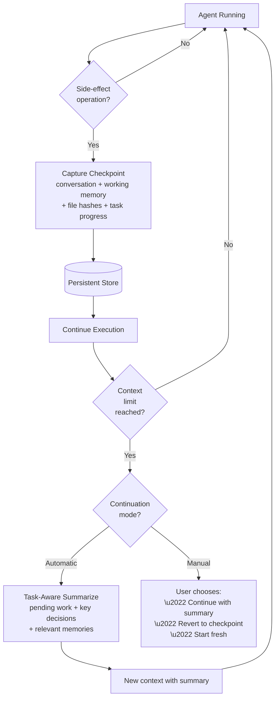

### Workspace Checkpoints

Before any side-effect operation (file write, tool execution, memory mutation), Engram captures a checkpoint:

- **Conversation state** — Full message history up to the checkpoint
- **Working memory snapshot** — All active slots with priorities and sources
- **File state** — Hashes of files that have been read or modified
- **Task progress** — Pending work items, completed items, key decisions

Checkpoints are stored in the persistent store. Any checkpoint can be reverted to, restoring the agent to an exact prior cognitive state.

### Hybrid Continuation

When context limits are reached, two continuation modes are available:

- **Automatic** (agent loops, tasks, orchestration) — The system automatically summarizes the conversation using task-aware extraction (pending work + key decisions + relevant memories), creates a new context with the summary, and continues execution. The agent never loses track of what it was doing.
- **Manual** (interactive chat) — The user is informed that context is being summarized and offered the choice to continue, revert to a checkpoint, or start fresh.

This replaces silent truncation with intelligent handoffs. No competing product offers checkpoint + continue that spans conversation + files + working memory.

---

## The Intelligence Loop

Engram's architecture is not a collection of independent features — it is a reinforcing loop where each principle strengthens the others. The Grand Research Synthesis reveals a unified intelligence architecture:

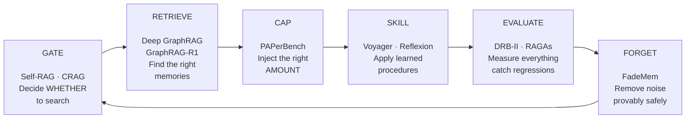

> **Each principle reinforces the others:**
> Gating makes retrieval efficient → Retrieval makes capping meaningful → Capping makes skills focused → Skills make evaluation concrete → Evaluation makes forgetting safe → Forgetting makes gating accurate

### Six Principles

| Principle | Component | Paper(s) | Function |
|---|---|---|---|
| **Gate** | RetrievalGate + IntentClassifier | Self-RAG, CRAG | Decide WHETHER to search (saves ~40% of searches) |
| **Retrieve** | Hybrid Search + GraphRAG + Graph Activation | Deep GraphRAG, GraphRAG-R1 | Find the right memories across local and global planes |
| **Cap** | ContextBuilder + Per-Model Injection Limits | PAPerBench | Inject the right AMOUNT (not too many, not too few) |
| **Skill** | Skill Library + Procedural Memory + Reflexion | Voyager, Reflexion | Apply learned procedures; compound over time |
| **Evaluate** | Quality Metrics + DRB-II Rubrics + PAPerBench Dilution | DRB-II, PAPerBench, RAGAs | Measure everything; catch regressions |
| **Forget** | FadeMem Dual-Layer + Fusion + Transactional GC | FadeMem | Remove noise provably safely; keep the store lean |

The key insight: **intelligent memory is not more memory — it is better memory.** Every component in the loop works to ensure that only the right information reaches the model at the right time, and that the system learns and improves with every interaction.

This six-principle loop represents the synthesis of 21 research papers spanning 5 years. No competing product implements all six principles as a unified architecture.

---

## Verification & Operational Completeness

An architecture of this complexity — 22 modules spanning three memory tiers, eight cognitive subsystems, and a six-principle intelligence loop — requires a verification model that is itself a first-class design concern. This section describes Engram's approach to ensuring that every architectural contract described in §1–§25 is exercised, measured, and proven correct under realistic conditions.

The verification architecture addresses four fundamental challenges that arise in any cognitive memory system: ensuring that multi-tier data pipelines flow correctly end-to-end, that scoring and ranking produce consistent results across system boundaries, that modules compose without silent degradation, and that the system's quality can be measured continuously rather than assumed.

### 26.1 Layered Verification Model

Engram's verification follows a four-layer pyramid. Each layer catches a different class of failure:

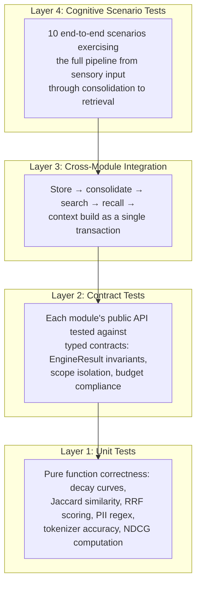

**Layer 1 — Unit tests** verify pure functions in isolation. These include decay curve monotonicity, Jaccard/cosine similarity correctness, RRF scoring, PII detection regex coverage, tokenizer per-model accuracy, and NDCG computation. Property-based testing (via `proptest`) is used for consolidation clustering invariants — specifically that cluster membership is reflexive and symmetric, that fusion never increases total memory count, and that decay is monotonically decreasing.

**Layer 2 — Contract tests** verify that each module's public API upholds its typed contract. Every function returning `EngineResult` is tested for both success and error paths. Scope isolation is verified: agent A's store operations are invisible to agent B's searches. Budget compliance is verified: the ContextBuilder never produces output exceeding the model's declared context window.

**Layer 3 — Cross-module integration** tests exercise multi-module pipelines as single logical operations. The canonical pipeline — store → consolidate → search → recall → context build — is tested with deterministic mocks (no LLM or embedding model required). Each integration test asserts that data flows correctly between tiers and that intermediate representations (embeddings, trust scores, quality metrics) propagate through the full chain.

**Layer 4 — Cognitive scenario tests** exercise the system as a whole against realistic usage patterns. These 10 scenarios form the system's acceptance criteria:

| Scenario | Modules Exercised | Invariant |
|---|---|---|
| Memory Lifecycle | graph, consolidation, schema | 50 episodic memories → clusters formed, semantic triples extracted |
| Forgetting Quality | graph, consolidation, retrieval_quality | Decay + GC cycle → NDCG does not degrade (transactional rollback) |
| Three-Tier Flow | sensory_buffer, working_memory, graph | 30 messages → sensory → working memory promotion → long-term storage |
| Multi-Agent Isolation | memory_bus, encryption, graph | 3 agents → scope-isolated search + bus delivery with capability tokens |
| Encryption Round-Trip | encryption, graph, schema | PII stored → encrypted at rest → decrypted on search → GDPR purge zero-residual |
| Context Budget Fidelity | context_builder, model_caps, tokenizer | 5 model sizes → token counts never exceed window → correct priority ordering |
| Dream Replay Idempotency | dream_replay, graph, meta_cognition | Two replay cycles → no duplicate edges, no double-strengthening |
| Entity Lifecycle | entity_tracking, graph | Aliased mentions → canonical resolution → entity-scoped retrieval |
| Contradiction Resolution | consolidation, graph | Conflicting facts → newer wins, `Contradicts` edge, confidence transferred |
| Skill Compounding | graph (procedural), bridge | Task success → skill extracted → failure → failure variant stored |

### 26.2 Single Source of Truth Principle

A critical design constraint for multi-layer systems is that scoring, ranking, and token estimation must happen in exactly one place. Engram enforces this by treating the Rust engine as the sole authority for all numerical computation:

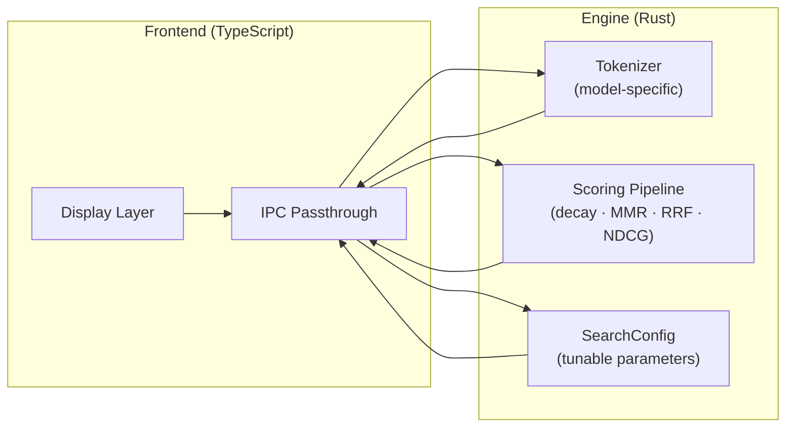

Token estimation uses model-specific divisors (Cl100k: $\div 3.4$, O200k: $\div 3.8$, Gemini: $\div 3.3$, SentencePiece: $\div 3.0$) rather than a fixed heuristic. Temporal decay, MMR diversity reranking, and quality scoring are computed server-side in Rust and returned as final scores. The frontend receives pre-scored, pre-ranked results and renders them without modification. Configuration parameters (BM25/vector weight, decay half-life, MMR lambda, relevance threshold) are read from the engine via IPC at startup, not duplicated as client-side constants.

This eliminates an entire class of divergence bugs where the frontend and backend disagree on compaction thresholds or result ordering.

### 26.3 Cognitive Pipeline Integration

The three-tier memory pipeline (§4) is designed as a unidirectional flow: Sensory Buffer → Working Memory → Long-Term Store. The verification model enforces that every tier is instantiated, connected, and exercised:

```mermaid
flowchart LR
    IN["Incoming<br/>Message"] --> SB["Sensory Buffer<br/>(ring buffer, O(1) push)"]
    SB -->|"eviction on<br/>capacity overflow"| WM["Working Memory<br/>(priority-sorted slots)"]
    WM -->|"lowest-priority<br/>eviction"| LTM["Long-Term Store<br/>(SQLite graph)"]
    LTM -->|"recall by<br/>ContextBuilder"| WM
    SB -->|"drain within<br/>token budget"| CTX["ContextBuilder<br/>(budget-aware assembly)"]
    WM -->|"priority-ordered<br/>slots"| CTX
    LTM -->|"auto-recalled<br/>memories"| CTX
    CTX --> LLM["LLM Prompt"]
```

The IntentClassifier gates every retrieval operation, producing signal weights that adapt hybrid search (§6) to the query type: factual queries weight BM25 higher, conceptual queries weight vector similarity higher, procedural queries boost the procedural memory store. This intent-adapted weighting feeds through the full pipeline — from the initial `classify_intent()` call through `resolve_hybrid_weight()` to the final `rerank_results()` output.

All consumer paths — chat, tasks, orchestrator, swarm, channel bridges — route through a single `gated_search()` entry point. This guarantees that every retrieval operation receives gate classification, intent-adapted weighting, encryption-aware decryption, CRAG quality checking, and NDCG measurement. No path bypasses the quality pipeline.

### 26.4 Embedding Model Portability

Vector embeddings are model-specific: cosine similarity between vectors from different models is meaningless. Engram handles model migration through the Dream Replay subsystem:

1. Every memory records the embedding model that generated its vector (stored in the `embedding_model` column).
2. When the configured embedding model changes, all existing vectors are marked stale.
3. Dream Replay Phase 2 (re-embed stale) processes stale vectors during idle time, generating new embeddings with the current model.
4. During the transition period, the hybrid search pipeline falls back gracefully to BM25-only for memories with stale embeddings — the system degrades to keyword search rather than producing invalid similarity scores.

This design ensures that users can switch between embedding models (e.g., `nomic-embed-text` → `mxbai-embed-large`) without data loss or retrieval corruption.

### 26.5 Scale Verification

The system's performance characteristics must be verified at realistic scale, not just assumed from algorithmic complexity bounds. Engram defines five scale tiers with target latency budgets:

| Memory Count | Search Latency | Consolidation Cycle | Concurrent Readers | RAM Budget |
|---|---|---|---|---|
| 1K | <5ms | <100ms | 8 | <50MB |
| 10K | <10ms | <500ms | 8 | <100MB |
| 50K | <15ms | <2s | 8 | <200MB |
| 100K | <25ms | <5s | 8 | <350MB |
| 500K | <50ms (HNSW disk) | <15s | 8 | <500MB |

These targets are enforced through Criterion benchmark suites that run against seeded databases at each tier. Regressions beyond the target latency block merge. The tiered vector index transitions automatically from brute-force (< 1K) to in-memory HNSW (1K–100K) to disk-backed HNSW (> 100K), keeping search latency sublinear across the full range.

### 26.6 Quality Feedback Loop

Verification is not a one-time activity — it is a continuous feedback loop built into the system's runtime. Every search operation produces a `RetrievalQualityMetrics` payload containing:

- **NDCG** — Normalized Discounted Cumulative Gain measuring ranking quality (§23)
- **Average relevancy** — Mean composite trust score across returned memories
- **Candidates filtered** — How many memories were considered vs. returned
- **Search latency** — Wall-clock time for the full pipeline
- **Rerank strategy applied** — Which of the four strategies was selected

These metrics serve dual purposes: they surface in the cognitive debug panel for developer inspection, and they feed the transactional forgetting system. If a garbage collection cycle degrades NDCG by more than 5%, the cycle is rolled back via vector savepoint. This ensures that the system can never silently degrade its own retrieval quality through its maintenance operations.

The consolidation engine reports its own metrics per cycle: candidates processed, clusters formed, semantic triples extracted, contradictions resolved, and knowledge gaps discovered. These allow the system to track its learning velocity — how efficiently it converts raw episodic experience into structured semantic knowledge over time.

---

## References

### Foundations

- Ebbinghaus, H. (1885). *Memory: A Contribution to Experimental Psychology.*
- Anderson, J. R. (1983). *A Spreading Activation Theory of Memory.* Journal of Verbal Learning and Verbal Behavior, 22(3), 261-295.
- Tulving, E. (1972). *Episodic and Semantic Memory.* In Organization of Memory. Academic Press.
- Miller, G. A. (1956). *The Magical Number Seven, Plus or Minus Two.* Psychological Review, 63(2), 81-97.
- Bartlett, F. C. (1932). *Remembering: A Study in Experimental and Social Psychology.* Cambridge University Press.
- Nader, K., Schafe, G. E., & LeDoux, J. E. (2000). *Fear Memories Require Protein Synthesis in the Amygdala for Reconsolidation After Retrieval.* Nature, 406, 722-726.

### Information Retrieval

- Robertson, S. E., & Zaragoza, H. (2009). *The Probabilistic Relevance Framework: BM25 and Beyond.* Foundations and Trends in IR, 3(4), 333-389.
- Carbonell, J., & Goldstein, J. (1998). *The Use of MMR, Diversity-Based Reranking for Reordering Documents and Producing Summaries.* SIGIR '98.
- Cormack, G. V., Clarke, C. L. A., & Buettcher, S. (2009). *Reciprocal Rank Fusion Outperforms Condorcet and Individual Rank Learning Methods.* SIGIR '09.
- Malkov, Y. A., & Yashunin, D. A. (2018). *Efficient and Robust Approximate Nearest Neighbor Using Hierarchical Navigable Small World Graphs.* IEEE TPAMI.
- Chen, J., et al. (2023). *Dense X Retrieval: What Retrieval Granularity Should We Use?* ACL 2024.

### Neuroscience & Cognition

- Cahill, L., & McGaugh, J. L. (1995). *A Novel Demonstration of Enhanced Memory Associated with Emotional Arousal.* Consciousness and Cognition, 4(4), 410-421.
- Flavell, J. H. (1979). *Metacognition and Cognitive Monitoring.* American Psychologist, 34(10), 906-911.
- Wilson, M. A., & McNaughton, B. L. (1994). *Reactivation of Hippocampal Ensemble Memories During Sleep.* Science, 265(5172), 676-679.
- Diekelmann, S., & Born, J. (2010). *The Memory Function of Sleep.* Nature Reviews Neuroscience, 11(2), 114-126.

### Distributed Systems

- Shapiro, M. et al. (2011). *Conflict-Free Replicated Data Types.* SSS 2011.
- Getoor, L., & Machanavajjhala, A. (2012). *Entity Resolution: Theory, Practice & Open Challenges.* VLDB Tutorial.

### Agent Architectures

- Park, J. S., et al. (2023). *Generative Agents: Interactive Simulacra of Human Behavior.* UIST '23.
- Packer, C., et al. (2023). *MemGPT: Towards LLMs as Operating Systems.* arXiv:2310.08560.
- Wang, G., et al. (2023). *Voyager: An Open-Ended Embodied Agent with Large Language Models.* NeurIPS 2023.
- Shinn, N., et al. (2023). *Reflexion: Language Agents with Verbal Reinforcement Learning.* NeurIPS 2023.
- Du, Y., et al. (2023). *HELPER: Memory-Augmented LLMs for Instruction-Following Embodied Agents.* EMNLP 2023.

### Retrieval-Augmented Generation

- Asai, A., et al. (2024). *Self-RAG: Learning to Retrieve, Generate, and Critique Through Self-Reflection.* ICLR 2024.
- Yan, S., et al. (2024). *Corrective Retrieval Augmented Generation (CRAG).* ICLR 2024.
- Edge, D., et al. (2024). *From Local to Global: A Graph RAG Approach to Query-Focused Summarization.* Microsoft Research.
- Microsoft Research. (2025). *LazyGraphRAG: Setting a New Standard for Quality and Cost.* microsoft.com.
- Es, S., et al. (2024). *RAGAs: Automated Evaluation of Retrieval Augmented Generation.* EACL 2024.
- Chen, J., et al. (2023). *Dense X Retrieval: What Retrieval Granularity Should We Use?* ACL 2024.
- Jiang, Z., et al. (2023). *LLMLingua: Compressing Prompts for Accelerated Inference.* EMNLP 2023.
- Santhanam, K., et al. (2022). *ColBERTv2: Effective and Efficient Retrieval via Lightweight Late Interaction.* NAACL 2022.

### 2026 Research (Revolutionary Advances)

- Zhang, Y., et al. (2026). *FadeMem: Biologically-Inspired Forgetting for Efficient Agent Memory.* arXiv:2601.18642. — Dual-layer adaptive forgetting with measured quality; 45% storage reduction, F1=29.43.
- Agarwal, S., et al. (2026). *Long Context, Less Focus: A Scaling Gap in LLMs Revealed through Privacy and Personalization* (PAPerBench). arXiv:2602.15028. — Proves attention dilution degrades personalization and privacy; validates budget-first injection.
- Li, H., et al. (2026). *Deep GraphRAG: A Balanced Approach to Hierarchical Retrieval and Adaptive Integration.* arXiv:2601.11144. — Three-stage hierarchical pipeline; DW-GRPO enables 1.5B→70B quality.
- Chen, W., et al. (2026). *WildGraphBench: Benchmarking GraphRAG with Wild-Source Corpora.* arXiv:2602.02053. — Reveals GraphRAG failure modes; validates query-type routing.
- Wang, Z., et al. (2026). *DeepResearch Bench II: Diagnosing Deep Research Agents via Rubrics from Expert Reports.* arXiv:2601.08536. — 9,430 binary rubrics across 132 tasks; best system achieves 45.40%; calls Agent Memory the future.
- Xu, R., et al. (2026). *GraphRAG-R1: Graph Retrieval-Augmented Generation with Process-Constrained Reinforcement Learning.* arXiv:2507.23581 (accepted WWW 2026). — PRA + CAF reward signals for retrieval policy training.
- Zhao, P., et al. (2026). *Retrieval-Augmented Generation for AI-Generated Content: A Survey.* Data Science and Engineering, Springer. — Comprehensive RAG taxonomy and benchmark map.

---

*Project Engram is part of OpenPawz, an open-source AI platform licensed under MIT. Contributions welcome.*
