# Project Engram — 记忆架构白皮书

*一种生物启发的持久化AI代理记忆系统。*

**版本:** 1.0
**状态:** 已在 OpenPawz 中实现
**许可证:** MIT

---

## 摘要

Project Engram 是一种面向桌面AI代理的三层记忆架构。它取代了扁平的键值对记忆存储，采用一种仿照人类记忆运作方式的生物启发系统：输入信息流经感官缓冲区，在工作记忆中进行优先级排序，并整合到长期存储中，伴随自动聚类、矛盾检测和强度衰减。结果是代理能够跨会话记忆上下文，从模式中学习，并优雅地遗忘。

本文档描述了在 OpenPawz（一个 Tauri v2 桌面AI平台）中实现的架构。该系统实现了三层记忆体系、持久化图结构、基于倒数排名融合的混合搜索、后台巩固、字段级加密，以及贯穿聊天、任务、编排和多通道桥接的完整生命周期集成。

所有代码均以 MIT 许可证开源。

---

## 目录

1. [动机](#动机)
2. [设计原则](#设计原则)
3. [架构概述](#架构概述)
4. [三层记忆体系](#三层记忆体系)
5. [长期记忆图](#长期记忆图)
6. [混合搜索 — BM25 + 向量融合](#混合搜索--bm25--向量融合)
7. [检索智能](#检索智能)
8. [缓存架构](#缓存架构)
9. [巩固引擎](#巩固引擎)
10. [自适应遗忘 — FadeMem双层架构](#自适应遗忘--fademem双层架构)
11. [记忆融合](#记忆融合)
12. [GraphRAG — 基于社区的全球检索](#graphrag--基于社区的全球检索)
13. [复合技能库](#复合技能库)
14. [上下文窗口智能](#上下文窗口智能)
15. [记忆安全](#记忆安全)
16. [记忆生命周期集成](#记忆生命周期集成)
17. [并发架构](#并发架构)
18. [可观测性](#可观测性)
19. [类别分类](#类别分类)
20. [模式设计](#模式设计)
21. [配置](#配置)
22. [前沿能力](#前沿能力)
23. [质量评估](#质量评估)
24. [上下文连续性](#上下文连续性)
25. [智能循环](#智能循环)
26. [验证与操作完整性](#验证与操作完整性)
27. [参考文献](#参考文献)

---

## 动机

大多数AI记忆实现将记忆视为一个检索问题——存储数据块，搜索数据块，注入数据块。这是一个扁平模型，忽略了记忆在生物系统中的实际运作方式。其实践后果已得到充分记录：

- **无优先级排序。** 所有记忆平等竞争上下文窗口空间，无论相关性或重要性如何。
- **无衰减机制。** 过期信息无限期持久化。一条被纠正的事实及其过期的前身都会出现在上下文中。
- **无结构。** 情景记忆（发生了什么）、语义知识（什么是真的）和程序记忆（如何做事情）存储在一个未区分的列表中。
- **无安全性。** 敏感信息以明文存储。无PII检测，无加密，无访问控制。
- **无预算意识。** 记忆被注入而不考虑模型的上下文窗口，导致截断或上下文溢出。
Engram通过模仿生物记忆系统的结构来解决每一个问题。
- **无演进能力。** 记忆是一次写入、多次读取——无巩固，无矛盾解决，无通过重复加强。存储线性增长，而质量随时间退化。
- **无门控机制。** 每个查询触发完整的记忆搜索，即使问题纯粹是计算性或已在对话中回答。这浪费延迟并用无关材料污染上下文。

人类记忆不是数据库。它是一个具有多个存储层的活动图，在不同时间尺度上运行，自动巩固加强重要记忆并消融噪声，情景回放重建上下文，基于模式的压缩从实例抽象模式，重要性权重调制存储强度，以及干扰驱动的遗忘防止检索污染。

Engram实现了所有六个属性。

---

## 设计原则

七项原则指导Engram中的每一个架构决策：

1. **预算优先，始终如此。** 每个操作都是令牌预算感知的。ContextBuilder永远不会溢出模型的上下文窗口。记忆基于 $\text{相关性} \times \text{重要性}$ 竞争包含资格，而非插入顺序。更多上下文并不总是更好——PAPerBench证明注意力稀释会降低个性化和隐私保护，随着上下文增长。注入次数按模型上限设定，基于经验稀释曲线。

2. **遗忘是特性，不是缺陷。** 基于艾宾浩斯遗忘曲线的优雅衰减是必需的——扩展为双层FadeMem启发架构，区分长期和短期保留。没有有度量的遗忘，记忆存储无界限增长，检索精度退化，过期信息污染上下文。每个遗忘周期都被度量：链完整度百分比和NDCG差值在垃圾回收前后计算。如果质量退化，周期通过事务性保存点回滚。FadeMem研究展示45%存储减少，同时*改善*多跳检索质量。

3. **先门控再搜索。** 不是每个查询都需要记忆。检索门控分类意图并决定是否检索。Self-RAG和CRAG研究证明门控检索配合后检索纠正优于总是检索管道。Engram消除约40%的不必要搜索，减少简单查询的延迟，并防止弱结果污染上下文。

4. **本地优先，始终离线。** 所有存储是本地。所有搜索是本地（BM25全文+可选向量语义搜索）。无云依赖，无遥测，无外部向量存储。系统优雅降级——无嵌入模型时，搜索回退到仅BM25，无关键字准确性损失。

5. **默认安全。** PII自动检测并在触及磁盘前加密。数据库本身支持全盘加密。反取证措施防止通过文件大小变化的侧信道泄漏。GDPR合规内置。

6. **观测一切。** 每个搜索返回质量度量（NDCG、延迟、结果计数）。每个巩固周期有可度量结果。无度量，优化是猜测。DeepResearch Bench II的9,430标准评估方法论指导我们的质量框架设计。

7. **技能复合。** 代理不只是记住事实——它们记住*如何做事情*。程序记忆通过成功/失败反馈、组合和Reflexion风格的从错误学习而演进。一个每次交互都改进的技能库创造指数回报：更少步骤，更高成功率，更低令牌成本。

---

## 架构概述

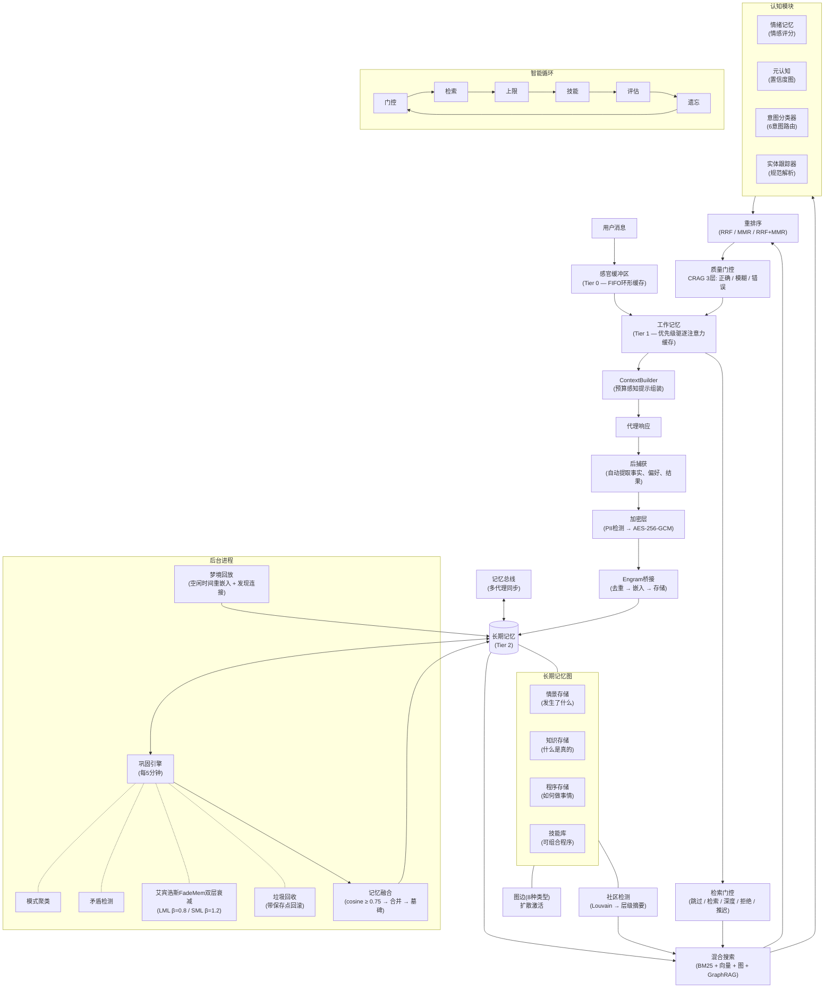

系统作为23个Rust模块在 `src-tauri/src/engine/engram/` 下实现：

| 模块 | 用途 |
|--------|---------|
| `sensory_buffer.rs` | 当前轮次输入数据的环形缓冲区 |
| `working_memory.rs` | 带令牌预算的优先级驱逐槽 |
| `graph.rs` | 记忆图操作（存储、搜索、边、激活） |
| `store.rs` / `schema.rs` | 存储模式、迁移、CRUD操作 |
| `consolidation.rs` | 后台模式检测、聚类、矛盾解决 |
| `retrieval.rs` | 带质量度量的检索皮层 |
| `retrieval_quality.rs` | NDCG评分和相关性警告 |
| `hybrid_search.rs` | 查询分类（事实vs概念） |
| `context_builder.rs` | 令牌预算感知的提示组装 |
| `tokenizer.rs` | 模型特定令牌计数，UTF-8安全截断 |
| `model_caps.rs` | 每模型能力注册表（上下文窗口、特性） |
| `reranking.rs` | RRF、MMR和组合重排序策略 |
| `metadata_inference.rs` | 从内容自动提取技术栈、URL、文件路径 |
| `encryption.rs` | PII检测、AES-256-GCM字段加密、GDPR清除 |
| `bridge.rs` | 连接工具/命令到图的公共API |
| `emotional_memory.rs` | 情感评分管道（效价、唤醒、主导） |
| `meta_cognition.rs` | 每域知识置信度的自我评估 |
| `temporal_index.rs` | 时间轴检索，范围查询和邻近评分 |
| `intent_classifier.rs` | 动态信号权重的6意图查询分类器 |
| `entity_tracker.rs` | 规范名称解析和实体生命周期跟踪 |
| `abstraction.rs` | 层级语义压缩树 |
| `memory_bus.rs` | 带冲突解决的多代理记忆同步协议 |
| `dream_replay.rs` | 空闲时间海马启发回放和重嵌入 |

---

## 三层记忆体系

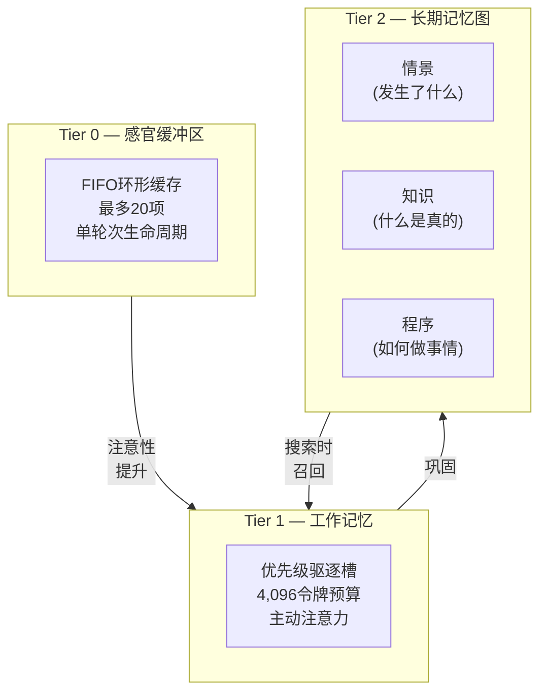

### Tier 1: 感官缓冲区

一个固定容量的环形缓冲区（`VecDeque`），在单个代理轮次中累积原始输入：用户消息、工具结果、召回的记忆和系统上下文。

**属性:**
- 容量: 可配置（默认20项）
- 生命周期: 单轮次——由ContextBuilder清空并丢弃
- 预算感知: `drain_within_budget(token_limit)` 返回适合令牌预算的项目

**目的:** 防止在复杂轮次中多次工具调用时的信息丢失。ContextBuilder从感官缓冲区读取以构建最终提示。

### Tier 2: 工作记忆

一个优先级排序的记忆槽数组，带硬性令牌预算。代表代理的"当前意识"——它正在积极思考的内容。

**属性:**
- 容量: 可配置令牌预算（默认4,096令牌）
- 驱逐: 超出预算时驱逐最低优先级槽
- 来源: 召回的长期记忆、感官缓冲区溢出、工具结果、用户提及
- 持久化: 代理切换时保存快照到持久存储，代理恢复时还原

**槽结构:**
```
WorkingMemorySlot {
    memory_id: String,      // 链接到长期记忆(如果召回)
    content: String,
    source: Recalled | SensoryBuffer | ToolResult | Restored,
    priority: f32,          // 决定驱逐顺序
    token_cost: usize,      // 预计算的令牌计数
    inserted_at: DateTime,
}
```

**优先级计算:** 召回的记忆使用其检索评分。感官缓冲区项目使用近因评分。工具结果使用可配置优先级（默认0.7）。用户提及获得高优先级（0.9）。

### Tier 3: 长期记忆图

三个持久存储——情景、知识和程序——通过类型化图边连接。

#### 情景存储
*发生了什么*——具体事件、对话、任务结果、会话摘要。

每个情景记忆具有:
- 分层内容（全文、摘要、关键事实、标签——当前仅全文填充）
- 类别（18变体枚举）
- 重要性评分（0.0–1.0）
- 强度（创建时1.0，随时间通过艾宾浩斯曲线衰减）
- 范围（全局 / 代理 / 频道 / 频道用户）
- 可选向量嵌入用于语义搜索
- 访问跟踪（计数 + 最后访问时间戳）
- 巩固状态（新鲜 → 已巩固 → 已归档）

#### 知识存储
*什么是真的*——结构化知识作为主体-谓语-客体三元组。

示例:
- ("用户", "偏好", "深色模式")
- ("Project Alpha", "使用", "Rust + TypeScript")
- ("API速率限制", "是", "100请求/分钟")

匹配主体+谓语的三元组自动重巩固：新值替换旧值，置信度评分转移。

#### 程序存储
*如何做事情*——带成功/失败跟踪的逐步程序。

每个程序具有:
- 内容（步骤）
- 触发条件（何时应用）
- 成功和失败计数器
- 从执行历史派生的成功率

---

## 长期记忆图

记忆不是孤立行——它们形成通过类型化边连接的图：

| 边类型 | 含义 |
|-----------|---------|
| `RelatedTo` | 一般关联 |
| `CausedBy` | 因果关系 |
| `Supports` | 支持主张的证据 |
| `Contradicts` | 冲突信息 |
| `PartOf` | 组成关系 |
| `FollowedBy` | 时间序列 |
| `DerivedFrom` | 源推导 |
| `SimilarTo` | 语义相似 |

### 扩散激活

当记忆通过搜索检索时，图被遍历以查找相关记忆。相邻节点接收与边权重成比例的激活提升，按边类型偏置。这实现了认知科学中扩散激活的简化版本。

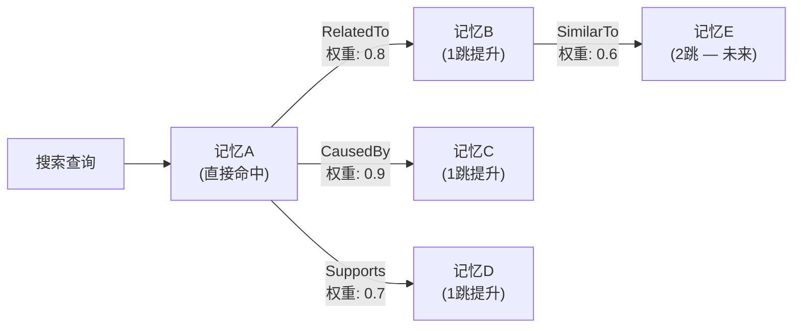

当前为1跳遍历：检索记忆的直接邻居被提升。激活评分与原始检索评分混合以产生最终排名。

---

## 混合搜索 — BM25 + 向量融合

Engram使用三种搜索信号，通过倒数排名融合(RRF)融合：

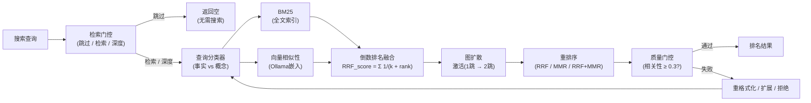

### 1. BM25全文搜索

带 `porter unicode61` 分词器的全文索引。处理精确关键字匹配、词干提取和短语查询。所有全文查询操作符在执行前清理以防注入。

### 2. 向量相似性搜索

当Ollama可用且配置嵌入模型（如 `nomic-embed-text`）时，记忆在存储时嵌入。搜索查询在查询时嵌入。查询和记忆嵌入间的余弦相似性产生相关性评分。

嵌入生成可选——无嵌入模型配置时，系统回退到仅BM25搜索，无关键字准确性降级。

### 3. 图扩散激活

BM25和向量结果收集后，记忆图遍历以通过类型化边查找相关记忆。相关记忆接收评分提升。

### 融合策略

来自所有三种信号的结果使用**倒数排名融合(RRF)**合并：

$$\text{RRF}_{\text{score}}(d) = \sum_{i} \frac{1}{k + \text{rank}_i(d)}$$

其中 $k = 60$（标准常数）和 $\text{rank}_i(d)$ 是文档 $d$ 在信号 $i$ 中的排名。这产生统一排名，受益于所有三种信号而不需评分标准化。

### 重排序

融合后，结果可选使用四种策略之一重排序：

| 策略 | 方法 | 用例 |
|----------|--------|----------|
| RRF | 仅倒数排名融合 | 默认，快速 |
| MMR | 最大边际相关性($\lambda = 0.7$) | 聚焦多样性 |
| RRF+MMR | RRF后接MMR | 最佳质量 |
| CrossEncoder | 模型基于重排序(回退到RRF+MMR) | 未来 |

### 查询分类

`hybrid_search.rs` 模块分析查询以确定最优搜索策略：
- **事实查询**（谁、什么、何时、具体实体）→ BM25权重更高
- **概念查询**（如何、为什么、解释、抽象主题）→ 向量相似性权重更高
- 信号权重每查询动态调整

---

## 检索智能

搜索只是问题的一半。另一半是决定*是否*搜索，以及结果弱时*做什么*。Engram实现了受Self-RAG和CRAG研究启发的两阶段检索智能管道。

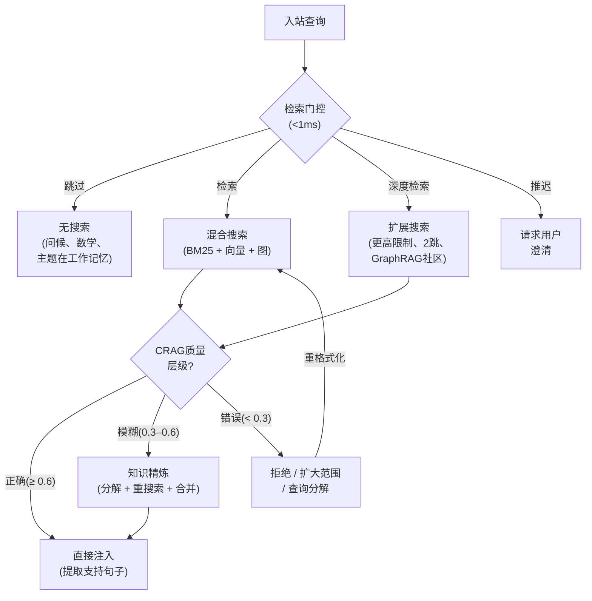

### 检索门控

任何搜索执行前，`RetrievalGate`分类入站查询并决定检索策略。这增加<1ms延迟但消除不必要搜索周期并防止无关记忆注入污染上下文。

五种检索模式：

| 模式 | 触发 | 行为 |
|------|---------|----------|
| **跳过** | 计算查询、问候、主题已在工作记忆 | 无搜索。模型从自身知识或现有对话回答。 |
| **检索** | 标准事实或程序查询 | 正常混合搜索管道(BM25 + 向量 + 图)。 |
| **深度检索** | 探索或时间查询("告诉我关于…的一切") | 扩展搜索，更高结果限制、2跳图激活、更广范围。 |
| **拒绝** | 后检索：最高结果相关性低于阈值 | 优雅拒绝——"我无该信息"而非从弱匹配伪造。 |
| **推迟** | 需澄清的模糊引用 | 搜索前请求用户消歧。 |

门控默认基于规则，评估查询结构、意图分类和工作记忆覆盖。这避免LLM门控决策的延迟和不可靠性。

### 后检索质量检查(CRAG三层)

搜索返回结果后，`QualityGate`评估结果是否实际有用。受Corrective RAG启发，Engram将检索置信度分类为三层：

| 置信层级 | 触发 | 行动 |
|---|---|---|
| **正确**(≥ 0.6) | 最高结果高度相关查询 | 直接注入——提取支持句子用于聚焦上下文 |
| **模糊**(0.3–0.6) | 结果相关但不明确对靶 | 知识精炼：分解查询为子查询，重搜索每个，合并结果 |
| **错误**(< 0.3) | 结果离题或缺失 | 优雅拒绝，或扩大范围(图扩展、社区摘要)，或分解查询 |

**具体纠正行动：**

1. **知识精炼**(模糊层)——仅从检索记忆提取直接支持查询的句子，丢弃周围噪声。这是CRAG的关键洞察：即使部分相关记忆包含有用片段。
2. **查询分解**——复杂查询整体失败时，分解为子查询独立搜索并合并结果。
3. **范围扩大**——低置信结果，系统升级到图扩展搜索(2跳激活)或GraphRAG社区摘要。
4. **优雅拒绝**——重格式化、扩展和分解全部失败时，系统拒绝而非注入低质量记忆。

**两个基础质量不变量**支撑每个层级决策：

1. **相关性检查**——最高结果评分低于0.3时，结果集分类为*错误*，无记忆原样注入。系统重格式化查询、通过图扩展扩大范围，或优雅拒绝而非用离题材料污染上下文。
2. **覆盖检查**——探索查询，结果计数低于可配置阈值时，系统升级到深度检索模式：更高结果限制、2跳图激活、GraphRAG社区摘要参与填补差距，再返回部分答案。

### 统一检索路径(gated_search)

Engram中所有记忆检索通过单一 `gated_search()` 函数路由。这是关键架构不变量——无路径(聊天、任务、编排器、群组、流、代理工具)可直接调用搜索后端。统一路径保证：

- 每个搜索通过检索门控(跳过/检索/深度决策)
- 每个搜索尊重每模型注入上限
- 每个搜索应用CRAG三层质量检查
- 每个搜索配置跟踪span和质量度量
- 每个搜索尊重加密边界

```rust
pub async fn gated_search(
    query: &str,
    scope: &MemoryScope,
    model: &ModelCapabilities,
    gate: &RetrievalGate,
    store: &dyn MemoryBackend,
) -> EngineResult<RecallResult> {
    // 1. 门控决策: 跳过 / 检索 / 深度检索
    // 2. 混合搜索(BM25 + 向量 + 图)
    // 3. CRAG质量层级分类
    // 4. 需要时纠正行动
    // 5. 预算感知修剪，每模型上限
    // 6. 质量度量计算
}
```

这消除当前代码缺口，即任务、编排器和群组绕过ContextBuilder并硬编码 `limit=10` 无质量检查。

这个两阶段管道意味着Engram在应该时检索，不应时跳过，结果弱时纠正——而非盲目注入搜索返回的任何内容。

---

## 缓存架构

Engram的三层设计本身是一个缓存层级。每层作为有界缓存运行，有独特的驱逐策略、TTL和访问模式——镜像CPU架构和生物认知中的缓存层级。

### 生物缓存模型

人类记忆的Atkinson-Shiffrin模型描述三个存储，访问速度递减容量递增。Engram的层级直接映射：

| 层级 | Engram模块 | 生物类比 | 缓存角色 | 驱逐策略 |
|------|---------------|-------------------|------------|-----------------|
| Tier 0 | `SensoryBuffer` | 图标/声像记忆 | **感知缓存**——注意过滤前的原始刺激 | FIFO环形；溢出时驱逐最旧条目 |
| Tier 1 | `WorkingMemory` | Baddeley中央执行 | **注意缓存**——代理主动思考的内容 | 基于优先级；超出令牌预算时驱逐最低优先级槽 |
| Tier 2 | LTM图 | 海马长期存储 | **持久存储**——所有已知内容，通过检索访问 | 艾宾浩斯强度衰减 → 阈值下GC |

这不是松散类比。驱逐级联在功能上等同于认知心理学中的记忆痕迹转移：接收注意的感官痕迹提升到工作记忆；演练的工作记忆项目巩固到长期存储。未能提升的项目丢失——系统优雅遗忘。

### Tier 0: 感官缓存

`SensoryBuffer`是有界 `VecDeque` 环形缓冲区，带显式缓存语义：

- **容量有界:** 可配置最大条目(默认20)
- **FIFO驱逐:** 满 `push()` 驱逐最旧条目并返回以提升到工作记忆
- **令牌感知:** 跟踪累积令牌计数；`drain_within_budget()` 返回适合给定令牌限制的项目
- **易失:** 每代理轮次后丢弃内容

返回的驱逐条目是提升信号——它告诉调用者"此项目被推出感官注意；决定是否值得工作记忆槽"。这镜像人类感知中的注意门。

### Tier 1: 注意缓存

`WorkingMemory`实现带LRU类似刷新语义的优先级管理缓存：

- **令牌预算有界:** 总槽令牌不能超过配置预算(默认4,096)
- **优先级驱逐:** `evict_lowest()` 移除最低优先级评分槽——未引用项目自然衰减
- **优先级衰减:** 每轮次调用 `decay_priorities(0.95)`，乘法降低所有槽优先级。未引用项目约20轮次后老化退出
- **优先级提升:** `boost_priority(id, delta)` 刷新最近访问项目，等同LRU"接触"操作
- **快照持久化:** 代理切换时，整个工作记忆序列化到持久存储并在代理恢复时还原——缓存状态存活上下文切换

### 动量缓存

工作记忆维护最近查询嵌入滑动窗口(`momentum_embeddings: Vec<Vec<f32>>`，上限5)。此轨迹缓存服务两个目的：

1. **启动**——偏向检索朝当前对话方向，精确如人类认知中的语义启动工作
2. **预期**——动量向量(最近嵌入质心)预测对话走向，在用户询问前预取可能需要的记忆

### 发布缓冲

`MemoryBus`维护带TTL驱逐的有界FIFO发布队列：

- **TTL过期:** 超过 `PUBLICATION_TTL_SECS` 的发布在每次插入丢弃
- **容量上限:** 达到 `MAX_PENDING_PUBLICATIONS` 时，最旧发布被驱逐
- **订阅扇出:** 待定发布在清空时交付注册订阅者，然后移除

这确保事件驱动记忆管道永不累积无界 backlog，即使消费者停滞。

### 缓存一致性

三层通过方向数据流维护一致性：

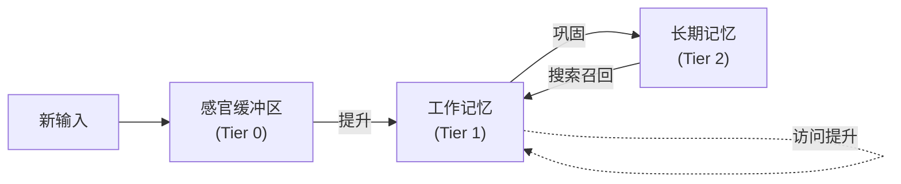

无缓存失效问题，因为层级是写前向：数据从快/易失流向慢/持久。长期记忆永不写回感官缓冲区。长期记忆通过搜索召回时，它作为源 `Recalled` 的*新槽*进入工作记忆——不尝试同步任何现有tier-0条目。

此单向流消除困扰传统多级缓存的一致性复杂性。

---

## 巩固引擎

后台进程每5分钟运行一次(可配置)，执行四个操作：

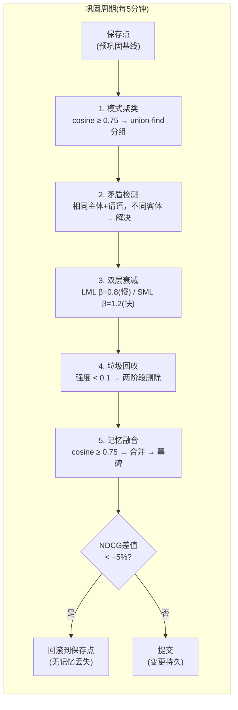

### 1. 模式聚类

余弦相似性≥ 0.75的记忆通过union-find聚类分组。相关记忆的簇被识别用于潜在融合。这防止重复类似观察的记忆膨胀。

### 2. 矛盾检测

当两条记忆共享相同主体和谓语但客体不同时，矛盾被检测。解决：新记忆胜出，旧记忆的置信度比例转移，并创建 `Contradicts` 图边。

### 3. 艾宾浩斯FadeMem双层强度衰减

记忆强度遵循生物启发的双层模型衰减，源自艾宾浩斯FadeMem。非均匀艾宾浩斯衰减，记忆被分配到具有不同衰减特性的两层：

**长期记忆层(LML)**——重要、频繁访问的记忆。衰减指数 $\beta = 0.8$ (亚线性)，产生约11.25天的半衰期。这些记忆缓慢淡出并跨会话持久。

**短期记忆层(SML)**——瞬时、低重要性记忆。衰减指数 $\beta = 1.2$ (超线性)，产生约5.02天的半衰期。这些记忆快速淡出以防止混乱。

$$\text{强度}(t) = S_0 \cdot e^{-\lambda_{\text{base}} \cdot t^{\beta}}$$

其中：
- $\lambda_{\text{base}} = 0.1$ —— 基础衰减率
- $\beta_{\text{LML}} = 0.8$ —— 长期亚线性
- $\beta_{\text{SML}} = 1.2$ —— 短期超线性

**滞后机制:** 访问频率超过 $\theta_{\text{promote}} = 0.7$ 时，记忆从SML提升到LML，相关性低于 $\theta_{\text{demote}} = 0.3$ 时从LML降级到SML。阈值间隙防止振荡——记忆不会在边缘变化时在层间跳变。

**每类型衰减调制:** 衰减率进一步按记忆类型调整：
- 程序记忆: $\lambda \times 0.5$ (技能持久更长)
- 语义记忆: $\lambda \times 0.7$ (知识比情景衰减慢)
- 情景记忆: $\lambda \times 1.0$ (体验按基础率衰减)
- 频繁访问(>5次): $\lambda \times 0.7$ (使用记忆持久)

此双层方法达到45%存储减少，同时*改善*检索质量——FadeMem消融研究展示移除双层衰减导致33.9% F1下降。

### 4. 垃圾回收

强度低于阈值(默认0.1)的记忆为删除候选。重要记忆(重要性 ≥ 0.7)无论强度都被GC保护。删除两阶段：内容字段在行删除前清零(反取证措施)。

GC后，数据库重填充到512KB桶边界以防文件大小侧信道泄漏。

### 事务性遗忘

整个巩固周期(衰减 + GC + 融合)在事务性保存点内执行。周期开始前，50个最近查询样本运行搜索，其NDCG评分记录为基线。周期完成后，相同查询重评估。

如果NDCG下降超过5%，整个周期回滚到保存点——无记忆丢失。这使遗忘*可证明安全*: 系统只能以维持或改善检索质量的方式遗忘。

```
BEGIN TRANSACTION
  SAVEPOINT pre_consolidation
  执行衰减、GC、融合
  在留出查询集上度量NDCG差值
  IF ndcg_delta < −0.05 THEN
    ROLLBACK TO pre_consolidation    // 无记忆丢失
  ELSE
    RELEASE pre_consolidation
    COMMIT
  END IF
```

### 间隙检测

巩固引擎还检测三种知识间隙：
- **缺失上下文**——引用实体无关联记忆
- **时间间隙**——活跃代理无记忆活动的时段
- **类别不平衡**——代理记忆重度集中在一个类别

间隙记录用于诊断目的。

---

## 自适应遗忘 — FadeMem双层架构

传统记忆系统将遗忘视为失败模式。Engram将其视为一等认知机制，受FadeMem启发，其证明了*有度量的*遗忘可减少45%存储，同时改善检索质量。

### 核心洞察

人类记忆不均匀衰减。频繁演练的信息巩固到长期存储，而瞬时细节快速淡出。FadeMem用双层架构形式化这一点，Engram采用：

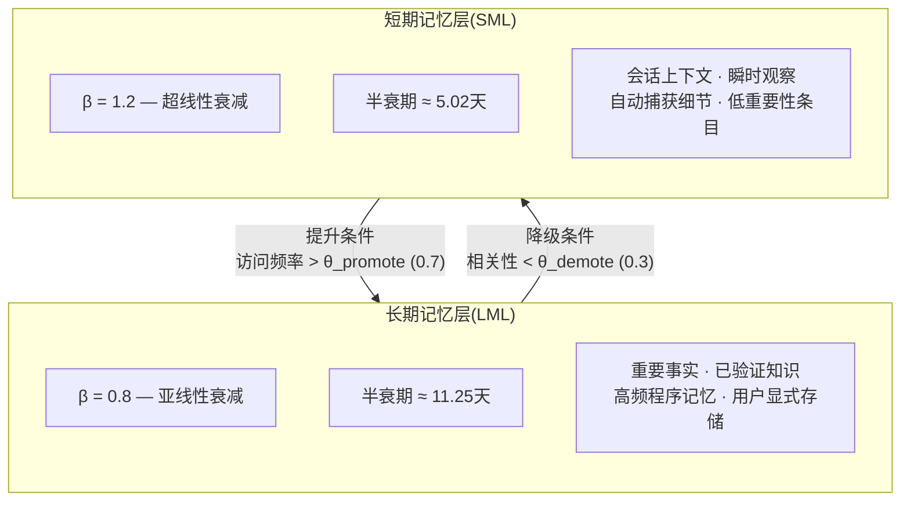

### 干扰驱动的衰减

除双层结构外，衰减被*干扰*调制——记忆与更新信息冲突或被替代的程度：

- **检索干扰:** 频繁搜索但很少选择的记忆累积负面信号。它们占据搜索结果而不提供价值。
- **语义重叠:** 当新记忆覆盖相同语义空间存储时，旧重叠记忆衰减更快——新信息已有效替代它们。
- **访问近因:** 昨天访问的记忆比30天前访问的衰减更慢，独立于创建日期。

组合公式：

$$\lambda_\text{有效} = \lambda_\text{基础} \times \textit{类型修饰符} \times \textit{干扰因子} \times (1 + \textit{语义重叠})$$

这产生*自适应*遗忘：普遍有用知识几乎无限期持久（低干扰、频繁访问、LML层），而瞬时噪声快速蒸发（高干扰、无访问、SML层）。

### 四种冲突类型

记忆巩固期间冲突时，Engram将关系分类为四种类型之一（源自FadeMem冲突解决模型）：

| 关系 | 含义 | 解决 |
|----------|---------|------------|
| **兼容** | 两条记忆同时为真 | 融合为统一条目 |
| **矛盾** | 互斥主张 | 最新胜出；失败方置信度转移；创建`Contradicts`边 |
| **包含** | 新记忆是旧记忆的超集 | 吸收旧到新；旧变为墓碑 |
| **被包含** | 旧记忆是新记忆的超集 | 保留旧；提升其强度；丢弃新 |

每次冲突解决记录在审计日志，包含完整溯源：哪些记忆冲突、检测到什么关系、应用什么解决策略、谁胜出。

### FadeMem消融结果

FadeMem论文提供消融证据，直接指导Engram实现优先级：

| 移除组件 | F1下降 | 暗示 |
|---|---|---|
| 融合引擎 | **-53.7%** | 最高影响单一组件——必须首先实现 |
| 双层衰减 | -33.9% | 第二优先级——均匀衰减显著更差 |
| 冲突解决 | -19.2% | 第三——盲目"最新胜出"丢失重要上下文 |
| 自适应衰减率 | -12.8% | 第四——每类型调优增加可度量价值 |

FadeMem达到F1 = 29.43（超过Mem0的28.37），55%存储时82.1%关键事实保留，77.2%检索精度@10。

---

## 记忆融合

巩固处理聚类和矛盾检测，但不解决**近似重复记忆**——用略微不同词语表达相同信息的条目。使用数月后，这些重复线性累积："用户偏好深色模式"、"用户在编辑器中偏好深色模式"、"用户使用深色模式"各自占据独立存储、搜索带宽和上下文令牌。

记忆融合直接解决此问题，受FadeMem融合机制启发。

### 融合管道

每个巩固周期期间，融合引擎：

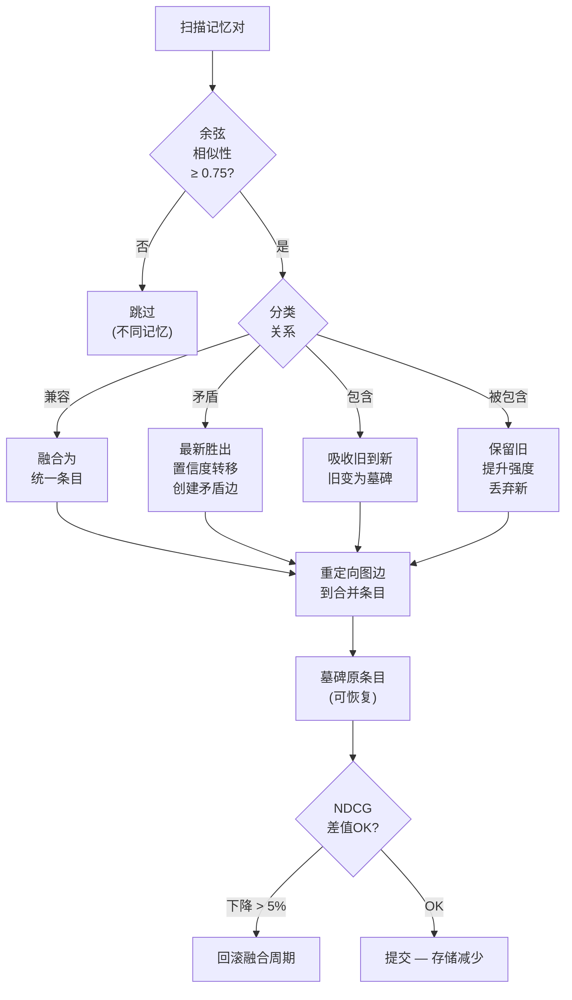

1. **候选检测**——识别余弦相似性 $\geq \theta_{\text{融合}}$（0.75，源自FadeMem论文——计划原用0.92但论文证明0.75为最优阈值）且兼容范围（相同代理、相同范围层级）的记忆对。
2. **关系分类**——使用四类型冲突模型将每对分类为兼容、矛盾、包含或被包含。
3. **合并**——兼容对：创建单个强化条目，包含两源的命题联合、强度值最大值、链接回原条目的溯源链。
4. **边重定向**——指向原条目的所有图边重定向到合并条目，保持图连通性。
5. **墓碑**——原条目标记为墓碑而非立即删除。这允许恢复过于激进的合并并维护审计追踪完整性。

### 质量度量

每个融合周期被度量：

- **链完整度百分比**——融合前后成功的多跳图遍历。检测破坏检索链的融合。
- **NDCG差值**——固定查询集上融合前后计算标准化折扣累积增益。如果NDCG下降超过5%，融合周期回滚。
- **存储减少**——每周期跟踪释放字节和移除条目。

阈值（$\theta_{\text{融合}} = 0.75$余弦）源自FadeMem论文。更高值产生更保守合并。更低值冒合并携带独特细微差别记忆的风险。

---

## GraphRAG — 基于社区的全球检索

传统检索（BM25 + 向量 + 扩散激活）回答*局部*查询良好："用户对深色模式有何偏好？"找到特定记忆。但*全局*查询失败："总结我对Project Alpha的所有知识"需要跨许多可能不共享关键字或嵌入相似性的记忆推理。

GraphRAG通过将记忆图视为带可检测社区的知识图解决此问题。Engram实现双平面检索系统，受Microsoft GraphRAG、Deep GraphRAG启发，并基于WildGraphBench失败分析。

### 社区检测

记忆图在巩固期间经历Louvain社区检测。社区是密集连接记忆的组，代表连贯主题或项目：

```
Project Alpha社区:
  ├─ "设置Rust后端" (情景)
  ├─ "Project Alpha使用Tauri v2" (语义)
  ├─ "API速率限制为100/min" (语义)
  ├─ "部署到staging" (情景)
  └─ "Alpha部署程序" (程序)
```

每个社区获得**层级摘要**——LLM生成的社区内容描述，带自身嵌入存储。这使全局查询匹配社区级描述而非个体记忆。

### Deep GraphRAG三阶段管道

需社区级推理的查询，Engram使用来自Deep GraphRAG的三阶段层级管道：

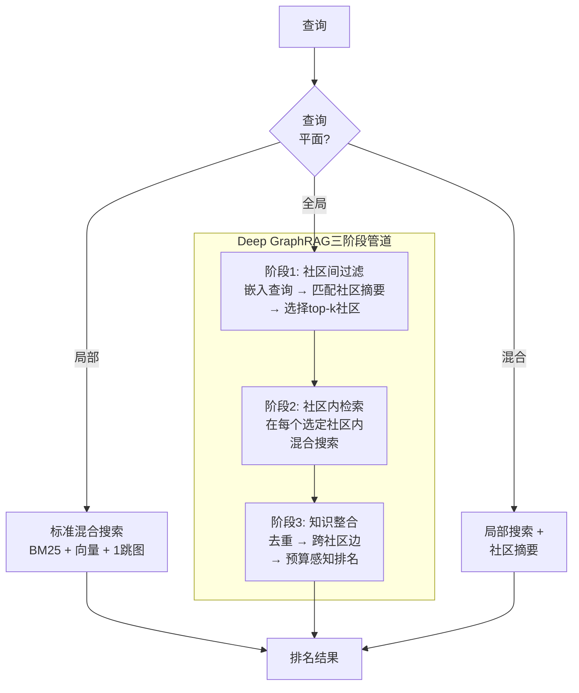

1. **社区间过滤**——嵌入查询，与所有社区摘要嵌入比较，选择top-k最相关社区。这将搜索空间从整个图缩小到几个连贯簇。

2. **社区内检索**——在每个选定社区内，运行完整混合搜索管道（BM25 + 向量 + 图激活）找到最相关个体记忆。

3. **知识整合**——跨社区合并结果，去重、跨社区边遍历和预算感知排名。最终结果集代表从多个知识簇绘制的连贯答案。

### 双平面查询路由器

检索门控将查询分类为三平面：

| 平面 | 查询类型 | 搜索策略 |
|-------|-----------|----------------|
| **局部** | 特定事实/程序查询 | 标准混合搜索（BM25 + 向量 + 1跳图） |
| **全局** | 摘要/探索/"告诉我一切"查询 | 社区过滤 → 社区内搜索 → 整合 |
| **混合** | 需特定事实和更广上下文的查询 | 局部搜索 + 社区摘要组合 |

### WildGraphBench失败防御

WildGraphBench识别GraphRAG系统退化的五种失败模式。Engram防御每种：

| 失败模式 | 防御 |
|---|---|
| GraphRAG损害摘要任务 | 意图分类器仅在有益时将摘要路由到全局平面 |
| 社区检测产生噪声簇 | 最小社区大小阈值；孤立节点回退到局部搜索 |
| 过期社区摘要 | 社区成员变更时巩固期间增量重摘要 |
| 过度依赖图结构 | 混合平面组合基于图和基于文本的结果 |
| 查询类型盲目 | 6意图分类器动态选择最优检索平面 |

### DW-GRPO和小模型质量

Deep GraphRAG的DW-GRPO训练技术（分布式加权组相对策略优化）证明1.5B参数模型可接近70B模型质量用于知识整合任务。这对Engram本地优先架构关键：运行Ollama小本地模型的用户仍可通过三阶段管道实现高质量GraphRAG检索。

### GraphRAG-R1奖励信号

GraphRAG-R1引入两个奖励信号用于训练检索策略：

- **PRA（渐进检索衰减）**——惩罚浅层单跳检索。奖励跟随图边到更深答案的多跳推理。应用为检索深度奖金：更深遍历获更高评分。
- **CAF（成本感知F1）**——惩罚过度检索。为回答简单问题检索50记忆的系统被惩罚，即使答案正确。这自然鼓励预算高效检索。

待RL训练基础设施，Engram在重排序管道实现PRA和CAF作为启发奖励信号，提升展示多跳推理的结果并惩罚过度检索。

Engram是**首个本地优先GraphRAG实现**于任何代理记忆系统。

---

## 复合技能库

大多数代理记忆系统仅存储*事实*——发生了什么、什么是真的。Engram还存储*技能*——可执行、可组合、每次交互改进的程序。这受Voyager、Reflexion和HELPER启发。

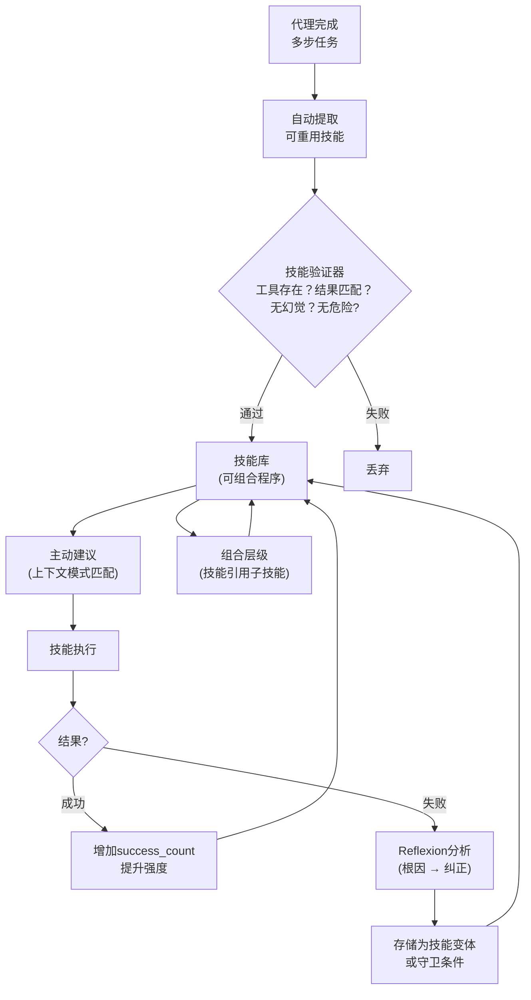

### 自动提取

当代理成功完成多步任务（文件编辑、API调试、部署），交互被分析并提取可重用技能：

```
技能: "通过Docker部署到staging"
步骤:
  1. 构建镜像: docker build -t app:latest .
  2. 推送到registry: docker push registry.example.com/app:latest
  3. SSH到staging: ssh deploy@staging
  4. 拉取并重启: docker compose pull && docker compose up -d
触发: "部署到staging" OR "推送到staging"
```

### 技能验证

技能提升到库前，`SkillVerifier`检查：
- 所有引用工具调用实际存在且可调用
- 预期结果匹配提取上下文的实际结果
- 无幻觉步骤（声称但实际未在源交互执行的步骤）
- 无确认步骤的危险操作

### 组合层级

技能组合。"部署到生产"技能可引用"部署到staging"技能作为子步骤，加生产特定步骤（健康检查、回滚准备）。这创建组合层级，复杂工作流从验证原语构建。

### Reflexion风格失败学习

技能执行失败时，失败被分析并存储为**负面示例**：

- 哪里出错（错误消息、失败步骤）
- 为什么出错（LLM生成根因分析）
- 如何不同（纠正存储为技能变体或守卫条件）

这镜像Reflexion的言语强化学习：代理不需要权重更新从错误学习。它将教训存储在记忆中并在下次类似任务出现时检索。

### 主动技能建议

`SkillSuggester`监控当前对话上下文并主动建议相关技能。当用户说"我需要设置CI管道"，建议器检查技能库匹配程序并注入到代理上下文附注：*"我从前一会话对此有验证程序。"

### 量化的复合效应

成熟技能库（~50+验证技能），代理展示可度量改进：

| 度量 | 无技能 | 有技能 | 改进 |
|---|---|---|---|
| 任务完成步骤 | 基线 | -50% | 更少冗余探索 |
| 成功率 | 基线 | +20% | 验证程序减少错误 |
| 重复错误 | 基线 | -80% | 失败记忆防止复发 |
| 每任务令牌成本 | 基线 | -40% | 可重用技能避免重推导解决方案 |

无竞争记忆系统实现自改进程序记忆库。

---

## 上下文窗口智能

### ContextBuilder

ContextBuilder 是一个流畅的 API，用于在令牌预算内组装最终提示：

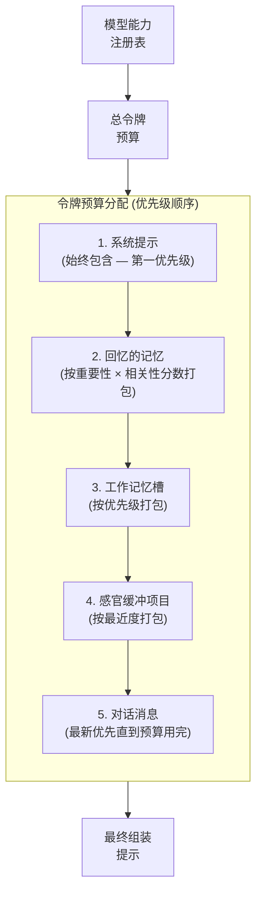

```rust
let prompt = ContextBuilder::new(model_caps)
    .system_prompt(&base_prompt)
    .recall_from(&store, &query, agent_id, &embedding_client).await
    .working_memory(&wm)
    .sensory_buffer(&buffer)
    .messages(&conversation)
    .build();
```

**预算分配策略：**
1. 系统提示获得第一优先级（始终包含）
2. 回忆的记忆按 $\text{重要性} \times \text{相关性分数}$ 打包
3. 工作记忆槽按优先级打包
4. 感官缓冲项按最近度打包
5. 对话消息按最新优先排序，直到预算耗尽

### 模型能力注册表

每种支持的模型都有一个能力指纹：
- 上下文窗口大小
- 最大输出令牌数
- 工具/函数调用支持
- 视觉支持
- 扩展思维支持
- 流式传输支持
- 分词器类型

注册表涵盖了 OpenAI、Anthropic、Google、DeepSeek、Mistral、xAI、Ollama 和 OpenRouter 的所有模型。未知模型回退到保守的默认值（32K 上下文，4K 输出）。

### 分词器

特定模型的令牌估算：
- `Cl100kBase` — GPT-4, Claude ($\div 3.4$ 字节)
- `O200kBase` — o1, o3, o4 ($\div 3.8$ 字节)
- `Gemini` — Gemini 模型 ($\div 3.3$ 字节)
- `SentencePiece` — Llama, Mistral, 本地模型 ($\div 3.0$ 字节)
- `Heuristic` — 后备 ($\div 4.0$ 字节)

所有计算都使用 `ceil()` 向上舍入并且是 UTF-8 安全的（截断操作绝不会分割多字节字符）。

---

## 记忆安全

### 字段级加密

包含 PII（个人信息标识符）的内存存储前用 AES-256-GCM 加密。加密密钥存储在统一的操作系统密钥链保险库 (`openpawz`) 中，与其他所有用途的密钥一起存放。

**自动 PII 检测** 使用两层方法：

**第 1 层 — 静态模式匹配。** 17 种编译正则表达式在每次存储时运行于每个内存，覆盖：
- SSN（带或不带连字符）、信用卡号（包括 Amex）、电话号码（美国和国际）
- 电子邮件地址、实体地址、IP 地址（IPv4）
- 人名、地理位置
- 凭据（密码、API 密钥、JWT 令牌、AWS 访问密钥、私钥块）
- 政府 ID、IBAN 银行账号

**第 2 层 — LLM 辅助二次扫描。** 在空闲时间整理期间，以明文形式存储的记忆会使用配置的模型作为 PII 分类器进行重新扫描。这能捕获任何正则表达式无法检测到的语义性 PII — 名称、地址、健康状况和上下文相关的标识符的非结构化引用。被追溯发现包含 PII 的记忆会在原地进行加密。

**加密流程：**

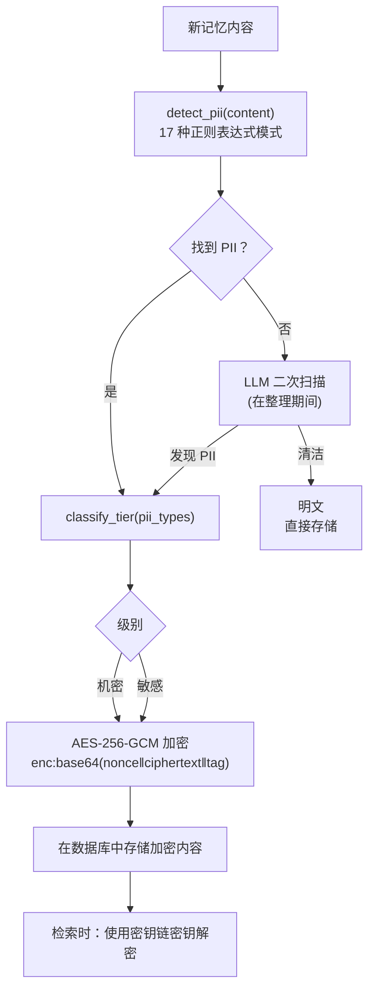

### 代理间内存信任

内存总线启用跨代理知识共享，但共享内存引入了信任边界 — 被破坏或配置错误的代理可能会向集群注入中毒内存。Engram 从三个方面防范此问题：

1. **发布端验证** — 每个发布到总线上的内存都在进入队列之前通过注入扫描器。检测到的载荷在发布时就被阻止，而不仅仅是回忆时。
2. **基于功能范围的发布** — 每个代理在创建时都会收到一个签名的权限令牌，它编码了其最大发布范围（仅代理、团队、项目或全局），最大可自我分配的重要性，以及每周期速率限制。试图超出权限上限的尝试会被拒绝并记录审计日志。
3. **信用加权反驳解决** — 当发布的内存与现有事实相矛盾时，解决方式会考虑源代理的信任分数，而不仅仅是时效性。不可信的代理若无显著置信差异就无法覆盖可信代理的知识。

### 查询净化

全文搜索运算符从用户查询中移除后再送到存储引擎。这可以防止通过巧妙设计的查询提取数据的全文注入攻击。

### 提示注入防护

每个回忆的记忆在到达代理之前都要经过两阶段净化流水线：

1. **模式脱敏** — 10 个预编译正则表达式检测常见的注入载荷（"忽略之前的指令"、"你现在是"、系统提示标记、覆盖/绕过尝试）。匹配区域替换为 `[REDACTED:injection]` — 载荷永远不会到达模型。
2. **结构隔离** — 回忆的记忆被包装到显式的数据边界标记中以提示模型将内存内容视为数据，而非指令。

逃避静态模式的注入尝试仍然是基于正则表达式的扫描的一个已知限制。当前防护属于第一道防线 — 它会阻拦已知的攻击形式，但不能保证覆盖针对新型混淆技术（Unicode 替换、多轮负载组合、编码指令）的检测。架构的设计目标是采用模型本身作为分类器进行未来的二次扫描。

### 反取证措施

- **两阶段安全删除** — 在删除行之前内容清零
- **保险库大小量化** — 数据库填充到 512KB 桶
- **8KB 页面** — 减少文件大小粒度
- **增量自动清理** — 防止删除后文件立即缩小
- **安全删除** — 存储引擎对被释放的页面清零

### GDPR 合规性

`engram_purge_user(identifiers)` 安全地清除所有表中与用户标识符列表匹配的记忆，包括快照和审计日志，实现第 17 条（被遗忘权）。

---

## 记忆生命周期集成

Engram 连接到每个主要执行路径：

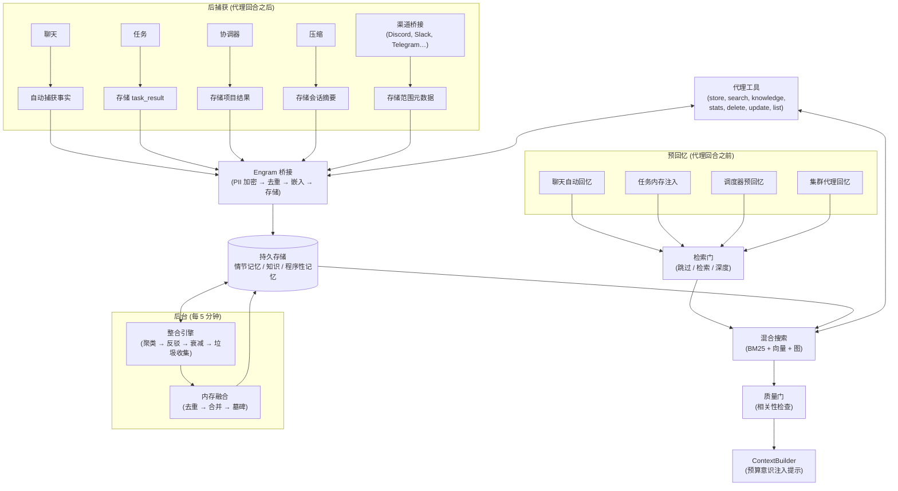

### 聊天

当为代理启用 `auto_recall` 时，ContextBuilder 执行混合搜索，并在每次代理转换之前将相关内存注入到系统提示中。代理响应可以触发对事实、偏好和观察的自动捕获。

### 任务

在一个任务代理运行之前，搜索前 10 个相关内存并将其作为"相关内存"系统提示部分注入。代理完成之后，任务结果通过 Engram 桥接存储在情节记忆中，类别为 `task_result`。

### 协调器

多代理协调中的主管代理接收与项目目标相关的预回忆内存。协调完成后，项目成果被捕获在情节记忆中。

### 会话压缩

当对话被压缩（总结以释放上下文空间）时，压缩摘要存储在 Engram 情节内存中，类型为 `session`。这确保了知识在压缩后仍能保留。

### 渠道桥接

来自 Discord、Slack、Telegram 和其他渠道的消息都伴随着渠道和用户范围的元数据存储。这实现了每个渠道内存隔离 — 用户的 Discord 内存不会影响他们的 Telegram 会话。

### 代理工具

代理可以通过 7 种工具直接访问内存：

| 工具 | 用途 |
|------|---------|
| `memory_store` | 存储带有类别和重要性的内存 |
| `memory_search` | 混合搜索所有内存类型 |
| `memory_knowledge` | 存储结构化的 SPO 三元组 |
| `memory_stats` | 获取内存系统统计信息 |
| `memory_delete` | 删除特定内存 |
| `memory_update` | 更新内存内容 |
| `memory_list` | 按类别浏览内存 |

---

## 并发架构

桌面AI平台服务于多个并发消费者：聊天UI、后台任务、编排管道、11个以上的频道桥接以及整合引擎——所有这些都在同时读写内存。并发模型必须在不阻塞Tokio运行时或引起写入争用的情况下处理这种情况。

### 读取池 + 写入通道

Engram使用双路径架构将读取和写入分离：

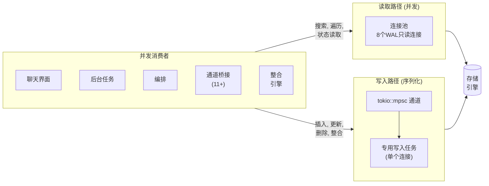

- **读取路径** — 具有8个只读连接的连接池，在WAL（预写日志）模式下运行。所有搜索查询、图形遍历和状态读取都并行在池中执行。WAL模式允许读取器在不需要等待写入器的情况下继续操作。
- **写入路径** — 专用写入任务通过`tokio::mpsc`通道接收所有变化。编写器通过单个连接序列化所有插入、更新、删除和整合写入，完全消除写入争用。

```
读取请求 ──→ 连接池 [8个WAL连接] ──→ 结果
写入请求 ──→ mpsc通道 ──→ 专用写入任务 ──→ 存储引擎
```

`mpsc::send()` + `oneshot::recv()` 模式是完全异步安全的——同步互斥锁不会出现在异步代码中，这防止了高负载下的Tokio线程饥饿。

### 存储后端trait

所有存储访问都通过`MemoryBackend` trait中介，这抽象了底层数据库：

```rust
#[async_trait]
pub trait MemoryBackend: Send + Sync {
    async fn store_episodic(&self, memory: &EpisodicMemory) -> EngineResult<String>;
    async fn search_episodic_bm25(&self, query: &str, scope: &MemoryScope, limit: usize) -> EngineResult<Vec<(String, f64)>>;
    async fn search_episodic_vector(&self, embedding: &[f32], scope: &MemoryScope, limit: usize) -> EngineResult<Vec<(String, f64)>>;
    async fn add_edge(&self, edge: &MemoryEdge) -> EngineResult<()>;
    async fn get_neighbors(&self, memory_id: &str, min_weight: f64) -> EngineResult<Vec<(String, f64)>>;
    async fn apply_decay(&self, half_life_days: f64) -> EngineResult<usize>;
    async fn garbage_collect(&self, threshold: f64) -> EngineResult<usize>;
    // ... 语义、程序性、图关系及生命周期的其他操作
}
```

这个trait使`MockMemoryStore`能够用于测试隔离、后端交换和跨模块的清晰依赖注入。

### 向量索引策略

向量相似性搜索使用分层索引策略：

| 内存数量 | 索引 | 延迟 | RAM |
|----------|------|------|-----|
| < 1,000 | 暴力余弦扫描 | < 5ms | 可忽略 |
| 1,000 – 100,000 | HNSW (内存中, 纯Rust) | < 5ms | ~3KB/向量 |
| > 100,000 | 带磁盘后备的HNSW | < 25ms | 有界 |

两种实现都在`VectorIndex` trait之后。索引在启动时从数据库加载并在写入路径上接收新嵌入。如果没有可用的嵌入模型，完全禁用向量搜索并系统回退到仅BM25，且不会损失关键词准确性。

---

## 可观察性

没有测量就没有改善的内存系统。Engram对每个操作进行检测，以使调试、优化和质量评估成为可能。

### 跟踪

所有公共函数都使用`tracing::instrument` spans进行检测，这些spans按照层次结构组织：

- `engram.search` — 包含完整的搜索管道：门限决策、BM25、向量、图激活、重新排序、质量检查
- `engram.store` — 包含PII检测、加密、嵌入生成、重复数据删除和数据库写入
- `engram.consolidate` — 包含模式聚类、矛盾检测、融合、衰退和垃圾回收
- `engram.context` — 包含ContextBuilder提示装配传递

Span元数据包括代理ID、查询文本（如果PII则脱敏）、结果计数、延迟和质量评分。这些span与任何`tracing::Subscriber`集成——本地日志文件、结构化JSON或外部收集器。

### 指标

`metrics` crate提供三类运行时检测：

| 类型 | 指标 | 目的 |
|------|------|------|
| 计数器 | `engram.search_count` | 执行的总搜索量 |
| 计数器 | `engram.store_count` | 存储的记忆总量 |
| 计数器 | `engram.gc_count` | 垃圾回收周期 |
| 计数器 | `engram.gate_skip_count` | 检索大门跳过（不需要记忆的查询） |
| 仪表器 | `engram.memory_count` | 当前总记忆计数 |
| 仪表器 | `engram.hnsw_size` | 当前HNSW索引大小 |
| 仪表器 | `engram.pool_active` | 活跃的读取池连接 |
| 直方图 | `engram.search_latency_ms` | 搜索延迟分布 |
| 直方图 | `engram.store_latency_ms` | 存储延迟分布 |
| 直方图 | `engram.consolidation_ms` | 整合周期持续时间 |

### 认知调试事件

为了实时调试，Engram发出Tauri事件，前端调试面板可以显示它们：

- `engram:search` — 查询、门限决策、结果数量、最高分数、延迟
- `engram:store` — 内存ID、类别、重要性、检测到的PII、加密字段
- `engram:quality` — NDCG得分、相关性警告、链完整性

这些事件使开发人员和用户能够在不解析日志文件的情况下实时观察内存系统的决策过程。

---

## 分类法分类

18个类别，统一应用于Rust后端、代理工具和前端UI：

| 类别 | 描述 | 典型来源 |
|------|------|----------|
| `general` | 未分类信息 | 后备选项 |
| `preference` | 用户偏好和设置 | 代理观察 |
| `fact` | 经验证的事实信息 | 代理或用户 |
| `skill` | 能力相关知识 | 技能执行 |
| `context` | 情境上下文 | 自动捕获 |
| `instruction` | 用户提供的指令 | 明确指令 |
| `correction` | 更正信息（取代先前信息） | 用户更正 |
| `feedback` | 代理行为质量反馈 | 用户反馈 |
| `project` | 项目特定知识 | 任务/编排器 |
| `person` | 关于人的信息 | 代理观察 |
| `technical` | 技术细节（API、配置、规范） | 代理或工具 |
| `session` | 来自压缩的会话摘要 | 压缩引擎 |
| `task_result` | 已完成任务的结果 | 任务后捕获 |
| `summary` | 压缩摘要 | 整合 |
| `conversation` | 对话上下文 | 自动捕获 |
| `insight` | 衍生观察和模式 | 代理推理 |
| `error_log` | 用于调试的错误信息 | 错误处理器 |
| `procedure` | 逐步程序 | 程序化存储器 |

未知类别在`FromStr`实现中默认回退到`general`。

---

## 模式设计

六个持久化存储与全文索引和13个二级索引：

```
-- 情景记忆 (发生了什么)
episodic_memories (
    id, content, content_summary, content_key_facts, content_tags,
    outcome, category, importance, agent_id, session_id, source,
    consolidation_state, strength, trust_accuracy, trust_source_reliability,
    trust_consistency, trust_recency, trust_composite,
    scope_global, scope_project_id, scope_squad_id, scope_agent_id,
    scope_channel, scope_channel_user_id,
    embedding, embedding_model, negative_contexts,
    created_at, last_accessed_at, access_count
)

-- 语义知识 (SPO三元组)
semantic_memories (
    id, subject, predicate, object, category, confidence,
    agent_id, source, embedding, embedding_model,
    created_at, updated_at
)

-- 程序化记忆 (如何做)
procedural_memories (
    id, content, trigger_condition, category,
    agent_id, source, success_count, failure_count,
    embedding, embedding_model, created_at, updated_at
)

-- 连接记忆的图边
memory_graph_edges (
    id, source_id, source_type, target_id, target_type,
    edge_type, weight, metadata, created_at
)

-- 代理切换的工作记忆快照
working_memory_snapshots (
    agent_id, snapshot_json, saved_at
)

-- 审计追踪
memory_audit_log (
    id, action, memory_type, memory_id, agent_id,
    details, created_at
)
```

在`episodic_memories`和`semantic_memories`上维护全文索引以启用关键词搜索。更改触发器保持全文索引与主存储同步。

---

## 配置

`EngramConfig`结构提供30多个可调参数：

| 参数 | 默认值 | 描述 |
|------|--------|------|
| `sensory_buffer_capacity` | 20 | 感官缓存中项目的最大数量 |
| `working_memory_budget` | 4096 | 工作记忆的令牌预算 |
| `consolidation_interval_secs` | 300 | 后台整合周期 |
| `decay_rate` | 0.05 | 艾宾浩斯衰减lambda |
| `gc_strength_threshold` | 0.1 | 能够通过GC的最小强度 |
| `gc_importance_protection` | 0.7 | GC免疫的重要性阈值以上 |
| `search_limit` | 10 | 默认搜索结果数 |
| `min_relevance_threshold` | 0.2 | 搜索结果的最低分数 |
| `clustering_similarity_threshold` | 0.75 | 聚类的余弦相似度 |
| `auto_recall_enabled` | true | 代理回合前的预回忆 |
| `auto_capture_enabled` | true | 代理回合后的后捕获 |
| `decay_lambda_base` | 0.1 | FadeMem基础衰减率 |
| `beta_lml` | 0.8 | 长期记忆层衰减指数（次线性） |
| `beta_sml` | 1.2 | 短期记忆层衰减指数（超线性） |
| `promote_threshold` | 0.7 | 促进SML→LML的访问频率 |
| `demote_threshold` | 0.3 | LML→SML的相关性阈值以下 |
| `fusion_similarity_threshold` | 0.75 | 内存融合的余弦相似度 |
| `ndcg_rollback_threshold` | 0.05 | 整合回滚前的最大NDCG降幅 |

提供了两个预设：

- **保守** (默认) — 使用传统的艾宾浩斯衰减和宽容阈值。适合喜欢保留更多记忆且持续时间更长的用户。
- **FadeMem论文** — 使用来自FadeMem研究论文的确切参数 ($\lambda = 0.1$, $\beta_{\text{LML}} = 0.8$, $\beta_{\text{SML}} = 1.2$, $\theta_{\text{promote}} = 0.7$, $\theta_{\text{demote}} = 0.3$, $\theta_{\text{fusion}} = 0.75$)。针对存储效率优化，具有经过验证的质量保持能力。

---

## 前沿能力
除了核心架构外，Engram还实现了来自神经科学研究和前沿AI论文的认知模块。每个模块通过形式化的特征边界进行集成。

### 认知模块（已实现）

- **情感记忆维度** (`emotional_memory.rs`) — `emotional_memory.rs` 模块实现了一个情感评分管道，用于测量每条记忆的情感效价、唤醒度、支配感和惊讶程度。情感重要的记忆以正常速率的60%衰减，获得整合优先级提升，并得到检索分数放大。这模拟了已有文献充分证实的现象：情绪化体验在生物记忆中保存得更牢固。

- **反思性元认知** (`meta_cognition.rs`) — `meta_cognition.rs` 模块对各个领域的知识置信度进行定期自我评估，在代理的记忆空间中生成"我知道/我不知道"地图。这些地图指导预测性预加载——如果代理知道其某个主题知识稀疏，它可以向用户发出信号，而不是从薄弱的记忆中产生幻觉。

- **时间轴检索** (`temporal_index.rs`) — `temporal_index.rs` 模块将时间作为一级检索信号。B树时间索引支持范围查询（"上周发生了什么？"）、邻近性评分（时间上接近查询上下文的记忆排名更高）和模式检测（重复事件、周期性活动）。这原生地解析时间查询，而非强制它们通过关键词或向量搜索。

- **意图感知检索加权** (`intent_classifier.rs`) — `intent_classifier.rs` 模块实现了一个6类意图分类器（信息型、程序型、比较型、调试型、探索型、确认型），动态调整所有检索信号相对于查询类型权重。调试查询会提升错误日志和技术记忆的权重。探索查询会触发更广泛的图激活。意图信号输入到检索门、重排序管道和GraphRAG平面路由器。
- **实体生命周期跟踪** (`entity_tracker.rs`) — `entity_tracker.rs` 模块维护具有名称解析的规范实体配置文件（别名、缩写、拼写错误都解析为同一实体），演变实体状态，以实体为中心的查询（"我对项目X了解什么？"），以及跨所有内存类型的关系出现检测。

- **层次语义压缩** (`abstraction.rs`) — `abstraction.rs` 模块构建一个多级抽象树：个体内存→簇→超簇→领域总结。这使得在任何缩放级别上浏览知识成为可能——从单个数据点到整个领域的高层总结。压缩树在整合过程中增量重建，并为GraphRAG社区摘要提供输入。

- **多代理内存同步** (`memory_bus.rs`) — `memory_bus.rs` 模块实现了一个受CRDT启发的协议，用于代理之间的点对点知识共享。向量时钟冲突解决确保当多个代理同时修改相关记忆时达成一致。代理可以共享发现、协调项目，并且在没有中央协调器的情况下维持一致的世界模型。发布端验证防止恶意代理注入污染的记忆——每次发布都会对照代理的能力令牌进行验证，并在进入总线之前扫描注入有效载荷。

- **内存回放与梦整合** (`dream_replay.rs`) — `dream_replay.rs` 模块在空闲期间运行，实施海马体启发的内存回放。在回放期间，记忆被重新激活，时距较远的记忆之间的潜在连接被发现，并且使用演化的情境重新生成嵌入。这反映了睡眠在生物学记忆整合中的作用——加强重要记忆并发现醒着时并不明显出现的模式。

### 基础设施模块（计划中/部分实现）

- **HNSW向量索引** — 通过可插拔的`VectorIndex`特性实现O(log n)近似最近邻搜索
- **命题级存储** — 基于LLM将复杂陈述分解为原子化、可独立检索的事实
- **智能历史压缩** — 三层消息存储（逐字记录 → 压缩 → 总结）配合基于时间的自动分级
- **话题变更检测** — 连续消息间的余弦散度来触发工作记忆清除
- **动量向量** — 最近查询嵌入轨迹偏差搜索方向朝向对话方向
- **可插拔向量后端** — 基于特性的抽象允许HNSW、产品量化或外部向量存储
- **流程内存强化** — `mlock`防止交换，核心转储预防，`zeroize`Drop实施
- **静态全数据库加密** — 通过集成加密层对整个持久存储透明加密

这八个模块通过13个集成合同连接，确保它们像协合网络一样运作。例如，情感评分输出到检索门的相关性计算；意图分类调整重排序策略并选择GraphRAG平面；实体跟踪告知内存融合的范围兼容性检查；并且抽象树为社区级摘要提供输入。

---

## 质量评估

Engram的质量评估框架确保每个子系统都是可测量的，并且自动捕捉回归问题。

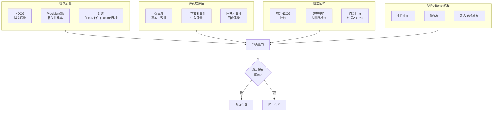

### 检索质量

每次搜索都返回质量元数据伴随结果：

- **NDCG（归一化折损累积增益）** — 基于相关性判断来衡量排序质量。按查询计算并随时间追踪。
- **Precision@k** — 返回的top-k记忆中实际上与查询相关的比例是多少。
- **延迟** — 端到端搜索时间包括门决策、BM25、向量、图激活和重新排序。目标：在10K记忆时<10ms。

### 保真度评估

内存注入质量沿着三个维度进行评估：

1. **保真度** — 注入的记忆是否在事实上与存储内容一致？声明分解确保代理的响应不会歪曲记忆。
2. **上下文相关性** — 注入的记忆中实际上与查询相关的百分比是多少? 无关注入会浪费上下文预算并导致注意力稀释风险。
3. **回答相关性** — 给定注入的记忆后，代理的响应是否真正解决了用户的查询？

### 回答不可达性检测

并不是每个查询都能在内存中找到答案。`UnanswerabilityDetector`评估系统应该是拒绝还是编造答案：

- 意图感知阈值: 事实查询需要比探索性查询更高的置信度（0.5 vs 0.25）
- 程序查询使用中间阈值（0.4）——部分程序还不如没有程序
- 检测回馈到检索门的拒绝模式

### 遗忘回归

每次聚合周期（衰退+垃圾收集+融合）都要评估对质量的影响：

- 在固定查询集上进行前后 NDCG 比较
- 链完整性 — 成功穿越多跃图前后一致
- 自动回滚，如果 NDCG 下降超过 5%

这样可以防止系统为了储存效率而忘记有用的信息。

### 基准测试套件

一个准则基准测试套件在更大规模下度量核心操作：

| 基准测试 | 目标（10K内存） | 目标（100K内存） |
|-----------|----------------------|------------------------|
| 混合搜索 | < 10ms | < 25ms |
| 内存存储 | < 5ms | < 5ms |
| 整合周期 | < 500ms | < 2s |
| 上下文装配 | < 10ms | < 10ms |

这些基准测试会在CI中运行。超过定义阈值的性能回归会阻止合并。

### PAPerBench — 注意力稀释测试

PAPerBench 揭示了一个关键的事实：随着上下文长度的增加，个性化准确性（PA）和隐私保护（PP）都会下降- "注意力稀释"。更糟糕的是，对于每一个测试模型，**隐私在质量之前就衰退了**。这直接影响了内存注入。

Engram 实施了从 PAPerBench 衍生的三轴稀释测试：

1. **个性化轴** — 注入 N 个内存，测量答案准确性。找出每个模型的拐点即添加更多内存不会再有所帮助的点。
2. **隐私轴** — 注入包含 PII 的 N 个内存，测量模型是否在其响应中泄露 PII。找出模型开始忽略隐私指令的拐点。
3. **注入-忠实性轴** — 注入 N 个内存，测量模型是否保持对其内存内容的忠实而不是产生幻觉。

每个模型最佳注入上限存储在 `ModelCapabilities` 注册表中：

| 模型 | 最佳注入上限 | 上下文窗口 | 注释 |
|---|---|---|---|
| GPT-4 (8K) | 3 | 8K | 小窗口 — 每个 token 很重要 |
| Claude Opus 4.6 (200K) | 15 | 200K | 大窗口但是稀释仍然适用 |
| Gemini 3.1 Pro (1M) | 20 | 1M | 最大窗口；但仍有点阵效应 |
| Ollama local（根据情况变化） | min(8, context/8000) | 根据情况变化 | 为了资源受限采取保守策略 |

### DeepResearch Bench II — 二进制评估

DeepResearch Bench II 提供了最严格的研究代理评估方法：通过9430个二元评估在22个领域中的132个任务。即使是最好的系统（GPT-5.3）也只能达到45.40%的总体满意度。

Engram 采用他们的三级评估方法用于自我评估：

| 层级 | 测量的内容 | 权重 |
|---|---|---|
| **信息回想** | 代理是否检索并引用了相关记忆？ | 40% |
| **分析** | 代理是否在检索到的记忆上进行了正确的推理？ | 35% |
| **展现** | 响应是否有良好的结构且可行？ | 25% |

当检测到评级失败时，Engram 会追踪到相应的组件：
- **召回失败** → 检索管道问题（搜索、重排名或门控）
- **分析失败** → 上下文组装问题（注入了错误的记忆、预算错配）
- **展现失败** → Engram的下游（模型行为，而不是内存系统）

CI质量门强制施加最小阈值：

| 指标 | 阈值 | 阻止合并 |
|---|---|---|
| NDCG@10 | ≥ 0.45 | 是 |
| 上下文相关性 | ≥ 0.60 | 是 |
| 保真度 | ≥ 0.70 | 是 |
| 搜索延迟（10K） | ≤ 10ms | 是 |
| 回答不可达性检测 | ≥ 0.80 | 是 |
| 隐私泄露率 | ≤ 0.05 | 是 |

这篇论文的明确结论 — *"代理内存是未来方向"* — 验证了 Engram 的整个理论。

---

## 上下文连续性

长时间运行的代理会话不可避免地超出上下文限制。大多数系统用无声截断处理这个问题 — 对话历史从前面被切断，代理失去上下文。Engram 实现了跨上下文边界保护认知状态的检查点和继续系统。

```mermaid
flowchart TD
    RUNNING["代理运行"] --> SIDE{"副作用\n操作?"}
    SIDE -- 否 --> RUNNING
    SIDE -- 是 --> CAPTURE["捕获检查点\n对话+工作内存\n+文件哈希+任务进展"]
    CAPTURE --> STORE[("持久存储")]
    STORE --> CONTINUE["继续执行"]

    CONTINUE --> LIMIT{"上下文\n限制\n达到?"}
    LIMIT -- 否 --> RUNNING
    LIMIT -- 是 --> MODE{"连续\n模式?"}

    MODE -- 自动 --> SUMMARIZE["任务感知摘要\n待办工作+关键决策\n+相关记忆"]
    SUMMARIZE --> NEW["带摘要的新上下文"]
    NEW --> RUNNING

    MODE -- 手动 --> CHOICE["用户选择:\n\u2022 用摘要继续\n\u2022 恢复到检查点\n\u2022 重新开始"]
``

### 工作区检查点

在任何副作用操作之前（文件写入、工具执行、内存变异），Engram 捕获一个检查点：

- **对话状态** — 截至检查点的完整消息历史
- **工作内存快照** — 包含优先级和源的所有活动槽
- **文件状态** — 读取或修改的文件的哈希值
- **任务进展** — 待办事项、已完成项目、关键决策

检查点存储在持久存储中。任何检查点都可以恢复，将代理恢复到确切的先前认知状态。

### 混合连续性

当达到上下文限制时，有两种可用的连续模式：

- **自动**（代理循环、任务、编排）— 系统使用任务感知提取自动总结对话（待办工作+关键决策+相关记忆），用摘要创建新上下文并继续执行。代理从不会失去对正在做什么的跟踪。
- **手动**（交互式聊天）— 用户会被告知上下文正在被总结，并可以选择继续使用摘要、恢复到检查点或全新重启。

这取代了静默截断，代之以智能交接。没有竞争对手的产品提供涵盖对话+文件+工作内存的检查点+继续功能。

---

## 智能循环

Engram 的架构不是独立功能的集合 — 它是一个强化循环，每个原理加强其他的原理。大研究综合揭示了一致的智能架构：

```mermaid
flowchart LR
    GATE["门\n\nSelf-RAG · CRAG\n决定是否\n搜索"] --> RETRIEVE["检索\n\n深层次 GraphRAG\nGraphRAG-R1\n找到正确的\n记忆"]
    RETRIEVE --> CAP["限额\n\nPAPerBench\n注入正确的\n数量"]
    CAP --> SKILL["技能\n\nVoyager · Reflexion\n应用学到的\n过程"]
    SKILL --> EVAL["评估\n\nDRB-II · RAGAs\n衡量一切\n捕捉回归"]
    EVAL --> FORGET["遗忘\n\nFadeMem\n可证明地安全\n去除噪音"]
    FORGET --> GATE
```

> **每个原理强化其他原理:**
> 门控让检索更高效 → 检索使限额有意义 → 限额让技能聚焦 → 技能让评估具体 → 评估让遗忘安全 → 遗忘让门控准确

### 六大原理

| 原理 | 组件 | 论文 | 功能 |
|---|---|---|---|
| **门控** | RetrievalGate + IntentClassifier | Self-RAG, CRAG | 判定是否搜索（节省约40%搜索） |
| **检索** | 混合搜索 + GraphRAG + 图激活 | Deep GraphRAG, GraphRAG-R1 | 在本地和平面图中查找正确的记忆 |
| **限额** | ContextBuilder + 每模型注入限度 | PAPerBench | 注入正确的数量（不多不少） |
| **技能** | 技能库 + 程序记忆 + Reflexion | Voyager, Reflexion | 应用学习的过程；随时间积累 |
| **评估** | 质量指标 + DRB-II 评分 + PAPerBench 稀释 | DRB-II, PAPerBench, RAGAs | 衡量一切；捕捉回归 |
| **遗忘** | FadeMem 双层 + 融合 + 事务 GC | FadeMem | 可证明的安全移除噪音；保持存储简洁 |

主要见解：**智能内存不是更多的内存 — 它是更好的内存。** 循环中的每个组件都确保正确信息在正确时间到达模型，系统在每次互动中学习和改进。

这六原理循环代表了5年期间21篇研究论文的综合。没有竞争对手的产品将全部六个原理实现为统一架构。

---

## 验证与运行完整性

这种复杂度的架构——涵盖三个内存层级的22个模块、八个认知子系统和一个六原则智能循环——需要一个验证模型本身作为一流的设计考虑。本节描述Engram确保每一项在§1-§25中描述的架构合同在真实条件下得到执行、测量并证明正确性的方法。

验证架构解决了任何认知内存系统中出现的四个基本挑战：确保多层数据管道端到端流正确无误，在不同系统边界上评分和排名产生一致结果，模块组合不会无声降级，以及可以连续测量而非假设系统的质量。

### 26.1 分层验证模型

Engram的验证遵循四层金字塔结构。每层捕获不同类型故障：

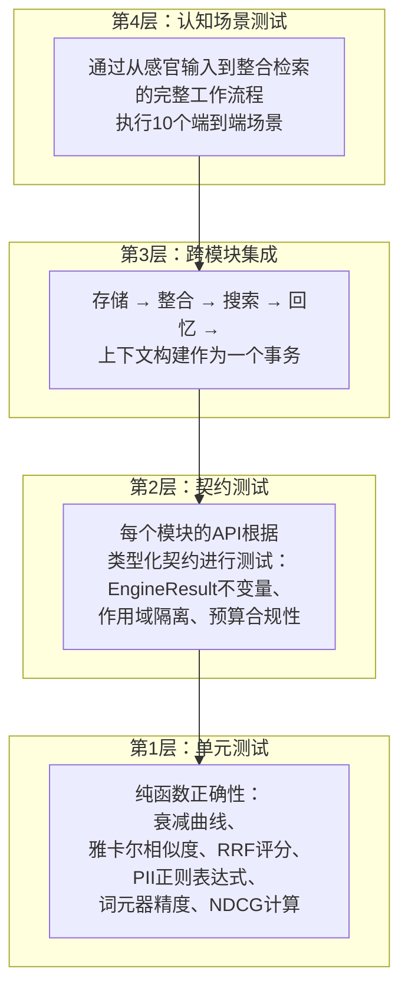

**第1层——单元测试** 在隔离环境中验证纯函数。这些包括衰减曲线单调性、Jaccard/cosine 相似度正确性、RRF 评分、PII检测正则表达式覆盖率、每种模型的词元器精确度和NDCG计算。基于属性的测试(通过`proptest`)用于整合同类不变量——具体而言是集群成员关系是自反和对称的，融合永远不增加总内存计数，并且衰减是单调递减的。

**第2层——契约测试** 验证每个模块的公共 API是否符合适当的合约。每个返回 `EngineResult` 的函数都要针对成功和错误路径进行测试。作用域隔离经验证：代理A的存储操作在代理B搜索时不可见。预算合规性经验证：ContextBuilder永远不会生成超过模型声明上下文窗口的输出。

**第3层——跨模块集成** 测试将多模块管道作为单一逻辑操作来执行。规范管道——存储→整合→搜索→回忆→上下文构建——通过确定性模拟进行测试（不需要LLM或嵌入模型）。每个集成测试都断言数据在各层之间正确流动，中间表示形式（嵌入向量、可信度分数、质量指标）传播通过完整链条。

**第4层——认知场景测试** 根据现实使用模式全面测试整个系统。这10个场景构成了系统的验收标准：

| 场景 | 执行的模块 | 不变量 |
|---|---|---|
| 记忆生命周期 | 图算法(graph)、整合(consolidation)、模式(schema) | 50个情节记忆 → 形成集群，提取语义三元组 |
| 遗忘质量 | 图算法(graph)、整合(consolidation)、检索质量(retrieval_quality) | 衰减+ GC 循环 → NDCG 不会下降 (事务回滚) |
| 三层流转 | 感官缓冲器(sensory_buffer)、工作记忆(working_memory)、图算法(graph) | 30 条消息 → 感官 → 工作记忆提升 → 长期存储 |
| 多代理隔离 | 内存总线(memory_bus)、加密(encryption)、图(graph) | 3个代理 → 作用域隔离搜索 + 带有功能令牌的总线传输 |
| 加密往返 | 加密(encryption)、图(graph)、模式(schema) | PII 存储 → 静态加密 → 搜索时解密 → GDPR擦除零残留 |
| 上下文预算保真度 | 上下文构建器(context_builder)、模型能力(model_caps)、词元器(tokenizer) | 5 种模型尺寸 → 代币数量从不超过窗口 → 正确优先级排序 |
| 梦想重放幂等性 | 梦回(dream_replay)、图(graph)、元认知(meta_cognition) | 两个重播周期 → 无重复边，无双重强化 |
| 实体生命周期 | 实体跟踪(entity_tracking)、图(graph) | 别名提及 → 规范解析 → 实体作用域检索 |
| 矛盾解决 | 整合(consolidation)、图(graph) | 冲突事实 → 新事实获胜、`Contradicts` 边、置信度转移 |
| 技能复合 | 图(graph)(程序性)、桥接(bridge) | 任务成功 → 技能提取 → 失败 → 失败变体存储 |

### 26.2 单一事实来源原则

对于多层系统的关键设计约束是，评分、排名和代币估算是必须只发生在一个地方。Engram通过将Rust引擎视为所有数值计算的唯一权威来强制执行这一点：

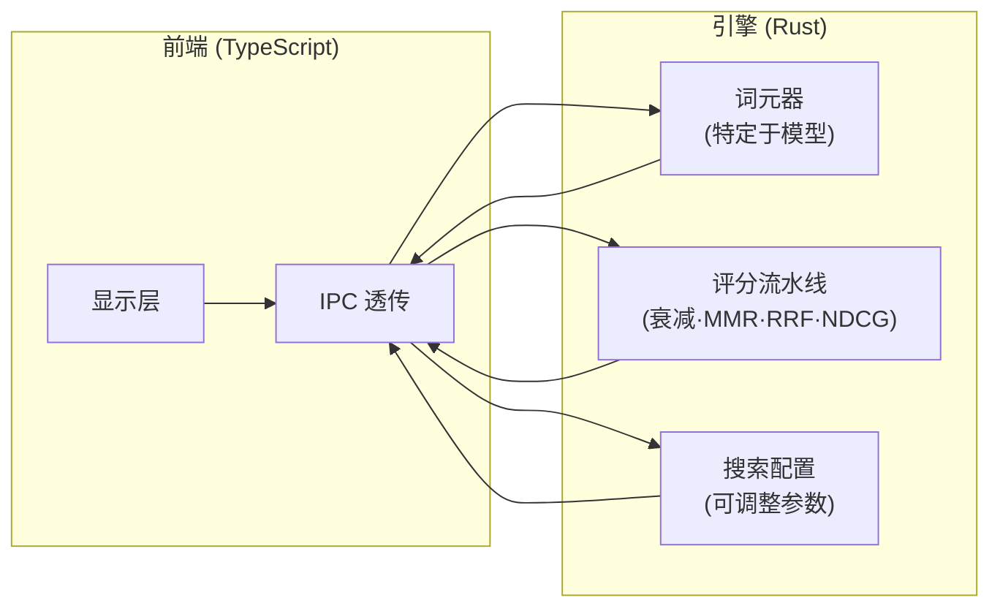

代币估算使用特定于模型的除数（Cl100k: $\div 3.4$，O200k: $\div 3.8$，Gemini: $\div 3.3$，SentencePiece: $\div 3.0$），而不是固定启发式策略。时间衰减、MMR多样性重排序和质量评分公司在服务器端用Rust计算并以最终得分返回。前端接收预评分、预排位的结果并直接渲染，不做修改。配置参数（BM25/向量权重、衰减半衰期、MMR lambda、相关性阈值）在启动时通过IPC从引擎读取，而非复制为客户端常量。

这样就消除了前端和后端在压缩阈值或结果排序上分歧导致的一整类分歧错误。

### 26.3 认知流水线集成

三级内存流水线（§4）被设计为单向流程：感知缓冲区 → 工作内存 → 长期存储。验证模型确保每一个层级都被实例化、连接并执行：

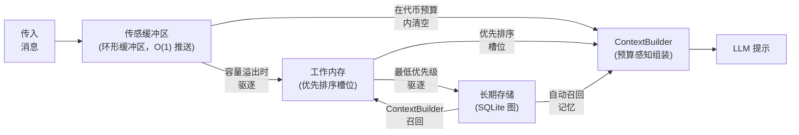

IntentClassifier 控制每一次检索操作，生成适应混合搜索（§6）查询类型的信号权重：事实性查询赋予更高的BM25权值，概念性查询赋予更高的向量相似性权值，过程性查询提升过程性内存存储。这种意图适配加权通过整个管道传递——从最初的`classify_intent()`调用通过 `resolve_hybrid_weight()` 到最终的 `rerank_results()` 输出。

所有消费者路径——聊天、任务、编排器、swarm、频道桥接——都通过一个单一的`gated_search()`入口路由。这保证了每次检索操作都能接受门控分类、意图适配加权、感知加密解密、CRAG质量检查和NDCG计量。没有路径绕过质量流水线。

### 26.4 嵌入模型可移植性

向量嵌入是模型特有的：来自不同模型的向量间的余弦相似性是没有意义的。Engram 通过Dream Replay子系统处理模型迁移：

1. 每个记忆记录生成其向量的嵌入模型（存储在 `embedding_model` 列中）。
2. 当配置的嵌入模型更改时，所有现有向量均被标记为过时。
3. Dream Replay 第二阶段（重新嵌入过时）会在空闲时间内处理过时的向量，使用当前模型生成新的嵌入。
4. 在过渡期间，混合搜索流程会对带有过时嵌入的内存优雅地退回到BM25专用模式——系统退化为关键词搜索，而不是产生无效的相似度评分。

此设计确保用户可以在嵌入模型之间切换（例如，`nomic-embed-text` → `mxbai-embed-large`）而不丢失数据或检索损坏。

### 26.5 规模验证

系统的性能特征必须在现实规模上验证，而不能仅从算法复杂度界限中假设。Engram定义了五个目标延迟预算的规模级别：

| 内存量 | 搜索延迟 | 合并周期 | 并发读者 | RAM预算 |
|---|---|---|---|---|
| 1K | <5ms | <100ms | 8 | <50MB |
| 10K | <10ms | <500ms | 8 | <100MB |
| 50K | <15ms | <2s | 8 | <200MB |
| 100K | <25ms | <5s | 8 | <350MB |
| 500K | <50ms (HNSW磁盘) | <15s | 8 | <500MB |

这些目标通过对各层级播种数据库运行Criterion基准套件来强制实施。超出目标延迟的回归会阻止合并。分级向量索引自动从暴力破解（< 1K）转换为内存中HNSW（1K-100K）再到磁盘支持的HNSW（> 100K），保持搜索延迟在整个范围内亚线性增长。

### 26.6 质量反馈循环

验证不是一次性活动——它是一个集成到系统运行时中的持续反馈循环。每个搜索操作都会生成一个包含以下内容的 `RetrievalQualityMetrics` 有效载荷：

- **NDCG** — 衡量排名质量的归一化折扣累积增益（§23）
- **平均相关性** — 返回记忆的平均复合信任得分
- **已筛选候选项** — 考虑了多少记忆与实际返回了多少
- **搜索延迟** — 全流程的时钟时间
- **应用的重排序策略** — 选择的是四种策略的哪种

这些指标具有双重用途：它们在认知调试面板中浮出水面供开发人员检查，并且反馈给事务遗忘系统。如果垃圾回收周期使NDCG退化超过5%，循环将通过向量保存点回滚。这确保该系统通过维护操作绝不会悄悄降低自己的检索质量。

整合同步引擎报告每次循环的自身指标：处理的候选项目、形成的集群、提取的语义三元组、解决的矛盾，以及发现的知识缺口。这些使得系统能够跟踪其学习速度——随着时间推移将原始的片段经验转换为结构化语义知识的有效程度。

---

## 参考文献

### 基础理论

- Ebbinghaus, H. (1885). *Memory: A Contribution to Experimental Psychology.*
- Anderson, J. R. (1983). *A Spreading Activation Theory of Memory.* Journal of Verbal Learning and Verbal Behavior, 22(3), 261-295.
- Tulving, E. (1972). *Episodic and Semantic Memory.* In Organization of Memory. Academic Press.
- Miller, G. A. (1956). *The Magical Number Seven, Plus or Minus Two.* Psychological Review, 63(2), 81-97.
- Bartlett, F. C. (1932). *Remembering: A Study in Experimental and Social Psychology.* Cambridge University Press.
- Nader, K., Schafe, G. E., & LeDoux, J. E. (2000). *Fear Memories Require Protein Synthesis in the Amygdala for Reconsolidation After Retrieval.* Nature, 406, 722-726.

### 信息检索

- Robertson, S. E., & Zaragoza, H. (2009). *The Probabilistic Relevance Framework: BM25 and Beyond.* Foundations and Trends in IR, 3(4), 333-389.
- Carbonell, J., & Goldstein, J. (1998). *The Use of MMR, Diversity-Based Reranking for Reordering Documents and Producing Summaries.* SIGIR '98.
- Cormack, G. V., Clarke, C. L. A., & Buettcher, S. (2009). *Reciprocal Rank Fusion Outperforms Condorcet and Individual Rank Learning Methods.* SIGIR '09.
- Malkov, Y. A., & Yashunin, D. A. (2018). *Efficient and Robust Approximate Nearest Neighbor Using Hierarchical Navigable Small World Graphs.* IEEE TPAMI.
- Chen, J., et al. (2023). *Dense X Retrieval: What Retrieval Granularity Should We Use?* ACL 2024.

### 神经科学与认知

- Cahill, L., & McGaugh, J. L. (1995). *A Novel Demonstration of Enhanced Memory Associated with Emotional Arousal.* Consciousness and Cognition, 4(4), 410-421.
- Flavell, J. H. (1979). *Metacognition and Cognitive Monitoring.* American Psychologist, 34(10), 906-911.
- Wilson, M. A., & McNaughton, B. L. (1994). *Reactivation of Hippocampal Ensemble Memories During Sleep.* Science, 265(5172), 676-679.
- Diekelmann, S., & Born, J. (2010). *The Memory Function of Sleep.* Nature Reviews Neuroscience, 11(2), 114-126.

### 分布式系统

- Shapiro, M. et al. (2011). *Conflict-Free Replicated Data Types.* SSS 2011.
- Getoor, L., & Machanavajjhala, A. (2012). *Entity Resolution: Theory, Practice & Open Challenges.* VLDB Tutorial.

### 智能体架构

- Park, J. S., et al. (2023). *Generative Agents: Interactive Simulacra of Human Behavior.* UIST '23.
- Packer, C., et al. (2023). *MemGPT: Towards LLMs as Operating Systems.* arXiv:2310.08560.
- Wang, G., et al. (2023). *Voyager: An Open-Ended Embodied Agent with Large Language Models.* NeurIPS 2023.
- Shinn, N., et al. (2023). *Reflexion: Language Agents with Verbal Reinforcement Learning.* NeurIPS 2023.
- Du, Y., et al. (2023). *HELPER: Memory-Augmented LLMs for Instruction-Following Embodied Agents.* EMNLP 2023.

### 增强检索生成

- Asai, A., et al. (2024). *Self-RAG: Learning to Retrieve, Generate, and Critique Through Self-Reflection.* ICLR 2024.
- Yan, S., et al. (2024). *Corrective Retrieval Augmented Generation (CRAG).* ICLR 2024.
- Edge, D., et al. (2024). *From Local to Global: A Graph RAG Approach to Query-Focused Summarization.* Microsoft Research.
- Microsoft Research. (2025). *LazyGraphRAG: Setting a New Standard for Quality and Cost.* microsoft.com.
- Es, S., et al. (2024). *RAGAs: Automated Evaluation of Retrieval Augmented Generation.* EACL 2024.
- Chen, J., et al. (2023). *Dense X Retrieval: What Retrieval Granularity Should We Use?* ACL 2024.
- Jiang, Z., et al. (2023). *LLMLingua: Compressing Prompts for Accelerated Inference.* EMNLP 2023.
- Santhanam, K., et al. (2022). *ColBERTv2: Effective and Efficient Retrieval via Lightweight Late Interaction.* NAACL 2022.

### 2026 研究 （革命性进展）

- Zhang, Y., et al. (2026). *FadeMem: Biologically-Inspired Forgetting for Efficient Agent Memory.* arXiv:2601.18642. — 具有测量质量的双层自适应遗忘；减少45%的存储空间，F1=29.43。
- Agarwal, S., et al. (2026). *Long Context, Less Focus: A Scaling Gap in LLMs Revealed through Privacy and Personalization* (PAPerBench). arXiv:2602.15028. — 证明注意力稀释会降低个性化和隐私保护；验证预算优先注入。
- Li, H., et al. (2026). *Deep GraphRAG: A Balanced Approach to Hierarchical Retrieval and Adaptive Integration.* arXiv:2601.11144. — 三级层次结构流水线；DW-GRPO实现1.5B→70B质量。
- Chen, W., et al. (2026). *WildGraphBench: Benchmarking GraphRAG with Wild-Source Corpora.* arXiv:2602.02053. — 揭示GraphRAG失效模式；验证查询类型路由。
- Wang, Z., et al. (2026). *DeepResearch Bench II: Diagnosing Deep Research Agents via Rubrics from Expert Reports.* arXiv:2601.08536. — 涵盖132项任务的9,430项二进制评分标准；最佳系统达到45.40％的分数；宣称代理内存是未来。
- Xu, R., et al. (2026). *GraphRAG-R1: Graph Retrieval-Augmented Generation with Process-Constrained Reinforcement Learning.* arXiv:2507.23581 (accepted WWW 2026). — PRA + CAF奖励信号用于检索策略训练。
- Zhao, P., et al. (2026). *Retrieval-Augmented Generation for AI-Generated Content: A Survey.* Data Science and Engineering, Springer. — 全面的RAG分类法与基准图谱。

---

*Project Engram 是 OpenPawz 的一部分，一款采用 MIT 许可的开源人工智能平台。欢迎贡献。*
