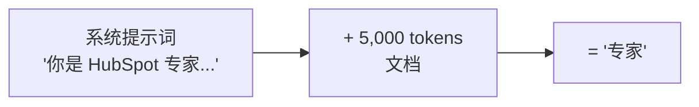
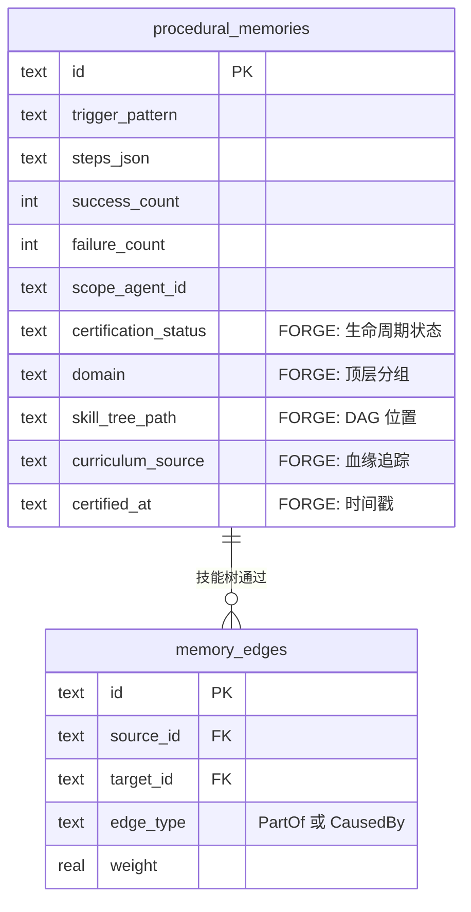
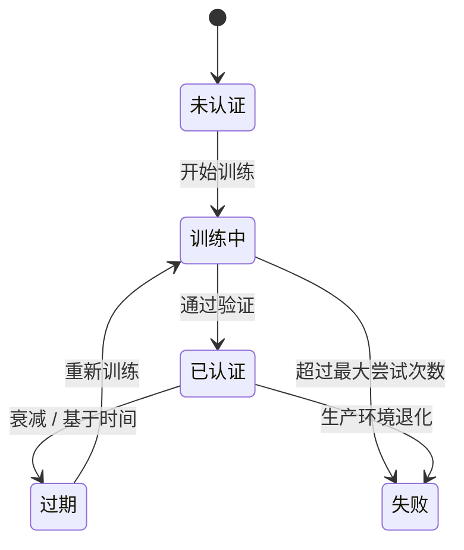
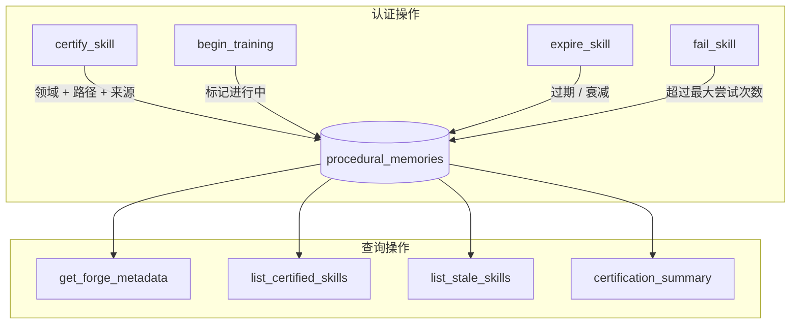
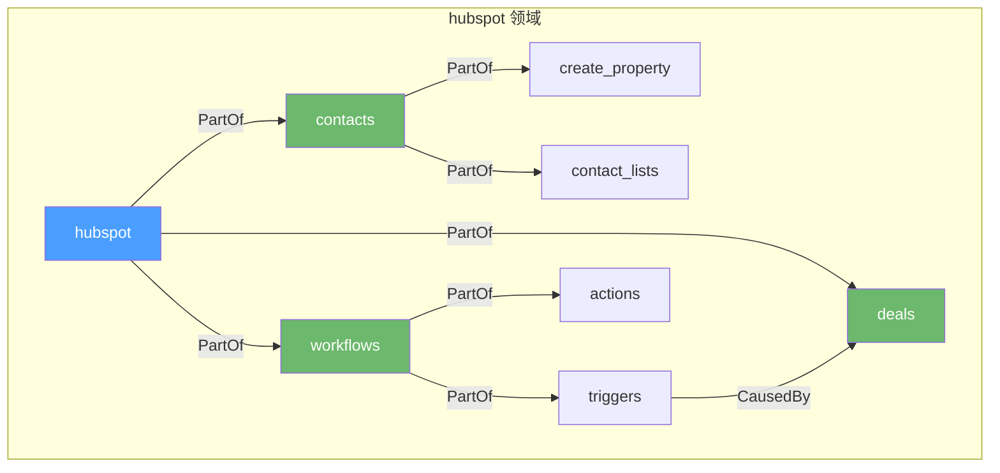
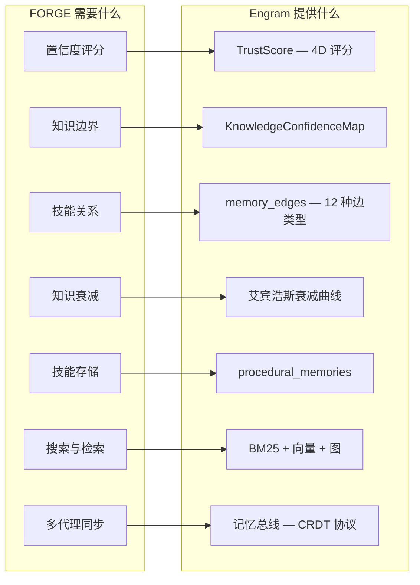

# THE FORGE（锻造） — 获得专业知识的 AI 代理

**状态：** 基础架构已实现  
**作者：** 团队负责人  
**日期：** 2026年3月  
**目标：** OpenPawz 平台  

---

## 执行摘要

如今的每个 AI 平台都用同样的方式创建"专家"：把一个 markdown 文件粘贴到系统提示词中。那不是专业知识 —— 那只是备忘单。THE FORGE（锻造）是在 Engram 之上的认证层，通过结构化测试正式验证程序性记忆。没有并行存储 —— FORGE 扩展了 Engram 现有的程序性记忆、记忆边缘、信任分数、元认知和艾宾浩斯衰减。

**护城河：** 你可以复制一个提示文件。但你无法复制存储在 Engram 中的数千个已验证的训练周期。

**设计原则：** 认证生命周期是我们已经构建的记忆系统上的附加元数据。FORGE 是训练逻辑，不是存储。

---

## 目录

1. [问题](#问题)
2. [解决方案](#解决方案)
3. [已实现内容](#已实现内容)
4. [架构](#架构)
5. [与 Engram 的集成](#与-engram-的集成)
6. [未来工作](#未来工作)
7. [首个目标：HubSpot 专家](#首个目标hubspot-专家)

---

## 问题

### 如今大家如何构建 AI"专家"

这种方法存在根本缺陷：

| 问题 | 影响 |
|---------|--------|
| **无验证** | 代理声称有专业知识但从未经过测试。它可能会自信地对已废弃的功能产生幻觉。 |
| **无知识边界** | 代理不知道自己不知道什么。它会以与提示中涵盖的功能相同的信心回答从未遇到的 HubSpot 功能问题。 |
| **无演进** | 当 HubSpot 发布新的 API 版本时，"专家"立即过时。直到客户遇到失败才有人注意到。 |
| **无失败学习** | 当代理给出错误答案时，没有反馈循环。下次它还会给出同样的错误答案。 |
| **可轻易复制** | 你的竞争对手复制提示文件就有了同样的"专家"。零护城河。 |

### 真正的专业知识是什么样的

一个人类 HubSpot 专家：
- 系统地学习平台（课程体系）
- 在知识上接受测试（认证）
- 知道自己的薄弱领域并说"我需要查一下"（元认知）
- 从实地中的错误中学习（失败反馈）
- 随着平台的演进保持最新（持续学习）
- 可以用业绩记录证明专业知识（可验证凭证）

THE FORGE 赋予代理所有六个特性。

---

## 解决方案

### 核心概念：在现有记忆上的认证

FORGE 不是构建并行存储或单独的训练服务，而是内联扩展 Engram。每个程序性记忆都可以被正式认证、组织成技能树，并通过生命周期跟踪：

**认证生命周期：**

---

## 已实现内容

### 模式扩展

FORGE 用五个认证列扩展 `procedural_memories`。所有迁移都是附加的 —— 现有程序性记忆不受影响，默认为 `uncertified`（未认证）状态。

| 列 | 目的 |
|--------|--------|
| `certification_status` | 生命周期状态：未认证、训练中、已认证、过期、失败 |
| `domain` | 顶层分组（例如 `hubspot`、`stripe`） |
| `skill_tree_path` | 完整 DAG 位置（例如 `hubspot.workflows.triggers.deal_stage`） |
| `curriculum_source` | 用于血缘追踪的 URL 或文档引用 |
| `certified_at` | 最后认证的 ISO 8601 时间戳 |

在领域、认证状态和技能路径上的专用索引确保查询在规模上保持快速。

### 认证生命周期

认证模块管理程序性记忆训练状态的完整生命周期：

- **认证** — 将程序性记忆标记为已验证，标记领域、技能树路径、课程来源和时间戳
- **训练** — 将记忆标记为正在评估中
- **过期** — 标记信任已衰减或时间已流逝的已认证技能
- **失败** — 标记超过最大训练尝试次数的技能
- **查询** — 检索单个技能的元数据、列出每个代理/领域的所有已认证技能、查找需要重新认证的过期技能，或获取认证计数摘要

### 技能树 DAG

技能树是构建在 Engram 现有 `memory_edges` 表上的 DAG —— 没有新存储。

- **PartOf 边** 编码父→子层级（"create_property 是 contacts 的一部分"）
- **CausedBy 边** 编码先决条件（"workflow 触发器依赖于 deals 知识"）
- **`prerequisites_met()`** 在允许技能提升之前检查所有上游依赖项是否已认证
- **`list_domains()`** 聚合所有 FORGE 标记的记忆以显示领域级进度

---

## 架构

### 设计决策：扩展 Engram，不要复制它

FORGE 刻意避免构建并行存储。Engram 已经提供认证系统所需的基础设施：

通过用认证列扩展现有模式而不是创建新表，FORGE 认证技能自动继承混合搜索、图遍历、艾宾浩斯衰减、加密、PII 扫描和多代理记忆同步 —— 无需一行集成代码。

---

## 与 Engram 的集成

FORGE 如何连接到现有内容：

| Engram 系统 | FORGE 关系 |
|---------------|-------------------|
| **Procedural Memories（程序性记忆）** | FORGE 认证它们。5 个新列对现有记忆进行分类，而不是创建新记忆。 |
| **Memory Edges - PartOf（记忆边 - PartOf）** | FORGE 将它们用于父→子技能树结构。 |
| **Memory Edges - CausedBy（记忆边 - CausedBy）** | FORGE 将它们用于技能之间的先决顺序。 |
| **TrustScore（信任分数）** | 现有信任评分应用于 FORGE 认证记忆。具有高 TrustScore 的已认证技能最具权威性。 |
| **KnowledgeConfidenceMap（知识置信度图）** | 元认知可以查询认证状态来说"我对 X 有已验证的知识"与"我对 Y 在猜测"。 |
| **Ebbinghaus Decay（艾宾浩斯衰减）** | `fast_strength` / `slow_strength` 自然衰减。当已认证技能的强度下降时，它是重新认证的候选者。`list_stale_skills()` 使其可查询。 |
| **Consolidation Pipeline（巩固管道）** | 7 阶段巩固引擎可以在其合并/修剪决策中包含认证状态。 |
| **Encryption / PII Scanning（加密 / PII 扫描）** | FORGE 数据继承 Engram 现有的加密和隐私保护。 |

---

## 未来工作

这些是自然的后续步骤，大致按优先级排序。它们建立在基础之上，无需架构更改。

### 1. 课程摄取
摄取领域来源（URL、API 文档、课程）并将它们分解为原子技能，成为带有 FORGE 元数据的程序性记忆。使用现有的获取工具 + LLM 提供者抽象。

### 2. 测试运行器
针对专家执行结构化测试。L0（确定性/API）、L1（模板）、L2（LLM-as-judge）、L3（对抗性）。结果输入认证生命周期 — `begin_training()` → 测试 → `certify_skill()` 或 `fail_skill()`。

### 3. 工艺大师代理
一个老板代理（使用现有 Orchestrator）编排训练→测试→认证循环。在工具执行器中注册 FORGE 特定工具。使用现有子代理生成。

### 4. 元认知集成
将 `get_forge_metadata()` 和 `certification_summary()` 连接到专家的响应管道，以便它可以说"我对此有 94% 的信心（已认证）"与"我在这里没有已验证的知识。"

### 5. 持续演进
使用 Engram 巩固引擎模式的后台重新认证。检测过期技能、领域来源更改、生产失败 → 队列重新训练。

### 6. 前端仪表板
技能树可视化、认证状态徽章、训练进度、领域级置信度分数。使用现有视图模式的标准 UI。

---

## 首个目标：HubSpot 专家

### 为什么是 HubSpot

| 因素 | 评分 | 原因 |
|--------|--------|--------|
| **有界领域** | ★★★★★ | 清晰边界 — HubSpot 是一个具有定义功能的产品 |
| **现有课程** | ★★★★★ | HubSpot Academy 提供免费的结构化课程 |
| **可通过 API 测试** | ★★★★★ | 开发者测试门户可用。工作流要么工作要么不工作。 |
| **市场需求** | ★★★★☆ | 大型 SMB 市场使用 HubSpot。CRM/营销自动化帮助有需求。 |
| **技能树清晰度** | ★★★★☆ | HubSpot 模块（contacts、deals、workflows、reports）清晰映射到技能树 |

### V1 范围

| 模块 | 技能 | 测试层级 |
|--------|--------|-----------|
| Contacts（联系人）（属性、列表、生命周期） | ~15 个原子技能 | L0（API）+ L1（模板） |
| Deals（交易）（管道、阶段、属性） | ~10 个原子技能 | L0（API）+ L1（模板） |
| Workflows（工作流）（触发器、动作、分支） | ~20 个原子技能 | L0（API）+ L2（LLM-judge） |
| Forms（表单）（创建、提交、集成） | ~8 个原子技能 | L0（API） |
| Reporting（报告）（仪表板、自定义报告） | ~10 个原子技能 | L1（模板）+ L2（LLM-judge） |
| **总计** | **~63 个原子技能** | |

---

## 竞争格局

| 平台 | 专业知识方法 | FORGE 优势 |
|----------|----------------------|-----------------|
| **OpenAI Assistants** | 文件上传 + 检索 | 无验证、无技能边界、无演进 |
| **AutoGPT / AgentGPT** | 静态系统提示 | 无训练循环、无失败学习 |
| **CrewAI** | 基于角色的提示 | 角色是标签，不是获得的能力 |
| **LangGraph** | 基于图的工作流 | 工作流 != 知识。无技能验证。 |
| **自定义 RAG 解决方案** | 文档检索 | 检索 != 理解。无测试、无差距检测。 |
| **微调** | 训练数据上的权重更新 | 昂贵、缓慢、不透明、无细粒度技能跟踪 |
| **THE FORGE** | **结构化训练 → 验证认证 → 持续演进** | **细粒度技能跟踪、置信度感知响应、自愈知识、可导出的能力证明** |

---

## 附录：为什么这很难复制

即使竞争对手阅读本文档并构建相同的管道：

1. **训练周期是昂贵的。** 每个已认证专家代表数百次 LLM 调用、测试执行和失败分析。你不能走捷径。

2. **知识复利。** 一个有 6 个月生产失败反馈通过重新训练的专家，拥有新训练专家没有的知识。时间是因素。

3. **领域专业知识是特定的。** 我们 HubSpot 专家的失败模式（"用户经常混淆注册与重新注册触发器"）来自真实的生产交互。通用训练无法产生这些。

4. **Engram 集成是深度的。** FORGE 不仅仅存储技能的 JSON 文件。它将它们存储在具有衰减、巩固、元认知和多代理同步的活跃记忆图中。复制这需要复制 Engram。

5. **训练基础设施是较小的部分。** FORGE 是一个薄的认证层。它依赖的记忆系统 — Engram — 是一个庞大、成熟的基础设施。FORGE 是多年记忆架构工作之上的最后一英里。

---

*本文档反映了已实现的 FORGE 基础。愿景超出了已构建的内容 — 课程摄取、测试运行器和持续演进是未来工作 — 但存储基础、认证生命周期和技能树 DAG 是真实的、经过测试的并且正在运行。*
