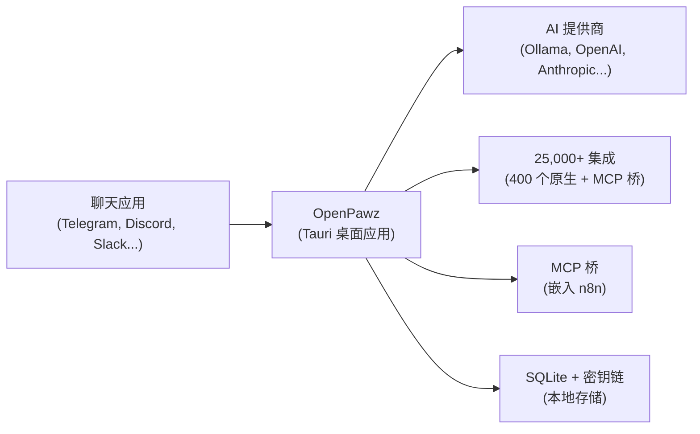

> **您的 AI，您的规则。** — 这就是重点。

基于 [Tauri v2](https://v2.tauri.app/) 构建的开源 AI 智能体操作系统。创建具有**通过 MCP 桥接实现的 25,000+ 集成**的自主智能体，将它们连接到 11 个聊天平台，并在您的机器上本地运行所有内容。无云，无开放端口，无 Node.js 后端。

<Columns cols={3}>
  <Card title="开始使用" href="/docs/start/installation" icon="download">
    安装 OpenPawz 并在几分钟内启动应用程序。
  </Card>
  <Card title="创建智能体" href="/docs/start/first-agent" icon="robot">
    个性化、提供商和工具的引导设置。
  </Card>
  <Card title="连接提供商" href="/docs/start/first-provider" icon="server">
    添加 OpenAI、Ollama、Anthropic 或其他 7 个提供商。
  </Card>
</Columns>

---

## 什么是 OpenPawz？

OpenPawz 是适用于您桌面的**开源 AI 智能体操作系统**。它不是一个聊天机器人。也不是围绕 API 的包装器。它是一个在您的机器上原生运行的完整多智能体平台 — 零云依赖。

**想象一下：** 您拥有具有独特个性、长期记忆和访问权限的自主 AI 智能体**（25,000+ 集成）** — 管理 Notion 看板、Slack 频道、GitHub 仓库、邮件、在三条链上交易加密货币、用语音发出回应、监控基础架构、控制智能家居设备、在线研究、部署到 AWS、撰写内容，以及跨**11 个聊天平台同时**响应消息。400+ 集成开箱即用，25,000+ 个可通过嵌入式 n8n 引擎和 MCP 桥使用 — 智能体在运行时按需发现和安装它们。只需配置凭据并开始使用。

<Tabs>
  <Tab title="适合谁？">
    **每个人都对围墙花园式的 AI 感到厌倦。** 希望构建和扩展的开发人员。希望在他们使用的每个平台上拥有个人 AI 军队的高级用户。需要私有、可审核 AI 的团队，从不外传数据。如果您曾经希望您的 AI 真正*做事情* — 而不只是聊天 — OpenPawz 就是您一直在等待的产品。
  </Tab>
  <Tab title="有什么不同？">
    大多数 AI 工具为您提供一个聊天窗口。OpenPawz 为您提供一个**智能体操作系统**：
    - **25,000+ 集成** — 400+ 原生内置集成，另外通过到 n8n 的 MCP 桥还有 25,000+ 社区集成 — 所有集成都可在运行时发现和自动部署
    - **11 个渠道同时** — Telegram、Discord、Slack、WhatsApp、Matrix、IRC、Twitch 等更多
    - **多智能体编排** — 老板/工人委派、智能体小队、智能体间消息传递
    - **多链 DeFi 交易** — Coinbase + Solana (Jupiter/Pump.fun) + Ethereum (Uniswap) 配有政策保障
    - **混合语义记忆** — BM25 + 向量 + MMR + 时间衰减
    - **语音** — 三种 TTS 提供商（Google、OpenAI、ElevenLabs）+ 语音转文本
    - **可视化节点编辑器** — 用于代理管道的拖放工作流构建器
    - **模型路由** — 自动复杂度路由 + 每日预算上限 + 思考级别控制
    - **自我改进智能体** — 智能体搜索 PawzHub 并在运行时自己安装技能
    - **远程访问** — Tailscale 网格 VPN + Webhook 服务器，可从任何地方触发智能体
    - **10 个 AI 提供商** — Ollama（本地）、OpenAI、Anthropic、Google、DeepSeek 等
    - **零云** — SQLite、OS 密钥链、AES-256-GCM 加密。无服务器、无端口、无订阅
    - **原生性能** — Tauri v2 + Rust 后端。不是 Electron。530 项测试。零 CVE。
  </Tab>
  <Tab title="为什么开源？">
    因为您的 AI 不应该有一个房东。OpenPawz 是 **MIT 授权** — 分叉它、扩展它、随意部署它。代码库是透明的、可审核的，并由社区驱动。无供应商锁定。无意外的价格变化。没有"我们更新了隐私政策"的电子邮件。
  </Tab>
  <Tab title="需求">
    一台计算机（macOS、Linux 或 Windows）、5 分钟和以下之一：
    - 通过 [Ollama](https://ollama.com/) 的**本地模型** — 完全免费，完全私密
    - 来自任何受支持提供商的**API 密钥** — OpenAI、Anthropic、Google 等

    就这样。不需要 Docker。无需管理数据库。无需维护基础设施。
  </Tab>
</Tabs>

---

## 它如何工作



桌面应用是智能体、会话、路由和渠道连接的唯一真实来源。所有通信都通过 **Tauri IPC** 进行 — 无开放端口，无 HTTP 服务器。

---

## 主要功能

<Columns cols={2}>
  <Card title="25,000+ 集成" icon="puzzle">
    内置 400+ 原生集成，另有通过到 n8n 的 MCP 桥的 25,000+ 社区集成。智能体在运行时发现并自动部署每个服务的工作流 — 零配置。
  </Card>
  <Card title="多智能体协调" icon="users">
    老板/工人委派、持久智能体小队、智能体间消息传递和工作区隔离。完整的项目生命周期管理。
  </Card>
  <Card title="多渠道网关" icon="message-lines">
    Telegram、Discord、Slack、Matrix、IRC、WhatsApp、Twitch 和另外 4 个，只需一个应用。每个渠道智能体路由和智能消息拆分。
  </Card>
  <Card title="多链 DeFi" icon="bitcoin-sign">
    Coinbase + Solana (Jupiter/Pump.fun) + Ethereum (Uniswap)。配备每日亏损限制的交易策略引擎。完整的交易审计追踪。
  </Card>
  <Card title="语音（TTS/STT）" icon="microphone">
    三个 TTS 提供商（Google、OpenAI、ElevenLabs）+ 语音转文本。自动语音模式在回应到达时朗读。
  </Card>
  <Card title="可视化节点编辑器" icon="diagram-project">
    拖放工作流构建器。在视觉上连接触发器、智能体、工具、条件和输出 — 无需编码。
  </Card>
  <Card title="模型路由" icon="route">
    自动复杂度路由。简单查询发送到便宜模型，复杂任务发送到强大的模型。每日美元预算上限。
  </Card>
  <Card title="10 个 AI 提供商" icon="server">
    Ollama（本地和免费）、OpenAI、Anthropic、Google、DeepSeek、Grok、Mistral、OpenRouter 以及任何自定义端点。
  </Card>
</Columns>

---

## 不会忘记的记忆

大多数 AI 工具在对话之间会忘记一切。OpenPawz 不会。

<Columns cols={2}>
  <Card title="语义长期记忆" icon="brain">
    每个重要事实、偏好和细节都会自动捕获并使用向量嵌入进行存储。当上下文相关时，它会自动召回对话中 — 无需手动提示。
  </Card>
  <Card title="记忆宫殿" icon="building-columns">
    专门用于浏览、搜索、编辑和管理您的智能体所学知识的界面。完全了解您的 AI 对您的了解。
  </Card>
</Columns>

<Tip>默认情况下，智能体共享一个记忆命名空间，所以一个智能体捕获的知识对所有智能体可用。您也可以为单个智能体或工作区隔离记忆。</Tip>

---

## 使用会话压缩节省代币

长对话很快烧掉代币。OpenPawz 有一个内置解决方案：**自动会话压缩**。

当对话接近模型的上下文窗口限制时，OpenPawz：
1. **总结**对话的旧部分成紧凑摘要
2. 在内存中**保持**关键事实和决定
3. **归档**完整的会话以备后续参考
4. 使用摘要 + 记忆上下文**继续**对话，无缝衔接

<Note>这意味着您的智能体可以运行**无限长的对话**而不碰到上下文限制或失去重要上下文 — 在此过程中支付更少的代币。</Note>

---

## 您完全可以信任的安全性

OpenPawz 从零开始设计采用**零信任、纯本地的安全模型**。

<Columns cols={2}>
  <Card title="100% 本地 — 无数据离开您的机器" icon="shield-halved">
    所有对话、记忆、智能体配置和文件保留在您的硬件上。无云同步、无遥测、无分析。唯一的出站流量是您明确配置的 AI 提供商。
  </Card>
  <Card title="操作系统级凭证存储" icon="key">
    API 密钥和密钥存储在您操作系统的本地密钥链中 — macOS 密钥链、Windows 凭证管理器或 Linux 密钥服务。从不在明文中。从未在配置文件中。
  </Card>
  <Card title="命令风险分类" icon="triangle-exclamation">
    每个工具和 shell 命令都在 1-5 风险等级上评级。高风险操作（文件删除、系统命令、网络访问）需要在执行前明确用户确认。
  </Card>
  <Card title="沙盒执行" icon="box">
    在具有可配置资源限制、网络策略和文件系统限制的隔离 Docker 容器中运行智能体 shell 命令。智能体无法触及您的主机系统。
  </Card>
</Columns>

<Columns cols={2}>
  <Card title="每智能体策略" icon="lock">
    精确控制每个智能体可做的操作 — 它可以访问哪些工具、可以使用哪些渠道、允许执行的风险级别。完全粒度权限控制。
  </Card>
  <Card title="提示注入防护" icon="shield">
    内置提示注入检测分析进入消息的操作尝试，并在可疑内容传达到智能体之前标记它们。
  </Card>
</Columns>

<Columns cols={2}>
  <Card title="TLS 证书固定" icon="lock">
    仅限 Mozilla 根 CA 的自定义 `rustls` 配置 — 系统信任存储排除在外。即使用户机器上的 CA 被破坏也不能拦截提供商流量。
  </Card>
  <Card title="请求签名和内存清零" icon="fingerprint">
    每个外发 AI 请求都用 SHA-256 签名以防止篡改。API 密钥通过 `Zeroizing<String>` 在提供商断开连接时自动从 RAM 清零。
  </Card>
</Columns>

---

## 快速开始

<Steps>
  <Step title="克隆和安装">
    ```bash
    git clone https://github.com/OpenPawz/openpawz.git
    cd openpawz
    pnpm install
    ```
  </Step>
  <Step title="构建 Tauri 应用">
    ```bash
    pnpm tauri dev
    ```
    应用以内置 UI 启动。不需要单独的后端。
  </Step>
  <Step title="添加提供商">
    打开 **设置 → 提供商** 并为 OpenAI、Anthropic 添加 API 密钥，或指向本地 Ollama 实例。
  </Step>
  <Step title="创建您的第一个智能体">
    前往 **智能体 → 新建智能体**，选择一个模型并开始聊天。您的智能体立即可以通过 MCP 桥访问 25,000+ 集成了。
  </Step>
</Steps>

需要完整的安装指南吗？请查看[安装](/docs/start/installation)。

---

## 从此开始

<Columns cols={3}>
  <Card title="安装" href="/docs/start/installation" icon="download">
    macOS、Linux 和 Windows 的先决条件和构建说明。
  </Card>
  <Card title="首个智能体" href="/docs/start/first-agent" icon="robot">
    创建和配置智能体的逐步指导。
  </Card>
  <Card title="首选提供商" href="/docs/start/first-provider" icon="server">
    连接到 10 个支持的 AI 提供商中的任何一个。
  </Card>
  <Card title="渠道" href="/channels/overview" icon="message-lines">
    连接 Telegram、Discord、Slack 和另外 8 个。
  </Card>
  <Card title="集成" href="/guides/integrations" icon="puzzle">
    浏览可供智能体使用的 25,000+ 集成。
  </Card>
  <Card title="架构" href="/reference/architecture" icon="sitemap">
    了解 Tauri + Rust + TypeScript 堆栈如何组合在一起。
  </Card>
</Columns>

---

## 了解更多

<Columns cols={3}>
  <Card title="智能体" href="/guides/agents" icon="robot">
    智能体配置、策略和生命周期。
  </Card>
  <Card title="记忆" href="/guides/memory" icon="brain">
    语义记忆、自动回忆和记忆宫殿。
  </Card>
  <Card title="编排器" href="/guides/orchestrator" icon="users">
    多智能体工作流和任务委派。
  </Card>
  <Card title="浏览器" href="/guides/browser" icon="globe">
    无人值守浏览器自动化和研究。
  </Card>
  <Card title="安全" href="/reference/security" icon="shield-halved">
    命令风险分类、沙盒和智能体策略。
  </Cell>
  <Card title="故障排除" href="/reference/troubleshooting" icon="wrench">
    常见问题和诊断步骤。
  </Card>
</Columns>
